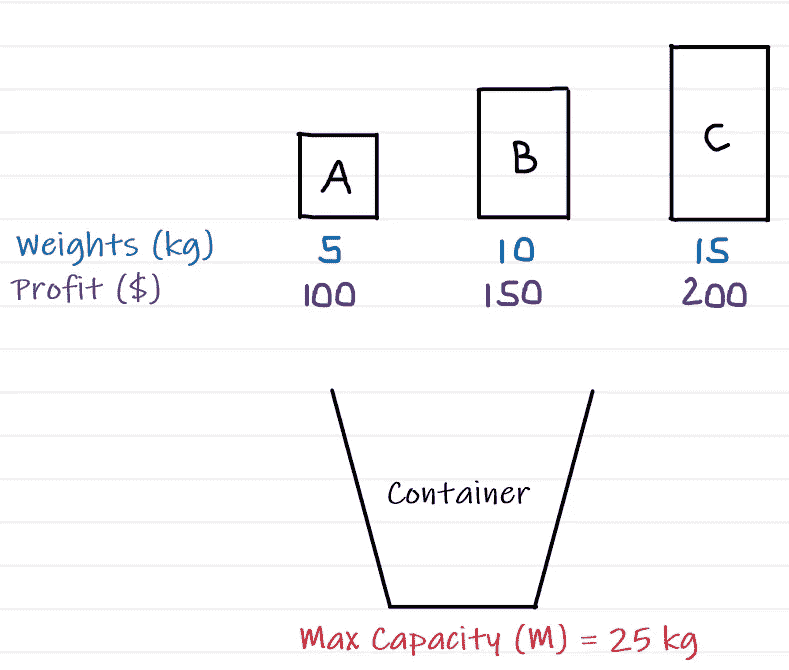
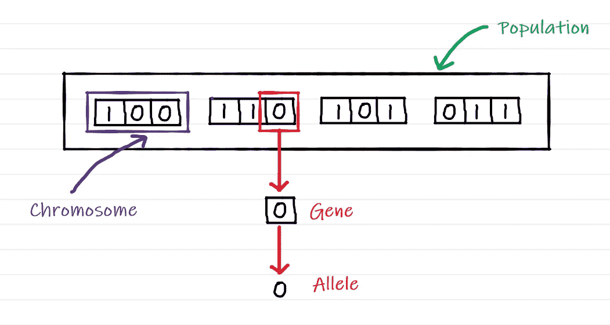
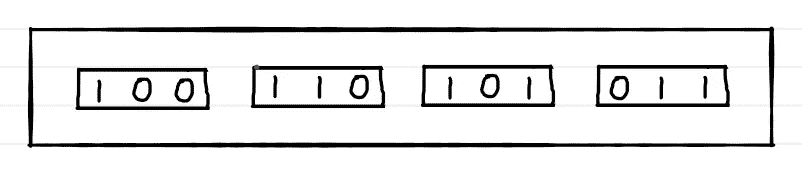
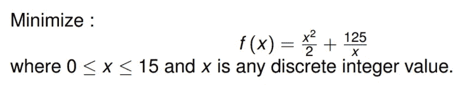
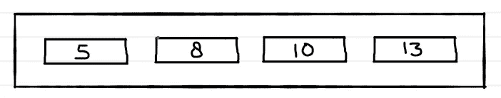
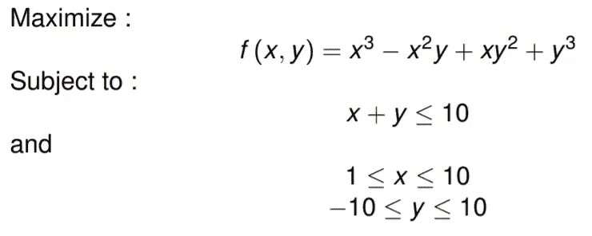
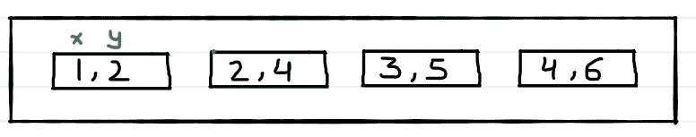
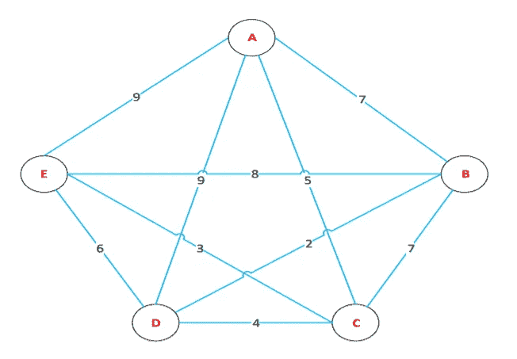
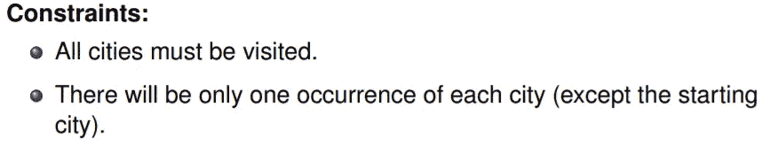
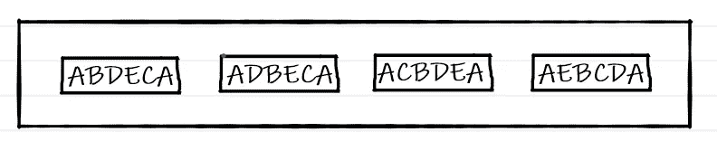

# 遗传算法中的编码技术

> 原文：<https://medium.com/geekculture/encoding-techniques-in-genetic-algorithm-371bccbe4bf7?source=collection_archive---------6----------------------->

# 二进制编码

*   最常见的编码方法。
*   用比特(0 和 1)表示一个基因。
*   最适合在离散搜索空间中进行优化。

## 示例 1

***问题***

为下面的 [0-1 背包](https://en.wikipedia.org/wiki/Knapsack_problem)问题定义初始种群:

***解***

不违反约束(最大容量)的一些可能的解决方案是 A、AB、AC 和 BC。

有三种权重(A、B 和 C)。所以我们用 3 位来代表群体中的每条染色体。1 表示权重存在，0 表示不存在。

下图还旨在阐明一些重要的术语，如群体、染色体、基因和等位基因。

或者，我们可以简单地将解决方案表示为:

## 示例 2

***问题***

定义以下问题的初始总体:

***解***

不破坏约束(0≤x≤15)的一些可能的解是 5、8、10 和 13。

x 可以取的最大值是 15，可以用 4 位表示。所以我们用 4 位来代表群体中的每条染色体。

# 值编码

*   将一个基因表示为某个值。
*   值可以是整数、实数、字符或某个对象。
*   使用变量/设计参数的直接表示。
*   避免任何中间编码和解码步骤。
*   最适合在连续搜索空间中进行优化。

## 示例 1

***问题***

定义以下问题的初始总体:

***解***

不破坏约束(0≤x≤15)的一些可能的解是 5、8、10 和 13。

## 示例 2

***问题***

定义以下问题的初始总体:

***解***

不打破问题中提到的三个约束的一些可能的解决方案是(1，2)、(2，4)、(3，5)和(4，6)。染色体代表(x，y)组合。

# 置换(或顺序)编码

*   每条染色体代表一个序列(元素的顺序)。
*   用于排序问题。

## 示例 1

***问题***

为下面的[旅行推销员](https://en.wikipedia.org/wiki/Travelling_salesman_problem)问题定义初始人口:

***解***

不打破问题中提到的两个约束的一些可能的解决方案是 ABDECA、ADBECA、ACBDEA 和 AEBCDA。

染色体代表销售人员访问城市的顺序。例如，染色体 ABDECA 意味着销售人员从城市 A 到 B，B 到 D，D 到 E，E 到 C，C 到 A。

这就是本文的全部内容。

不要忘记👏如果你喜欢这篇文章。

如果您想了解更多关于 GA 的知识，请查看我的系列文章:

 [## 遗传算法(GA)系列

### 我发表了不少关于遗传算法的文章。虽然这些文章站在自己的立场，它将更多…

apargarg99.medium.com](https://apargarg99.medium.com/genetic-algorithm-ga-series-9cf533b292f) 

如果你有任何问题或者想要澄清什么，你可以在 LinkedIn 上找到我。

~快乐学习。