# 为 NLP 任务编码文本

> 原文：<https://medium.com/geekculture/encoding-text-for-nlp-tasks-84696bce83e6?source=collection_archive---------21----------------------->

对文本进行编码是所有自然语言应用中最重要的步骤之一。首先，它是将自然语言文本转换成计算机可以理解的数值的过程。这在**深度学习**中尤为关键，因为**神经网络**对数字、向量、张量进行操作，而不是字符、单词和句子。

考虑以下问题:对单词“go”进行编码的最佳方式是什么？这个不好回答，但是可以从以下几个因素开始思考。

*   动词时态:“去”、“去”、“去了”、“去了”在我们的编码中应该有类似的表示
*   语义:“旅行”、“移动”、“进行”应该有相似的表征；“停止”、“停留”、“立定”应该离得很远
*   上下文:“Go”可以指一个动作、一种编程语言或一个棋盘游戏，这取决于上下文，它们应该以不同的方式表示

对文本进行编码不是一个简单的问题，有许多可能的方法来实现。使用有效的表示来恰当地捕获单词的语法、语义和上下文对于所有下游的自然语言任务来说是极其重要的。

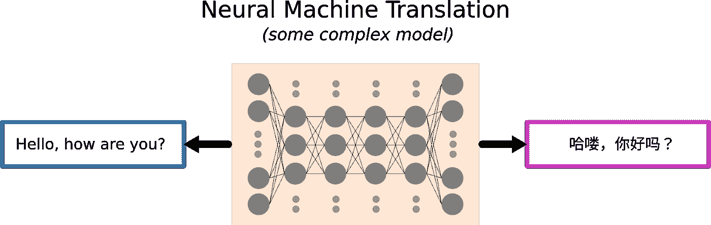

为了便于可视化，文本通常直接用作计算模型的输入和输出。但是，总有一个中间步骤将文本编码成更有用的表示。

在这篇文章中，我将分享一些最常见的单词级文本编码方法。在我们深入细节之前，这里有一些在这篇文章中经常提到的 NLP 术语和概念。

*   语料库:整个数据集；通常是文件的集合
*   文档:一篇文章，如期刊论文、故事、网页或简单的段落集
*   句子:文档中一个或多个句子构成一个段落
*   类型和标记:一个**类型**是语料库中一个独特的单词，而每个单词总是一个**标记。**比如句子“工厂是工厂的工厂。”包含四种类型和八个标记。类型是唯一的单词，即“a”、“factory”、“is”和“of”。

不同的实现在术语上可能会有细微的差别，尤其是在类型和标记的定义方面。例如，有时类型不区分大小写，或者有时缩写、所有格和连字符根据标记器的不同而有不同的处理方式。为了简单起见，让我们暂时假设我们的记号赋予器删除标点符号，然后使用空格将句子分割成记号。

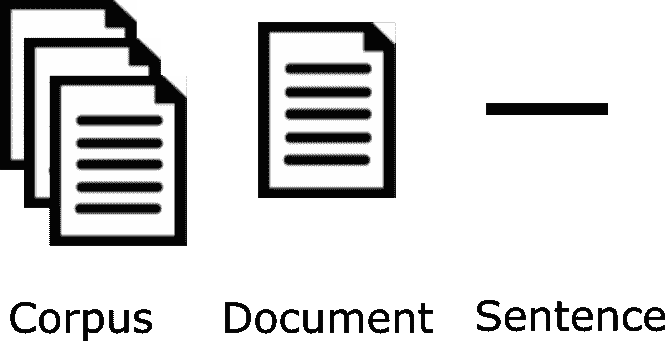

Text data hierarchy

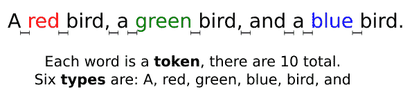

# 基于索引的编码

对文本进行编码的最简单的方法是基于索引的编码。这个想法是用一个索引来映射每种类型，这样我们就可以通过使用各自的索引来唯一地标识和表示语料库中的所有标记。假设我们的语料库有三个文档，每个文档只有一个句子:

> corpus = ["这是我们的第一篇媒体文章，它是关于 NLP 的，我们喜欢它！",
> 
> “我想分享如何对文本进行编码以及如何应用它”，
> 
> "据说数据科学的温哥华女人有有趣的工作！"]

在这个例子中，有 31 个经过一些预处理的唯一标记(例如:小写和删除标点)。它们根据哈希值进行编号，如下所示。

> {'about': 10，' and': 18，' apply': 2，' article': 27，' data': 16，' encode': 4，' first': 28，' has': 17，' how': 29，' i': 19，' in': 30，' interest ':25，' is': 26，' it': 22，' like': 6，' love': 13，' medium': 15，' nlp': 23，' our': 12，' said': 31，' science': 1，' share': 9，' text': 11，' that': 8，' this': 5，' to': 3，'温哥华

然后，语料库被编码为索引列表的列表:

> [[5, 26, 12, 28, 15, 27, 22, 26, 10, 23, 18, 14, 13, 22],
> 
> [19, 7, 6, 3, 9, 29, 3, 4, 11, 18, 29, 3, 2, 22],
> 
> [22, 26, 31, 8, 24, 21, 30, 16, 1, 17, 25, 20]]

我们已经将文档转换成了数字列表，但是在编码方面还有一个至关重要的步骤。大多数机器学习模型需要固定长度的输入向量，所以我们需要将我们的交错数组转换为方形数组。让我们首先找到语料库中最长的文档；然后，我们需要通过在序列末尾添加 0 来填充其他较短的文档。在前面的例子中，第一个和第二个文档都有 14 个单词，所以我们用两个额外的零填充文档 3，使其表示为一个 14 长度的数组。我们最终的编码语料库变成了:

> [[31, 10, 26, 12, 6, 17, 23, 10, 20, 18, 33, 19, 15, 28],
> 
> [21, 1, 13, 9, 7, 30, 9, 32, 14, 33, 30, 9, 25, 23],
> 
> [2, 10, 5, 29, 16, 4, 24, 22, 3, 27, 11, 8, 0, 0]]

序列末尾的填充称为“后序列填充”；或者，我们也可以在开始时填充。除了填充较短的序列之外，有时我们可能需要将长序列截短到预定义的长度，以适应内存中的模型输入。实际上，填充和截断经常结合使用。

基于索引的编码很容易理解。但是，任意给令牌赋值可能会产生意想不到的负面后果。特别是，单词之间的数字距离可能会产生意想不到的影响，尤其是对机器学习模型而言。例如:语义上，你会说“科学”(1)比“有趣”(25)更接近“中等”(15)吗？

# 一键编码

一键编码使用 0 和 1 来表示单个标记是否出现在句子中。和以前一样，创建一个独一无二的编码的第一步是对语料库中的惟一标记进行编号。然后，我们将创建一个 0 和 1 的序列来标记每个唯一标记的存在，而不是像基于索引的编码那样为每个文档构建一个索引序列。

使用这种方法，我们可以通过计算向量空间中的相似度来比较两个文档。注意，表示每个文档的向量在结构上长度相等，因此填充和截断步骤是不必要的。然而，使用独热编码的一个缺点是表示是稀疏的，这意味着向量包含很大比例的零。稀疏表示通常是低效的，尤其是在存储方面。此外，由于独热编码的大小与语料库中唯一标记的数量成比例增长，所以当语料库很大时，它可能会迅速增长失控。为了有效地处理稀疏向量和矩阵，[这里的](https://machinelearningmastery.com/sparse-matrices-for-machine-learning/)是我推荐的一本好书。最后但同样重要的是，一键编码被广泛用于编码分类变量。

# 单词袋(蝴蝶结)

单词包是一种常见的文本编码技术。它不使用二进制值来表示文档中标记的存在，而是使用整数来标记标记在句子中出现的次数。总的来说，构建过程类似于一键编码。

示例文档的弓形向量是:

顾名思义，这种方法把每个句子都当作一个单词包。它考虑每个单词在句子中出现的次数，但不考虑它们的顺序，这意味着我们失去了单词的上下文。尽管如此，由于其简单性和有效性，它仍然是自然语言处理中的一种实用技术。

# 术语频率—反向文档频率(TF-IDF)

停用词是在每个句子或文档中常见的标记；它们通常没有太多意义，并且在执行文本分析时会给语料库增加噪声。常见的停用词包括 and、the 和 a。在某些特定领域的设置中，我们也可以将一些术语视为停用词。比如财经新闻中的“利益”“银行”，影评中的“评论”“导演”等。由于停用词不会给文档带来唯一性，因此将停用词作为一种特征(如在一键编码和单词包中)会降低表示的有效性。为了解决这个问题，我们可以使用 TF-IDF 来惩罚所有文档中突出的单词。

TF-IDF 是术语频率-逆文档频率的缩写。在 TF-IDF 中，每个术语都表示为该词在给定文档中相对于整个语料库的相对频率。它可以被认为是单词编码包的扩展。

TF-IDF 有两个组成部分。**词频(TF)** 衡量一个词(token)在语料库中是常见还是罕见。也有多种方法来定义术语频率，如[布尔](https://en.wikipedia.org/wiki/Boolean_data_type)“频率”、增强频率等。最常见的定义是一个术语在给定文档中出现的次数除以给定文档中的术语总数。设 ***t*** 和 ***d*** 表示文档 d 中的给定术语，则术语频率 ***tf_(t，d)*** 定义为:

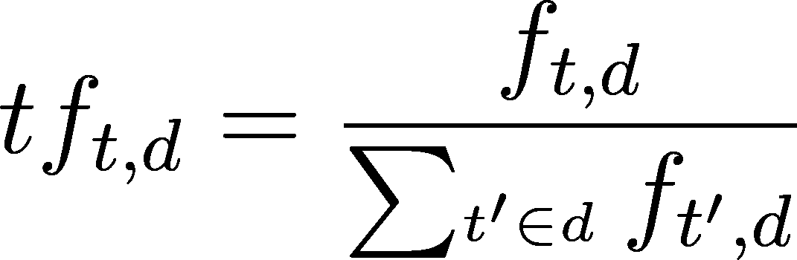

其中分子是文档 ***d.*** 中时间项 ***t*** 的数量

**逆文档频率(IDF)** 是语料库中的文档总数除以语料库中包含给定术语的文档数。对于停用词来说，这将是非常低的。设 ***N*** 表示语料库 D 中的文档总数，则文档频率的倒数定义为:

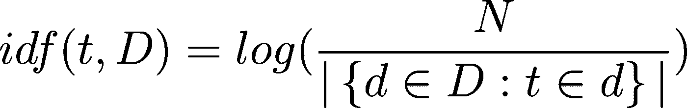

其中分母是出现术语 ***t*** 的文档数。

Term/token ***t*** 可以表示为 TF 和 IDF 的乘积:

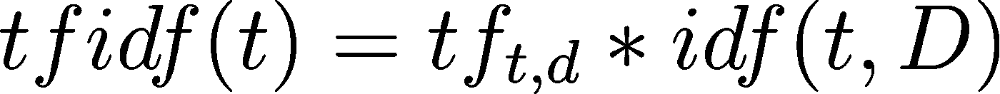

例如:对于样本语料库的文档 1:

> corpus = ["这是我们的第一篇媒体文章，它是关于 NLP 的，我们喜欢它！",
> 
> “我想分享如何对文本进行编码以及如何应用它”，
> 
> "据说数据科学的温哥华女人有有趣的工作！"]

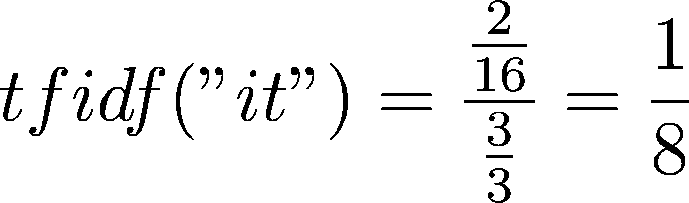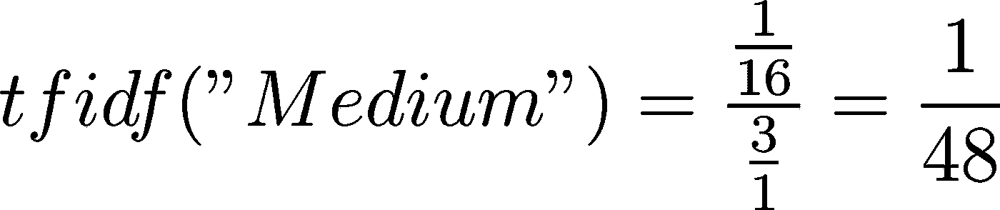

示例文档的 TF-IDF 向量是:

Note: some text representations have been cute off, please check the source code for full representations

TF-IDF 已广泛应用于文本挖掘和信息检索。尽管 TF-IDF 考虑了标记频率，但它没有考虑文档中单词的顺序、共现或语义。

# 分布式单词表示

上述方法将单词视为原子单位，与复杂的方法相比，它们易于理解，并且在小数据集上表现更好。然而，许多 NLP 任务，如机器翻译和语音识别，经常需要处理各种语言的大型语料库。

自然语言处理中最成功的突破之一是单词的分布式表示。Harris [1]提出了一个分布假设:出现在相似上下文中的单词往往具有相似的含义，例如，英语中单词“mother”的向量空间表示经过训练后与日语中的非常接近。通过对齐两种不同语言的单词嵌入空间，我们可以在不学习词汇的情况下推断一些单词的意思。此外，人们还发现，词语的意义有时可以作几何解释[2]:*vector(" King ")—vector(" Man ")+vector(" Woman ")*结果得到一个最接近单词 Queen 的向量表示。这在 Word2vec [3，4]，GloVe [5]和 FastText [6]中被利用。

Geometric Relationship of Word Embedding

## **Word2Vec**

Word2Vec 是一个从数百万个单词中学习高质量单词向量的框架。其思想是:给定一个大型语料库，固定词汇表中的每个单词都由一个数字向量表示。该算法遍历文本中的每个位置 ***t*** ，其中有一个中心词 ***c*** 和上下文词*o，我们使用词向量的相似度为*c***o***来计算给定**o*的概率该算法不断调整单词向量以最大化该概率。*****

****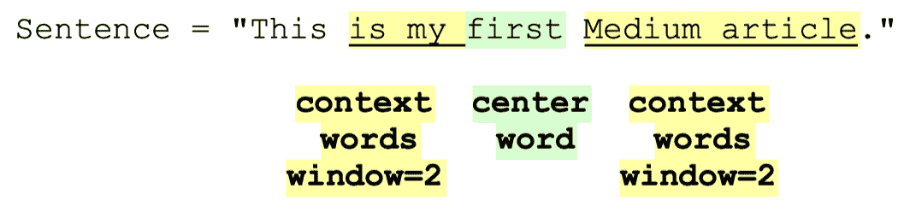****

****使用神经网络在大型语料库上训练该模型，以学习单词语义和句法单词相似性。架构方面:训练 Word2Vec 有两种方法:CBOW(连续单词包)和 skip-gram。CBOW 模型从其周围的上下文单词中预测目标单词。而 skip-gram 模型预测给定单词周围的单词，更接近给定单词的单词比更远的单词具有更大的权重。根据作者的说法，训练 CBOW 模型更快，而 skip-gram 模型对不常用的词做得更好[3，4]。****

****对于所有位置 ***t*** ，Word2Vec 试图最大化给定中心词 ***w_j*** 的固定大小的窗口内上下文词的可能性:****

****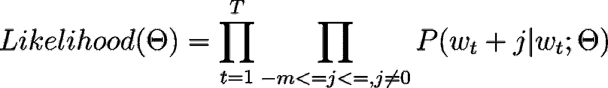****

****[7]****

****目标函数是:****

****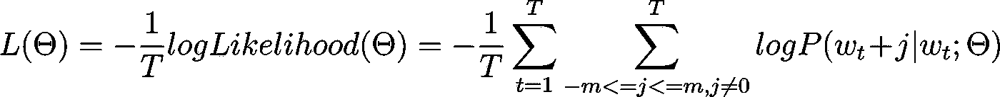****

****[7]****

****Word2Vec 使用一个 [softmax](https://en.wikipedia.org/wiki/Softmax_function) 作为输出层进行训练；设 ***u_w*** 和 ***v_w*** 为中心词和上下文词的双词向量；该算法通过取上下文词和目标词之间的相似度在整个词汇上归一化的点积来给出概率分布:****

****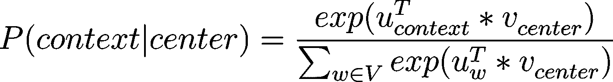****

****[8]****

****这使得模型难以训练，因为词汇表的大小太大。有两种方法来近似上述等式中的条件对数似然:分级 softmax 和负采样。分层 softmax 方法使用一棵[霍夫曼树](https://en.wikipedia.org/wiki/Huffman_coding)来减少计算量【8】。负样本指的是从语料库中随机选择的不在目标单词上下文窗口中的单词。负采样让训练 Word2Vec 快了很多。****

****Word2Vec 可以通过相对较少的预处理以在线方式输入到模型中。然而，Word2Vec 没有考虑单词的内部结构，并且不能处理词汇外(OOV)。****

# ****手套****

****Glove 与 Word2Vec 相似，都能够捕捉单词之间的语义相似性。然而，Glove 的训练方式是利用单词在整个语料库中的共现，而不是像 Word2Vec 那样在本地上下文中的共现。****

****基于矩阵分解训练手套。它首先在整个语料库上建立一个大的共现矩阵。对于矩阵的每种类型(行)，它计算这种类型的标记在给定语料库的某个上下文(列)中出现的频率。****

****然后重构共现矩阵以提取 2 个潜在因素:*单词*潜在因素矩阵*和*潜在因素*上下文矩阵*。*单词*潜在因素矩阵*的每一行都是单词的向量表示。最后但同样重要的是，它通过乘以 2 个潜在因子来重构共生矩阵。因为重构步骤不是确定性的，所以矩阵分解试图找到产生最小重构损失(地面真实计数和预测的同现计数之间的均方误差)的这两个潜在因素。如果你想了解细节，我鼓励你多读一些关于矩阵分解的书。****

# ****快速文本****

****FastText 是由 FAIR 的一组研究人员开发的。FastText 与 Word2Vec 和 Glove 的主要区别在于，FastText 使用单个单词的 n 元模型进行训练，然后该单词的最终向量是 n 元模型向量的总和。单词 vector‘awesome’是 n 个字母的和: *< aw，awe，wes，eso，som，ome，me >* 如果 n = 3，其中符号 *` < '* 和 *` > '* 表示单词边界。****

****使用 n-gram 特性可以使单词表示健壮地应对词汇表之外的情况，比如拼写错误、俚语和缩写。例如，当我们看到一个 OOV 单词，比如“awme”，这个单词的表示将是子单词 *< aw、wme 和 me >* 的矢量和。由此产生的嵌入仍然会比其他随机词更接近“牛逼”这个词，比如“人类学”。****

****分布式单词表示多年来一直是学习单词向量的最先进的方法。此外，该框架根据单词向量的维度和训练数据量提供灵活的训练时间和准确性[4]。****

# ****预训练语言模型****

****预先训练的语言模型是使用大型文本语料库(如数百万维基百科文章)上的自我监督学习来训练的。巨大的数据量允许语言模型学习较低级别(词性、时态等)。)和更高层次的特征(语义、语法等)。).传统上，研究人员训练语言模型来预测句子中的下一个单词，就像在句子完成任务中一样。从 2018 年开始，谷歌的研究人员开发了掩蔽语言模型，该模型可以预测句子中任何地方的单词。通过对较小的特定于任务的数据集进行微调，语言模型在许多下游任务中表现得非常好。比如问答用的 [SQuAD](https://rajpurkar.github.io/SQuAD-explorer/) ，序列分类用的 [GLUE](https://gluebenchmark.com/) ，机器翻译用的[欧洲议会议事录平行语料库](http://www.statmt.org/europarl/)等。****

****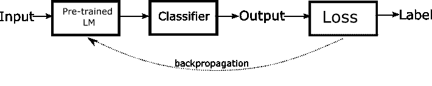****

****Fine-tuning a classifier with a pre-trained language model****

****几个最受欢迎的预训练语言模型是[埃尔莫](https://allennlp.org/elmo)、[伯特](https://ai.googleblog.com/2018/11/open-sourcing-bert-state-of-art-pre.html)、 [GPT](https://openai.com/blog/gpt-3-apps/) 、 [XLNet](https://arxiv.org/pdf/1906.08237.pdf) 和 [T5](https://ai.googleblog.com/2020/02/exploring-transfer-learning-with-t5.html) 。其中，最流行的是 BERT，它代表来自变压器的双向编码器表示[9]。与 Word2Vec 相比，BERT 也有一个子词级嵌入作为其架构的一部分，但这并不是像 BERT 这样的语言模型最常见的用例。更重要的是，BERT 可以将整个句子或文档编码成向量表示，这对于区分多义词的含义非常有帮助。例如，Word2Vec 将为单词“tangerine”生成一个单词表示。而 BERT 在提到水果或金融机构时会产生不同的表示。****

****微调大型预训练语言模型的便利性促进了 BERT 在各种应用中的采用。然而，庞大的语言模型并不是没有问题。例如，微调期间的过拟合可能是一个问题，尤其是因为特定于任务的数据是有限的。此外，训练竞争性语言模型在计算上是昂贵的，并且在环境上是昂贵的。****

****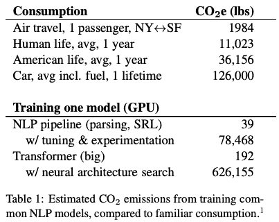****

****Energy and Policy Considerations for Deep Learning in NLP. Strubell et al. ACL 2019****

****Strubell 等人将训练 NLP 模型的碳排放与美国人的平均生活方式进行了比较[10]。虽然语言模型是令人难以置信的技术，但我们也必须意识到它们对环境的负面影响。我们只是触及了伯特的皮毛。敬请期待我们的下一篇文章，在那里我们会更详细地讨论它，直到下次！****

****特别感谢[本玲](https://www.linkedin.com/in/belinghy/)对帖子结构和学术内容的真知灼见！非常感谢 [Duong Vu](https://www.linkedin.com/in/duongqvu/) 对最终草案的仔细评论和对 DataCan 的持续支持！本文由[席琳刘](https://www.linkedin.com/in/siliangliu/)供稿。示例代码可以在这里找到[。](https://colab.research.google.com/drive/1HN4r8rOP6THcpGSAQQZdXdNn0UBwVA41?usp=sharing)****

*****本文原载于*[*@ DataCanOrg*](/@DataCanOrg)*。保持与*[*Data can*](https://datacan.network/)*&*[*数据科学温哥华的女人*](https://www.linkedin.com/company/wids-vancouver/) ！****

# ******参考******

****[1]哈里斯，Z. (1954 年)。分配结构。*字*，10(23):146–162。****

****[2]米科洛夫，托马斯，伊，文-陶，茨威格，杰弗里(2013)。“连续空间单词表示中的语言规则”。HLT-Naacl:746–751。****

****[3]米科洛夫、托马斯等人(2013 年)。“向量空间中单词表示的有效估计”。[arXiv](https://en.wikipedia.org/wiki/ArXiv_(identifier)):[1301.3781](https://arxiv.org/abs/1301.3781)[[cs。CL](https://arxiv.org/archive/cs.CL) 。****

****[4]托马斯·米科洛夫(2013 年)。*单词和短语的分布式*表征及其组合性*。* *神经信息处理系统的进展*。[arXiv](https://en.wikipedia.org/wiki/ArXiv_(identifier)):[1310.4546](https://arxiv.org/abs/1310.4546)。****

****[5]杰弗里·潘宁顿、理查德·索赫尔和克里斯托弗·曼宁(2014 年)。GloVe:单词表示的全局向量。[https://nlp.stanford.edu/pubs/glove.pdf](https://nlp.stanford.edu/pubs/glove.pdf)****

****[6]皮奥特·博亚诺夫斯基，爱德华·格雷夫，阿曼德·朱林，托马斯·米科洛夫，(2016)。用子词信息丰富词向量，[https://arxiv.org/abs/1607.04606](https://arxiv.org/abs/1607.04606)****

****[7]克里斯托弗·曼宁，2021 年。斯坦福大学，CS224n:深度学习的自然语言处理。****

****[8]维基百科。Word2vec。【https://en.wikipedia.org/wiki/Word2vec ****

****[9]瓦斯瓦尼，a .，沙泽尔，n .，帕尔马，n .，乌兹科雷特，j .，琼斯，l .，戈麦斯，A. N .，凯泽，和 Polosukhin，I. (2017 年)。你需要的只是关注。*神经信息处理系统的进展*(第 5998-6008 页)。[https://arxiv.org/abs/1706.03762](https://arxiv.org/abs/1706.03762)****

****[10]埃玛·斯特鲁贝尔，阿南娅·加内什，安德鲁·麦卡勒姆。自然语言处理中深度学习的能源和政策考虑。[https://arxiv.org/abs/1906.02243](https://arxiv.org/abs/1906.02243)****