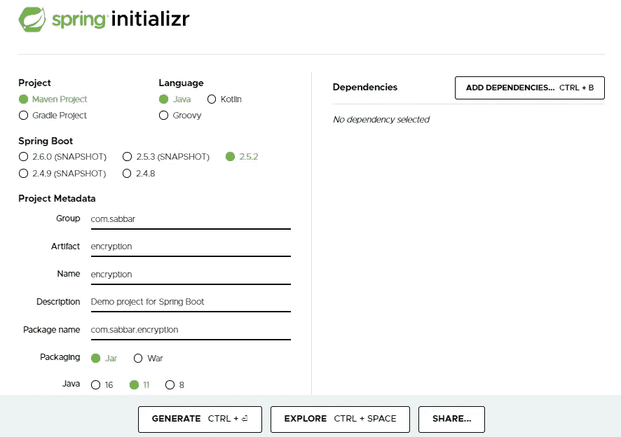
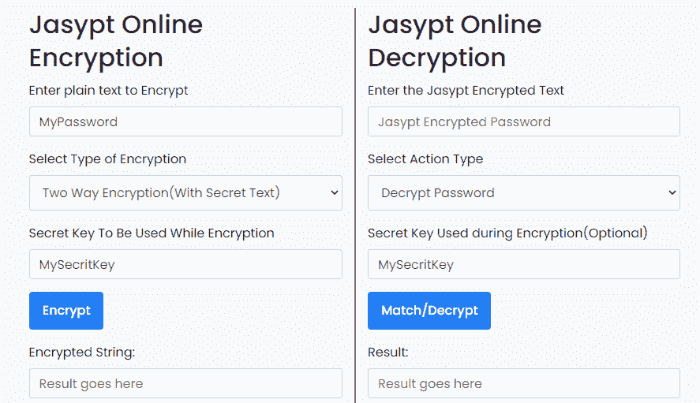
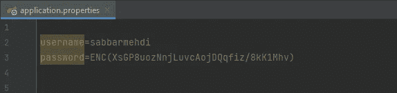
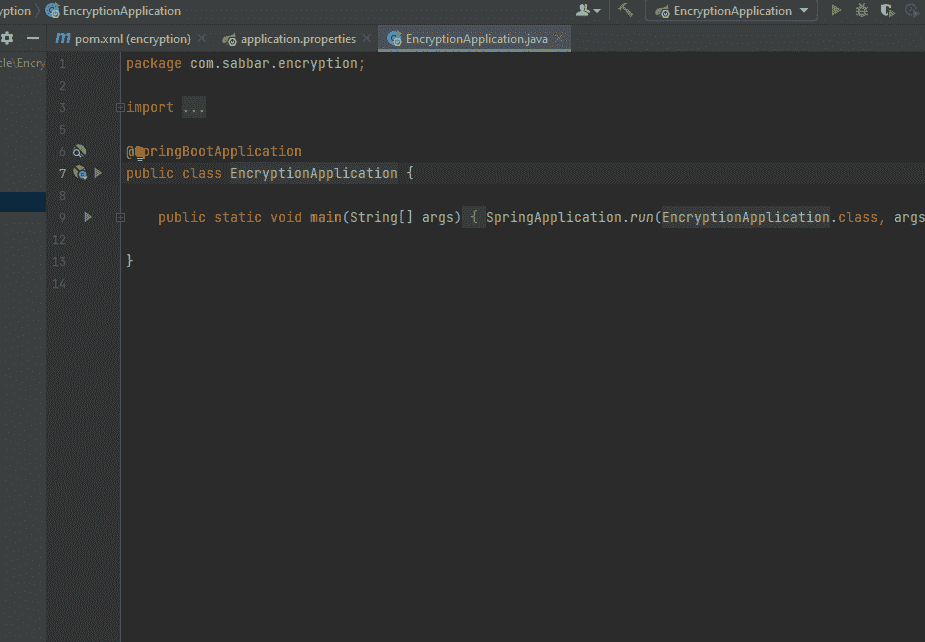
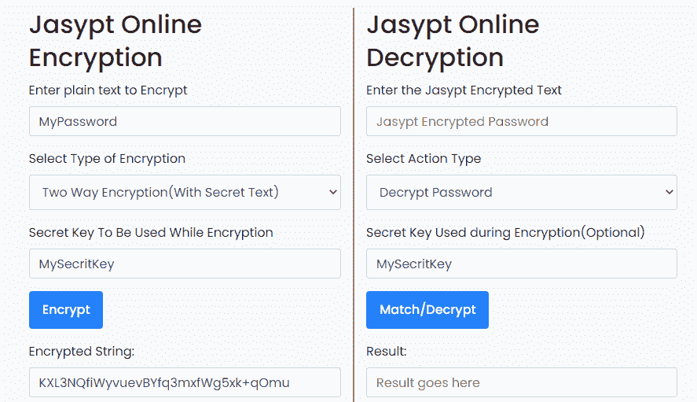

# 使用 Jasypt 加密 Spring Boot 项目中的密码和密钥

> 原文：<https://medium.com/geekculture/encrypt-passwords-and-keys-in-a-spring-boot-project-using-jasypt-6b4406891c09?source=collection_archive---------9----------------------->

## 如何在公共存储库中保证密码的安全

Source:[https://unsplash.com/](https://unsplash.com/)

我听说过许多人的故事，他们把他们的 Google 或 Amazon API 密钥、密码或类似的东西推到公共存储库中，他们遇到了真正的麻烦。

因此，为了使敏感信息安全，你应该加密它，如何？这是您将在下一节了解的内容

如果您已经有一个项目，您可以跳过第 1 步来创建一个新项目！

**第一步:生成一个新的 spring boot 项目**

**第二步:**

我们需要 Jasypt 依赖，对我来说是 3.0.3 版本，你可以在这里 查看最新版本[。](https://mvnrepository.com/artifact/com.github.ulisesbocchio/jasypt-spring-boot-starter)

你也需要这个插件:

**第三步:加密**

有两种方法可以使用 Jasypt 加密文本。

***第一种方式:*** 是通过去[**jassypt-online**](https://www.devglan.com/online-tools/jasypt-online-encryption-decryption)

Source:[https://www.devglan.com](https://www.devglan.com/online-tools/jasypt-online-encryption-decryption)

然后你用:***ENC(the _ Hash _ Code _ gen arated)***替换你的密码或密钥，见下面的例子。

***第二种方式；是使用命令行:***

*mvn jas ypt:encrypt-value-djasypt . encryptor . password = my credit key-djasypt . plugin . value = my password*

**第四步:编译项目**

要编译项目，您应该给他们密钥，否则编译会失败，为此您有两个选择，一个是通过命令行:

***mvn spring-boot:run-djasypt . encryptor . password = my secretkey***

第二个选项是使用 IDE:

***编辑配置…- >配置- >虚拟机*** ***选项***

然后写这个命令:***-djasypt . encryptor . password = my secretkey***

要解密哈希代码，也可以使用 jaspyt-online 或命令行:

使用网站见 GIF 下图

Source:[https://www.devglan.com](https://www.devglan.com/online-tools/jasypt-online-encryption-decryption)

使用命令行:

***mvn jas ypt:decrypt-value-djasypt . encryptor . password = my cretkey-djasypt . plugin . value = ENC(xsgp 8 uoznnjluvcaojdqqfiz/8 kk 1 mhv)***

现在你可以使用 Jasypt 来加密你的密码，保护你的敏感信息的安全。

## 资源:

[http://www.jasypt.org](http://www.jasypt.org)

[https://www.devglan.com](https://www.devglan.com/online-tools/jasypt-online-encryption-decryption)