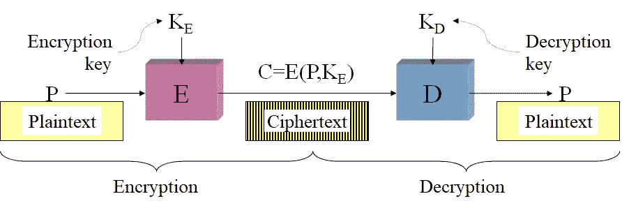
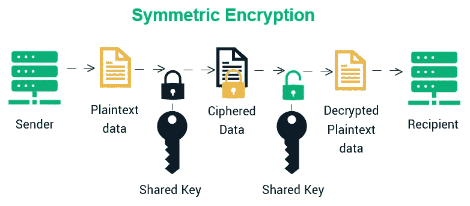
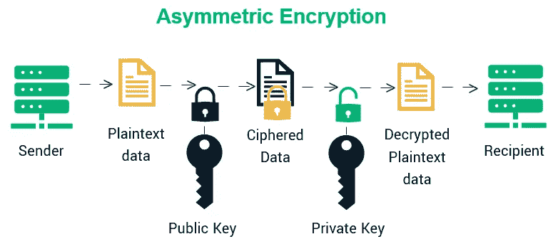

# 加密、散列和安全软件开发

> 原文：<https://medium.com/geekculture/encryption-hashing-and-secure-software-development-83225df5f959?source=collection_archive---------10----------------------->

Source ([https://wallpaperaccess.com/cryptography](https://wallpaperaccess.com/cryptography))

如果您在构建软件时不考虑软件的安全性，这就像您在构建自己的房子时不锁门窗一样。因此，每个软件工程师都需要了解如何保护我们的应用程序。

当谈到安全软件开发时，它大致分为两部分:应用安全(T0)和软件安全(T2)。

*   **应用安全**:部署完成后防御软件攻击的一种方式。
*   软件安全:一种通过构建安全的软件来防御软件漏洞的方法。(在软件中构建安全性)

为了避免软件开发过程中的安全威胁，使用了不同的策略。两个基本策略是**漏洞测试**和**渗透测试**。漏洞测试是识别和量化环境中漏洞的过程。换句话说，就是评估软件系统中的安全风险以降低威胁概率的过程。渗透测试是模拟外部或内部攻击者旨在破坏软件安全性的行为。安全漏洞带来的一些问题包括直接的经济损失、名誉损失和诉讼。当我们考虑安全攻击的类型时，分为**泄漏**、**篡改**、**资源窃取**、**破坏**和**拒绝服务。**

*   **泄漏**:信息离开系统。
*   **篡改**:未经授权的信息篡改。
*   **资源** S **tealing** :非法使用资源。
*   **故意破坏**:干扰正确的系统操作。
*   **拒绝** S **服务**的 :扰乱合法系统使用。

当我们谈到攻击的方法时，分为**窃听、伪装、消息篡改、重放、**和**泛洪。因此，为了避免这些攻击并构建安全的软件，我们需要知道对它们可用的补救措施；**

*   **窃听**:未经授权获取消息副本。
*   ****(*恶搞* )** :未经授权使用他人身份。**
*   ****消息篡改**:截取并篡改消息。**
*   ****重放**:存储消息，稍后发送。**
*   ****洪水**:发送太多信息**

> **什么是安全软件工程？**
> 
> **“可靠的软件做它应该做的事情。安全软件只能做到这一点”(伊万·阿尔塞)**

# **密码系统**

**静态数据和传输数据的安全性是开发软件时要考虑的基本安全需求之一。**密码学**是秘密写作的艺术/科学。目标是通过“扰乱”原始数据来防止那些不应该看到的人看到信息。我们使用一种众所周知的算法来扰乱数据。加密算法有两个输入作为数据&密钥。密钥只有**授权用户**知道。**加密**和**哈希**是密码学的两个主要部分。**加密**是双向功能；加密的内容可以用正确的密钥解密。这意味着当我们使用加密算法和密钥加密(加扰)数据时，我们可以使用正确的密钥再次解密(解扰)数据。**散列**是一种单向函数，它对纯文本进行加扰，以生成唯一的消息摘要或散列码。因此，当我们使用哈希算法来哈希(加扰)数据时，这是不可逆的。**

> ****克霍夫原理****
> 
> **密码系统应该是安全的，即使除了密钥之外，系统的一切都是公开的。(与通过模糊获得安全感相反)**
> 
> **一个著名的反例:二战中的谜，英国军队如何破解纳粹德国战争信息的加密(如果你看过电影**《模仿游戏(2014)】**你知道我在说什么……*😁😁***

## **1.加密**

****

**Figure 1: The process of Encryption and Decryption**

**加密和解密算法(E，D)是众所周知的，并与密钥配合使用，以分别将明文转换成密码和将密码转换成明文。密钥(KE，KD)本质上可以是对称的或非对称的。密文是公众可以获得的唯一信息。明文只有拥有密钥的人才知道(在理想世界中…😁 ).**明文**是加密前的报文。**密文**是加密后的消息。**密钥**是从明文转换为密文(反之亦然)所需的信息。除了那个**混淆**和**扩散**是加密系统的两个关键因素。**

*   ****混淆:**隐藏密钥和密文之间的关系。**
*   ****扩散:**隐藏密文和明文的关系。**

**在上一段中，我提到了加密过程中使用的两种密钥；对称密钥加密和非对称密钥加密。**

****1)。对称密钥加密:**这是一种只使用一个密钥(秘密密钥)对明文和密文进行加密和解密的加密方式。通过对称加密进行通信的实体必须交换密钥。以便可以在解密过程中使用它。对称密钥加密有几种类型；**

*   **数据加密标准**
*   **电子代码簿**
*   **区块链密码**
*   **高级加密标准(AES)**

**对称密钥加密的主要优点是，由于使用一个密钥，它更加安全。但是缺点是关键的管理和分发问题，并且只能保证机密性。**

****

**Figure 2: Symmetric Key Encryption Process**

****②。非对称密钥加密:**这是一种使用两个独立但数学上相关的密钥来加密和解密数据的加密类型。**公钥**加密数据，而其对应的**私钥**解密数据。公开的是对普通大众公开的，私钥是保密的。给定公钥，私钥的生成在计算上是困难的。非对称密钥加密的一般过程；**

*   **接收者生成一对密钥(公钥和私钥),并通过可信服务发布公钥。**
*   **发送方获得接收方的公钥，并用它对消息进行编码，然后将其发送给接收方。**
*   **收件人使用其私人保存的密钥对邮件进行解码。为了回复，接收者使用发送者的公钥，接收者用他或她的私钥解码消息。**
*   **信息无法窃听被捕获的消息，因为窃听者没有私钥来解码消息。此外，消息不能以有意义的方式篡改，因为这需要获取纯文本消息。**

**非对称加密的主要优点是，由于使用两个密钥对，它将摆脱密钥分发问题。缺点是由于两个密钥对的生成和使用，它会很慢。一些非对称密钥加密是:**

*   **RSA 算法**
*   **迪菲·赫尔曼算法**
*   **Diffie Hellman 椭圆曲线算法**
*   **数字签名算法**

****

**Figure 3: Asymmetric Key Encryption Process**

> **PGP 用于电子邮件和数字签名的加密。它将对称和非对称加密结合在一起。**
> 
> ****对称有一个密钥分发问题**
> 
> ****非对称较慢，但没有密钥分发专业版**
> 
> **因此，作为一种解决方案，它使用非对称加密来加密和分发用于对称加密的密钥。**

## **2.散列法**

**哈希是从明文中获取固定大小的块，并迭代更新哈希算法的内部位表示(160 位、128 位、256 位等)的状态的过程。之后，在所有迭代结束时，获取称为消息摘要或哈希代码的内部位表示的状态。根据高级数学算法，使用**散列函数**来生成新的加扰数据。散列函数的结果被称为**散列码**，或者有时被称为**消息摘要**。一个好的散列函数使用一个**单向**散列算法，或者换句话说，散列值不能被转换回原来的值。要弄乱一个好的散列函数真的很难，因为如果你改变一个字符流中的一个字符，散列值将与之前的散列值完全不同。有几种类型的哈希算法，但其中一些现在已经过时了；**

*   **MD5(散列码的大小:128 位)**
*   **SHA-1(哈希码大小:160 位)**
*   **SHA-256(哈希码的大小:256 位)**
*   **SHA-512(哈希码的大小:512 位)**

**散列的一些应用是密码保护、设计区块链应用、以及保护软件许可证的完整性和数字证书的完整性。因此，当谈到密码保护时，如果发生任何数据泄漏，由于哈希密码存储在数据库中，攻击者很难从哈希密码中猜出原始密码，因为哈希函数是单向的。但是，如果我们只是存储密码的哈希值，它很容易受到**彩虹表攻击**和**字典攻击**。**

*   ****Rainbow Tables 攻击:**一个预先计算好的表，用于反转加密哈希函数，通常用于破解密码。**
*   ****字典攻击:**试图通过散列普通密码并将其与目标值进行比较来找到原始纯文本。**

**但是我们可以通过散列函数使用 **Salt** 和 **Pepper** 来消除这些攻击。它们是哈希运算前添加到密码随机位置的固定数量的随机字符。Salt 和 Pepper 的主要区别在于，Salt 与各自的哈希密码一起存储在数据库中，而 Pepper 与各自的哈希密码一起存储在数据库中。**

**所以现代密码学主要关心以下目标:**

1.  **保密:信息不能被任何非预期的人理解。**
2.  ****完整性:**在发送者和接收者之间存储或传输的数据的改变不能被改变而不被检测到。**
3.  ****不可否认性**:信息的创建者/发送者不能在以后否认他或她在创建或传输信息时的意图。**
4.  ****认证**:发送方和接收方可以确认对方的身份和信息的来源/目的地。**

**因此，对称密钥加密有助于我们实现机密性。非对称密钥加密帮助我们实现认证、机密性和不可否认性，哈希帮助我们实现完整性。**

# **参考**

**要进一步了解详情，请查看这些资源；**

*   **【https://www.youtube.com/watch?v=DUYAgNAtIHg **
*   **[https://www.youtube.com/user/Computerphile](https://www.youtube.com/user/Computerphile)**