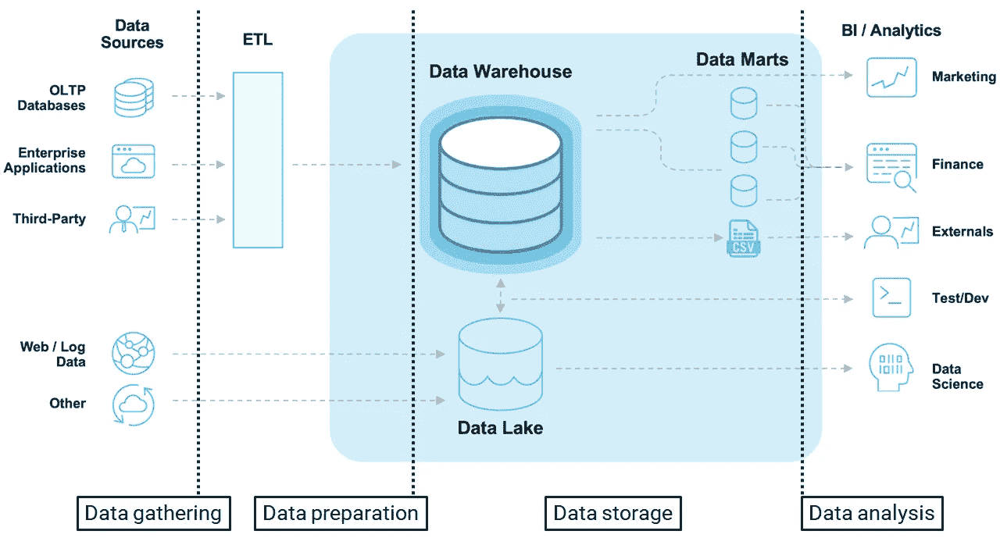
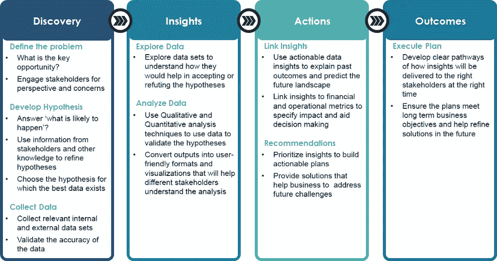

# 端到端 BI 项目:策略、步骤、流程和工具[第 1 部分]

> 原文：<https://medium.com/geekculture/end-to-end-bi-project-strategy-steps-processes-and-tools-part-1-1f8c3f8cb00c?source=collection_archive---------1----------------------->

我想出了一个主意，要撰写一系列文章，涵盖一个小规模的端到端商业智能(BI)项目。在这次旅程中，我将涵盖业务和技术两个方面。并且我会尽可能的阐述和简化**什么**、**如何** & **为什么**我们在做这些。

做出数据驱动的决策需要鸟瞰您业务的所有方面，甚至是您没有想到的方面。但是如何把非结构化的数据块变成有用的东西呢？答案是商业智能。

# 什么是商业智能？

首先，让我们从定义开始:**商业智能**或 **BI** 是收集、构建、分析原始数据并将其转化为可操作的商业见解的一系列实践。BI 的主要目的是提供可操作的业务洞察，并支持数据驱动的决策制定。

Technical Side (image reference: snowflake)

为了满足业务需求，我们将利用技术并确定**如何**构建端到端解决方案。根据我过去从**技术端**获得的经验，一个 BI 项目可以分为五个阶段:

*   数据采集
*   数据准备
*   数据存储
*   数据分析
*   数据叙事

为了涵盖**业务方面，**我将在这个项目中应用普华永道建议的[数据分析框架。这个框架将回答**我们将交付什么**以及**为什么**我们要交付这些。有四个方面:](https://www.coursera.org/learn/decision-making?)

*   发现
*   见识
*   行动
*   结果

Business Side

我们需要一幅清晰的图画，来描述我们想要完成什么，我们将如何完成它，以及我们如何知道什么时候已经完成了。让我们定义“**项目目标**”，这样我们就可以开始弄清楚我们的项目团队需要做些什么来实现它。项目目标是项目期望的结果。这是我们被要求做的，也是我们努力实现的。

要做到这一点，我们可能需要从利益相关者那里获得更多的信息。与他们谈论他们对项目的愿景。询问这如何与公司更大的目标和使命保持一致。这是发现阶段的起点。

在**发现**阶段，我们需要定义问题，提出假设，收集、准备和探索数据。在**洞察**期间，我们将进行数据分析。

接下来是**动作**，我们将在这里连接圆点。我们将进行数据叙事，将见解与可行的建议和执行计划联系起来。最后，我们将回顾改变了业务或业务单位或行业的**成果**。

*在这一系列文章中，我们将从业务和技术两个方面以及这些阶段讨论什么、如何做和为什么。*

# 项目概述和目标

首先，为了建立一个成功的项目并使我们的工作更容易，我们想在实际开始之前弄清楚需要做什么。我们需要准确地定义我们的目标和可交付成果，以便我们能够告诉我们的团队成员做什么。

让我们假设我们在超级商店工作。该项目的理想结果是满足超级商店开发强大的数据驱动的业务决策文化和系统的目标。

**目标 1** :通过更轻松地访问数字渠道中的关键指标来改善决策。将洞察力与财务和运营指标联系起来，以确定影响并帮助决策。

**目标 2** :确保计划符合长期业务目标，并帮助完善未来的解决方案。对见解进行优先排序，以制定可行的计划并提供解决方案/建议，帮助**超级商场**应对与其销售渠道相关的未来挑战。

**目标 3** :减少现有数据分析团队在重复性报告任务(手动收集数据和生成报告)上花费的时间。有更多时间产生洞察力和分析信息。

**目标 4** :将所有数据整合在一起，作为单一的事实来源，使关键经理和支持人员能够通过正确的支持和对数据的访问，做出数据驱动的决策。

# 项目可交付成果

一旦确定了目标，就该检查项目的可交付成果了。项目可交付成果是指项目的有形成果。换句话说，可交付成果是在任务、事件或过程结束时产生或呈现的东西。

可交付成果通常由项目中的利益相关者或客户预先决定。他们让每个人都负起责任，通常是实现目标的重要部分。

**对于本项目，我们将为超级商场交付以下内容:**

1.  **不可交付:**我将跳过与利益相关方的接触，因为我无法演示这一部分。在现实世界的项目中，我们必须提出项目章程、成本效益分析、概念验证以及许多其他与项目管理相关的可交付成果。
2.  **交付成果:**在这个项目中，我们将从数据收集和数据探索开始，了解它们将如何帮助接受或反驳关键指标。
3.  **可交付成果:**设计和开发数据收集管道(即 ETL 工作流)。我们还将执行数据准备。这个过程包括数据清理、数据准备、数据充实和数据验证。
4.  **不可交付成果:**我不会为这个项目提供一个数据仓库。我认为这将需要更多的解释，这将压倒读者监督这个项目的目的。我认为这超出了这个小规模项目的范围。
5.  **交付成果:**将输出转化为用户友好的格式和可视化，这将有助于涉众理解分析。送仪表板。
6.  **交付成果:**使用可操作的数据驱动洞察来解释绩效，并将洞察与财务和运营指标联系起来，以确定影响并帮助决策。**发布季度报告。**
7.  **交付成果:**为项目收尾起草一份 SOP、数据定义、自述文件、回顾和用户指南、培训演示文稿。

# 设定期望

在我们开始旅程之前，我想花一点时间设定一些期望。本系列文章旨在帮助您使用开源工具启动并运行一个小规模的 BI 生态系统。我可能会简化一些概念，我不会涉及这些工具的一些高级主题。

本系列文章适合具有一些基本的分析思维、解决问题的能力以及对工具和技术的好奇心的读者。我可能不会涵盖我将在这次旅程中使用的工具的所有基础知识。

话虽如此，我相信本系列文章中涵盖的概念、技巧和最佳实践将为您提供出色的基础理解。如果您是这些工具的大师级用户(或)高级 BI，请随意跳过。

# 设置先决条件

在这次旅程中，我假设您具备以下条件:

*   [下载](https://www.knime.com/getting-started-download)和[安装](https://www.youtube.com/watch?v=8ISIeFKkoOE) KNIME 分析平台
*   [下载](https://powerbi.microsoft.com/en-us/desktop/)并安装 Power BI Desktop
*   访问 Power BI 服务
*   访问 Google 帐户&
*   好奇的头脑

**KNIME Analytics Platform** 是一款面向整个数据科学生命周期的免费开源软件。 **KNIME** 的可视化编程环境不仅提供了访问、转换和清理数据的工具，还提供了训练算法、执行深度学习、创建交互式可视化等等。请开始探索这个 [KNIME 快速入门指南](https://docs.knime.com/2020-12/analytics_platform_quickstart_guide/analytics_platform_quickstart_guide.pdf)。

Power BI Desktop 是一款免费的应用程序，安装在本地计算机上，可以连接、转换和可视化数据。使用 **Power BI Desktop** ，您可以连接到多个不同的数据源，并将它们组合(通常称为建模)到一个数据模型中。请访问本文档“[Power BI Desktop](https://docs.microsoft.com/en-us/power-bi/fundamentals/desktop-getting-started)入门”并开始探索。

**Power BI Service** ，有时也称为 Power BI online，是 Power BI 的 SaaS(软件即服务)部分。在 Power BI 服务中，仪表板和报告连接到数据集，将所有相关数据集中到一个地方。

# 关键要点

*   我强烈建议你全程参与。在整个课程中充分利用阅读材料和其他资源。它们旨在支持您的学习。
*   参加所有的学习机会，获取尽可能多的知识和经验。如果有什么困惑，不要犹豫[联系我](https://www.linkedin.com/in/yemunn-soe-ba618690/)。

恭喜你选择迈出这第一步。享受旅程！