# 使用 Cypress.io 对 Web 应用进行端到端(E2E)测试

> 原文：<https://medium.com/geekculture/end-to-end-e2e-testing-for-web-apps-with-cypress-io-f45aba0a5fd8?source=collection_archive---------12----------------------->


我们都知道为应用程序编写测试是一种痛苦。😆

Cypress 是一个最近发布的前端测试工具，它非常容易与你的 web 应用集成，不仅可以创建端到端的测试，还可以创建单元测试和集成测试。

*   E2E 测试从头到尾测试整个特定应用程序的工作流程。
*   单元测试测试一小段代码(特定的功能)。
*   集成测试测试集成的组件行为。

它是一个纯粹基于 Javascript 的工具，可以用于在浏览器上运行的任何东西。

自动等待、时间旅行、录制测试工作流视频的能力、代码发生变化时的自我刷新、网络流量控制、跨浏览器测试、简单设置是 cypress 中存在的一些很酷的特性。

让我们将 cypress 集成到简单的 react 应用程序中。

首先，使用 NPM 或 Yarn 命令将 cypress 安装到应用程序中。

```
NPM: npm install cypress --save Yarn: yarn add cypress 
```

您可以通过查看 package.json 文件来验证安装

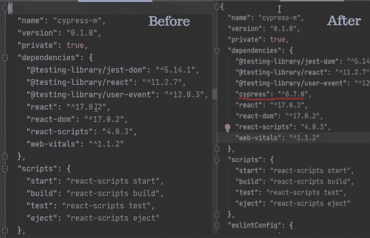

接下来，您可以安装 start-server-and-test npm 包，它有助于首先启动 web 应用程序，然后运行测试。

```
npm i start-server-and-test --save
```

在进行任何配置更改之前，使用下面的命令打开 Cypress 测试运行器。

```
npx cypress open
```

成功执行该命令将在项目文件夹中创建一个名为 cypress 的文件夹，一些子文件夹作为 fixtures、integration、plugins 和 support 作为初始目录。

前后的文件夹结构。

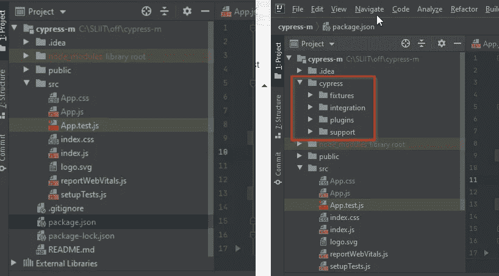

它还打开了 Cypress 测试运行器，如下图所示，带有一些示例测试。

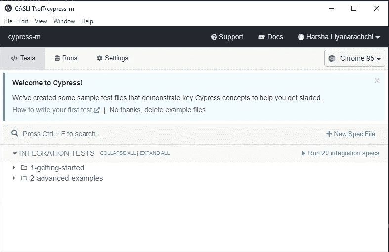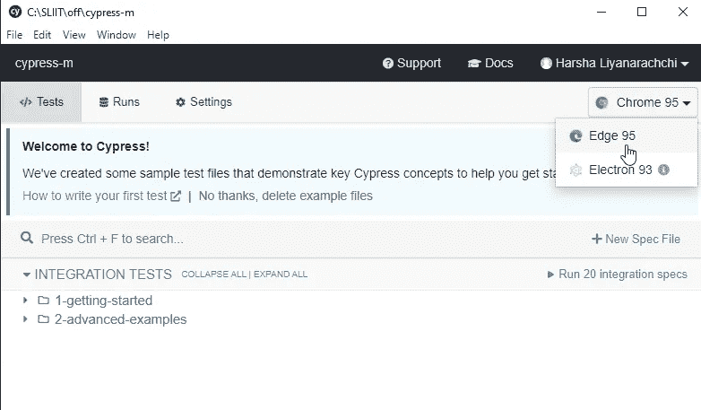

cypress 测试运行程序试图找到用户机器上所有兼容的浏览器。

除非 safari 和 IE 浏览器不支持这两种浏览器，否则您可以选择任何浏览器在任何特定的浏览器中执行测试。

现在，我们将配置其余的配置。让我们创建一个脚本命令，通过启动应用服务器，使用 cypress 仪表板执行 cypress 测试。为此，我们需要使用之前安装的启动服务器和测试包。

在 package.json 文件脚本部分，您需要做一些修改，如下图所示。除了我设置的名字，你可以随意设置任何命令名。

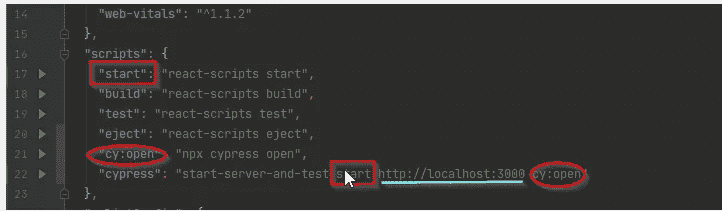

```
"cy:open": "npx cypress open","cypress": "start-server-and-test start http://localhost:3000 cy:open",
```

这将使用 URL[http://localhost:3000](http://localhost:3000)启动应用服务器，稍后打开 Cypress 测试运行器进行测试执行。

除了这个命令之外，您还可以在 terminal/cmd 中包含以下代码行来执行 cypress 测试，而不是打开 Cypress 测试运行程序。

```
"cy:run": "npx cypress run","cy:ci": "start-server-and-test start http://localhost:3000 cy:run"
```

在对 package.json 脚本部分进行了所有修改之后，它将如下所示。

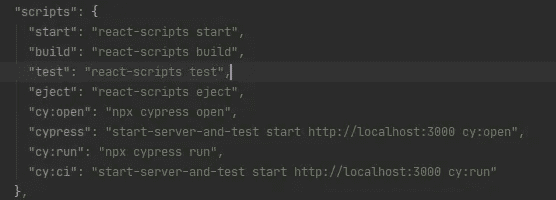

让我们为我创建的简单 react 应用程序创建一些 cypress 测试。

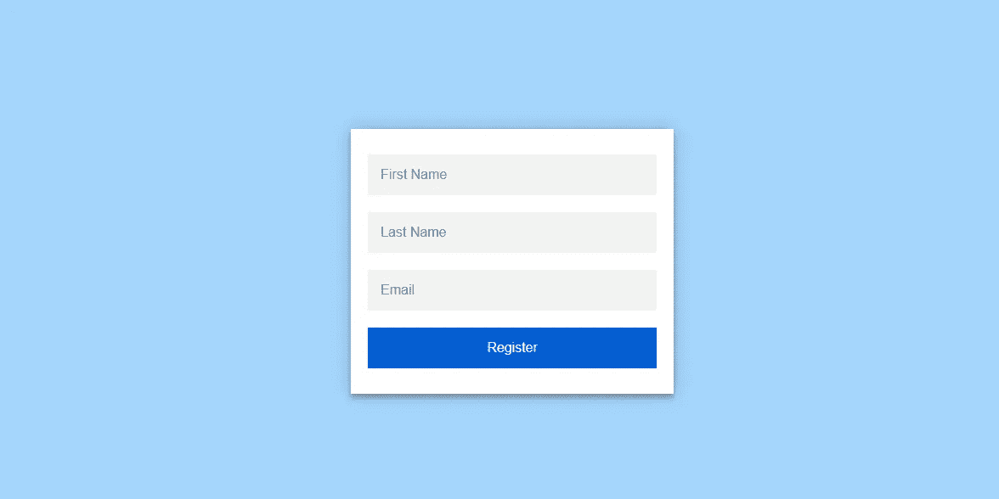

用户单击注册按钮而没有在输入字段中输入值，将会在注册表单中显示错误消息。

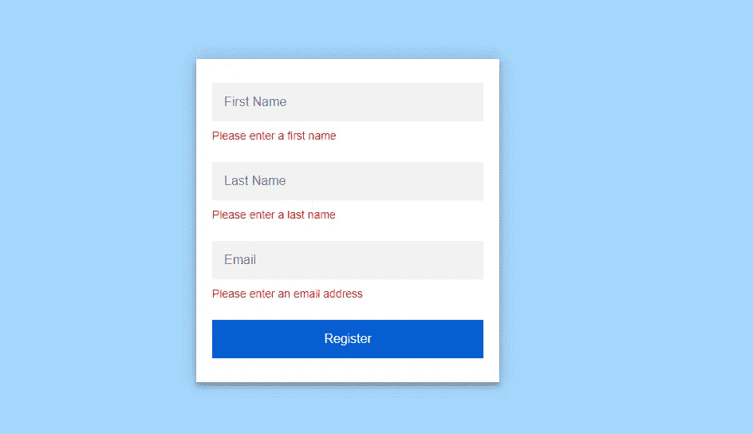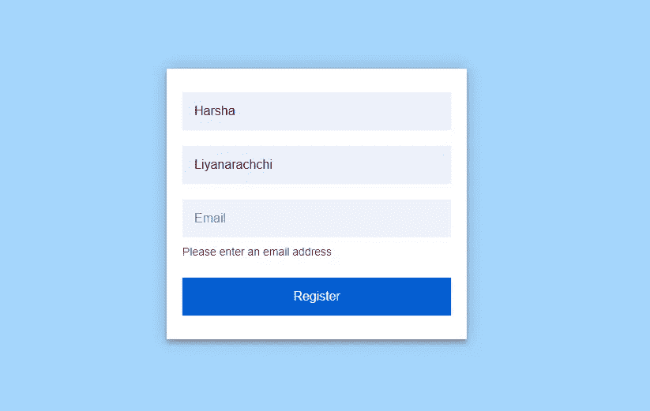

成功提交包含完整详细信息的注册表将显示一条成功消息。

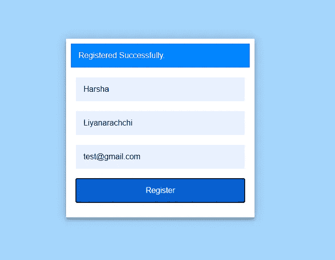

让我们在集成文件夹中创建一个 cypress 测试文件。

因为这是一个简单的注册表单，所以将在 integration 文件夹中创建 cypress 测试文件 registerForm.spec.js。

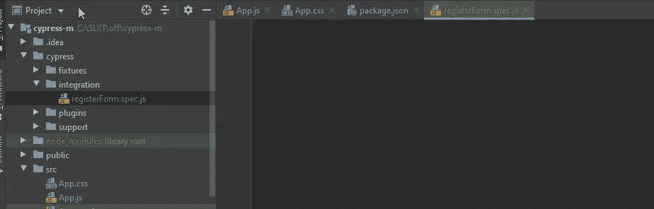

让我们在那个文件中写一些测试。

首先，我们需要使用 **describe()** 方法指定测试套件名称。

在这个测试套件中，可以包含我们希望使用 **it()** 方法覆盖的任意数量的测试场景。

**cy.visit()** —帮助导航到特定的 URL/页面。但是请记住，cypress 只支持一个测试中的同源。不能使用 cy.visit 重定向到两个不同的域。

**cy.get()** —用于获取元素(捕获 dom 中的特定 HTML 元素)

上面的测试用于加载页面，并验证表单是否正确加载了表单中必要的表单元素。

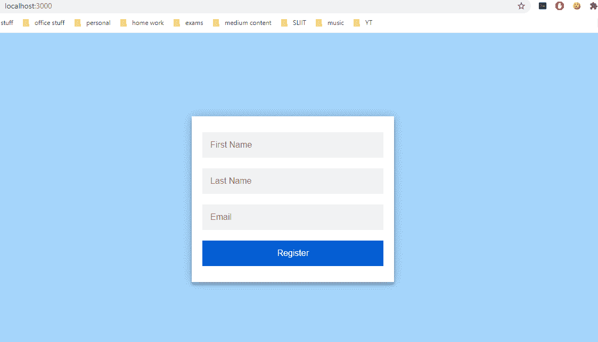

现在我们来看看如何做一个断言。

断言将有助于验证场景，如元素是可见的，在某些条件为真后立即启用，或者在元素中有特定的 CSS 类、状态变化或属性。

让我们想象一下上面的测试案例，一旦页面被加载，我们验证了一个特定的表单有一个输入名字的输入字段。

```
//verify that first name input field is rendered correctly in the resgiration form with placeholder as expected. 
cy.get('input[id="first-name"]').should('have.attr', 'placeholder', 'First Name');
```

**。** -是最常用的断言方法。

参考资料:

*   [https://www . tools QA . com/cypress/cypress-Assertions/#:~:text = Assertions % 20 enable % 20 you % 20 to % 20 validate，cases % 20 should % 20 have % 20 assertion % 20 steps](https://www.toolsqa.com/cypress/cypress-assertions/#:~:text=Assertions%20enable%20you%20to%20validate,cases%20should%20have%20assertion%20steps)。
*   [https://cheatography.com/aiqbal/cheat-sheets/cypress-io/](https://cheatography.com/aiqbal/cheat-sheets/cypress-io/)

你可以参考 cypress cheat sheet URL 来获取更多可用的关键字。

以下测试将有助于验证以下场景。

*   验证注册表单是否正确加载了所有输入字段和按钮。
*   验证正确的表单提交将显示成功消息。
*   不完成注册表单就验证表单提交将向用户显示相关的错误消息。

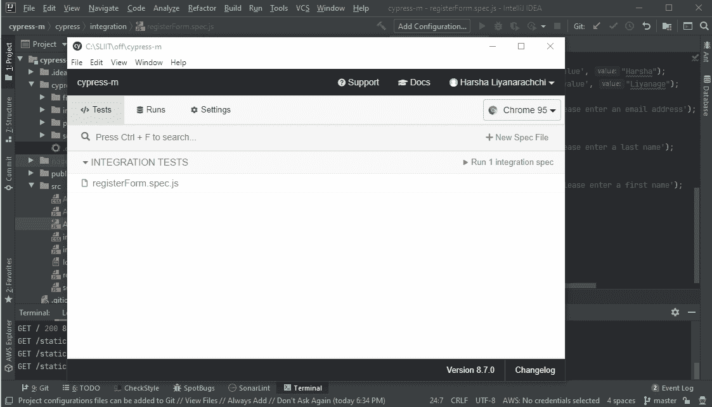

本文的目的是给出对 cypress 框架的一些基本理解，并动手为您的 web 应用程序编写 cypress 测试。