# 端到端机器学习项目

> 原文：<https://medium.com/geekculture/end-to-end-machine-learning-project-6d08b8915bdc?source=collection_archive---------18----------------------->

## 我们将致力于一个简单的汽车零售价格预测，并部署与 Streamlit 的网络应用程序。


Photo by [Kevin Ku](https://unsplash.com/@ikukevk?utm_source=medium&utm_medium=referral) on [Unsplash](https://unsplash.com?utm_source=medium&utm_medium=referral)

如果你像大多数人一样独自开始他们的数据科学之旅，你可能在一开始就很难找到在完成数据科学/机器学习课程后做什么。嗯，几乎每个人(甚至我自己)都建议开始从事个人项目，以熟悉你从上述课程中学到的一切。

让我们来看看端到端项目包括哪些内容:

1.  计划图编制
2.  数据收集
3.  数据清理
4.  探索性数据分析
5.  模型结构
6.  部署

**项目规划**

这是你思考你试图解决的问题的地方。在我们的例子中，我们希望根据一些特征来预测汽车的 MSRP(制造商建议零售价)。通常情况下，我们必须从 web 上获取数据，但是对于这个示例，我们将从 [Kaggle](https://www.kaggle.com/CooperUnion/cardataset) 获取数据。

**数据收集**

如前所述，我们将从 [Kaggle](https://www.kaggle.com/CooperUnion/cardataset) 获取数据。为此，您可以直接从网站下载，或者复制 API 命令，并直接在笔记本上运行。如果你正在使用 Google Colab 笔记本，我建议你选择后者，因为这是我个人最喜欢的方式。[这里有一篇来自 Soner yl DRM 的文章，展示了一步一步的过程。](https://towardsdatascience.com/how-to-use-kaggle-datasets-in-google-colab-bca5e452a676)

## **数据清理**

这是我们寻找缺失值或 NaN 值的地方。这一步是非常必要的，尤其是在处理机器学习时，因为模型通常不能很好地处理 NaN 值。为此，我们可以使用 df.info()来检查是否有丢失的值。

在看了一下我们的数据集之后，我们可以看出有大量的数据清理工作要做，特别是因为我们有大量的对象列(非数字列)。

让我们使用下面的代码开始查看每个对象列中唯一值的数量。

```
{column: len(df[column].unique()) for column in df.select_dtypes('object').columns}
```

{ '从动轮':4，'发动机燃料类型':11，'品牌':48，'市场类别':72，'型号':915，'变速器类型':5，'车辆尺寸':3，'车辆样式':16}

由于没有有序或二进制特征，我们不需要分别进行顺序编码或二进制编码。我们将对所有对象列使用 OneHot 编码。市场类别列有一个例外，因为它在一行中有多个值，所以我们必须首先拆分它们，然后执行一次性编码。如果你想看详细的代码，我建议你去我的 GitHub 库看看！

在所有预处理完成后，我们可以将数据拆分为依赖和独立的特征，然后将其拆分为训练集和测试集。我们在 EDA 之前这样做是因为，在现实世界的场景中，我们不希望我们的假设和设想受到测试数据的影响。

我们可以进入下一步；探索性数据分析

## **探索性数据分析**

我们将从查看非二进制变量(发动机马力、发动机气缸)的箱线图开始。这可以通过运行以下代码来完成:

```
cols_new = ['Engine HP','Engine Cylinders']for column in cols_new:
   plt.figure(figsize=(8,5))
   sns.boxplot(x=eda_df[column])
   plt.title(f'Boxplot for {column}')
   plt.show()
```

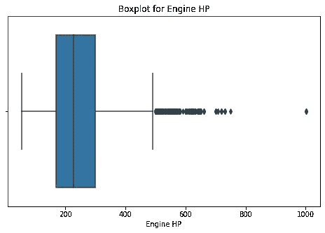

Boxplot for Engine Horsepower

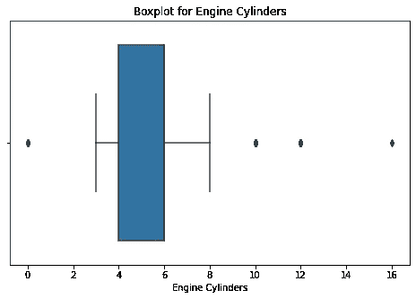

Boxplot for Engine Cylinders

正如我们从前面的箱线图中所看到的，发动机马力看起来接近正态分布，因为它的中值位于中心，但我们也可以看到有许多异常值，因此情况可能并非如此。让我们来看看它的。距离图:

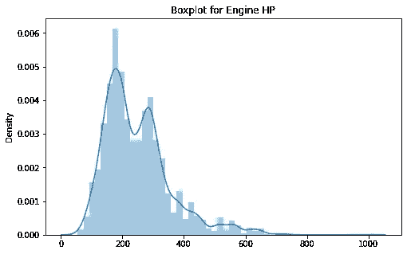

这是一个双峰分布，意味着一个概率分布有两个不同的模式。

让我们继续对几个特性和相关特性(MSRP)进行一些双变量分析。我们可以通过运行以下代码来实现这一点:

```
cols_new = [column for column in X_train.columns if len(X_train[column].unique())>2]for column in cols_new:
   plt.figure(figsize=(8,5))
   sns.scatterplot(data=eda_df,x=column,y='MSRP',hue='MSRP')
   plt.title(f'{column} vs MSRP')
   plt.show()
```

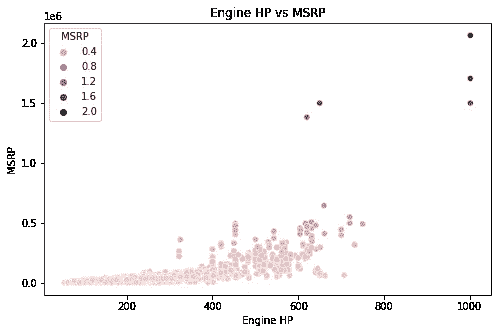

Engine Horsepower vs MSRP

MSRP 看起来是和发动机马力的功率成正比的，所以发动机马力多的车自然价格就高。

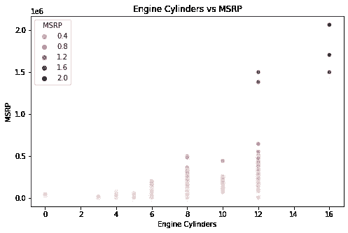

Engine Cylinders vs MSRP

我们也可以说，当气缸数量增加时，MSRP 增加，但因为发动机气缸是一个离散变量，很难从中获得连续函数。

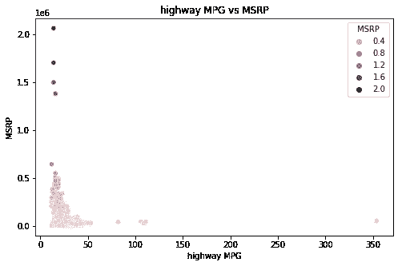

Highway miles per gallon vs MSRP

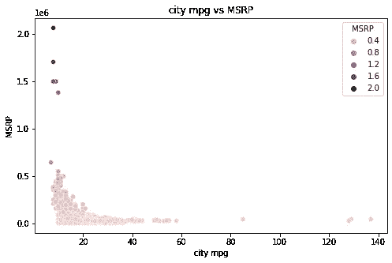

City miles per gallon vs MSRP

MSRP 看起来与公路和城市 mpg(每加仑英里数)成反比，因为它随着 mpg 的增加而减少。这绝对是值得注意的事情，因为价格最高的汽车每加仑的行驶里程非常低。这可以用下面的代码来显示:

```
df.iloc[df['city mpg'].sort_values(ascending=True).index].head(10)[['Make','Model','Year','Market Category','highway MPG','city mpg','MSRP']]
```

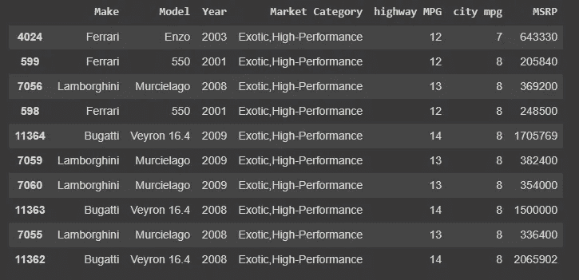

因此，城市油耗最低的汽车是数据集中最贵的。例如，售价 2065902 美元的布加迪威龙 16.4 在城市中每加仑仅行驶 8 英里！。另一件要注意的事情是，每一辆车都属于异国情调和高性能类别。

让我们用皮尔逊相关热图来验证我们之前的所有假设。

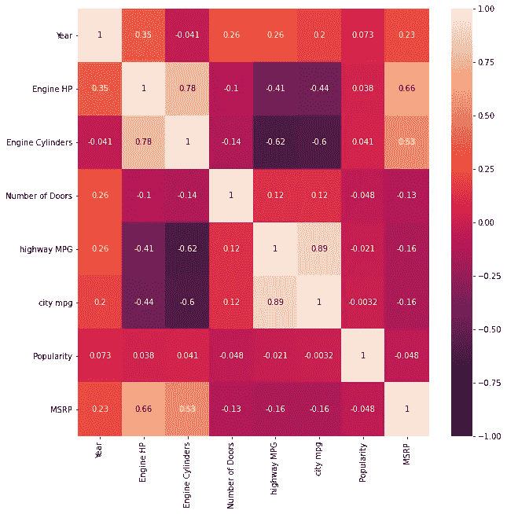

Pearson’s correlation

因此，从表中可以看出，我们关于发动机马力和发动机气缸与 MSRP 正相关的假设证明是正确的，因为它们的相关值为正且相对较高(接近 1)。此外，我们的另一个假设，即每加仑英里数呈负相关，也被证明是正确的，但这种相关性属于弱侧，因为它的值相对接近于 0。

现在我们对数据有了更好的理解，我们可以继续；模型搭建！

## **模型建筑**

如果你一直在关注，你可能会看到我们有 *1006 个特性！*这没什么疯狂的，但是如果我们使用经典的机器学习算法来训练它，它可能会有点慢(特别是在一些像 Random Forest 这样的系综模型上)。让我们尝试使用互信息删除一些不太相关的功能，并在完整的功能旁边训练它，然后比较它，看看两个模型之间是否有很大的性能差异。

让我们使用 Sci-Kit Learn 的 selectk best with Mutual Information 来选择前 20 个最佳功能。这仅在训练集上完成。

```
sel_five_cols = SelectKBest(mutual_info_regression,k=20)sel_five_cols.fit(X_train,y_train)X_train.columns[sel_five_cols.get_support()]
```

我们得到以下特征:

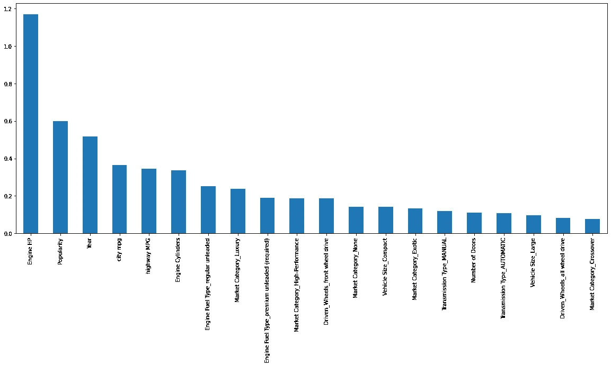

现在让我们进入每个人最喜欢的部分；培训。首先，我们将训练简化的特征模型。我们将使用几个模型，如线性回归、岭回归、KNearest 邻居、随机森林回归、Boost 回归等等。这是因为我们没有任何时间限制。实际上，我们会将这个潜在模型的大列表缩小到几个，以节省更多时间。例如，我们不会使用线性回归，而是使用像 Ridge 或 Lasso 这样的正则化模型。

我们将使用以下代码来训练我们的简化模型

```
models = {'Linear Regression': LinearRegression(),
'Ridge Regression (L2)': Ridge(),
'KNearest Neighbors Regressor': KNeighborsRegressor(),
'Support Vector Machine (Linear Kernel)': LinearSVR(max_iter=100000),
'Support Vector Machine (RBF Kernel)': SVR(),
'Decission Tree': DecisionTreeRegressor(),
'Neural Network': MLPRegressor(max_iter=10000),
'Random Forest': RandomForestRegressor(),
'Gradient Boosting Regressor': GradientBoostingRegressor(),
'Adaboost': AdaBoostRegressor(),
'XGB Regressor': XGBRegressor(),
'LGBM Regressor': LGBMRegressor()}for name, model in models.items():
    model.fit(new_X_train,y_train)
    print(name + ' trained')
```

让我们看看 RMSE 和 R 是什么样子的:

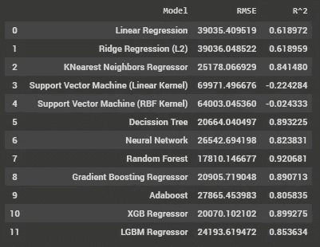

看起来随机森林回归器和 XGBoost 回归器表现最好。

现在让我们看看预处理特征的原始集合将会如何。我的假设是，这将比精简的功能集做得好一点。

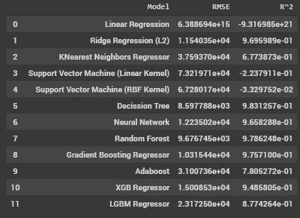

正如我们所看到的，两个随机森林的 R 之间的差异大约是 5%！RMSE 的差距并不理想，大约是 8000。让我们看看是否可以通过使用 GridSearchCV 进行一些超参数调整，使用以下代码，从我们的简化特征模型中获得更好的性能:

```
params = {
'min_samples_split': [2,3,4],
'n_estimators': [95,100,120,200],
'max_features':['auto','sqrt','log2']
}reg = GridSearchCV(RandomForestRegressor(),params,cv=3)reg.fit(new_X_train,y_train)new_reg = reg.best_estimator_
new_reg.predict(new_X_test,y_test)
```

并有效地；我们得到 97.36%的 R！这非常接近原始的功能集，所以我们将使用这一个。

让我们使用 pickle 保存我们的标准缩放器和模型。

```
import picklepickle.dump(scaler, open('/content/scaler.pkl','wb'))
pickle.dump(new_reg, open('/content/rf.pkl','wb'))
```

现在让我们开始部署。

## **部署(成 webapp)**

正如我在介绍中简要提到的，我们将使用 Streamlit 将我们的模型部署到 webapp 中。如果您想在不使用 HTML 的情况下快速部署您的模型，这个框架非常有用。[如果你想了解更多，这里有他们网站的链接(我强烈建议你这么做！)](https://www.streamlit.io)

我对 webapp 的计划是一个简单的界面，你可以在其中输入某些功能，并获得如下所示的动态预测:

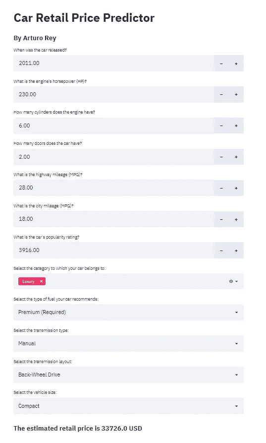

上面的例子是 2011 年的宝马 1 系，售价约为 29450 美元。

如果你想亲自尝试，我会添加下面的代码。

之后，您可以使用 Heroku 部署 webapp。Mohammad Ahmad 提供了一份非常全面的指南，告诉你如何做到这一点！我建议多做一点，部署它，因为你可以很容易地让更多的人来测试它，也许还能发现你平时看不到的小缺陷。

## **结论**

在获取和清理您的数据、训练您的模型并部署它之后，您已经成功地完成了一个端到端的机器学习项目。恭喜你！现在是时候了，我建议你在 GitHub 上记录你为这个项目所做的一切。

感谢您花时间阅读这篇文章。欢迎任何建设性的反馈。