# 端到端电影推荐系统

> 原文：<https://medium.com/geekculture/end-to-end-movie-recommendation-system-49b29a8b57ac?source=collection_archive---------3----------------------->

*使用 Docker 和 Kubernetes 收集数据、构建模型、创建前端并进行部署*


source: [https://erikhollanderdesign.com/MOVIE-CLASSICS-COLLAGE](https://erikhollanderdesign.com/MOVIE-CLASSICS-COLLAGE)

过去的一年半，我们被锁在家里，这让我们渴望室内娱乐，还有什么比看整部电影更好的娱乐方式呢！

有 N 部电影可以从各种流媒体网站上选择，当我们想看一部电影的时候，我们会选择哪一部呢？我们通常会根据演员、导演等选择一部电影，或者选择一部与我们喜欢的电影或朋友推荐的电影相似的电影，不是吗？

**如果** …我们建立自己的推荐系统会怎么样？

在本文中，我将解释从头构建一个端到端电影推荐系统所需的过程。以下是所有步骤的总结:

*   **使用 BeautifulSoup 从网络上抓取**数据(**数据提取**)
*   构建一个简单而有效的基于内容的推荐系统
*   为我们的模型设计一个**前端 web 应用**(使用 streamlit)来查看电影推荐
*   **容器化**我们的模型(使用 docker)并准备配置文件
*   **在 Google Kubernetes 引擎中部署**容器化应用

# 数据析取

最佳推荐引擎通过收集和研究许多其他类似用户的偏好来预测用户的偏好。这就是网飞所做的。例如，如果你喜欢蝙蝠侠电影，那么网飞会推荐其他喜欢蝙蝠侠电影的人喜欢的电影。这种方法叫做**协同过滤，**它需要用户偏好数据。另一种方法叫做**基于内容的推荐器**推荐与你喜欢的电影内容相似的电影，虽然简单，但它在推荐电影方面是有效的，并且非常适合这个项目。基于内容的推荐系统不需要随时间变化并需要不断更新的用户偏好数据。

我从 IMDB 网站 的 [**上搜集了这个项目的数据。它包含基于当前流行程度的电影列表。**](https://www.imdb.com/search/title/?title_type=feature&primary_language=en&ref_=adv_prv)

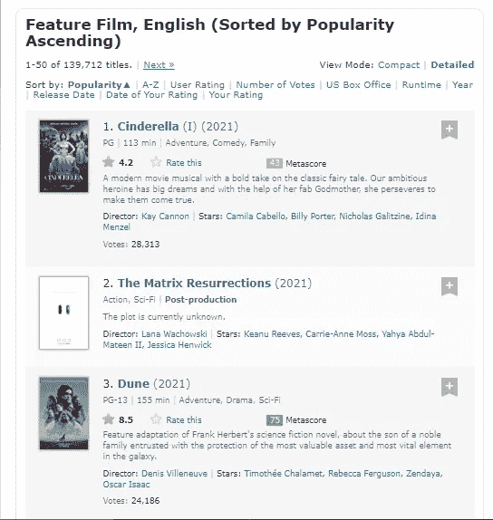

Results from the IMDB link mentioned above

下面的 web 抓取代码是一个简单的脚本，它使用 beautifulsoup 从站点的各种搜索页面中提取必要的字段。

这是一个从网站上搜集的数据的例子，

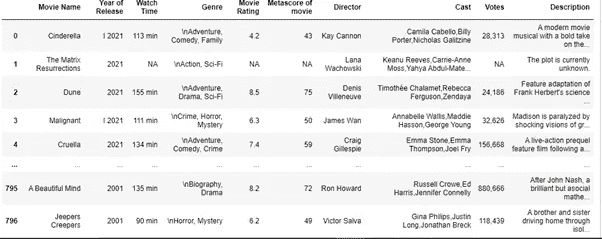

Web scraped data that will be used for modeling

# 构建基于内容的推荐系统

这种方法使用内容的属性来推荐相似的内容。它没有冷启动问题，因为它通过内容的属性或标签工作，如演员、流派或导演，以便新电影可以立即被推荐。例如，用户 X 喜欢《LOTR》、《星际迷航》电影(动作片、冒险片),那么我们的模型将向用户 X 推荐类似内容的电影，如《星球大战》等

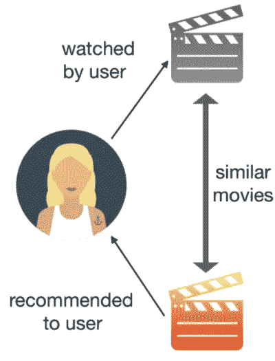

Captions from offerzen.com

**造型**

导入所有依赖项并加载抓取的数据。

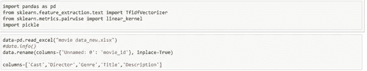

将标题、导演、类型、描述连接成一个单一的特征。

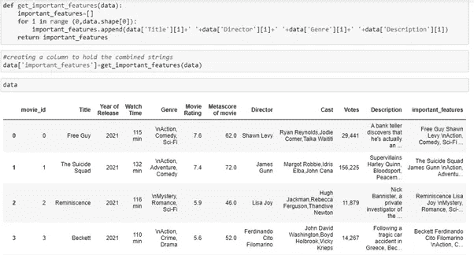

这样做是因为我们的推荐系统不仅通过推荐相似类型的电影，而且还基于电影的演员、导演和情节的组合。

下一步是矢量化该特征以计算相似性。

**TF-IDF 矢量器**

**TF(术语频率)是**给定术语在文档中出现的次数。

```
TF(t) = (Number of times term t appears in a document) / (Total number of terms in the document)
```

**IDF(逆文档频率)**是对该术语在整个语料库中的重要性的度量。

```
IDF(t) = log (Total number of documents / Number of documents containing the term t in it).
```


TF*IDF

选择 TF-IDF 的原因是因为它给不频繁的术语更多的权重，给频繁的术语更少的权重，这对我们的模型很重要。

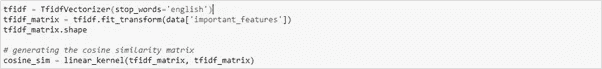

**余弦相似度**

下一步是计算电影之间的相似度。我们可以使用余弦相似度来计算两个向量之间的距离。

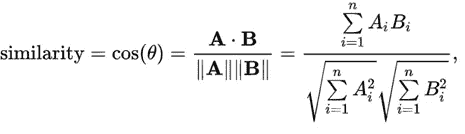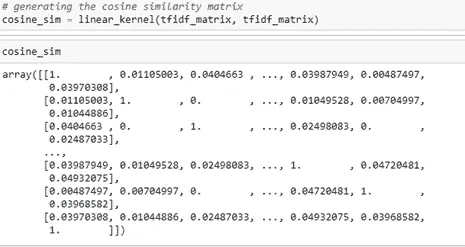

我们需要编写一个逻辑，以电影标题作为输入，并根据余弦相似度返回前 5 个相似的电影。

为此，我们可以创建一个函数来计算我们的输入与语料库中其他电影的相似性得分，然后按降序对得分进行排序，以获得具有最高相似性得分的前 5 部电影。这里，索引 0 在 sim_scores 变量中被丢弃，这样函数就不会返回与输入中输入的电影相同的电影。

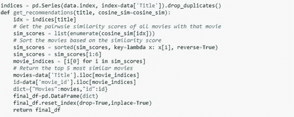

测试我们的推荐引擎

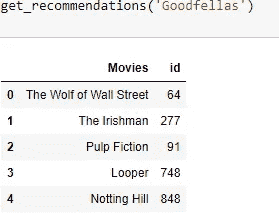

Pickle 是一个已经内置在 Python 中的序列化/反序列化模块:使用它我们可以将任意的 Python 对象(有一些例外)保存到一个文件中。一旦我们有了一个文件，我们就可以在不同的过程中从那里加载模型。


建模的完整代码，

# 设计前端

现在我们已经完成了模型的构建，我们可以开始创建 web 应用程序了。

我们的模型前端使用 Streamlit。 [Streamlit](https://www.streamlit.io/) 是一个开源的 Python 库，可以轻松地为机器学习和数据科学构建漂亮的定制 web 应用。

```
pip install **streamlit**
```

streamlit 上已经有很多好的教程了，比如[这个](https://towardsdatascience.com/streamlit-101-an-in-depth-introduction-fc8aad9492f2)。所以我不想详述我所有的过程。总的来说，我的目标是构建一个获取用户输入并推荐相似电影列表的前端。

一旦你建立了前端，你可以在命令提示符下测试它。

确保您位于包含所有文件的目录中，然后在 cmd 中键入以下命令

```
**streamlit run app.py**
```


# 将我们的模型容器化

什么是 docker 容器？

一个**容器**是一种打包应用程序及其所有依赖项的软件，因此应用程序可以从一个计算环境可靠地运行到另一个计算环境，而 **Docker** 是一种用于构建和管理容器的软件。


为什么我们需要码头集装箱？

您是否曾经遇到过这样的问题:您的代码在您的计算机上运行良好，但当您的朋友试图在他的计算机上运行相同的代码时，代码却无法运行？这个问题的答案是**环境。环境包括编程语言和所有的库和依赖项。**

如果我们可以创建一个可以转移到其他机器上的环境(例如，你朋友的电脑或者像 GCP、AWS 这样的云服务提供商)，我们就可以在任何地方重现结果。因此**，容器**是一种打包应用程序及其所有依赖项的软件，因此应用程序可以从一个计算环境可靠地运行到另一个计算环境。

为了将我们的应用程序进行容器化部署，我们需要一个 docker 映像，它在运行时成为一个容器。使用包含一组指令的 docker 文件创建 docker 映像。该项目的 docker 文件如下所示:

**为 Kubernetes 准备配置文件**

什么是 Kubernetes？

[Kubernetes](https://kubernetes.io/) 是一个开源[容器编排](https://blog.newrelic.com/engineering/container-orchestration-explained/)平台，旨在自动化容器化应用的部署、扩展和管理。

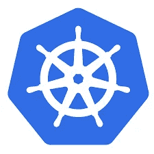

要在 Kubernetes 中部署我们的应用程序，我们需要某些配置文件。

一次部署。YAML 是 Kubernetes 中的一个配置文件，允许您管理一组相同的 pod。如果没有部署，您将需要手动创建、更新和删除一批 pod。

最后，我们需要创建一个服务。YAML

服务配置文件用于允许对一组 pod 进行网络访问。

# 在 Google Kubernetes 引擎中部署

什么是 Google Kubernetes 引擎？

**Google Kubernetes Engine(GKE)**是一个针对 Docker 容器和容器集群的管理和编排系统，运行在 Google 的公共云服务中。Google Kubernetes 引擎基于 Kubernetes，Google 的开源容器管理系统。

其他选择还有[亚马逊弹性库本内特服务(EKS)](https://aws.amazon.com/eks/) 和[微软 Azure 库本内特服务](https://azure.microsoft.com/en-us/services/kubernetes-service/)。

GCP 为新客户提供 90 天 300 美元的免费信贷，这对这个项目来说绰绰有余。

**步骤 1:** 注册并登录 GCP

登录到您的 GCP 控制台并创建一个新项目

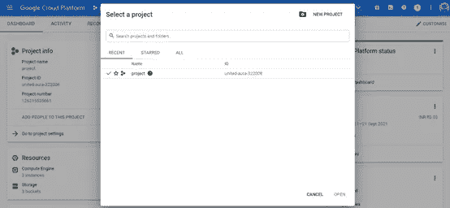

点击新建项目，用您喜欢的名称创建一个新项目，并记下**项目 id**

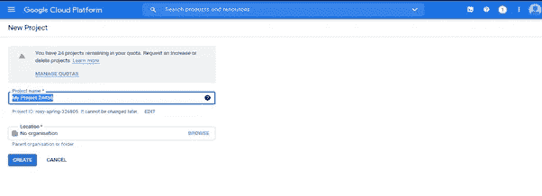

**第二步:**导入项目代码

单击控制台窗口右上角的“激活云壳”按钮打开云壳。

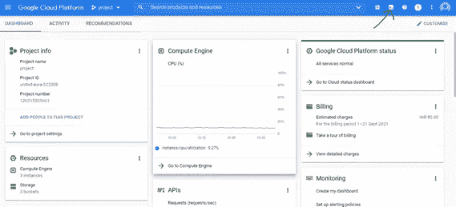

以下命令将帮助您克隆用于这个项目的 GitHub 库，或者您可以直接将源文件夹从您的计算机复制到 GCP。

```
git clone [https://github.com/Chandru-21/End-to-End-Movie-Recommendation-System-with-deployment-using-docker-and-kubernetes.git](https://github.com/Chandru-21/End-to-End-Movie-Recommendation-System-with-deployment-using-docker-and-kubernetes.git)
```

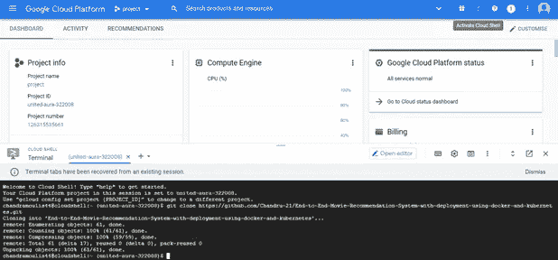

单击 open editor 选项，在 GCP 找到您的存储库。

**步骤 3:** 构建 docker 映像

在构建 docker 映像之前，请确保您已经在您的服务帐户中启用了执行此项目所需的必要 IAM 权限，并记下您的服务帐户 id。

导航到您的项目文件夹，然后构建应用程序的 docker 映像，并通过执行以下命令对其进行标记以便上传:

```
docker build -t gcr.io/${YOUR_PROJECT_ID}/movie_rs:latest .
```

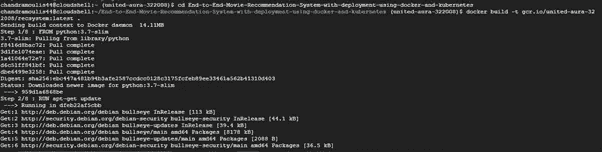

您可以通过运行以下命令来检查可用的图像:

```
**docker** images
```

**步骤 4:** 上传容器图像

执行下面的代码将 docker 图像上传到 google 容器注册中心

```
docker push gcr.io/${YOUR_PROJECT_ID}/ movie_rs:latest 
```

**步骤 5:** 创建一个 Kubernetes 集群

一个[集群](https://cloud.google.com/kubernetes-engine/docs/concepts/cluster-architecture)由至少一个*控制平面*机器和多个称为*节点* : [计算引擎虚拟机](https://cloud.google.com/compute/docs/instances/)实例组成，这些实例运行必要的 Kubernetes 进程，使它们成为集群的一部分。

```
gcloud container clusters create movie-rs — zone “us-west1-b” — machine-type “n1-standard-1” — num-nodes “1” — service-account ${YOUR_GOOGLE _SERVICEACCOUNT}
```

**步骤 6:** 应用配置文件

导航到 GCP 的容器注册表，单击您创建的容器，并复制其路径。

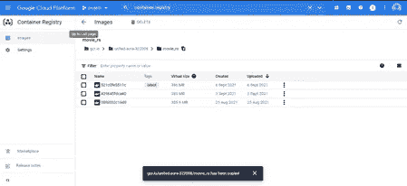

确保部署中存在复制的路径。YAML 文件

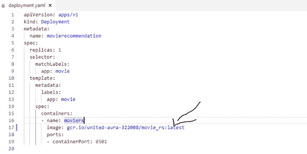

执行以下命令将配置应用到 Kubernetes 集群

```
kubectl apply -f deployment.yaml
```

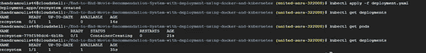

现在执行服务。YAML 配置文件，并等待几分钟，直到**我们的外部 IP** 生成。

```
kubectl apply -f service.yaml
```

**kubectl 获取服务，**命令检查服务的状态

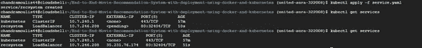

**第七步:**通过公共网址访问应用程序

将外部 IP 粘贴到您选择的任何浏览器中，然后**瞧**您就可以从头开始构建自己的电影推荐系统了。

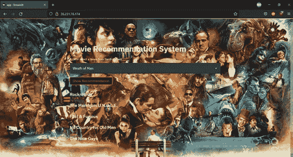

Recommendations for the movie Wrath of Man

此应用程序的[链接](http://35.230.8.59/)

**注意:**当您访问该链接时，它可能会从公共地址中删除，以限制资源消耗。

Github 链接获取本文中使用的所有代码和文件，

[](https://github.com/Chandru-21/End-to-End-Movie-Recommendation-System-with-deployment-using-docker-and-kubernetes) [## GitHub …

### 第一步:数据抓取数据是从 IMDB 网站上抓取的(使用美人汤)。参考网页抓取 _new.py…

github.com](https://github.com/Chandru-21/End-to-End-Movie-Recommendation-System-with-deployment-using-docker-and-kubernetes) 

# 结论

唷！这是一个很长的帖子，我希望我没有在中间失去很多人。我的目的只是演示创建一个端到端的电影推荐系统所需的基本步骤，而不是深入到每一个细节。

非常感谢你花时间阅读这篇文章，我希望这篇文章对你有所帮助。如果您有任何疑问、澄清或建议，请告诉我。下次再见，保重！