# ASP.NET 核心 6.0 中使用最少 API 的端到端项目

> 原文：<https://medium.com/geekculture/end-to-end-project-with-minimal-api-in-asp-net-core-6-0-f32eaca9334d?source=collection_archive---------1----------------------->


嗨，今天我们将谈论新的最小 API，它可以帮助我们以更简单的方式提高代码开发质量和速度。我们将创建端到端的项目，并尝试使用最小的 API 和的好处。Net 6.0

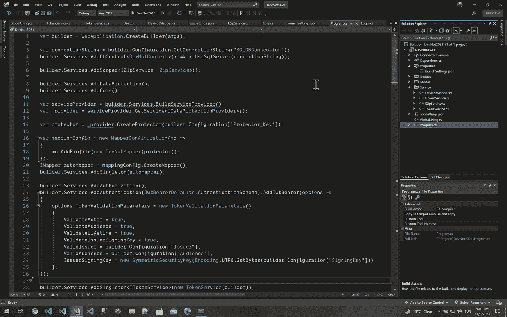

# 让我们设置环境:

*   [。Net SDK 6.0.100-preview.7](https://dotnet.microsoft.com/download/dotnet/6.0) 下载。
*   [Visual Studio 2022 预览版](https://visualstudio.microsoft.com/downloads/)下载
*   dotnet 工具安装—全局 dotnet-ef

。Net 6.0 和 Visual Studio 2022 尚未完全发布，但您可以在 2021 年 11 月 8 日下载最终版本。我们将首先为这个项目使用数据库，所以我们需要“ **dotnet-ef** ”从现有的 SQL 数据库(Abys-Prod)到我们的项目创建数据库上下文和实体。

> ***“把事情做得尽可能简单，但不要更简单。”***
> 
> **——阿尔伯特·爱因斯坦**

我们将创建一个空 web 应用程序，如下所示:

```
dotnet new web -o DevNot21
```

创建一个空的 web 应用程序后，我们将看到这个简单的代码页。没有控制器或任何命名空间，也没有导入文件。

```
var builder = WebApplication.CreateBuilder(args);var app = builder.Build();app.MapGet("/", () => "Hello World!");app.Run();
```

当我第一次看到 minimal API 时，我想欢迎使用 NodeJS Express:)它的可读性更好，而且整个东西都在一个地方。最小 API 是一个控制台应用程序。但是没有" **Main()** "方法。将程序的入口点放在一个类的静态方法中不需要额外的仪式。当您构建它时，Vm IIS 已经启动并从默认的 3000 端口运行。您可以通过以下方式更改默认端口

*   launchSettings.json/profiles/"projectName"/applicationUrl 或

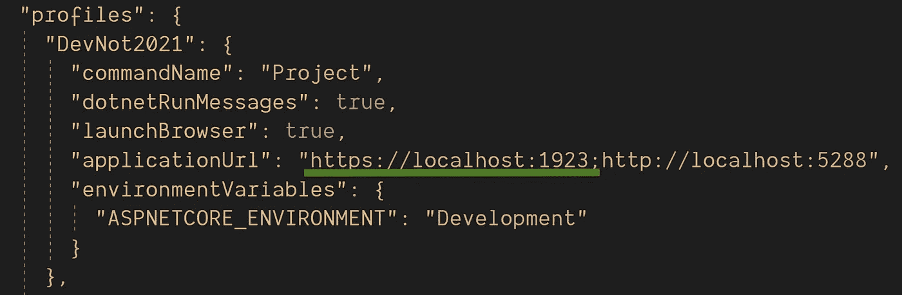

*   只需添加“ ***app。URLs . Add(" https://localhost:1923 ")；*** " to Program.cs .但是当我们选择第二个选项时，控制台应用并没有自动打开 chrome 浏览器。你必须手动操作。

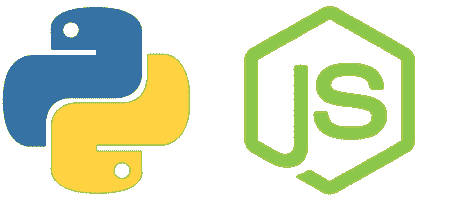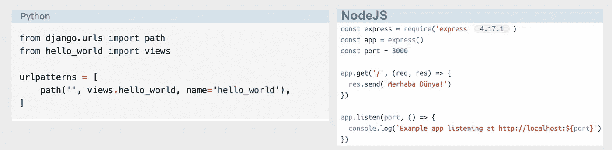

# 首次新测试服务:

**模型/角色:**这是角色记录。我们将从服务中返回*列表<角色>* 。 ***而且可以看到，“名称空间”不再需要“{" "}”了*** :)记录都是不可变的新类型。记录可以像方法一样接受构造函数属性。我们称之为位置记录。这些参数是 default declare init。这意味着当我们设置属性时，它们根本不能改变。记录随之而来。一年前的 Net 5.0。该测试虚拟服务将返回角色模型结果列表。

```
namespace DevNot21.Model;public record Role(int RoleID, string RoleName, int GroupID)
{
   public bool HasRole(int access, int roleID)
   { 
      return roleID == (access & roleID);
   }
}
```

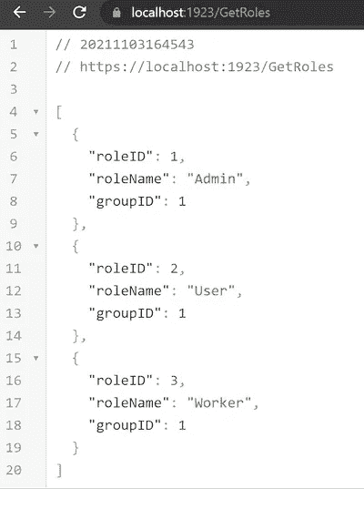

**Program.cs/GetRoles:**我们将返回虚拟数据**列表<角色>如下图。**

```
app.MapGet("/GetRoles", (Func<List<Role>>)(() => new()
{
    new(1, "Admin", 1),
    new(2, "User", 1),
    new(3, "Worker", 1)
}));
```

****

# **Swagger 集成:**

**我们将把下面的包从 Nuget 添加到项目中。**

**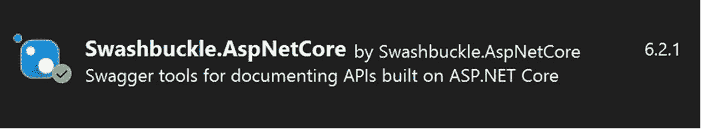**

**将 Swagger 配置添加到 Program.cs，如下所示。我们将添加身份验证部分和承载令牌。重要的部分是如果你把 type 描述成 HTTP "***Type = SecuritySchemeType。Http*** ，你就不用每次在令牌上大摇大摆的写**来人**开头了。**

****Program.cs/Swagger:****

**并且不要忘记在应用程序中添加“UseSwagger()和 UseSwaggerUI”。**

```
if (app.Environment.IsDevelopment())
{
   app.UseDeveloperExceptionPage();
   app.UseSwagger();
   app.UseSwaggerUI(c => c.SwaggerEndpoint("/swagger/v1/swagger.json", "Api v1"));
}
```

**这是 swagger 表单 URL "[***https://localhost:1923/swagger***](https://localhost:1923/swagger/index.html)"**

**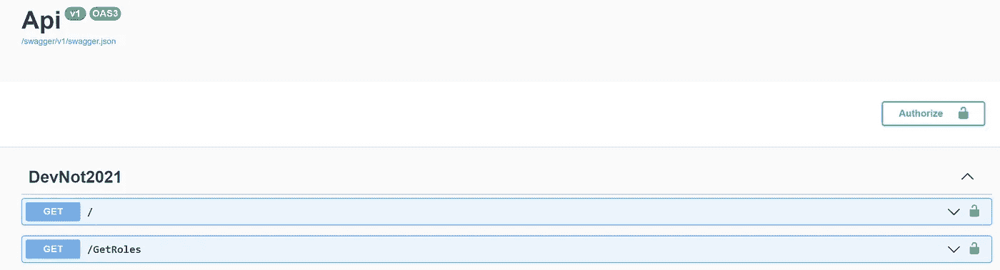**

# **创建 DBLayer，添加 DBContext 和实体**

**我们将在这个项目中首先使用数据库。为了创建 DBContext 和实体，您必须下载下面的包。**

```
dotnet add package Microsoft.EntityFrameworkCore.SqlServer.Design;
dotnet add package Microsoft.EntityFrameworkCore.SqlServer
dotnet add package Microsoft.EntityFrameworkCore.Tools
```

**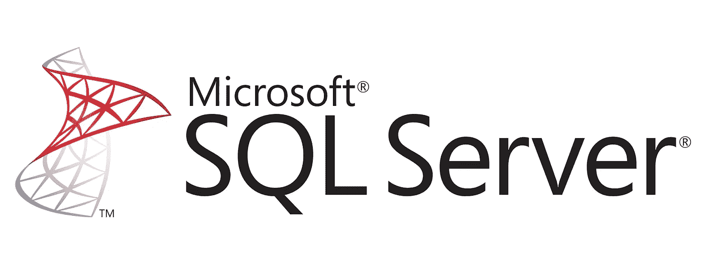**

**将 DBConnection 字符串声明到 appsettings.json，如下所示**

****appsettings.json****

```
"ConnectionStrings": {
    "SQLDBConnection": "Data Source=.;initial
catalog=ABYS_PROD;Trusted_Connection=True;"
},
```

**如果您调用如下的“***dotnet ef db context scaffold***”命令，DevNotContext 和所有实体将被创建在 Entities 文件夹下。**

```
dotnet ef dbcontext scaffold "Server=.;Database=ABYS_PROD;Trusted_Connection=True;" Microsoft.EntityFrameworkCore.SqlServer -o Entities --context-dir "Entities\DbContexts" --no-pluralize -c DevNotContext -f
```

**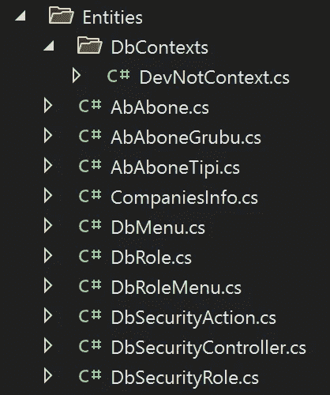**

****Program.cs:** 我们在 Program.cs 中调用 AddDBContext()方法，所以我们将在项目启动时创建 DevNotContext 作为静态。我们称之为**依赖注入。**“毕竟我们可以直接在任何类的构造函数中注入 DevNotContext。**

****program.cs/AddDbContext:****

*   **“建筑商。我们从 appsettings.json 中获得了“SQLDBConnection”**
*   **“建筑商。Service.AddDbContext()":我们为项目创建静态 DevNotContext。**

```
var connectionString = builder.Configuration.GetConnectionString("SQLDBConnection");builder.Services.AddDbContext<DevNotContext>(x => x.UseSqlServer(connectionString));
```

# **GlobalUsing.cs:**

**英寸 Net 6.0，我们可以用“ ***全局***”declare 关键字在一个类中声明所有的导入库。所以我们可以在一个地方管理所有的库。**

```
global using AutoMapper;
global using DevNot2021.Entities.DbContexts;
global using DevNot2021.Model;
global using DevNot2021.Services;
global using DevNot21.Model;
global using Microsoft.AspNetCore.DataProtection;
global using Microsoft.EntityFrameworkCore;
global using Microsoft.OpenApi.Models;
global using AutoMapper;
global using DevNot2021.Entities;
global using Microsoft.AspNetCore.DataProtection;
global using Microsoft.AspNetCore.Authentication.JwtBearer;
global using Microsoft.AspNetCore.Authorization;
global using Microsoft.AspNetCore.Mvc;
global using Microsoft.IdentityModel.Tokens;
global using System.Text;
```

# **可枚举。Zip():**

**这项功能将随一起提供。Net 6.0。示例场景，下面有三个 SQL 查询。我们可以通过使用视图或 SQL 过程来组合所有的查询。但是我不想把商业写进数据库。此外，如果我们将这些查询作为第三方公司的服务，我们必须手动组合所有三个查询，并将它们放在一个视图模型中。我们将使用**和*进行枚举。Zip*** ”。**

****

# **服务/IZipService:**

**我们将创建这个 ZipService。它需要三个列表<string>参数。这是我们的三个 Sql 查询结果列表。ZipService 返回元组"<string name="" string="" role="" long="" action="">"</string></string>**

*   ****名称**来自第一个查询也是第一个列表。**
*   ****角色**来自第二个查询也是第二个列表。**
*   ****动作**来自第三个查询也是第三个列表。**

**我们使用了“**产量**”关键字。我们一件一件地归还了每一件物品。所以我们不需要创建任何 List < string >对象来填充并返回它。**

*****可枚举。Zip(list1，list2，list3)*** ":组合这三个列表中的每一项，返回 tuple(string，string，long？)值。**

```
namespace DevNot2021.Services;public interface IZipService
{
    IEnumerable<string> ZipResult(List<string> list1, List<string> list2, List<long?> list3);
}public class ZipService : IZipService
{
    public IEnumerable<string> ZipResult(List<string> list1, List<string> list2, List<long?> list3)
    {
        foreach ((string name, string role, long? action) in
        Enumerable.Zip(list1, list2, list3))
        {
            yield return $"{name} - {role} - {action}";
        }
    }
}
```

**让我们将 ZipService 实现到我们的项目中:我们添加了带有“Scoped”的 IZipService。在每个新的请求中，我们将创建一个新的请求并处理它。如果我们将它创建为一个单例，由于 3 个列表参数，这可能是非常危险的。每个客户端都可以使用相同的 3 个列表:)**

```
builder.Services.AddScoped<IZipService, ZipService>();
```

> ***“通过消除生活中不必要的需求来减少生活的复杂性，生活的劳动也就减少了。”***
> 
> ****——埃德温·韦·蒂勒****

****Program.cs/GetTop5UserPermisions**:**

**让我们通过 LINQ 编写的这三个 SQL 查询来测试我们的 IZipService，并将结果与 IZipService 结合起来，最后返回它。**

```
app.MapGet("/GetTop5UserPermisions", async (DevNotContext context, IZipService service) =>
{
     var userList = await context.DbUser.Where(du => du.IdSecurityRole != null).Select(u => $"{u.Name} {u.LastName}").Take(5).ToListAsync(); var roleList = await (from role in context.DbSecurityRole join user in context.DbUser on role.IdSecurityRole equals user.IdSecurityRole select role.SecurityRoleName).Take(5).ToListAsync(); var IdUserList = await context.DbUser.Where(du => du.IdSecurityRole != null).Select(db => db.IdUser.ToString()).Take(5).ToListAsync(); var actionList = await context.DbSecurityUserAction.Where(a => a.IdSecurityController == 2 &&
IdUserList.Contains(a.IdUser.ToString())).Select(u =>
u.ActionNumberTotal).Take(5).ToListAsync(); return service.ZipResult(userList, roleList, actionList);});
```

*   **(DevNotContext context，IZipService service) = >我们通过使用依赖注入来添加 DBContext 和 IZipService。**
*   ****用户列表**:这是前 5 名用户全名列表。**
*   ****角色列表**:这是前 5 名用户的角色列表。**
*   ****动作列表**:这是前 5 名用户的授权列表。**
*   *****谓返回服务。ZipResult(userList，roleList，actionList)*** ":最后我们将这三个列表合并成一个结果列表。**

**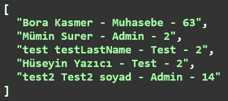**

# **自动映射器集成:**

**我们从 Nuget 包管理器下载了下面的包。**

**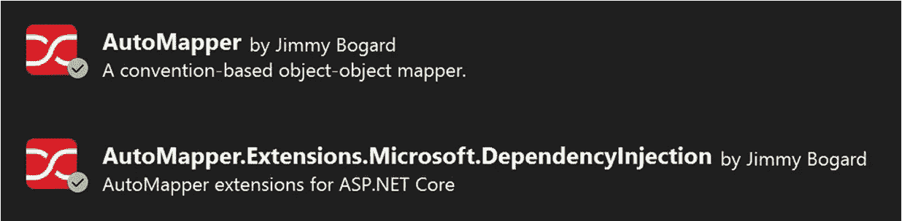**

**我们将使用 AutoMapper 来保护“ ***PasswordHash*** ”属性。所以我们将从 NuGet 包管理器下载 DataProtection 库，如下所示。**

**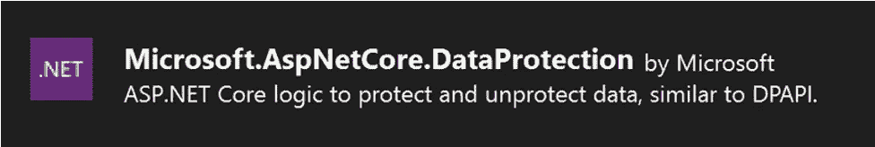**

**我们向构建器服务添加了“***【adddata protection()***”。我们使用了服务。用于在运行时创建提供程序的 BuildServiceProvider()。最小 API 比。Net 5.0 在运行时创建对象。因此，稍后我们可以将“ **protector** ”对象作为参数提供给 Automapper 类的构造函数。**

****

****Program.cs/AddDataProtection**:**

```
builder.Services.AddDataProtection();
builder.Services.AddCors();var serviceProvider = builder.Services.BuildServiceProvider();
var _provider = serviceProvider.GetService<IDataProtectionProvider>();var protector =
_provider.CreateProtector(builder.Configuration["Protector_Key"]);
```

****appsettings.json:** 这是保护类的密钥。为了安全起见，如果你将 Protector_Key 编码可能会好得多。**

```
"Protector_Key": "DevNot2021.Model.v1",
```

****用户视图模型:**我们将从 DBUser 获取“Name + LastName”作为用户视图模型的全名。实际上，我们会创造一个记录。记录是不可变的类型。它们看起来像类，但是有更多的属性。**

****型号/用户**:**

```
namespace DevNot2021.Model;
public record User
{
    public int? IdSecurityRole { get; set; }
    public string Name { get; set; }
    public string LastName { get; set; }
    public string UserName { get; set; }
    public string Password { get; set; }
    public string PasswordHash { get; set; }
    public string Email { get; set; }
    public string Gsm { get; set; }
    public long? TotalCompanyNumber { get; set; }
    public bool IsDeleted { get; set; }
    public bool? IsAdmin { get; set; }
    public string FullName { get; set; }
}
```

**让我们为匹配和编码属性创建 AutoMapper 类。**

****Model/DevNotMapper.cs:****

*   **" public devnot mapper(IDataProtector provider)":我们在构造函数中获得了 idata protector 类，用于通过依赖注入加密到密码。**
*   **" *CreateMap < DbUser，User > ()* ":我们将“DbUser”实体与“User”ViewModel =>full Name =(Name+last Name)进行了匹配**
*   ***CreateMap < DbUser，User>()*":password hash = provider。取消保护(u2。PasswordHash) = >当我们使用 provider 从 DBUser 读取数据时，我们解密了 PasswordHash 属性。Unprotect()方法。**
*   **“CreateMap <user dbuser="">()”:从 User 到 DBUser，实际上我们在插入或更新用户时，会通过使用 provider 加密到“PasswordHash”属性。Protect()方法。</user>**

```
namespace DevNot2021.Model;public class DevNotMapper : Profile
{
    public DevNotMapper(IDataProtector provider)
    {
        CreateMap<DbUser, User>()
        .ForMember(u => u.FullName, opt => opt.MapFrom(u2 => u2.Name + " " + u2.LastName))
        .ForMember(u => u.PasswordHash, opt => opt.MapFrom(u2 => provider.Unprotect(u2.PasswordHash))); CreateMap<User, DbUser>().ForMember(u => u.PasswordHash, opt => opt.MapFrom(u2 => provider.Protect(u2.Password)));
    }
}
```

> ****简约是极致的世故****
> 
> *****——达芬奇*****

***让我们将 AutoMapper 添加到这个构建器中。服务()。***

*   ***我们用“***mapper configuration()***”方法添加了 DevNotMapper 配置类。***
*   ***"***DevNotMapper(protector)***":我们将 protector 类作为参数添加到 DevNotMapper 构造函数中。这很容易。Net 6.0。但这并不容易。Net Core 5.0、3.1 或更老的版本。因为运行时创建问题。你必须避免启动服务注入。Net 6.0 或者你可以在 program.cs 之前创建一个对象。***
*   ***我们用 CreateMapper()方法创建了一个 autoMapper 类。毕竟，我们可以在 program.cs 中随时使用“ ***自动映射器*** ”对象***
*   ***我们创建了 autoMapper 作为一个单例，通过依赖注入注入到另一个类。***

```
*var mappingConfig = new MapperConfiguration(mc =>
{
    mc.AddProfile(new DevNotMapper(protector));
});IMapper autoMapper = mappingConfig.CreateMapper();
builder.Services.AddSingleton(autoMapper);*
```

*****让我们插入一个用户并检查数据库**:***

***我们用**依赖注入注入了 DevNotContext 和 IMapper。**和用户是一个参数。***

*****不是:** I *n 这个 post 方法，我们没有在用户参数前使用* `*[FromBody]*` *属性。****

*   ***"//var model = autoMapper。Map <dbuser>(user)”:我们也可以直接使用我们在 program.cs 开始时创建的“autoMapper”类。所以如果你愿意，你可以不注射 IMapper。</dbuser>***
*   ***“var 模型=映射器。Map <dbuser>(user)":我们使用 AutoMapper 从 user 映射到 DbUser，因此 PasswordHash 属性必须使用" *DataProtector* "类加密保存。</dbuser>***
*   ***“语境。Add(model)":我们通过使用 Entity 向 DbUser 添加了一个新用户。***

```
*app.MapPost("/InsertUser", async (DevNotContext context, User user,IMapper mapper) =>{ //var model = autoMapper.Map<DbUser>(user);
    var model = mapper.Map<DbUser>(user);
    context.DbUser.Add(model);

    await context.SaveChangesAsync();
    return new OkResult();
});*
```

***插入新用户后，这是 MsSql Server 上新用户数据的结果。如下所示，PasswordHash 属性是加密的并且是安全的。在从 User 到 DBUser 的自动映射类上，我们将 password 属性保护为 passwordhash 属性。***

***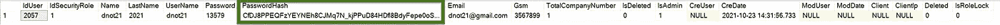***

*****让我们通过名称服务获取用户:*****

*****program.cs/GetAllUsersByName:**这次我们将通过包含从 DBUser 到= >用户视图模型的名称来获取用户列表。***

*   ***“语境。我们将通过名称异步获取用户列表。***
*   ***" var result = autoMapper。Map <list>>(model)”:我们将从 DBUser 获取用户数据到用户视图模型。从 DBuser 获取数据时，我们解密 PasswordHash 并返回用户视图模型。</list>***

```
*app.MapGet("/GetAllUsersByName/{name}", async (HttpContext http, DevNotContext context, string name) =>
{
    var model = await context.DbUser.Where(u =>
    u.UserName.Contains(name)).ToListAsync(); var result = autoMapper.Map<List<User>>(model);
    return result;
});*
```

***这是 GetAllUsersByName()方法的结果页。您可以看到 PasswordHash 已被解密。***

***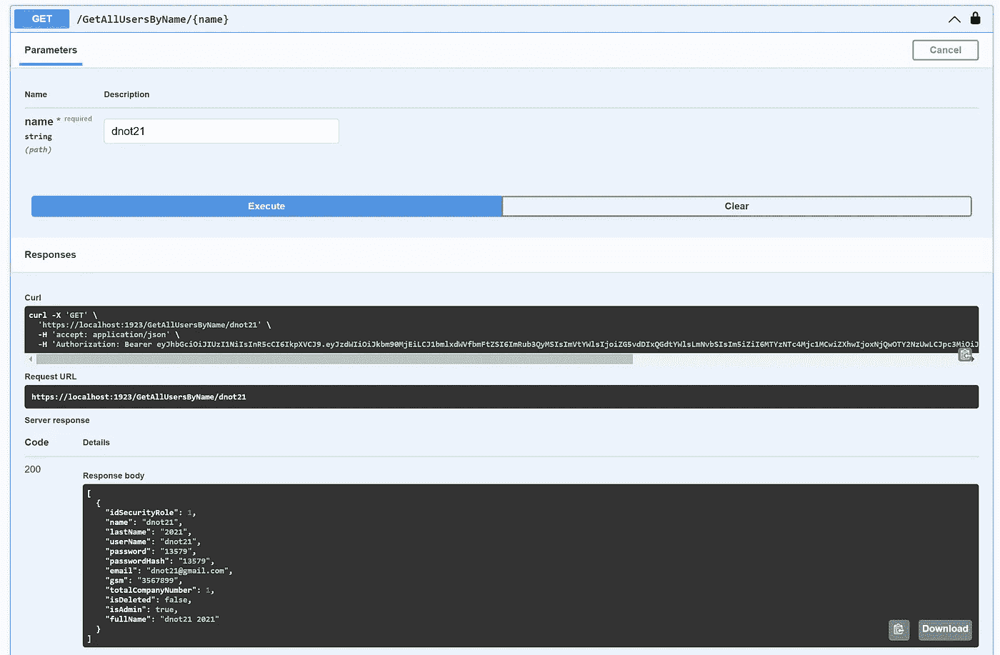*********

# ***JWT 令牌集成:***

***首先，我们必须下载认证。来自 Nuget 包管理器的 JwtBearer 库，如下所示。***

***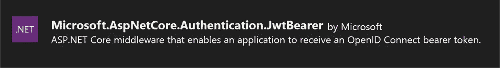***

***如下所示，我们用 JwtBearer 添加了身份验证配置。就我个人而言，我不喜欢 Jwt，因为无法改变令牌的到期时间。在声明 add Jwt 之前，必须调用 AddAuthorization()方法。“发行者”、“受众”和“签名密钥”是用于创建自己的唯一令牌密钥的可变配置参数。***

```
*builder.Services.AddAuthorization();builder.Services.AddAuthentication(JwtBearerDefaults.AuthenticationScheme).AddJwtBearer(options =>
{
    options.TokenValidationParameters = new TokenValidationParameters()
    {
        ValidateActor = true,
        ValidateAudience = true,
        ValidateLifetime = true,
        ValidateIssuerSigningKey = true,
        ValidIssuer = builder.Configuration["Issuer"],
        ValidAudience = builder.Configuration["Audience"],
        IssuerSigningKey = new SymmetricSecurityKey(Encoding.UTF8.GetBytes(builder.Configuration["SigningKey"]))
    };
});*
```

*****appsettings.json:** 我们必须在 appsettings.json 中声明这些参数。这些配置参数由 JWT 使用。***

```
*"Issuer": "https://login.vbt.com.tr/bkasmer",
"Audience": "borakasmer",
"SigningKey": "Cut The Night With The Light"*
```

# ***让我们用 JWT 创建令牌服务:***

*****Service/ITokenService:** 在我们登录之后，我们将获得一个用户，并使用它作为参数来为当前用户生成一个令牌。(GetToken())***

```
*namespace DevNot2021.Services;
public interface ITokenService
{
    string GetToken(DbUser user);
}*
```

*****服务/令牌服务:**在此服务中，我们将为登录用户创建一段时间的 JwtToken。***

*   ***首先，我们将使用“**用户**”参数创建一个索赔。***
*   ***发行者、受众和 SymmetricSecurityKey 是从配置中获取的。***
*   ***“过期”时间是六十天:)我知道太长了。并且您不能在此之前使令牌过期。这就是我不喜欢 JWT 的原因。***
*   ***“signingCredentials”:我们选择 SecurityAlgorithms.HmacSha256。***

```
*using Microsoft.IdentityModel.Tokens;
using System.IdentityModel.Tokens.Jwt;
using System.Security.Claims;
using System.Text;public class TokenService : ITokenService
{
    WebApplicationBuilder _builder;
    public TokenService(WebApplicationBuilder builder)
    {
         _builder = builder;
    } public string GetToken(DbUser user)
    {
        var claims = new[]
        {
            new Claim(JwtRegisteredClaimNames.Sub, user.UserName),
            new Claim(JwtRegisteredClaimNames.UniqueName, user.UserName),
            new Claim(JwtRegisteredClaimNames.Email, user.Email)
        };
        var token = new JwtSecurityToken
        (
            issuer: _builder.Configuration["Issuer"],
            audience: _builder.Configuration["Audience"],
            claims: claims,
            expires: DateTime.UtcNow.AddDays(60),
            notBefore: DateTime.UtcNow,
            signingCredentials: new SigningCredentials(
            new SymmetricSecurityKey(Encoding.UTF8.GetBytes(_builder.Configuration["SigningKey"])),SecurityAlgorithms.HmacSha256)
        ); return new JwtSecurityTokenHandler().WriteToken(token);
    }
}*
```

> ****“生活真的很简单，但是我们坚持要把它变得复杂。”****
> 
> *****——孔子*****

***我们将把这个 ITokenService 添加到生成器中，如下所示。毕竟我们可以用依赖注入来注入。***

*****program.cs/ITokenService:*****

```
*builder.Services.AddSingleton<ITokenService>(new TokenService(builder));*
```

*****program.cs:** 首先，我们必须向应用程序添加授权和认证服务。***

```
*app.UseAuthorization();
app.UseAuthentication();
app.UseCors(p =>
{
    p.AllowAnyOrigin();
    p.WithMethods("GET");
    p.AllowAnyHeader();
});*
```

*****模型/登录:**我们将编写登录服务。这是我们的登录模型。***

```
*namespace DevNot2021.Model;public class Login
{
    public string UserName { get; set; }
    public string Password { get; set; }
}*
```

*****program.cs/login:*****

*   ***"[AllowAnonymous]":此属性表示此方法没有授权。***
*   ***我们将在构造函数上注入 DevNotContext、ITokenService 和 HttpContext。并为用户发送登录参数。***
*   ***" _ 上下文。我们将通过用户名和密码搜索用户***
*   ***“if (userModel == null)”:如果我们没有找到任何用户，我们将返回 401 未授权错误。***
*   ***“var token =服务。GetToken(userModel)”:如果我们找到一个用户，我们将创建一个令牌并返回它。***

```
*app.MapPost("/login", [AllowAnonymous] async (DevNotContext _context, HttpContext http, ITokenService service, Login login) =>
{
    if (!string.IsNullOrEmpty(login.UserName) && !string.IsNullOrEmpty(login.Password))
    {
        var userModel = await _context.DbUser.Where(u => u.UserName == login.UserName && u.Password ==
login.Password).FirstOrDefaultAsync(); if (userModel == null)
        {
            http.Response.StatusCode = 401;
            await http.Response.WriteAsJsonAsync(new { Message = "Yor Are Not Authorized!" });
            return;
        }
        var token = service.GetToken(userModel);
        await http.Response.WriteAsJsonAsync(new { token = token });
        return;
    }
});*
```

***这是登录服务的结果。接下来，我们将使用这个 JWT 令牌对任何 web 服务进行授权。***

***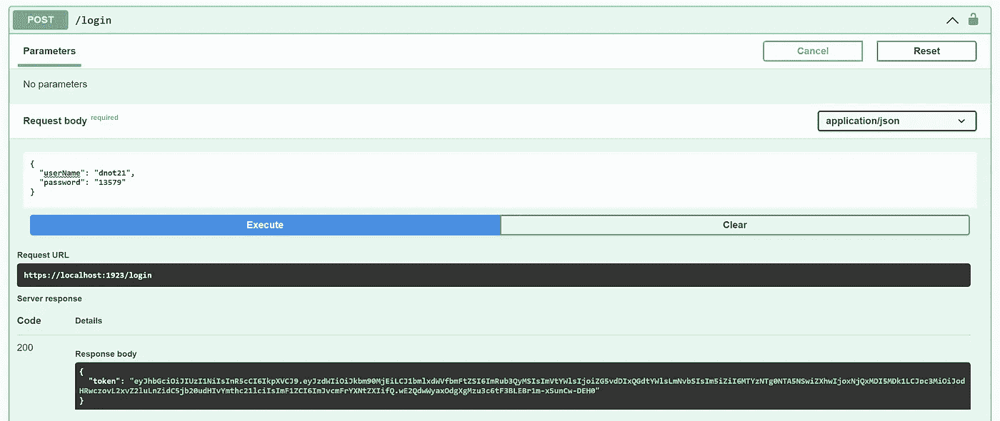***

# *****【Authorize(AuthenticationSchemes = JwtBearerDefaults。认证模式)】*****

*****program.cs/GetAllUsersByName:**现在我们给现有的 GetAllUsersByName()方法添加了[ **Authorize** 属性。现在，这种方法是安全的，禁止匿名用户使用。***

***此外，除了[ **授权**属性，我们还可以添加“ ***”。RequireAuthorization()*** "扩展方法来保护这个服务。***

```
*app.MapGet("/GetAllUsersByName/{name}", [Authorize(AuthenticationSchemes = JwtBearerDefaults.AuthenticationScheme)] async (HttpContext http, DevNotContext context, string name) =>
{
    var model = await context.DbUser.Where(u =>
    u.UserName.Contains(name)).ToListAsync();var result = autoMapper.Map<List<User>>(model);
    return result;
});//.RequireAuthorization();*
```

***如果您尝试 GetAllUsersByName()方法而不使用下面的登录名，您将得到一个 401 未授权错误。***

***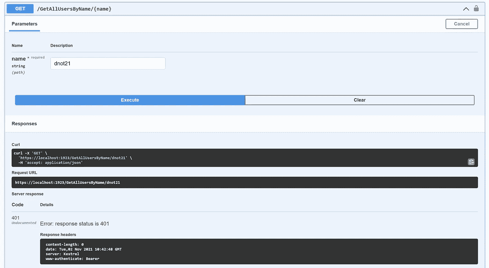***

***首先，你必须登录并获得一个令牌。稍后将其复制并粘贴到 swagger 授权持有人框中。仅此而已。我们完成授权步骤。***

***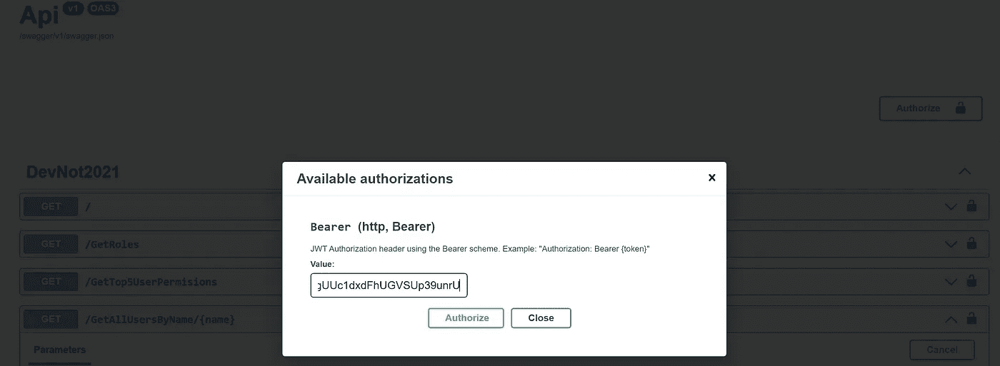***

***现在，当您从“GetAllUsersByName()”中按名称搜索用户时，您可以得到如下结果。***

******

*****结论:*****

***在本文中，我们讨论了最小 Api。Net 6.0 和 C#10 的优势和新特性。如今，性能和简单性是最重要的。。Net 6.0 和 Entity 6.0 给了我们更多的性能，最小 Api 给了我们更多的可读性。在我看来，极简 Api 对于微服务这样的小项目来说是非常得心应手的。。Net 6.0 和 C# 10 的新特性改变了游戏规则。如果您不接受新功能，如果您只是将 Entity 从 5.0 升级到 6.0，那么在行业标准 TechEmpower Fortunes 基准测试中，性能现在要快**70%**。***

***我希望这篇文章能帮助你理解什么是最小 API。我们如何在最小的 API 中实现环境技术？我们如何将现有的项目转换成最小的 API 或者创建一个新的？下次见，直到下一篇文章或视频。再见。***

****“如果你读到现在，首先感谢你的耐心和支持。欢迎大家到我的博客***获取更多！”*****

******源代码:**[**https://github.com/borakasmer/MinimalApi**](https://github.com/borakasmer/MinimalApi)****

******Abys_Proud Sql 脚本:**[**http://borakasmer.com/projects/Abys_Prod.sql**](http://borakasmer.com/projects/Abys_Prod.sql)****

******来源:******

*   ****[https://docs . Microsoft . com/en-us/dot net/cs harp/whats-new/cs harp-10](https://docs.microsoft.com/en-us/dotnet/csharp/whats-new/csharp-10)****
*   ****[https://www . code mag . com/Article/2111062/What % E2 % 80% 99s-New-in-ASP。网芯。NET-6](https://www.codemag.com/Article/2111062/What%E2%80%99s-New-in-ASP.NET-Core-in-.NET-6)****
*   ****[https://www . codemag . com/Article/2111052/Essential-c#-10.0-化繁为简](https://www.codemag.com/Article/2111052/Essential-C#-10.0-Making-it-Simpler)****
*   ****[https://dev blogs . Microsoft . com/dot net/ASP-net-core-updates-in-net-6-preview-4/](https://devblogs.microsoft.com/dotnet/asp-net-core-updates-in-net-6-preview-4/)****
*   ****[https://dev blogs . Microsoft . com/dotnet/announcing-entity-framework-core-6-0-preview-4-performance-edition/](https://devblogs.microsoft.com/dotnet/announcing-entity-framework-core-6-0-preview-4-performance-edition/)****
*   ****[https://dev blogs . Microsoft . com/dotnet/announcing-net-6-preview-7/](https://devblogs.microsoft.com/dotnet/announcing-net-6-preview-7/)****
*   ****[https://dotnetcoretutorials . com/2021/07/16/building-minimal-APIs-in-net-6/](https://dotnetcoretutorials.com/2021/07/16/building-minimal-apis-in-net-6/)****
*   ****[https://dotnetthoughts.net/minimal-api-in-aspnet-core-mvc6/](https://dotnetthoughts.net/minimal-api-in-aspnet-core-mvc6/)****
*   ****[https://dev blogs . Microsoft . com/dot net/file-io-improvements-in-dot net-6/](https://devblogs.microsoft.com/dotnet/file-io-improvements-in-dotnet-6/)****
*   ****[https://medium . com/devopsturkiye/net-6-ve-yenilikleri-1-preview-1-preview-2-6fd 1b 7667843](/devopsturkiye/net-6-ve-yenilikleri-1-preview-1-preview-2-6fd1b7667843)****