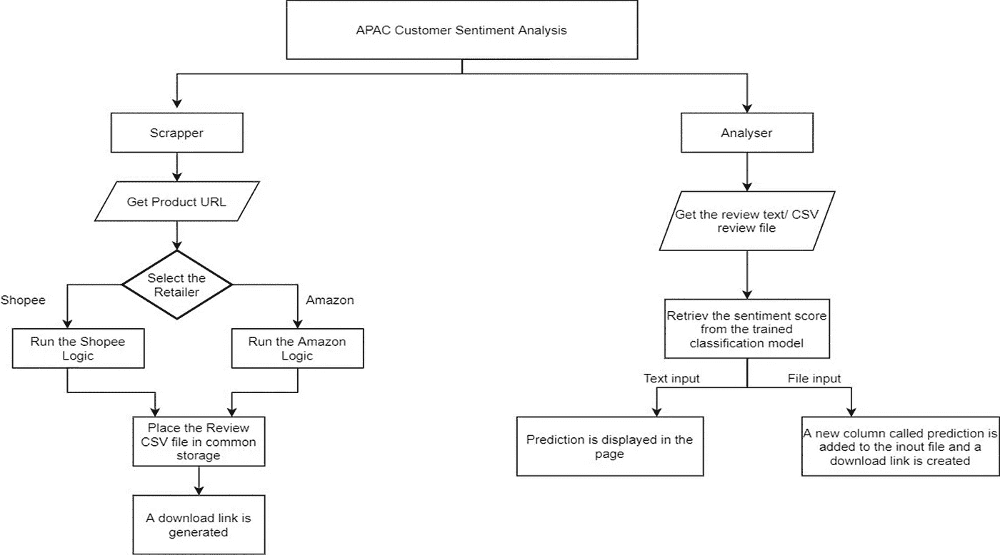
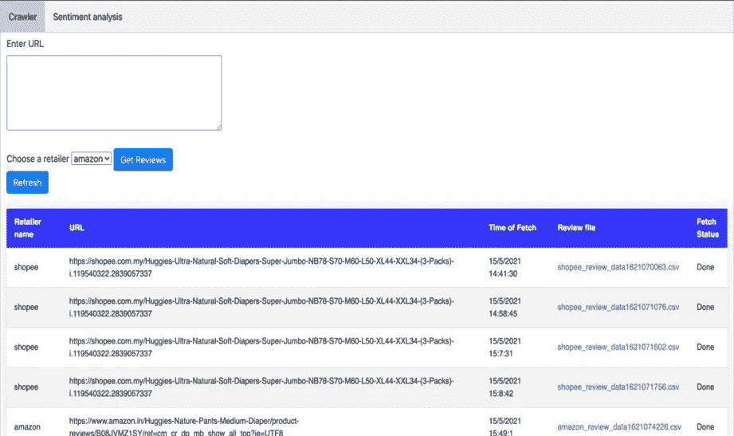

# 亚马逊和 Shopee 评论的端到端情感分析

> 原文：<https://medium.com/geekculture/end-to-end-sentiment-analysis-of-amazon-and-shopee-reviews-b717978a1e56?source=collection_archive---------11----------------------->

## 一个涉及收集数据、转换数据、获得见解然后预测情绪的项目，包含整个数据生命周期过程。


Photo by [Sunrise King](https://unsplash.com/@sunriseking?utm_source=medium&utm_medium=referral) on [Unsplash](https://unsplash.com?utm_source=medium&utm_medium=referral)

# **简介**

这个项目基于一个非常常见的 NLP 用例——产品评论的情感分析。已经开发了一个网络应用程序，它从亚马逊和 Shopee 等电子商务网站上抓取产品评论，然后对评论进行情感分析，以确定评论是正面还是负面。这个应用程序被设计为一个原型，用来分析在线提供的特定产品的产品评论，以找出 APAC 市场负面评论背后的原因。

完整的代码可以在我的 [GitHub repo](https://github.com/UtkarshRedd/Review_Scraper.git) 中找到。

# 方法学

## **1。Webapp**

web-app 的工作流程如下:



app 的 UI 如下:—



**第一步:**在“爬虫”标签中，可以从 Amazon 或 Shopee 粘贴任何产品页面的 URL。

**第 2 步:**选择特定的零售商，点击“获取评论”

**第三步:**点击刷新。新作业将在下表中排队。当“状态”显示“完成”时，单击查看生成的 csv 文件。这将把文件下载到本地机器。注意:这可能需要几分钟时间。

**第 4 步:**现在进入“情绪分析”选项卡。点击选择文件并上传下载的 csv 文件。点击“提交”。

**第五步:**下载输出 csv 文件。

最终的 csv 文件将有一个新列，其中包含每次审查的阳性/阴性标签。

或者，也可以将文本评论直接粘贴到给定的文本框中。点击“获取情绪”后，它会给出正面或负面的输出。

## 需要注意的几件事

1.  **Redis 队列管理**已经被采用，它在上面的快照中给出的表中对“get review”请求进行排队。
2.  需要使用以下表架构创建一个新数据库。此外，需要在 GitHub repo 中给出的“mysql_connection.py”和“main . py”(fetch 函数内部)文件中指定数据库凭证。

```
review1(
job_id LONGTEXT, 
time LONGTEXT, 
filename LONGTEXT, 
retailer VARCHAR(10), 
url LONGTEXT, 
status LONGTEXT
)
```

## **2。情感分析模型**

这款应用最棒的地方在于，任何人都可以整合自己训练过的机器学习模型。该模型存在于上述 GitHub repo 中名为“model.pkl”的 pickle 文件中。这是一个朴素贝叶斯分类器，已经在 Kaggle 亚马逊产品评论数据链接[这里](https://www.kaggle.com/arhamrumi/amazon-product-reviews)上训练过。

情感分析遵循以下模型方法:—

1.  **数据预处理**:过滤掉不相关的数据。
2.  **去噪**:去除评论中的停用词，除了否定词，如“不”、“不”、“不”等。这样做是为了保持句子的极性。
3.  **否定处理**:处理否定大大提高了情感分类的准确性，正如下面这篇值得一读的文章所强调的

[](https://utkarsh-lal.medium.com/increasing-accuracy-of-sentiment-classification-using-negation-handling-b6d2de93445e) [## 使用否定处理提高情感分类的准确性

### 简单的算法，以提高情感分类的准确性，为工业项目需要快速…

utkarsh-lal.medium.com](https://utkarsh-lal.medium.com/increasing-accuracy-of-sentiment-classification-using-negation-handling-b6d2de93445e) 

4.**特征提取**:在这个项目中，使用了 *TF-IDF 矢量器*和 *uni+bigrams* 来提取特征并将它们表示为一个稀疏矩阵。

5.**训练模型:**训练测试分裂函数用于将数据集划分为 70:30 的比例。朴素贝叶斯分类器用于机器学习。

6.**验证:**验证可以通过 *sklearn.metrics* 中的 *accuracy_score* 函数来完成。

## 在 LINUX 上运行 web-app 的说明

1.  Redis 队列管理命令:打开终端并运行“rq worker”
2.  运行 Flask APP 命令:打开另一个终端，运行“export Flask _ APP = APP . main:APP & & Flask run—reload”
3.  用一个表创建一个 MySQL 数据库

表模式:

```
review1( 
job_id LONGTEXT, 
time LONGTEXT, 
filename LONGTEXT, 
retailer VARCHAR(10), 
url LONGTEXT, 
status LONGTEXT
)
```

4.在上面提到的 GitHub repo 中的“mysql_connection.py”和“main . py”(fetch 函数内部)文件中指定 db 凭据。

# 未来范围

1.  可以结合使用*潜在狄利克雷分配*或其他技术的主题建模来找出最常出现的负面特征。
2.  单词嵌入可以用于增强情感分类以及否定处理。

任何进一步的应用程序的修改是非常欢迎的。请在我的 LinkedIn 上联系我，寻求任何帮助或合作。感谢阅读。

[GitHub](https://github.com/UtkarshRedd/Review_Scraper) 链接。