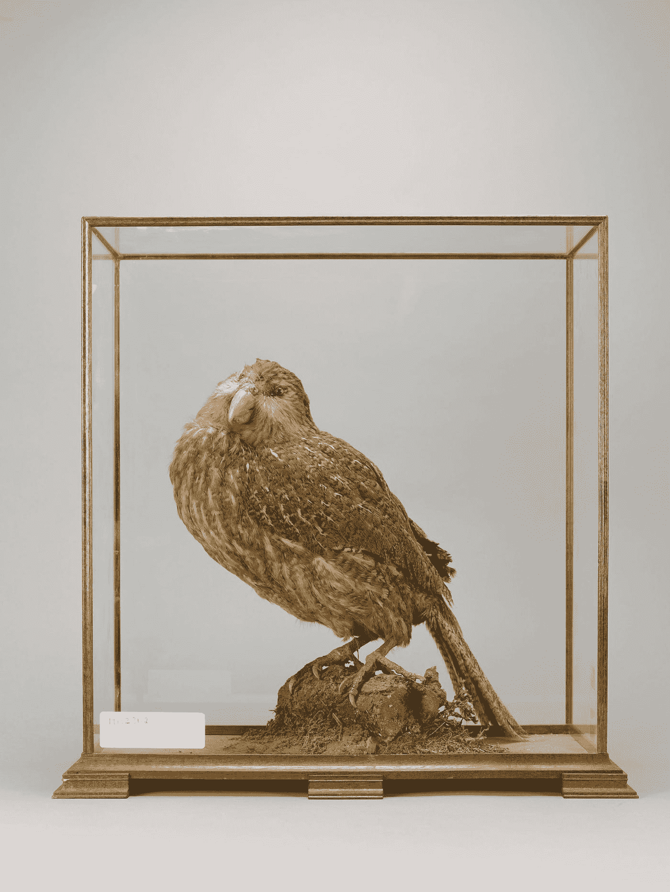
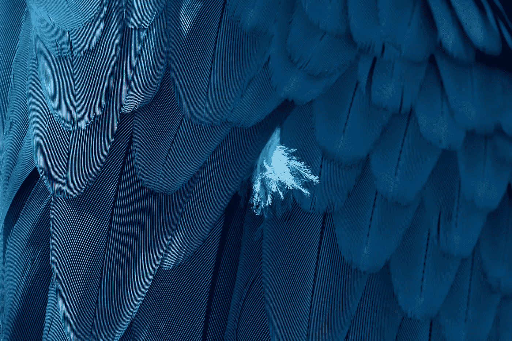
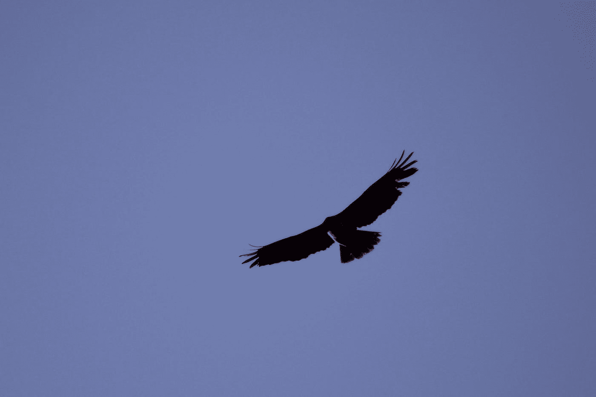
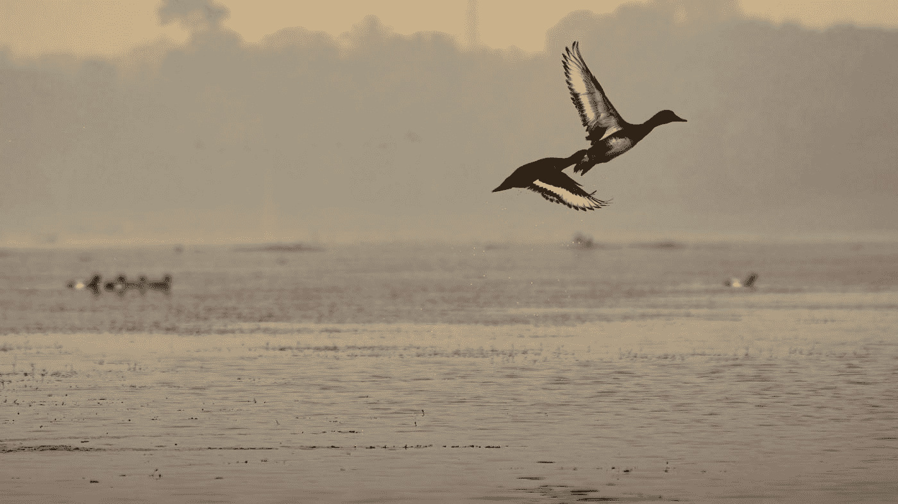

# "濒危鸟类:值得保护的稀有鸟类-第一部分"

> 原文：<https://medium.com/geekculture/endangered-avians-rare-birds-worth-protecting-24759426036a?source=collection_archive---------22----------------------->

世界上有超过 10，000 种不同种类的鸟类。虽然有些鸟类，如家雀或鸽子，几乎在地球的每个角落都能找到，但还有许多其他鸟类更加难以捉摸和罕见。这些鸟经常出现在偏远或难以到达的地方，它们的数量可能受到栖息地丧失、气候变化或其他环境因素的威胁。以下是世界上最稀有的五种鸟类:

# **鸮鹦鹉**

鸮鹦鹉是一种不会飞的鹦鹉，原产于新西兰。这是世界上最稀有的鸟类之一，据估计数量仅超过 150 只。鸮鹦鹉也是世界上最重的鹦鹉，重达 4 公斤(9 磅)。它是夜间活动的，通常在茂密潮湿的森林中出没，很难被发现。

Photo by [Birmingham Museums Trust](https://unsplash.com/@birminghammuseumstrust?utm_source=medium&utm_medium=referral) on [Unsplash](https://unsplash.com?utm_source=medium&utm_medium=referral)

# 斯皮克斯金刚鹦鹉

斯皮克斯金刚鹦鹉是一种小型的、颜色鲜艳的鹦鹉，原产于巴西。它是以德国博物学家约翰·施洗者·冯·斯皮克斯的名字命名的，他在 19 世纪初首次描述了这个物种。斯皮克斯金刚鹦鹉现在被认为在野外已经灭绝，最后一只已知的个体死于 2000 年。然而，仍有一些个体生活在圈养环境中，人们正在努力尝试将这一物种重新引入野外。

Photo by [Tahlia Doyle](https://unsplash.com/@tahliaclaire?utm_source=medium&utm_medium=referral) on [Unsplash](https://unsplash.com?utm_source=medium&utm_medium=referral)

# 加州秃鹰

加州秃鹰是一种大型秃鹫，原产于美国西部。它是北美最大的鸟类之一，翼展可达 3 米(10 英尺)。加州秃鹰濒临灭绝，数量只有 500 多只。在加利福尼亚、亚利桑那和犹他的一些偏远地区可以找到它，它受到濒危物种法案的保护。

Photo by [Arthur Hovan](https://unsplash.com/@werffff?utm_source=medium&utm_medium=referral) on [Unsplash](https://unsplash.com?utm_source=medium&utm_medium=referral)

# 贝尔氏 Pochard

Baer's pochard 是一种原产于东亚的潜水鸭。它是一种稀有濒危物种，种群数量不到 1000 只。Baer's pochard 在中国、蒙古和俄罗斯的一些偏远湿地被发现，并受到栖息地丧失和狩猎的威胁。

Photo by [Arnab Dey](https://unsplash.com/@arnab_dey_photography?utm_source=medium&utm_medium=referral) on [Unsplash](https://unsplash.com?utm_source=medium&utm_medium=referral)

# 卡古

神鸟是一种大型的不会飞的鸟，原产于太平洋岛国新喀里多尼亚的热带森林。它是一个受威胁的物种，种群数量不到 2500 只。神狗以其独特的叫声而闻名，这种叫声听起来像是狗叫和小孩哭声的混合。这是一种夜间活动的鸟，在它生活的密林中很难被发现。

这些只是在世界各地发现的许多珍稀濒危鸟类中的几个例子。不幸的是，我无法免费找到这些鸟的真实图像，有些只是对真实图像的解释，这就是为什么你知道它们有多稀有！保护这些物种及其栖息地对我们星球的健康和多样性非常重要。如果你有兴趣了解更多关于这些和其他稀有鸟类的信息，你可以在网上和当地图书馆找到很多资源。