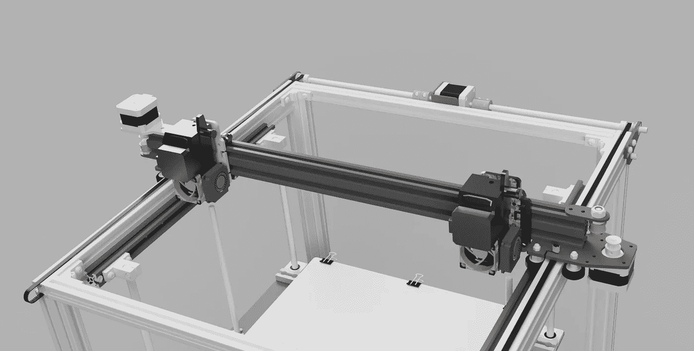
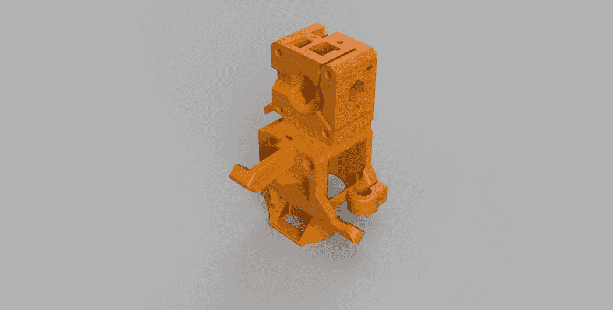
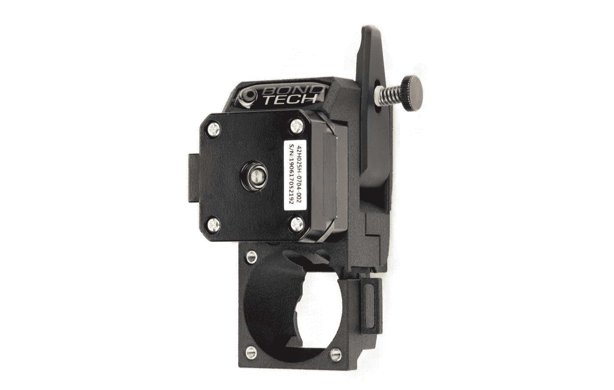
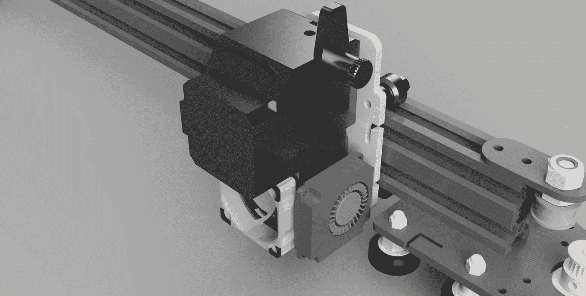
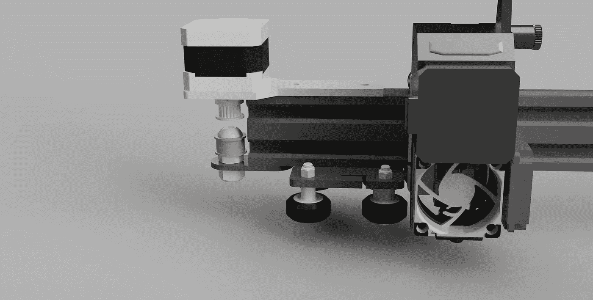
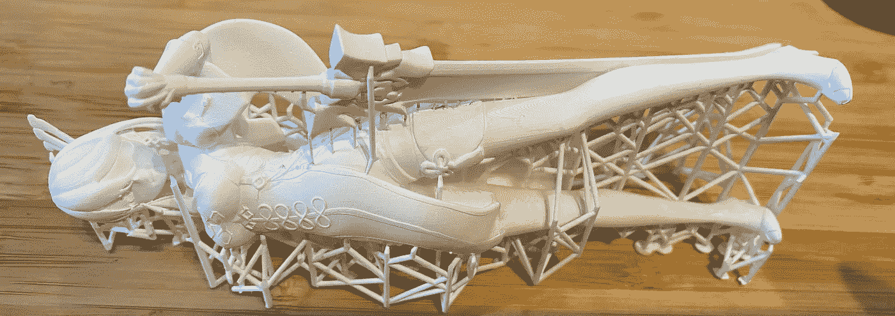
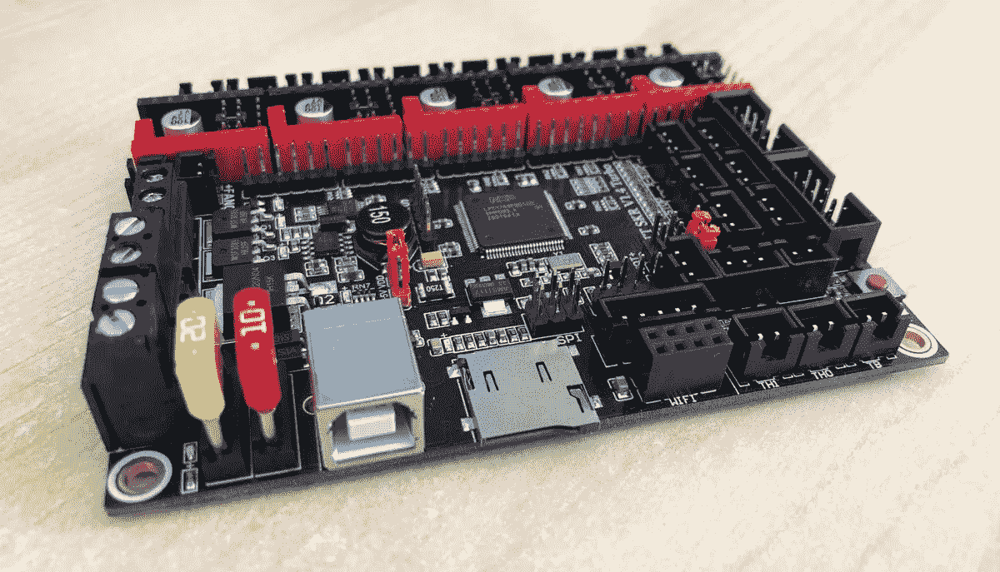
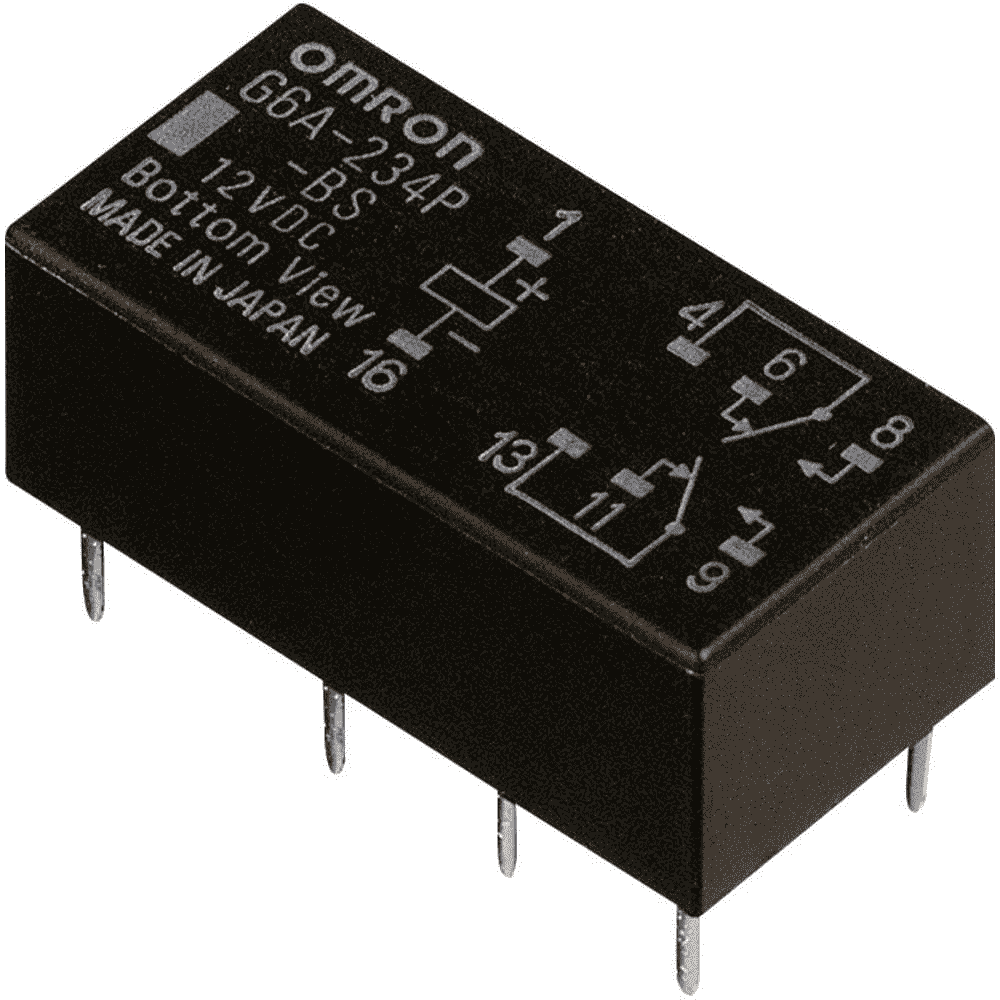
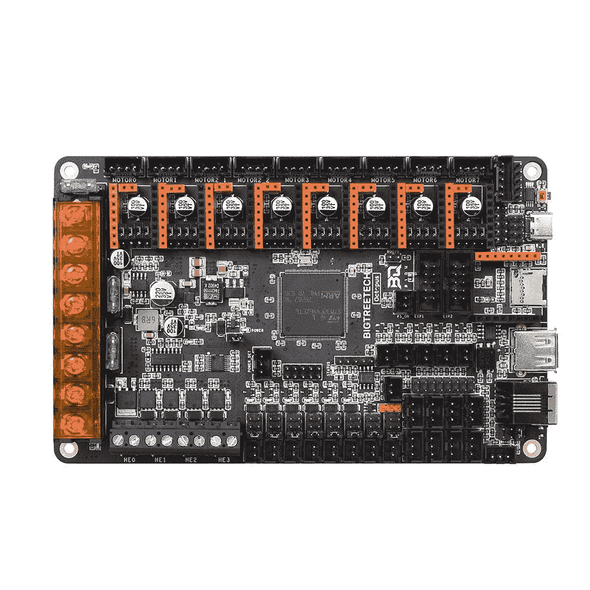

# Ender 5 Plus 双挤出机(第 4 部分— IDEX…)

> 原文：<https://medium.com/geekculture/ender-5-plus-dual-extruder-part-4-idex-688a78b5252a?source=collection_archive---------3----------------------->

Planning the update

所以，我设法买了一个 Raise3D E2，这是一个非常棒的打印机。它也非常非常非常贵，至少对家庭用户来说是这样，但它真的是一台很棒的打印机，我正在完成“如何让它打印完美”的步骤，到时候我会和大家分享。

这是个好消息，因为这意味着我可以再次打破我的 Ender 5 Plus 我的意思是升级它。几个月来，E5P 一直是我的主要打印机。我对它做了一些非常有趣的升级，等我有机会的时候会和大家分享。但是我们只能说，Creality 他们自己可能再也不能识别 E5P 了。我认为混淆创造力的关键区别是我的工作原理。

# 凸起的喷嘴不起作用

我大概画了 10-15 种不同的凸起喷嘴设计，每一种都变得越来越好，但是凸起喷嘴在 Ender 5 Plus 上根本行不通。我认为如果我真的重新发明打印机，它可能会工作，但在这种情况下，我宁愿扔掉它，买一个新的可配置打印机，而不是做一个工具转换器设计。

# 单喷嘴是个糟糕的主意

我在 Prusa i3 MMU2S 上试过单喷嘴多材料挤出，而且…坦白地说，Prusa 应该停止销售它。他们做的每样东西都很棒……除了……相当垃圾。机制确实很酷，但是材料浪费巨大。

# 马赛克调色板 3 专业版

是的，请…我的意思是不…也许？好吧，我将在 Palette 3 Pro 最终到货时对其进行测试。但是我一直在看 Joel Telling 的视频，除了支持很多灯丝，我看到的结果还不够好。我认为当你使用 8 种 PLA 时，它是美丽的…除了精神病净化塔。如果我考虑的话，我会在打印机旁边加一个垃圾箱，而不是失去我所有的不动产。然后，我真的不开心。

至于更换材料…我认为 Palette 3 Pro 不是解决这一问题的完美方案。我不会深入细节，但这些年来，我在来回切换不同的灯丝时遇到了太多的问题，最终在冷拔和移除喷嘴等过程中厌恶了生活。这不是一个很好的解决方案。

# 刀具更换器？

我想当我把所有的零件和电路都添加到安德 5 Plus 上，使它成为一个工具更换器时，我可能已经买了 E3D 工具更换器套件。目前，我真的不喜欢 E3D，正如你在我以前的文章中看到的那样。但是如果我需要 3 根细丝，我几乎 100%确定是时候换工具了。

# 独立双挤压(IDEX)！！！

所以，感谢 Raise3D E2，这是我见过的第一台真正工作的独立双挤压打印机，我已经决定 IDEX 不仅是可能的，而且是一个聪明的想法。事实上，我甚至在精神上尝试制造第三个喷嘴。

## IDEX 必须瘦到可以工作

以便在 x 轴上安装多个托架，特别是在 Ender 5 Plus 上，它实际上并不适合两个 x 托架。

这真的限制了我现成的选择。

Prusa i3 Extruder Assembly

这是一个众所周知的高端组件，如果它是用一种好的材料而不是他们使用的蹩脚灯丝印刷的，这是一个很好的选择。

这是我目前的第二选择，因为我认为要实现这一点，我需要在零件、运输、税收等方面花很多钱

BondTech DDX3 (credit: the product page on their site)

带有蚊子热端的 BondTech 解决方案是一个很好的选择，也是我目前正在设计的。

这种设计的唯一缺点是它没有镜像版本。此外，为了保持 V 型槽上的安装足够窄，我们很难切割铝安装。

BondTech DDX v2 (credits: Bondtech product page)

事实上，我可能最终会求助于 DDX v2，因为 DDX v3 的风扇支架是一个庞大的怪物。

## 库存 V 型槽不够好

因此，没有办法在 V 型槽 2020 上安装两个传动系统。对我来说幸运的是，当地的一家商店碰巧在卖一个 1 米长的 V 型槽 2040，我可以用它来做这个。

Credit: Kjell & Co product page for V-Slot

所以，要装两条皮带，我需要买它，然后我冲到商店买了它！

DDX v2 plus fans on V-Slot 2040

这是它组装后的样子。我正在使用标准的 V 型槽轮和新的背板。我将不得不运行几次迭代，以确保皮带的插槽足够好。但我最喜欢的是，更宽的 V 型槽将使车厢更加稳定。

# 不要重新发明整个打印机！！！

The second motor mount

对我来说非常重要的是，我可以避免重新组装打印机的所有部件。看起来好像我无论如何都在这么做…但是如果我做了太多的金属工作，我将需要支付费用或者请求我的一些机械师朋友来帮助，到目前为止，整个项目不需要任何新的金属部件，除了 V 型槽

## 你说没有新的金属部件吗？

是的，感谢 FormLabs 说服我购买一些刚性 10K 树脂，我刚刚完成了我的第一次测试打印，我全心全意地相信这整个设计可以在 Form 2 打印机上 3D 打印。

FormLabs 硬质 10K 树脂在挪威的入门价格约为 600 美元(假设你已经有了打印机，固化和清洗分类)。它不适合胆小的人。但是坚硬的 10K 树脂似乎非常适合这样的项目。所有的车厢和车牌都会印上它。

## 你从哪里得到这些零件的？

当我发布设计时，我会推荐使用便宜的 SLS 打印服务(现在确实有便宜的 SLS 打印服务)，你可以像那样打印零件…或者你可以尝试使用刚性树脂来打印便宜的树脂打印机…但是我真的认为订购是更聪明的。

或者，我可以…收回我的一些投资，建立一个 Etsy 商店或类似的东西。我们走着瞧。

Beidou Genshin Impact in FormLabs Rigid 10K Resin (model credit [Beidou — Genshin Impact by Mandrake](https://www.myminifactory.com/object/3d-print-beidou-genshin-impact-174042))

以上是我的第一个打印与 FormLabs 刚性 10K。我将在专门介绍这一材料的视频系列中详细介绍。我最感兴趣的是测试:

*   它将如何打印高细节
*   会有多僵硬
*   如果没有实际的治疗方法，我能治愈它吗(我做到了)
*   移除支架会留下什么样的痕迹
*   我能期待什么样的公差

简而言之，上面的模型是中空的，只有 1.5 毫米的墙壁，材料是惊人的。我会说，支持是刚性的脆弱点，但我相信当打印 4 毫米厚的板，这将是无可挑剔的，我也认为我可以打印这个项目几乎完全没有支持。

# 干净的替代品

我讨厌做傻事，比如在我实验的时候弄坏已经能用的东西，拿零件冒险。因此，到目前为止，我特别设计了这个，作为打印机上整个 X 托架的直接替代品。除了拧下现有的轴，然后拧上一个新的之外，它真的需要更多的东西。4 个螺丝…就是这样。如果出现问题，我可以再次使用这 4 个螺丝，回到我已经拥有的状态，这种状态非常非常好。

# 这种设计的主要缺点是

## 邦德科技对普鲁沙

首先，我对使用 Bondtech 感兴趣的主要原因是零件的可用性。我住在挪威，在这里运送许多小包裹会非常昂贵。我在全球速卖通或者直接从 Prusa 找到了几乎所有我需要的 Prusa 挤压机的零件。无论哪种方式，我发现价格都相当高，所以我决定宁愿使用 Bondtech，因为他们是一家瑞典公司(事实上，我认为由于我的位置，他们发给我的所有关于过去订单的邮件都是瑞典语)。这意味着，如果我需要什么东西，我可以使用廉价的邮政服务订购，并在一两天内从他们那里收到包裹。

如果我在 Bondtech 的经历一切顺利，如果他们需要我，我会去拜访他们。

但是，缺点当然是成本。

一个完整的带蚊子的 DDX v2 大约是 150-200 美元。为了做这个，我需要两个。

## 控制器

BTT v1.3 (Credit: I think their home page.)

我目前使用的是大树科技 SKR 1.3 版的 TMC2209 驱动程序。还有一个驱动程序可供我完成这个设计，但要构建这个，我需要另一个。这将是一个问题。

**控制器选项 1**

Latching DPDT relay (credit: product page)

我可以分开一个司机。由于我不需要同时操作两个 X 步进器，我实际上可以使用 4PDT 继电器(或两个 DPDT 继电器)连接一个继电器板来切换步进器。这可能是最好的解决方案，因为我没有真正的理由需要一个完整的额外驱动程序。

**控制器选项 2**

BigTreeTech Octopus v1.1 (Credit: biqu product page)

我可以用 BigTreeTech Octopus v1.1 取代 BigTreeTech SKR v1.3，这是有史以来最令人印象深刻的控制器之一。真的是什么都上的猛兽。我在想，这可能是我的结局，但只有在尝试了第三个选项之后。

**控制器选项 3**

对挤出机使用第二个控制器。

这是一个真正的选择，我可以编译和运行最新的 Klipper 固件，并从单个 Raspberry Pi 控制两个控制器。由于挤出机通常是相当良性的控制模式，股票 Creality Ender 3 主板会做得很好。我不担心噪音，因为挤出机上的步进器并没有真正从微步进或噪音抑制中受益。

# 为什么还没有完成？

嗯，很简单…我昨天早上刚拿到新的 Raise3D，我正在玩它。此外，在尝试寻找印刷公差时，需要花费大量时间来试验 FormLabs 硬质 10K 树脂。例如，我需要知道安装马达和挤压机的螺丝孔应该有多大。

还有…我可能已经有了市场上最好的双挤压打印机。老实说，我只是在 Ender 5 Plus 上做这个项目，因为我喜欢它。我不再需要它了。也就是说，我已经开始为下一步花钱了，因为很多人公开或私下要求我完成这个项目，并分享我是如何做到的。

我刚刚在打印机、灯丝和树脂上花了 4500 美元。我需要一点时间才能恢复到写这篇文章的状态。我已经给邦德科技发了一封邮件，询问他们是否会赞助这个项目，希望他们会赞助。毕竟，正如我所说的，我真的不需要它，如果只有 1%的人阅读了这篇文章的全部内容，决定花一些钱在它上面，这对他们来说是一大笔钱。我很确定我最终会花钱买一台一三个月都不太好用的打印机。所以，除了我在媒体上写作赚了大约 5 美元(总共)，我在这里除了从出色完成的工作中获得满足感之外没有任何收获。

# 我将何去何从？

我会在 DDX v2 的 CAD 模型上多下点功夫。我还会考虑用我从 Bondtech BMGx2 上取下的零件做一个模型，这些零件我在之前的帖子中没有用过。

不知道自己做设计的话散热片和加热块怎么办？我很可能只是从办公室借一个小的五轴铣床，自己加工，因为我有一些多余的库存。或者，我可能会看看是否能买到有史以来最便宜的 E3D v6 克隆版。热端真的不是这里的问题…只要我有两个相同的单位。

我不会使用 Microswiss 块，因为我已经得出结论，他们是非常无用的直接驱动。当然，我可以为它们制作自己的适配器，但总的来说，我认为在这种情况下，我最好使用 V6 或类似版本。

好吧，祝我好运。这是我最后一次尝试。如果我做不到这一点，我就把打印机恢复到现在的样子，然后忘掉它。

*附:我也非常想淘汰噪音很大的 Meanwell 500w 电源，代之以 150w 无风扇电源，用于电机和挤出机，然后是 350w 静音电源(如果我能找到的话)或交流电床。我已经做好了，所以当打印机不打印时，它会通过使用 Meanwell 远程控制连接来关闭电源。我为树莓派和树莓派触摸屏安装了一个额外的 Meanwell 5v 50w 电源。当我完成这个项目时，我会分享这一切。*