# 统一中的敌人波产卵器

> 原文：<https://medium.com/geekculture/enemy-wave-spawner-in-unity-f6d63f1dce4d?source=collection_archive---------3----------------------->

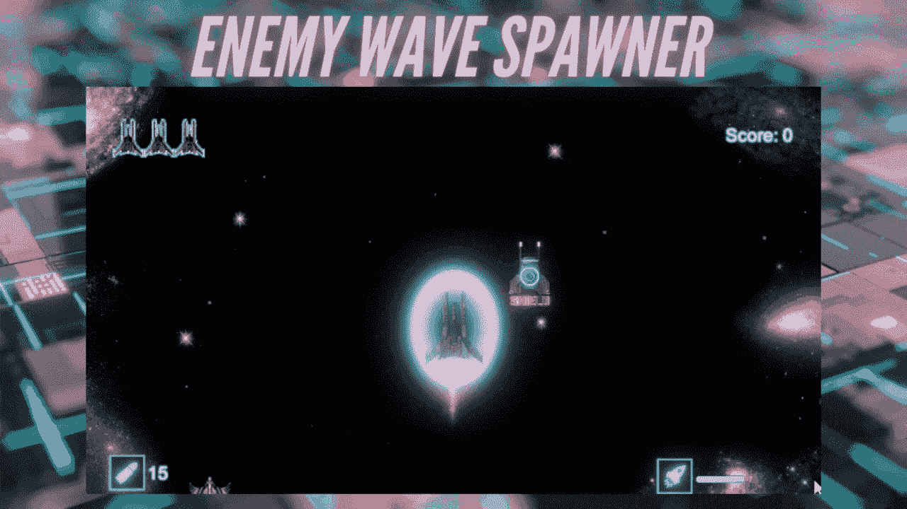

今天的核心编程挑战将集中在使用协程来控制我们的敌人如何进入游戏。

目标:创造一个协程，让每波都有越来越多的敌人出现。

# 添加波形指示器文本

我们将使用一组变量来控制 wave 的生成，另一组变量用来设置屏幕上的 wave 指示器文本。对于文本，我们将使用 [**TextMeshPro** ，](https://docs.unity3d.com/Manual/com.unity.textmeshpro.html)一种更高级的高质量替代常规 UI 文本。

1.  添加一个 TextMeshPro 并相应地重命名，例如 WaveText 或 WaveIndicator_text。

> **注意**:如果你以前从未使用过 TextMeshPro，你可能需要导入它的基本组件。

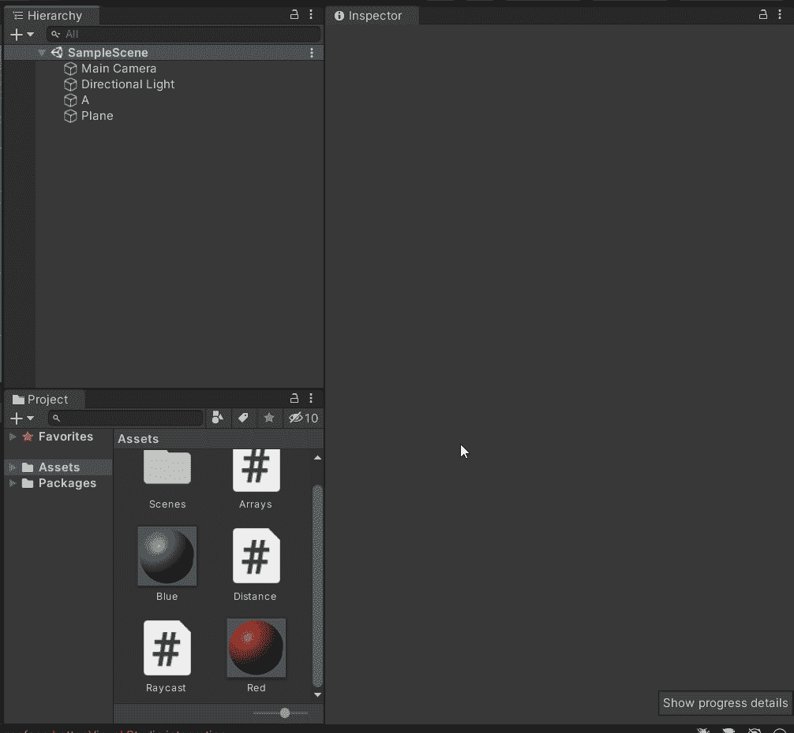

保留文本为空，并在检查器中停用它，因为它的内容将在以后通过代码添加。

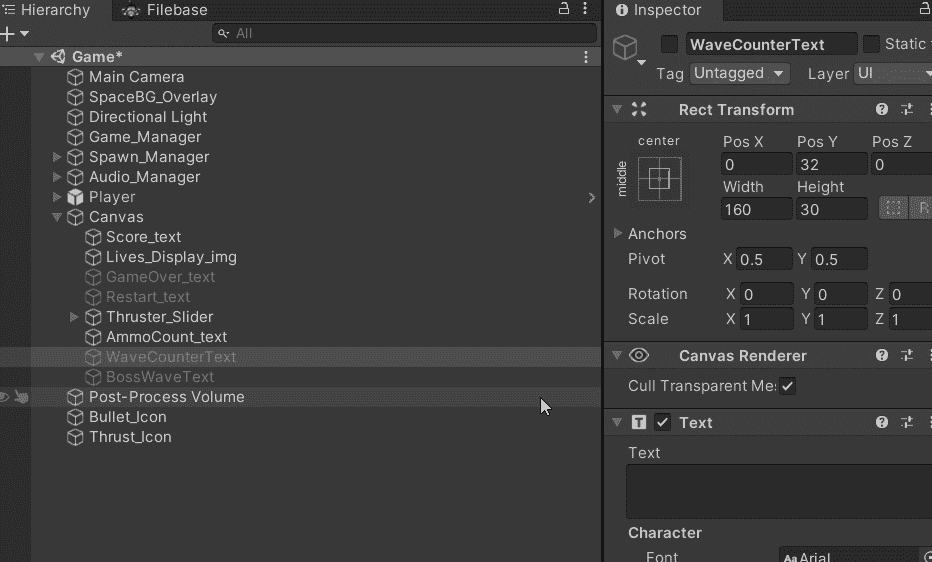

确保文本位置居中。您可以添加一些占位符文本来调整其位置。

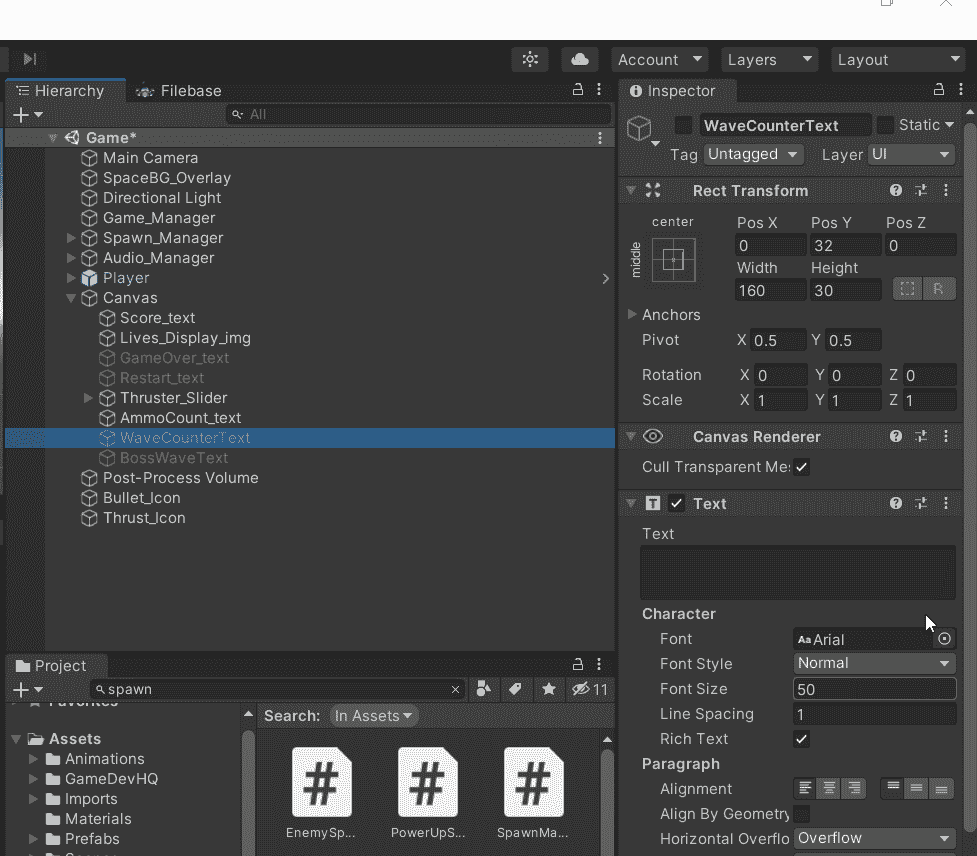

2.要使用 TextMeshPro，您需要**将其特定的库添加到您的脚本**中。理想情况下，您的脚本应该专门用于处理繁殖。

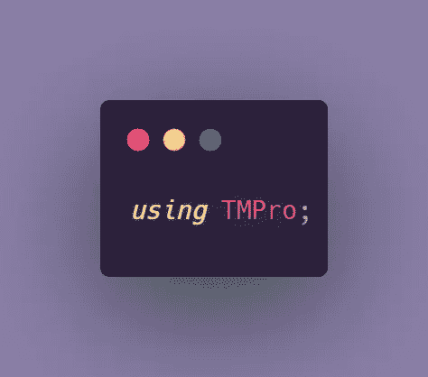

3.现在一切都设置好了，我们需要一个文本的全局变量，序列化的变量将在 inspector 中赋值。

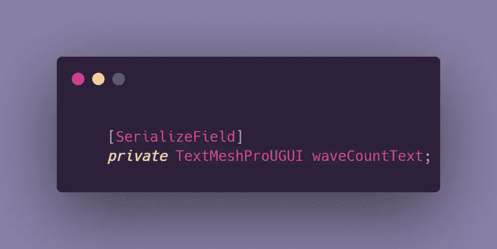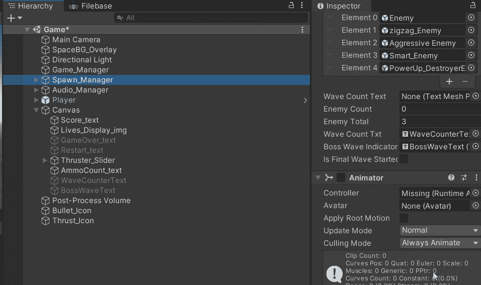

4.添加全局变量来控制种子。这可能看起来很多，但我们将一个接一个地讨论。

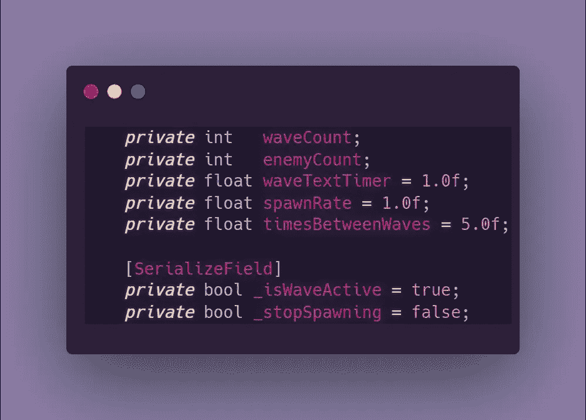

> **注**:您可以根据需要修改数值变量的值。

*   **波数:**这将记录波数，并在必要时增加数量。
*   **敌人计数:**负责增加每波的敌人数量。
*   **waveTextTimer:** 文本在屏幕上显示多长时间后会褪色。
*   **产卵率:**
*   **波间时间:**每一波开始需要多长时间。
*   **_isWaveActive:** 这是控制协程所需要的，我们将在本文的下一部分对协程进行编码。
*   **_ stop spacing:**协程的附加控制变量。您的脚本可能不需要使用两个 bool 变量，在这种情况下，只使用 _isWaveActive bool 就可以了。在我的例子中，这是必要的，因为在两种情况下，控制布尔值需要改变它们的默认值:当屏幕上有一个游戏时，其中 _stopSpawaning 必须设置为 true，因为继续产生玩家已经失去的波浪或能量没有意义。第二个实例是每当需要启动一个新的 wave 时，其中 _isWaveActive 必须设置为 true。因此，这两个变量需要相互独立。

# 创建敌人波产卵器协程

如果你想知道什么是协程，这是我迄今为止从 C#中学到的最喜欢的东西之一！你可以通过下面的链接了解更多。这将教你开始时需要知道的东西，我将在本文中重点解释 Wave Spawn 例程。

 [## 统一的协程！

### 任何在 Unity 中编程的人都知道，迟早你会积累大量的方法…

medium.com](/codex/coroutines-with-unity-b5a2b3fc3426) 

1.  这是我们协程的第一部分，在这里我们随机选择敌人将从哪个位置产生，我们也随机选择哪些敌人类型将产生。我的游戏目前有 6 种敌人类型，它们通过一个带有 SerializedField 的 GameObject 数组在检查器中设置。这里的 **_isWaveActive 被设置为 false** ，因为我们的 spawn 例程还没有开始，这只是设置。

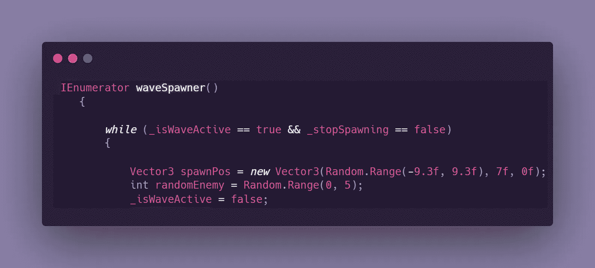

> 注意:由于我们将会产生很多敌人，学习如何在不打乱你的层级的情况下产生物体可能是有用的。

 [## 在 Unity 中生成没有混乱的对象

### 对象的迭代生成可能是核心游戏循环的重要部分。然而，有些时候…

levelup.gitconnected.com](https://levelup.gitconnected.com/spawning-objects-without-clutter-in-unity-c23c2aa347ed) 

2.接下来，我们将使用 for 循环对 wave 逻辑进行给定次数的迭代。

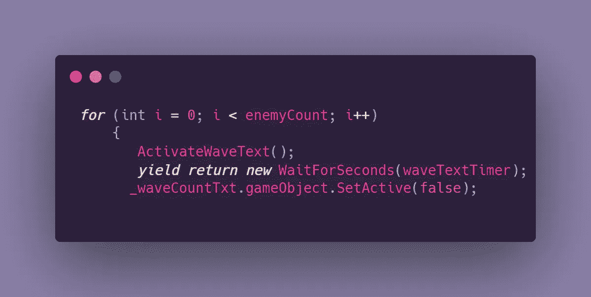

*   ActivateWaveText: 这是一个负责显示波数文本的方法，它被放在一个单独的方法上，以保持协同程序尽可能的整洁和可理解。
*   接下来的几行将使 Unity 等待指定的秒数，然后通过取消激活使文本消失。

> **注意**:这是前面提到的从协程调用的方法。这将更新显示实际数字和波形文本的 cout。随着我们继续使用协程，您将看到这是如何实现的。

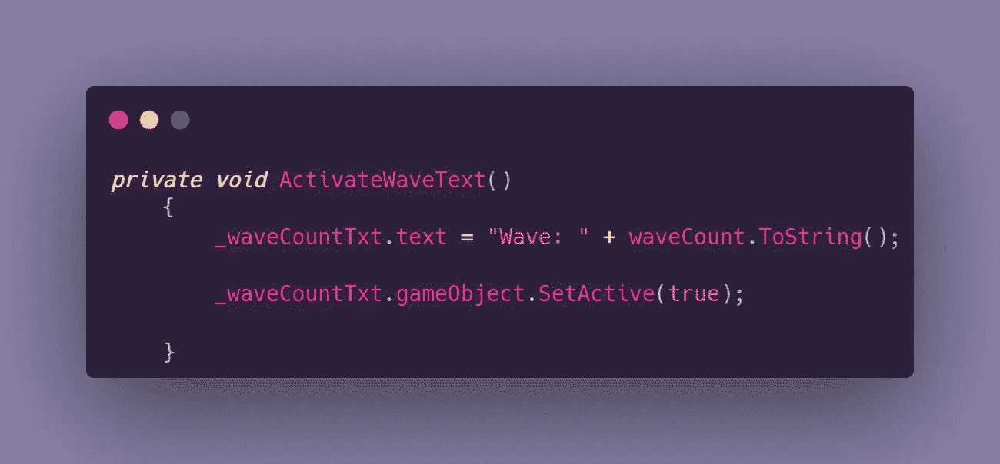

3.下一组，这里突出显示的代码，是我们实际实例化对象的地方。繁殖速率控制敌人被实例化到场景中的速率。

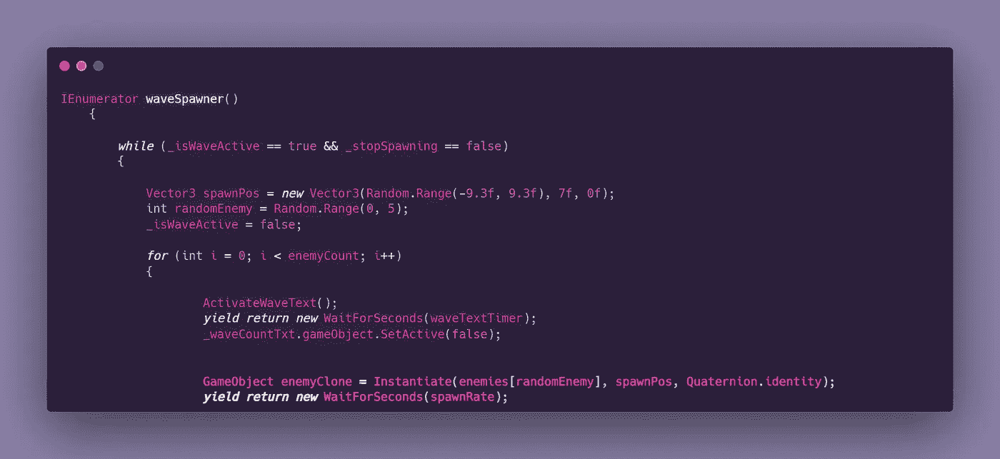

4.在这个集合之后，我们有一个 if 语句，它定义了当你到达最后一波时会发生什么。最后一波可以是你想要的任何数字，在我的例子中，是第五波。

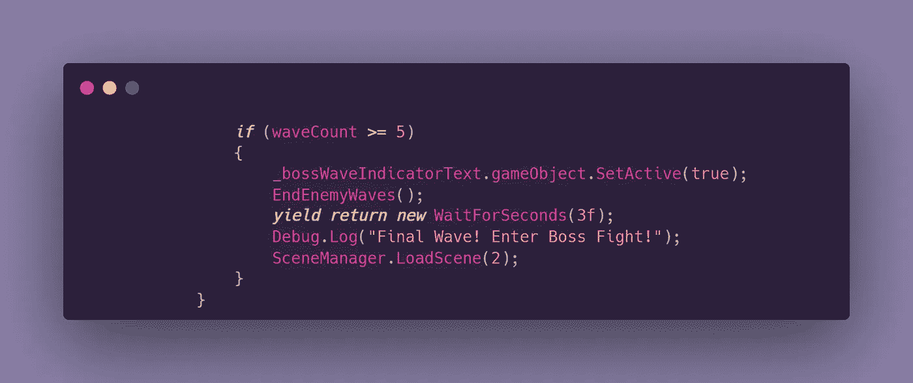

这里发生了很多事情，让我们来分析一下！

*   当我的游戏到达第五波时，将会出现一个 3 秒钟的文字，提示 boss 大战即将到来。(我会在后面的文章里教你我的 boss 搏击码！)
*   这里有一个方法可以结束敌人的波动，因为我们不能让敌人在转换到 boss 战时攻击玩家。
*   这一波结束后，我们加载下一个场景，这是老板打架。

> **注意**:上面代码末尾的两个括号关闭了 if 语句，然后是 for 循环。我想在这里设置一个小标记，因为我已经展示了代码块。我将在最后展示一个完整的视图，这只是为了分解它。

这就是前面提到的结束波浪的方法。

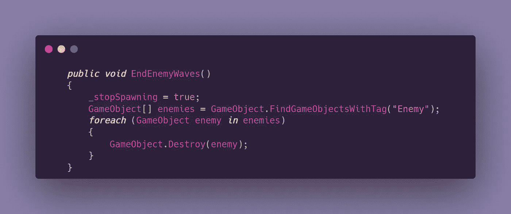

*   这里我们将 _ stopSpawning 控制布尔设置为 true，这将停止协程。
*   下一行搜索每一个被标记为敌人的物体并摧毁它。这是为了确保没有任何敌人从浪潮中幸存下来。

5.关闭 if 语句和 for 循环后，我们必须为下一波更新所有内容。

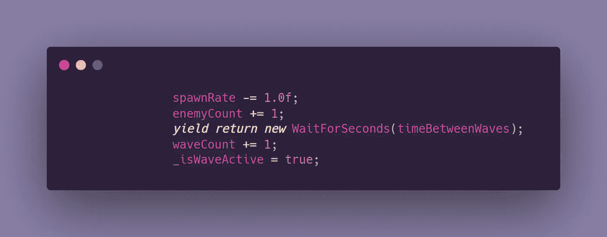

*   **产卵率**将会降低，这样敌人产卵会更快，每波会有越来越多的敌人产卵。
*   **敌人计数**增加以保持 for 循环条件运行
*   **在增加**波数**之前，等待指定的秒数**，这导致波数增加。
*   **_isWaveActive** 再次被设置为真，以便协程在下一波设置完成后继续运行。

现在剩下的就是将脚本添加到场景中的一个空游戏对象中，并在脚本开始时调用协程。

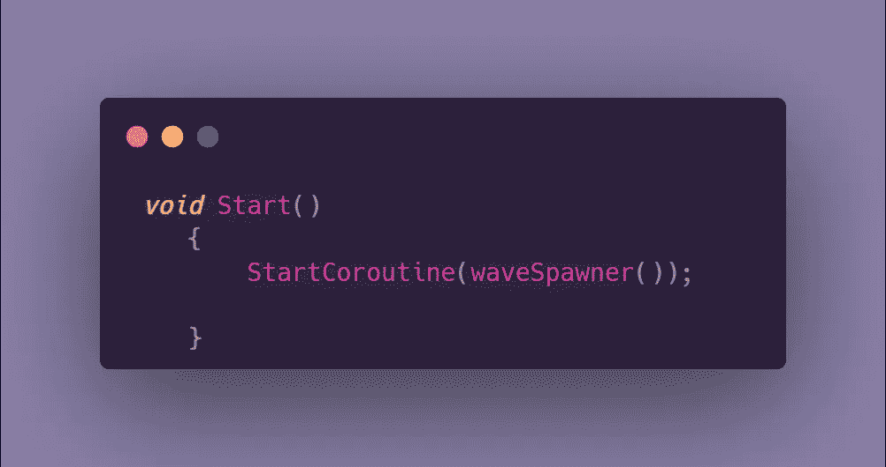

# 这里是代码的完整视图

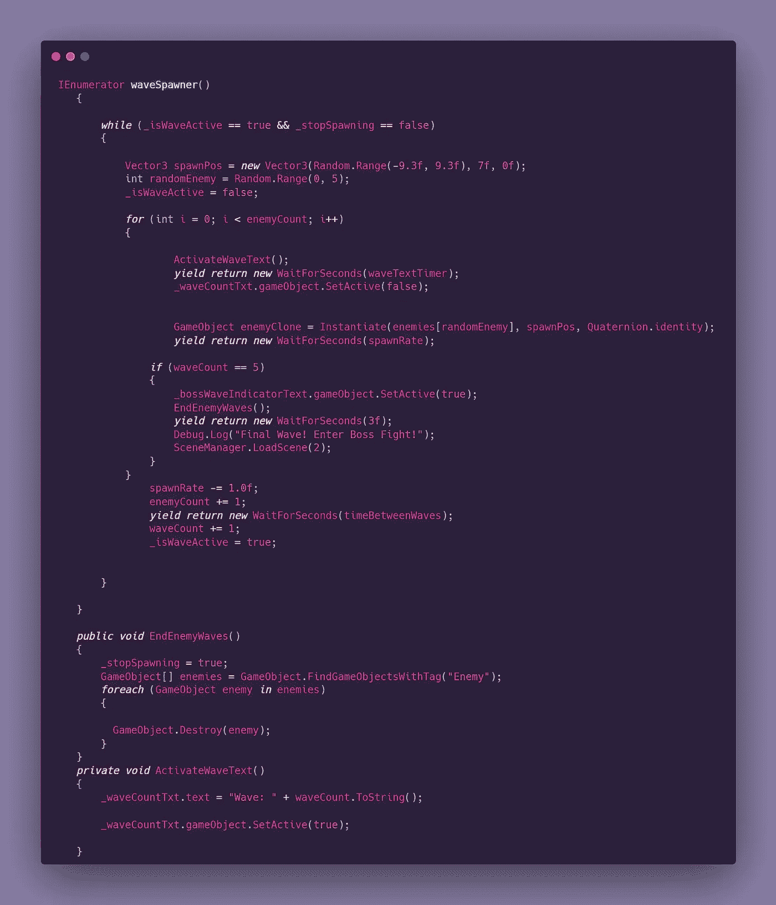

# 结果呢

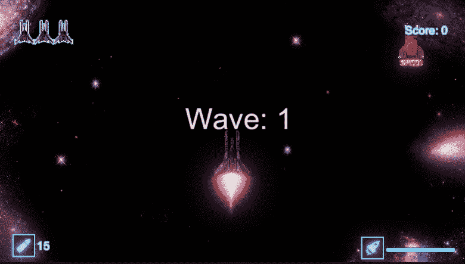

本文是 GameDevHQ 的核心编程挑战系列的一部分！在下一篇文章中，我将谈论寻的射弹！这组编码挑战的最后一篇文章将以本文中提到的 boss 之战为特色。

特别感谢技术朋友帮助我理解我应该实现的那种逻辑。剖析这段代码的功能并分解所有内容简直是一场爆炸！