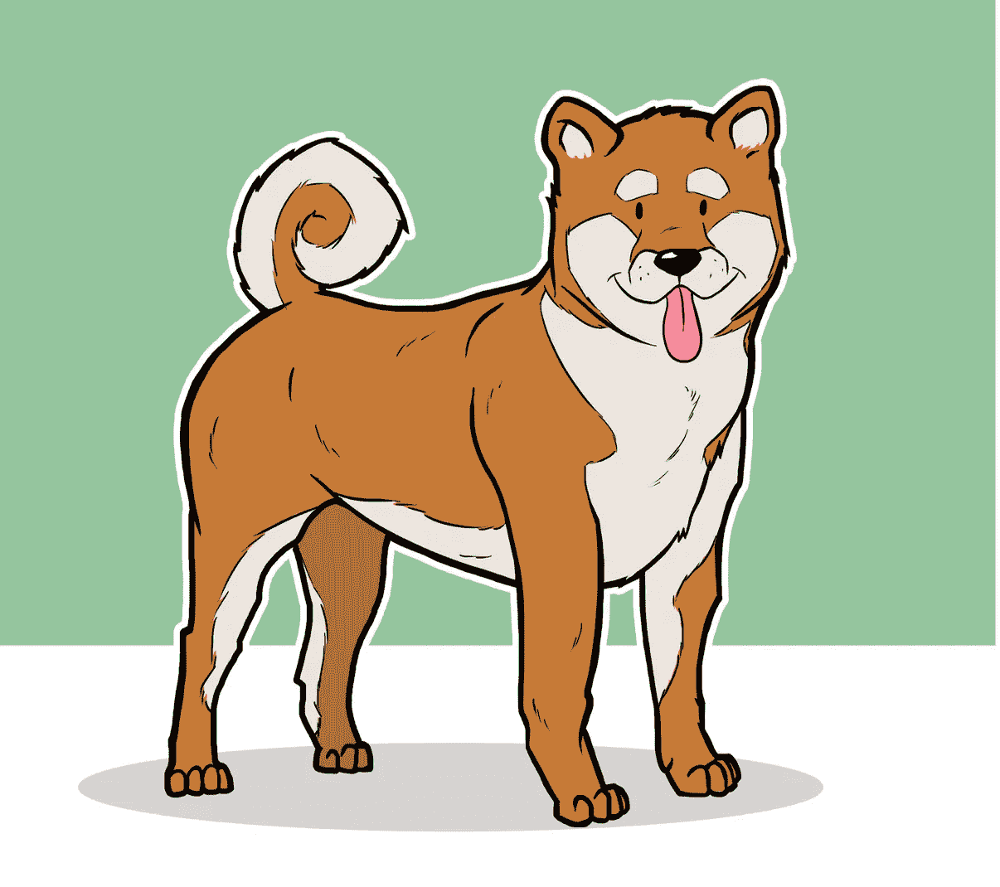

# EnergyWeb Doge NFT 发布

> 原文：<https://medium.com/geekculture/energyweb-doge-nft-launch-6c0225e5f14e?source=collection_archive---------14----------------------->

以扭曲的治理方式生成

## 项目更新

在成功发行并初步分发了价值$EWD 的代币后， [EnergyWeb Doge](https://www.ewd.green/index.html) 准备好实现它的主要目标了。它现在[跟踪](https://mar1.dev/ewd/) s，并将很快抵消 Dogecoin 的工作证明区块链的二氧化碳排放量。

几周以来，EWD 也一直在积累其绿色基金的交易费用，碳交换的 [GreenSea marketplac](https://greensea.carbonswap.finance/) e 将使使用这些费用购买碳排放信用代币成为可能。EWD 将同时启动其通货紧缩进程，每次碳信用额度被收回以抵消 Dogecoin 的排放时，都会引发一场燃烧事件。

> 如果你想了解更多关于碳信用和碳抵消的信息，可以看看这个便捷的指南:[https://Carbon Credits . com/the-ultimate-guide-to-understanding-Carbon-Credits/](https://carboncredits.com/the-ultimate-guide-to-understanding-carbon-credits/)

## 介绍 EWD·NFT 系列 inu

*发布日期:2021 年 10 月 31 日 16:00 UTC(白名单)18:00 UTC(公众)*

EnergyWeb Doge 自豪地推出 inu 系列 NFT，其中包含公用事业和一种游戏化的碳信用投资方式。自从在 EnergyWeb 链上推出新市场以来，EWD 团队已经获得了 500 多项碳清除债券。这样做是为了确保限量版系列中的每一款 NFT 都由试点项目 [CarbonLand Trust](https://carbonlandtrust.com/) 的 20 年碳排放债券支持。

## 铸造过程

一旦启动，铸造 dapp 将允许购买和生产 NFT。一些薄荷糖会产生稀有的非功能性碳交易，每年可以产生 2、4 或 12 个碳信用额。每个造币厂将产生一个随机的艺术品和 NFT 类别: ***普通、稀有、史诗或传奇。***
每个 NFT 的基础价格将以 EWT 美元计价，并与碳排放债券的价格保持一致，后者的定价在 300 美元左右。每家造币厂也会为 NFT 艺术家预留一小笔费用。那些希望增加铸造稀有 NFT 的几率的人可以在基本费用的基础上支付额外费用。

## 国家森林交易系统将如何产生碳信用。

*   NFT 的收集将由绿色基金持有的一篮子碳排放债券支持。绿色基金中的债券数量将永远大于新发行的债券数量。
*   债券将在 20 年内每年给我们的绿色基金带来 1 美元的回报。
*   EWD 的 web 应用程序将托管一个赌注/采矿平台，作为一种游戏化的方式来赚取$CRC 令牌。(非技术人员不必离开钱包)。
*   每一个 NFT 职业都将被铸造不同的 hashrate 能力。稀有、史诗和传奇的非战斗单位将会有更强的散列能力，从而减少申领 1 $CRC 所需的时间。
*   持有者也将被允许在同一个钱包中组合他们的 NFT 哈希拉特，以获得令牌化碳信用的线性分布。
*   该仪表板将跟踪每个时期每个 NFT 停留的时间，并在满足一定数量的哈希时允许索赔。

> 例如:
> -如果需要 100 万个散列才能声明 1$CRC，则为了声明 1 $CRC，公共 NFT 必须被标记 52 个时期(1 个时期= 1 周)。
> -如果持有人的钱包中有 4 个普通的 NFT，同时挖掘它们将允许每 3 个月申领 1 个$CRC 令牌。
> -传说中的 NFTs，每个时期产生更多的散列(大约每天 40 000 个散列)，可能允许每月一次的$CRC 索赔。

## 管理

我们的 Dogecoin 二氧化碳追踪系统的每一个时代都将导致购买和收回$CRC 代币，以及$EWD 代币的燃烧事件。NFTs 将作为一个投票系统，可以影响$EWD 的燃烧机制。这将有可能使用国家森林交易系统来增加与要收回的碳信用额相关的 EWD 币的燃烧量。

NFT 税的另一个目的是，如果 Dogecoin 被完全抵消，NFTs 也可以作为一种投票权来决定绿色基金应该把税收分配到哪里。

*备注:*

EWD 可以利用不同的收入来源来扩大支持 NFT 收藏的债券篮子。这可以增加每幅 NFT 的产量，使整个收藏更有价值。

***关于*** : *EnergyWeb Doge 是一个旨在抵消 Dogecoin 工作证明区块链产生的碳排放的项目。战俘链由矿工运营和验证，最近成为许多批评者的焦点。通过电力链，采矿钻机不断在网络上竞争开采下一个区块，导致过度用电。随着网络遍布全球，用于驱动这些采矿钻机的能源来自多个来源，通常包括碳基燃料(煤和天然气)。与许多其他迷因项目不同，EWD 并不打算与 Dogecoin 竞争。事实上，EWD 是为了确保最初的 Doge 在碳排放及其留下的碳足迹方面看起来良好而鲜明。*

*访问我们的网站:*[*https://www.ewd.green/index.html*](https://www.ewd.green/index.html)