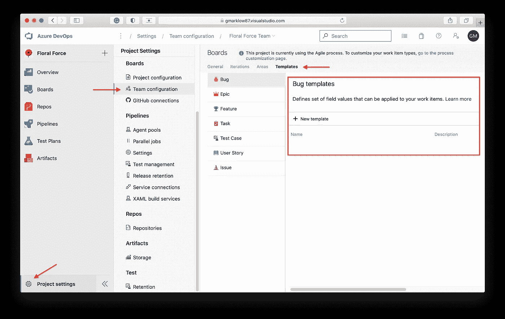
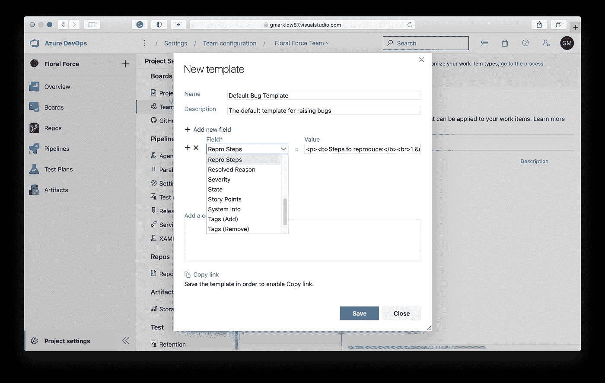
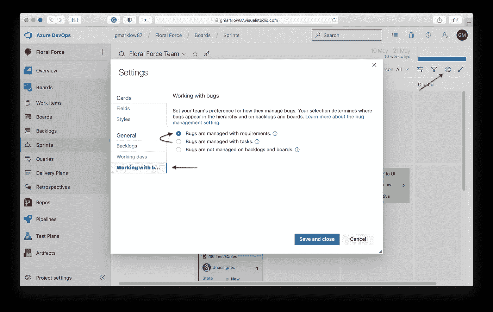
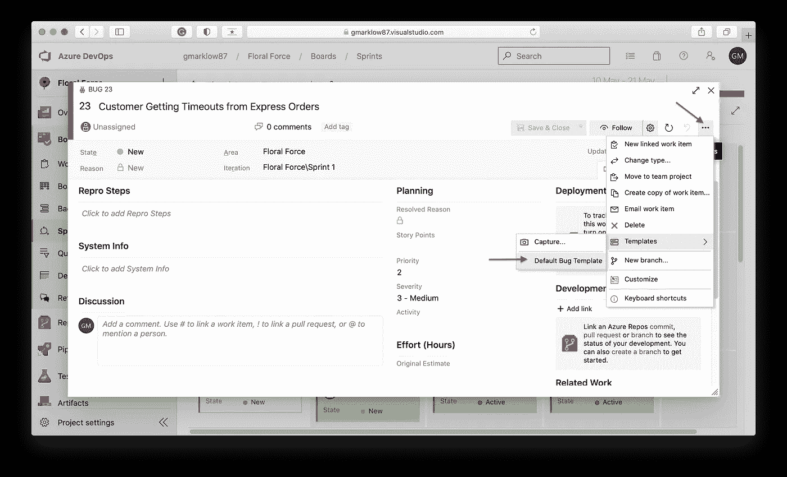
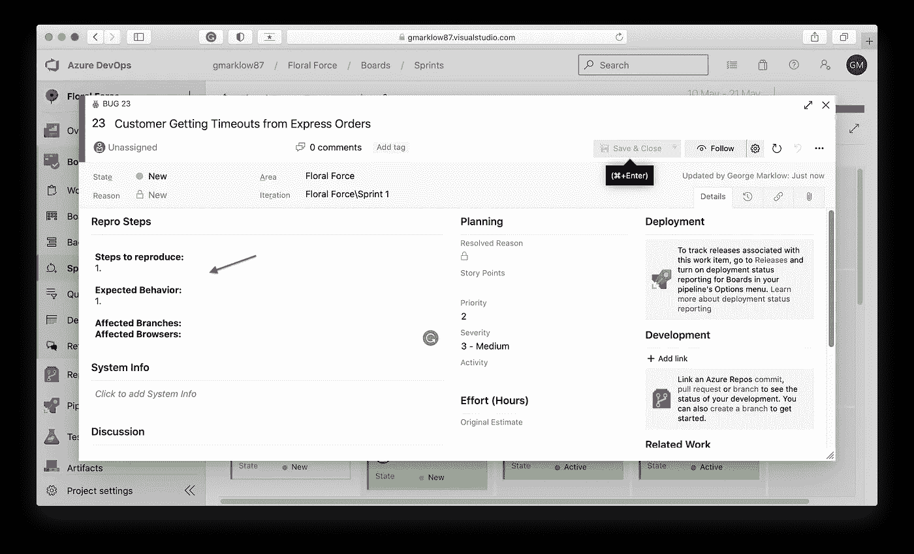

# 使用 Azure DevOps 模板引发错误时，强制实施最佳实践

> 原文：<https://medium.com/geekculture/enforce-best-practices-when-raising-bugs-with-azure-devops-templates-3b6bb066267c?source=collection_archive---------16----------------------->

## 确保 bug 有所有的细节供开发人员重现


Photo by [Michal Mrozek](https://unsplash.com/@miqul?utm_source=unsplash&utm_medium=referral&utm_content=creditCopyText) on [Unsplash](https://unsplash.com/s/photos/butterfly?utm_source=unsplash&utm_medium=referral&utm_content=creditCopyText)

# 介绍

当试图解决 bug 时，我们有时并不总是拥有我们需要的所有信息，尤其是在处理紧急生产问题时。在这种情况下，我们通常通过电话交谈或即时消息以及帮助台电子邮件渠道来澄清遗漏的错误细节。

然而，在**所有**其他情况下，您应该尽可能详细地提出错误，包括:

*   如何一步一步地重现问题。
*   预期的结果是什么。
*   有这个 bug 的浏览器/设备。
*   受影响的分支机构。
*   截图。

在本文中，我将解释如何使用模板在 Azure DevOps 中实施这些最佳实践。

# 创建模板

要创建模板，请执行以下操作:

*   点击左下角的*项目设置*滚轮。
*   在*板卡*下，选择*团队配置。*
*   在出现的菜单中，点击*模板*选项卡。
*   在 *Bug 模板*中，点击 *+新建模板*按钮。



给你的模板一个*名称*和*描述*，然后从*字段*下拉菜单中选择*再现步骤*。

接下来，将以下 HTML 复制并粘贴到*值*中:

```
<p>
    <b>Steps to reproduce:</b><br>1.&nbsp; <br><br>
    <b>Expected Behavior:</b><br>1\. <br><br>
    <b>Affected Branches:</b> <br> 
    <b>Affected Browsers:</b><br>
</p>
```



单击“保存”按钮—现在让我们应用该模板。

# 应用模板

导航到您的一个 sprints，确保在*设置*和*使用 bug*下，您已经选择了*bug 使用需求*进行管理。



接下来，点击 *+ New Work Item* 并选择 *Bug* ，给你的 Bug 起一个名字。


点击 bug 右上角的三个点图标，选择*模板、*，然后选择*默认 Bug 模板*:



现在，您应该看到您的模板已应用，并准备好由 QA 分析师填写:



感谢阅读！在下面的评论区让我知道你的想法，别忘了订阅。👍