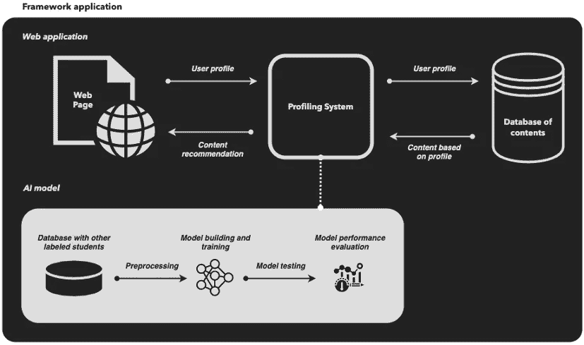
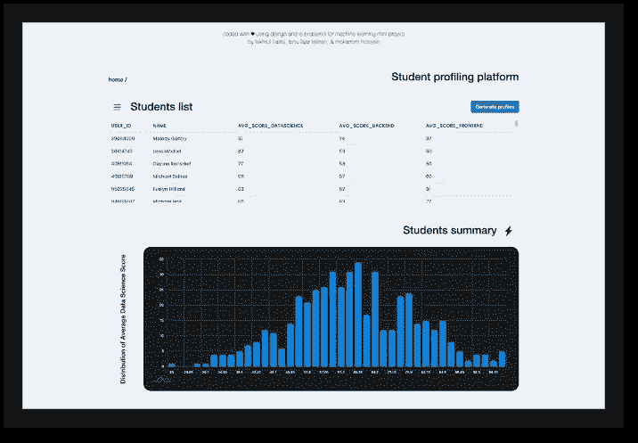
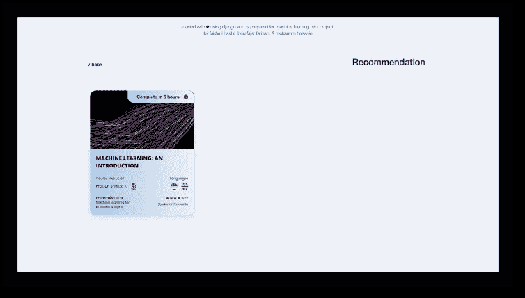
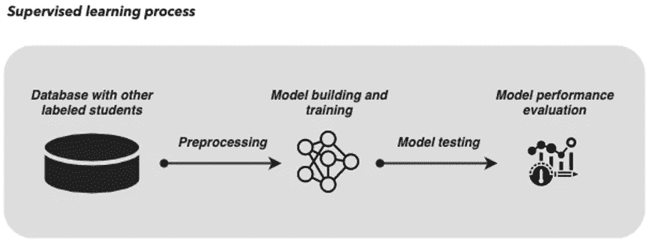
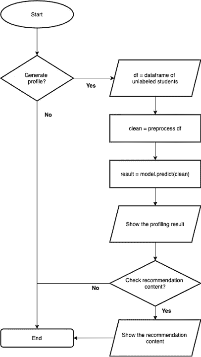
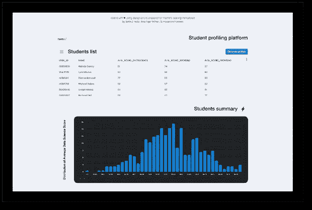
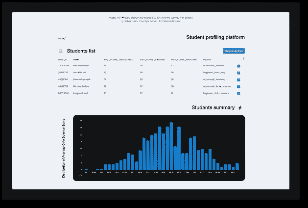
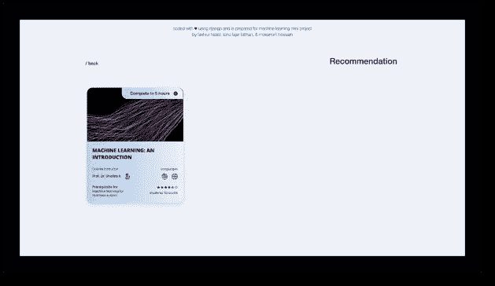

# 将机器学习加载到 Web 应用中

> 原文：<https://medium.com/geekculture/english-machine-learning-4th-288dad82a042?source=collection_archive---------50----------------------->


Photo by [Pietro Jeng](https://unsplash.com/@pietrozj?utm_source=medium&utm_medium=referral) on [Unsplash](https://unsplash.com?utm_source=medium&utm_medium=referral)

## 案例研究系列—独立学习数据科学。

## 第四个案例研究。


[→ Source code (Github)](https://github.com/arulhasbi/final-ml)

**目录**

1.  [简介](#b70d)
2.  [概述](#7adc)
3.  [项目背景](#c14d)
4.  [项目目标](#d1c9)
5.  [项目范围](#d083)
6.  [框架应用](#060d)
7.  [设计](#9924)
8.  [发展](#adfd)
9.  [原型](#f471)
10.  [结论](#57bc)
11.  [参考文献](#4973)

# 介绍

在这个案例研究中，我想分享另一个机器学习迷你项目，是我和我的其他合作者一起做的:伊布努·🇮🇩和莫卡拉姆·🇧🇩.与第一个机器学习案例研究略有不同，我们通过一个 web 应用程序原型展示了机器学习模型的能力。简而言之，这个项目旨在建立一个多分类器，根据学生的属性来描述他们，并在一个简单的用例中模拟其用法和能力。

# 概观

人工智能(AI)的进步一直是一个令人期待的主题，因为它对转变商业具有宝贵的潜力。埃森哲的一份报告指出，84%的企业高管认为他们需要人工智能来扩展他们的目标。人工智能使能器的可用性，即技术，有助于企业应用它并增加回报价值。一般来说，人工智能是分析、数据和自动化的结合。根据麦肯锡公司 2017 年的报告，一些早期采用人工智能的公司在业务应用方面取得了显着的业绩，预计将扩大与其他公司的差距。在工业中有许多人工智能应用；其中之一就是教育(Jacques et al .，2017)。

今天的教育有两种类型:正规和非正规教育。根据(Elaine Eaton，2017)的说法，正规教育由结构化和有组织的课程、训练有素的教师和系统的等级组成，如高中毕业文凭或学位。她继续说，非正规教育不太可能以正规课程为指导，但它仍然是有组织的。然而，这种教育类型可能会由更有资格和经验的教师领导。虽然非正规教育不会产生正式的文凭或学位，但学生获得的经验可能更多，它可以作为正规教育的补充。同样，它可以培养学生的能力和技能。

今天，在一个快速、不断变化的社会中，终身学习对于获取最新知识和技能以保持相关性是非常有价值的。持续学习通常发生在正规教育之后，不一定发生在非正规教育中。事实上，大多数成年人以非正式的方式继续学习(Betül C. Czerkawski，2000 年)。幸运的是，基于网络技术的进步能够提供大规模的可访问性，并将更多的人带入在线学习的主流。Betül C. Czerkawski 接着说，在线学习为正规和非正规教育增加了更多的机会。正式的在线学习倾向于以教师为中心(自上而下)，而非正式的在线学习倾向于以学生为中心(自下而上)。

自下而上的方向可能有点挑战；它需要概括学生，提出适当的课程，不像自上而下，教师有一个指导性的课程可以遵循。解决自下而上问题的一种方法是将人工智能嵌入在线学习，以帮助特定学生决定内容。

# 项目背景

坦率地说，在非正规教育在线学习中，有两种甚至更多的问题可以解决。执行学生概况分析或按类似因素对课程进行分组。解决学生特征分析的问题可能是针对特定学生的特定内容的适当起点。网上学习的科目种类繁多；然而，根据(Williams，2014)的说法，生活在一个被技术驱动和包围的当前世界中，学习信息技术以在未来保持相关性将是一项不错的投资，因为可能会缺乏优秀的程序员。(Rahmat 等人，2012 年)的研究确定了学习编程的几个主要困难中的参考资料、讲师、解决能力和自信。

Tortuga code 是一个专注于技术和编程课程的在线学习平台。它旨在为特定的学生提供个性化的内容目录。通过利用其收集的带有标签的学生数据，可以将其输入人工智能，并嵌入其在线学习平台，以提供个性化的内容。人工智能的使用将给 Tortuga 带来优势，如效率(通过自动化内容个性化)、有效性(通过向特定简档提供适当的内容)、竞争力(来自其他学习平台)、最终最大化学生保留率(取决于模型业务)和最小化学生流失。

# 项目目标

1.  根据开发人员档案给学生贴标签。
2.  向特定学生的个人资料显示特定目录的示例。

# 项目范围

1.  使用的数据集将是[Tortuga code](https://www.kaggle.com/scarecrow2020/tech-students-profile-prediction/version/1)synthetic tech students 数据，并带有 IBM Maratona 2020 确认。
2.  开发的原型将围绕标签的新学生的个人资料，并显示一个内容的例子，将被定向到一个特定的学生个人资料。

# 框架应用



**Figure 1.** The framework application

为了清楚地了解原型的工作方式和外观，图 1 显示了完整的框架应用程序图。作为一个实例，框架应用程序由两个主要构件组成；web 应用和人工智能模型。

框架应用程序中的关键实现是推荐系统，实际上是平台的核心。与已经嵌入 AI 模型的网页交互的推荐系统经过最终的性能评估。为了简化原型演示，内容数据库将被硬编码。使用的技术栈是 HTML、CSS、javascript、python 和 Django。

# 设计

在开发原型之前，应用程序的设计需要基于已定义的框架应用程序。设计过程直接在 HTML、CSS 和 JavaScript 中完成，因为它直接将框架应用程序规范和范围转换成两个相关的网页。网页如图 2(主页)和图 3(推荐页面)所示。



**Figure 2\.** The main page

简而言之，主页由学生列表和学生摘要组成。学生列表将显示一些学生属性，如用户 id、姓名、avg_score_datascience、avg_score_backend 和 avg_score_frontend。学生摘要将显示学生属性的直方图分布，如 avg_score_datascience、avg_score_backend、avg_score_frontend。



**Figure 3\.** The recommendation page

推荐页面简单地由学生属性的直方图分布可视化组成，如 avg_score_datascience、avg_score_backend、avg_score_frontend。

# 发展

web 应用程序原型的开发主要建立在 Django 框架之上。网络应用程序也由一个人工智能模型提供动力，该模型使用多层感知器(MLP)方法，其规格如下:12 个输入神经元，4 个隐藏层，每层 10 个神经元，6 个输出神经元。选择模型(MLP)作为分类器是基于文献综述的输出。web 应用程序和 AI 模型并行开发，以加速原型的创建。最终，它们组合成了完整框架应用程序的构建块。



**Figure 4**. The supervised learning process

这个项目涉及的问题是监督学习。监督学习仅仅意味着我们作为模型学习源的数据集已经与每个记录中的标签相关联。图 4 显示了模型的监督学习过程。该模型的开发使用了现有的库，并在机器学习社区 scikit-learn 中很受欢迎。scikit-learn 库由各种机器学习算法组成，多层感知器(MLP)就是其中之一。模型开发完成后，它被嵌入到 web 应用程序中以完成原型。

作为附加信息，在将 MLP 模型嵌入 web 应用程序之前，我们执行了模型测试，以确保获得良好的结果。幸运的是，我们在训练和测试数据的第一次运行中获得了良好的准确性。对于测试，准确率为 90.24%，对于训练，准确率为 91.39%。

# 原型

该原型将演示一个简单的活动过程，并展示一个简单的内容推荐的例子。然而，为了使它更容易理解，在查看 web 应用程序图之前，图 5 中的伪代码以图表的形式描述了活动过程。



**Figure 5\.** The pseudocode in a flowchart diagram

开发的 web 应用程序也将遵循图 5 所示的流程图中描述的流程。图 6、图 7 和图 8 显示了一组完整的活动，包括以下步骤；g *生成学生档案****查看推荐内容* (见后面 6 到 8 的数字)。**

****

****Figure 6\.** The main page before profiling**

****

****Figure 7.** The main page after profiling**

****

****Figure 8.** A recommendation page after selecting a student’s profile**

# **结论**

**项目的主要目的是解决所有预先定义的目标。通过开发一个嵌入了使用多层感知器的人工智能模型的 web 应用程序原型，已经解决了这些问题。多层感知器取得了 90.24%(测试)和 91.39%(训练)的良好结果。然而，由于其潜在的弱点，该模型仍有改进的余地。**

****实力****

**该模型的主要优势是学生概况的直接实现，并提供内容推荐。更不用说用达到的精度来衡量的良好的概括能力了。**

****弱点****

1.  **由于其简单性，原型的实现可能被认为是幼稚的。然而，对于一个原型来说，它可能足以证明它能够给学生贴上标签，并根据标签推荐内容。**
2.  **可以添加或缩放学生标签，以获得更全面的描述。**
3.  **如果课程数据集可用，则可以创建更多的推荐种类。例如，使用其相似性因子推荐一组课程是可能的。由于唯一可用的数据集是学生的数据，推荐仍然可能发生，但以简单的方式。**

# **参考**

```
1\. Abiodun, O. I., Jantan, A., Omolara, A. E., Dada, K. V., Mohamed, N. A. E., & Arshad, H. (2018). State-of-the-art in artificial neural network applications: A survey. *Heliyon*, *4*(11), e00938\. https://doi.org/10.1016/j.heliyon.2018.e009382\. Badea (Stroie), L. M. (2014). Predicting Consumer Behavior with Artificial Neural Networks. *Procedia Economics and Finance*, *15*(14), 238–246\. https://doi.org/10.1016/s2212-5671(14)00492-43\. Betül C. Czerkawski. (2000). Blending Formal and Informal Learning Networks for Online Learning. *The International Review of Research in Open and Distributed Learning*, *17*(3).4\. Elaine Eaton, D. S. (2017). *Formal, Non-formal and Informal Learning: What Are the Differences* (Issue April).5\. Jacques, B., Hazan, E., Sree, R., Michael, C., Tera, A., Peter, D., Nicolaus, H., & Monika, T. (2017). *ARTIFICIAL INTELLIGENCE: THE NEXT DIGITAL FRONTIER?*6\. Lee, W. I., Shih, B. Y., & Chung, Y. S. (2008). The exploration of consumers’ behavior in choosing hospital by the application of neural network. *Expert Systems with Applications*, *34*(2), 806–816\. https://doi.org/10.1016/j.eswa.2006.10.0207\. Majhi, R., Majhi, B., & Panda, G. (2012). Development and performance evaluation of neural network classifiers for Indian internet shoppers. *Expert Systems with Applications*, *39*(2), 2112–2118\. https://doi.org/10.1016/j.eswa.2011.07.1288\. Rahmat, M., Shahrani, S., Latih, R., Yatim, N. F. M., Zainal, N. F. A., & Rahman, R. A. (2012). Major Problems in Basic Programming that Influence Student Performance. *Procedia - Social and Behavioral Sciences*, *59*, 287–296\. https://doi.org/10.1016/j.sbspro.2012.09.2779\. Taneja, A., & Arora, A. (2019). Modeling user preferences using neural networks and tensor factorization model. *International Journal of Information Management*, *45*(November 2018), 132–148\. https://doi.org/10.1016/j.ijinfomgt.2018.10.01010\. Williams, P. S. (2014). *Why is there a shortage of good programmers?* University of Reading.
```