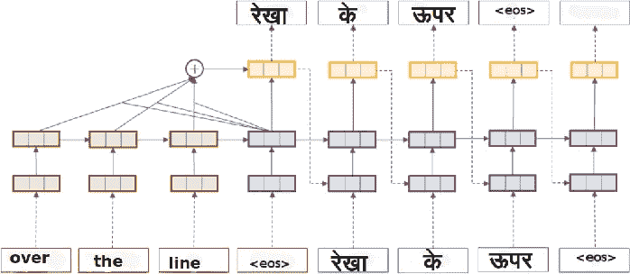
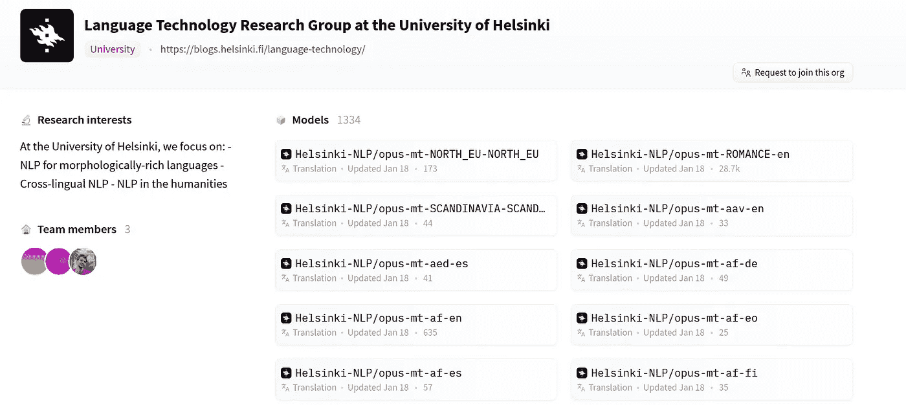
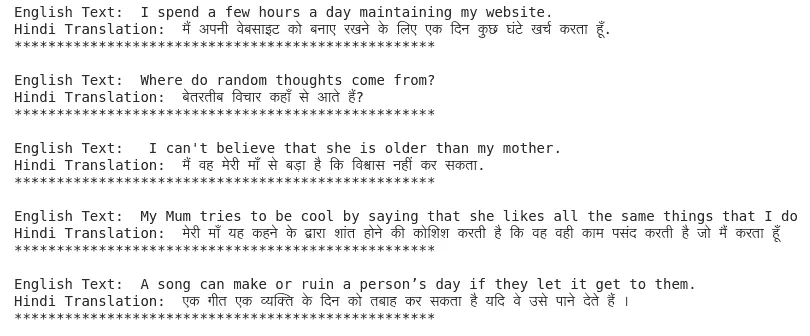

# 使用来自 HuggingFace 的 MarianMT 模型进行英语到印地语的文本翻译

> 原文：<https://medium.com/geekculture/english-to-hindi-text-translation-using-marianmt-models-from-huggingface-187b4719809e?source=collection_archive---------20----------------------->

在这篇简短的博客中，我将讲述如何使用 Huggingface 中流行的 transformer 库进行文本翻译🤗

Image Source: [Google Image Search](https://www.semanticscholar.org/paper/Neural-Machine-Translation%3A-English-to-Hindi-Laskar-Dutta/6c44544842956bc49d3e39e7ab3b3f4c30e2bbe9/figure/0)

如果你正在寻找一些已经可用的模型，能够将某种给定语言 X 的给定文本翻译成某种语言 y 的文本，那么赫尔辛基大学的语言技术研究小组为我们带来了 1300 多个机器翻译(MT)模型，这些模型在 HuggingFace 平台上随时可用。这里是[页面](https://huggingface.co/Helsinki-NLP)的链接，里面包含了所有的 MT 车型。

如前所述，这里有一个关于将英语文本转换成印地语文本的小教程。并且本教程可以很容易地扩展到任何语言对(给定其相应的模型可用性)。当您访问他们的 MT 模型的存储库页面时，您会看到如下所示的内容。

Helsinki’s MT model hub

# 寻找符合您需求的正确机器翻译型号

上面你会注意到，***Helsinki-NLP/opus-mt***是所有型号通用的。只是其余部分各不相同。这意味着所有的模型名称都具有以下格式:***Helsinki-NLP/opus-mt-{ src }-{ tgt }***，其中 src 和 TGT 占位符包含[语言代码](https://developers.google.com/admin-sdk/directory/v1/languages)。所以，对于英语到印地语的文本翻译，模型名称应该是[***Helsinki-NLP/opus-mt-en-hi***](https://huggingface.co/Helsinki-NLP/opus-mt-en-hi)。

# 赫尔辛基-NLP/opus-mt-en-hi 简介

该模型在 [OPUS](https://opus.nlpl.eu/) 数据集上进行训练。这个开放的平行是来自网络的翻译文本的集合。它还包括维基百科、维基资源、维基图书、维基新闻和维基百科网页的翻译。这个 [GitHub 页面](https://github.com/Helsinki-NLP/Tatoeba-Challenge/blob/master/data/Backtranslations.md)将提供从 wiki 网页下载源文本和目标文本的链接。并且所需的预处理步骤还包括使用[句子片段](https://pypi.org/project/sentencepiece/)库对文本进行分词。我不会深入讨论他们的架构和其他细节。但是，如果你有兴趣了解更多，那么在这个 [GitHub repo](https://github.com/Helsinki-NLP/OPUS-MT-train) 中，你可以深入挖掘，找到你所有的答案。

# 代码加输出

下面是将文本从英语转换成印地语所需的代码片段。

从上述代码生成的印地语文本似乎可以很好地翻译某些句子。但是有几个句子，翻译不达标。尝试检查任何英语文本，并测试出来。

Output from above code

我们还可以微调这个文本翻译模型，进一步提高它的性能，使它在我们自己的任务中表现得更好。喜欢笔记本的人可以看看这款 [colab 笔记本](https://colab.research.google.com/drive/1jmhls0lLspB7iidqMRepyKsy3jevt1tY?usp=sharing)并开始使用。享受机器翻译…！！！