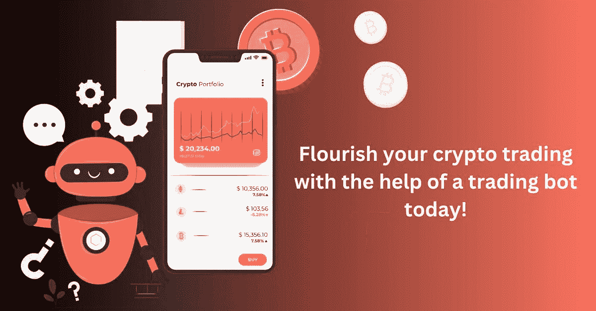

# 增强人工智能驱动的加密交易机器人成为专业交易者，并获得更高的利润率！

> 原文：<https://medium.com/geekculture/enhance-the-ai-powered-crypto-trading-bot-to-become-a-pro-trader-and-reap-higher-profit-rates-dcf1de6a1cb?source=collection_archive---------19----------------------->

机器人只是一个在互联网上运行的自动化程序，比人类更快地执行重复的任务。根据一些估计，机器人与网页用户交互，扫描内容，并执行其他任务，占所有互联网流量的一半以上。

[**密码交易机器人**](https://www.coinsqueens.com/crypto-trading-bot-development) 开发遵循相同的原则，基于预定义的参数工作。不会错过任何机会。无论你想投资加密货币还是增加新的硬币，你都可以使用交易机器人在全球范围内日夜及时、自动地购买、出售或持有资产。加密交易机器人的开发使用由交易相关协议启动的算法，当数据符合市场条件时会自动触发。

AI Crypto Trading Bot

## **加密货币交易机器人合法吗？**

在加密货币市场，bot 交易是合法的。交易机器人不仅被允许，而且受到交易者的高度欢迎。例如，做市机器人为市场提供了所需的流动性，让所有市场参与者受益。交易机器人通过交易模拟器进行测试。交易模拟器允许用户用虚拟货币模拟交易机器人。交易者在投入真金白银之前，会在真实市场上测试他们的策略。

## 知道为什么密码交易员更喜欢密码交易机器人吗？

据报道，大约 60%的交易是通过基于算法的自动化程序进行的。让我们来看看加密交易机器人的一些最重要的好处。

**无感情交易:**

据报道，超过 70%的私人贸易商因各种因素而亏损。交易波动较大的加密货币是情绪工作，情绪导致判断失误。我们的情绪状态可以影响多达 40%的手工交易，导致我们做出非理性的决定。这只是人的心理。相反，加入使用交易机器人赚钱的专业交易者，以确保交易的非情绪化、系统化。

**快速交易:**

机器人胜过人类。它们可以跨多个时区和市场执行数百万次计算和交易。交易在几分之一秒内完成，远远快于任何个人交易者。

**简化交易:**

监控多个交易所寻找最佳交易机会需要时间。机器人可以再次为你解决这个问题。交易机器人可以跟踪和执行交易。此外，它们可以处理大量数据，并在人类之前识别出绝佳的机会。

## **加密交易机器人是如何工作的？**

要在加密货币交易所与加密机器人进行交易，您必须通过 API 密钥(应用程序接口)授予交易机器人对您帐户的访问权限，该权限可以随时授予或撤销。交易机器人通过直接与加密交易所通信并根据您的预设条件下单，为您的投资目标提供非凡的速度、更高的效率和无感情的交易。交易机器人的操作如下:

**数据研究:**

数据分析对一个[密码交易机器人](https://www.coinsqueens.com/crypto-trading-bot-development)的成功至关重要。支持机器学习的软件可以更快、更智能、更好地识别、收集和分析海量数据。

**信号产生:**

一旦数据分析完成，机器人的信号生成基本上完成了交易者的工作，根据市场数据和技术分析指标进行预测和识别潜在的交易。

**风险分配:**

风险分配是 bot 根据交易者建立的一套特定的交易参数和规则来分配风险的过程。

**执行:**

执行是根据预先配置的交易系统产生的信号买卖加密货币。此时，信号处理买入或卖出订单，并通过它们的 API 将它们发送到交易所。

## **选择加密货币交易机器人时需要考虑的事情**

当涉及到监控加密货币时，人类有一个显著的劣势。用户需要睡眠时间，但加密市场每周 7 天、每天 24 小时都有实时交易，你应得的小睡可能会让你失去独一无二的投资机会。好消息是，加密机器人可以持续监控市场并代表我们执行订单，让你在睡觉的时候也能赚钱。但是，在拥有一个加密机器人之前，需要考虑一些事情。

**完美品质:**

在这个数字世界里，每个产品必须具备的最重要的东西就是质量。当谈到加密货币交易机器人时，软件的完美质量和可信度是专业交易者的关键因素。加密交易涉及有价值资产的转移。你必须选择一个可靠的交易机器人来管理和执行交易。让我与你分享一个选择加密交易机器人的安全提示。加密机器人必须选择从您的 exchange 帐户中提取资金。

**可定制:**

联系加密交易机器人开发公司，了解您的具体需求，并彻底讨论它们。专业交易者可能有定制的交易策略和技巧来完成交易。因此，您可以联系开发人员的团队来定制您的机器人的功能。

**准确:**

加密货币市场不稳定。因此，要在几秒钟内赢得交易，加密交易机器人必须快速可靠。此外，加密货币市场的波动是微小的，计算利润率是一项任务。用户必须选择一个交易机器人，允许他们设置所需的利润和亏损百分点。总的来说，你的加密机器人必须可靠、准确、快速。

**精通:**

加密货币市场和交易所正在不断改进其特性和功能。因此，您应该从一家声誉良好的加密交易 bot 开发公司选择 bot，该公司会定期更新其 bot 交易技术、功能和特性。虽然有众多的交易技术，如信号和自动交易，你是决定完成的人。因此，在进行交易时，你的加密交易机器人必须简单易用。一个加密交易机器人必须是用户友好的，易于使用。

**安全:**

说到网上交易，安全性是至关重要的。您的加密交易机器人必须高度加密，具有强密码、推送通知、不同设备注册的双重认证和其他功能。即使是专业开发人员也会雇佣加密交易机器人开发公司来审核他们的应用程序。如果你想创建你的加密交易机器人，你可以聘请专业人士来审计软件。

## **总结！**

私人投资者仍受困于不灵活、低效的手工交易，并被自动化所主导，这使他们依赖市场，无法参与竞争。你可以使用自动交易来克服这些障碍，利用市场。用户友好的加密货币交易机器人策略可以帮助您全天完成有利可图的交易，并且您可以在您的加密投资组合中保持大量的流动性。选择功能丰富、可定制的最佳加密货币交易机器人，帮助您以自动化的方式实现交易目标。

相信要在密码交易中成功的交易者应该拥有最好的工具和资源。交易机器人被设定在一个可承受的价格，这样即使那些预算紧张的人也可以从这些算法中受益并开始赚钱。有很多[密码交易机器人](https://www.coinsqueens.com/crypto-trading-bot-development)开发公司。骗子越来越多地瞄准缺乏经验的交易者，他们讲述难以置信的复杂交易机器人，承诺令人难以置信的利润和零损失。你对骗子最好的防御是从可靠的来源寻找信息和阅读。在做出购买决定之前，使用加密交易机器人的试用版！