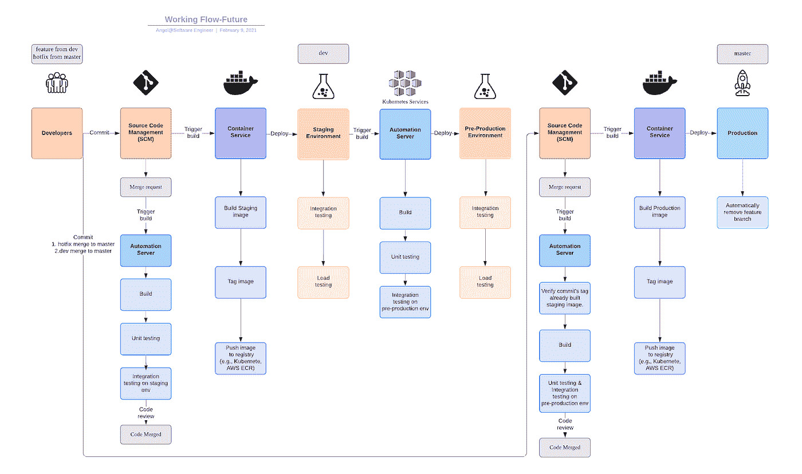

# 来自 Git 流、GitHub 流和 GitLab 流的增强工作流。

> 原文：<https://medium.com/geekculture/enhanced-working-flow-from-git-flow-github-flow-and-gitlab-flow-9fdb02ef65dd?source=collection_archive---------1----------------------->

无论您是使用多线程为不同组件开发硬件验证工具，还是考虑 API、缓存和消息传递的 web 服务，流畅的工作流程都可以促进您的开发和故障排除。

Full Working Flow Enhancement Overview

# 需求澄清