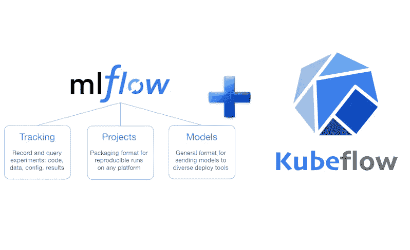
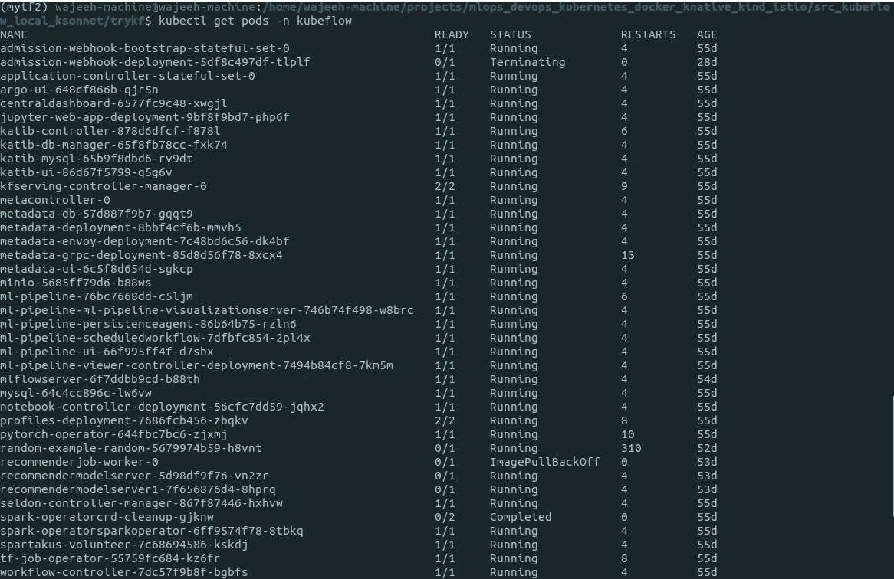
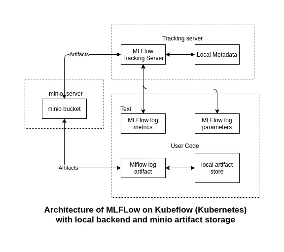

# 使用 MLFlow 增强 Kubeflow

> 原文：<https://medium.com/geekculture/enhancing-kubeflow-with-mlflow-8983373d0cac?source=collection_archive---------0----------------------->

MLFlow and Kubeflow

对机器学习有了解的人都明白，机器学习模型开发不同于传统的软件工程问题。许多工具已经上市，试图解决这个问题。在我们开始之前，看看我以前的一篇关于为什么我们需要 MLOps 的文章，链接到文章:[https://medium . com/@ wajeehulhassan/ai-is-electricity-and-MLOps-is-the-transmission-line-7960 e7e 8 c7fb](/@wajeehulhassan/ai-is-electricity-and-mlops-is-the-transmission-line-7960e7e8c7fb)

Kubeflow 和 MLFlow 是该领域中两个最著名的工具。Kubeflow 和 MLFlow 都是很好的模型部署工具，而 Kubeflow 更加丰富，为我们提供了更多的组件。MLFlow 可以在本地机器上使用，也可以在 Kubernetes 集群上使用，但 Kubeflow 只能在 Kubernetes 上运行，因为 Kubeflow 是在考虑部署可扩展的机器学习模型的情况下制作的。我们也可以在 Kubernetes 上部署 MLFlow，但在本文中，我将向您展示如何在 Kubeflow 上安装 MLFlow 并增强 Kubeflow 的功能。

Kubeflow 本身从未打算取代任何机器学习工具，而是旨在创建一个可扩展的环境，其中所有工具可以协同工作，并创建一个顺畅的工作流管道。

# 先决条件

*   库伯内特斯
*   库贝弗洛
*   舵 3
*   YAML
*   MLFlow
*   码头工人

**假设你已经有了一个正在运行的 Kuberflow 或者在云中(GCP，AWS，Azure)** 。首先，我们将确保所有的 pod 都在运行，为此运行命令:
**kube CTL get pods-n kube flow**

Kubeflow pods, mlflow deployed

你可以看到我机器中的 pods 大约有 2 个月了，那是我在 Minikube 上重新创建 Kubeflow 集群并在其中安装 MLFlow 的时候。

您还可以看到，我已经在我的 Kubeflow 集群上安装了 MLFLow，当您安装 Kubeflow 时，您将不会获得 MLFlow pod，因为它没有与 Kubeflow 打包在一起。

# **MLFlow 组件:**

MLFlow 有三个主要组件:

*   物流跟踪
*   MLFlow 项目
*   ml 流程模型

Kubeflow 还为我们提供了不同的组件。MLFlow 相对来说更容易使用，而 Kubeflow 为我们提供了企业级的工作流管理，MLFlow 在这方面落后于 Kubeflow。在本文中，我们将只讨论 MLFlow。我们将把 Kubeflow 留到后面的文章中。

用于在 Kubeflow 集群上安装 MLFlow，这将允许我们从不同的 docker 容器中写入元数据，并集中查看元数据。MLFlow 的主要组件可以在下面的架构图中找到:

*   Minio(预装了 Kubeflow)
*   MLFlow 跟踪服务器—(我们将在 Kubeflow clulster 中安装该组件)

Architecture of MLFlow on Kubeflow (Kubernetes) with local backend and minio based artifact storage

我们可以以编程方式指定 MLFlow 日志度量和 MLFLow 日志参数。我们还可以指定 MLFlow 日志工件和本地工件存储的位置。

# **在 Kubeflow (Kubernetes)上安装 MLFLow 跟踪服务器:**

由于 MLFlow 默认用于本地机器，因此 MLFlow 服务器将 MLFlow 运行存储到本地文件或 SQLAlchemy 兼容数据库，但在我们的情况下，我们将在 Kubeflow 集群中安装它，因此我们将使用远程服务器作为后端。

对于存储，MLFLow 有两个组件:

*   **后端存储-** (MLFlow tracking server 在后端存储中存储实验和运行元数据以及运行的标记、指标和参数)。后端存储可以存储为文件存储或数据库支持的存储。这里我们将使用 docker 映像中的文件存储。**注意:**如果容器重启，数据将会丢失。对于更长时间的存储，我们可以使用 NFS 服务器或数据库。
*   **工件存储** —它必须是能够存储更大文件的存储系统，比如可以是云上的存储桶，甚至是 NFS 文件系统。如果您想使用 NFS，您可能需要先配置 NFS。按照链接安装和配置 NFS[https://www . kube flow . org/docs/other-guides/kube flow-on-multi node-cluster/](https://www.kubeflow.org/docs/other-guides/kubeflow-on-multinode-cluster/)。在这篇文章中，我们不会使用 NFS。
*   Minio 与硬件无关，可以使我们的工件存储云独立。对于藏物存储，我们将使用 Minio。

我们的 docker 文件应该安装 mlflow、awscli、boto3，它应该公开 post 5000 以便与 MLFlow 跟踪服务器进行通信。它还应该有不同的环境变量来配置云存储。

我们利用了一个脚本，该脚本将 docker 容器作为入口点运行。

运行脚本将为 mlflow 创建所需的目录，该目录将用作后端存储，同时我们还将定义用于存储人工制品的 s3 存储桶。在我们的例子中，s3 存储桶是 minio 存储系统，minio 使用的是在安装过程中提供给 Kubeflow 的存储系统。该脚本在 0.0.0.0 上运行主机，因此任何 ip 都可以访问端口 5000 上的服务器。

现在，我们将通过运行 build.sh 脚本来构建 docker 容器。该构建脚本将构建 Dockerfile 文件，并将其命名为“lightbend/mlflow:1.0”。

Dockerfile、run 和 build 脚本可以在 Github 资源库中找到:[https://github.com/wajeehulhassanvii/mlflow_on_kubeflow/](https://github.com/wajeehulhassanvii/mlflow_on_kubeflow)

docker 容器启动后。海图可以安装舵。Helm 将安装 MLFlow 部署服务器、将公开 MLFlow 部署的 Kubernetes 服务以及将通过 Istio 入口网关向用户公开 MLFlow 服务的虚拟服务。

在终端中运行以下命令，在 Kubeflow Kubernetes 集群中安装 MLFlow helm chart。

***舵安装<舵图位置>***

链接到 Github 库:【https://github.com/wajeehulhassanvii/mlflow_on_kubeflow 

在后面的文章中，我们将更深入地研究 MLOps 工具。