# 用 TigerGraph 增强 Kaggle 计算(第二部分):用 Plotly Express 创建可视化

> 原文：<https://medium.com/geekculture/enhancing-your-kaggle-computations-with-tigergraph-part-ii-creating-visualisations-with-plotly-1197d7707dac?source=collection_archive---------21----------------------->

## 使用 Plotly Express 创建简单的可视化

> 注意:这是“用 TigerGraph 增强 Kaggle 计算”系列的继续。[在这里阅读往期博客](/codex/accelerating-your-kaggle-computations-with-tigergraph-part-i-creating-a-lego-graph-f2a43029f78f):[https://medium . com/codex/accelerating-your-ka ggle-computations-with-tiger graph-part-I-creating-a-Lego-graph-f2a 43029 f 78 f](/codex/accelerating-your-kaggle-computations-with-tigergraph-part-i-creating-a-lego-graph-f2a43029f78f)

# 概观

## 目标

在过去的博客中，我们使用 Kaggle 的 Lego 数据库数据集创建了一个 TigerGraph 图。现在我们将使用 Plotly Express 创建一些数据的可视化。

## 使用的工具

*   [TG 云](https://tgcloud.io/):这是我们的图表托管的地方(在云上)。
*   pyTigerGraph :这个 Python 包允许我们将笔记本与 TG Cloud 连接起来。
*   这是一个高级 Plotly 包，可以轻松快速地创建可视化效果。

现在，让我们进入代码！

# 第 0 部分:准备您的图表

## 第一步:确保图表“就绪”

首先，确保您的图表在 TG Cloud 中的状态是“就绪”。为此，请转到[https://tgcloud.io/](https://tgcloud.io/)并导航至您的“我的解决方案”选项卡。在“状态”下，确保有一个绿色的“就绪”点。如果没有，请转到“操作”下的“解决方案操作”,然后在下拉列表中按“开始”。等到状态为绿色。

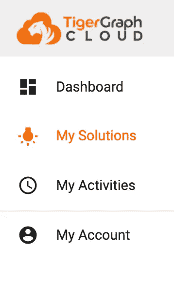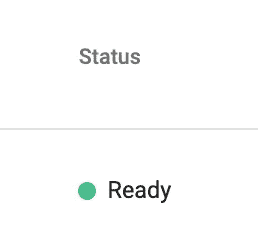

Go to “My Solutions” and check that your Status says “Ready.”

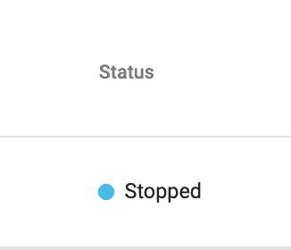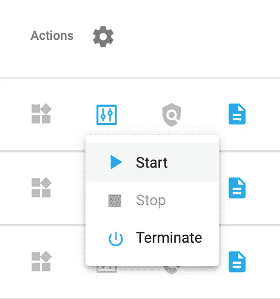

If you status says “Stopped,” press the “Solution Operations” button and press “Start.”

当它变绿并表示“准备好”时，你就准备好继续前进了！

## 步骤二:安装 pyTigerGraph 并创建一个连接

接下来，pip 安装 pyTigerGraph 并导入库。

```
!pip install pyTigerGraphimport pyTigerGraph as tg
```

接下来，创建你的连接。因为我们想要创建一个到我们在过去的博客中创建的 LegoGraph 的连接，所以创建连接看起来会稍有不同，现在需要一个 graphname 参数。

```
conn = tg.TigerGraphConnection(host="https://legograph.i.tgcloud.io/", password="tigergraph", graphname="LegoGraph")
conn.apiToken = conn.getToken(conn.createSecret())
```

## 步骤三:导入附加库

最后，我们需要再导入两个库:Plotly Express 和 Pandas。Plotly Express 将处理可视化，Pandas 将帮助我们创建一个数据框架来处理 TigerGraph 和 Plotly Express 之间的数据。

```
import pandas as pdimport plotly.express as px
```

太棒了。现在让我们开始观想吧！

# 第一部分:创建散点图

## 第一步:创建散点图

首先，我们将可视化每年每套零件的数量。为此，让我们首先编写一个查询来获取每个集合中的所有部件以及该集合发布的年份。

```
year_parts = conn.runInterpretedQuery('''INTERPRET QUERY () FOR GRAPH LegoGraph {TYPEDEF TUPLE <year INT, num_parts INT> YEAR_PARTS;
ListAccum<YEAR_PARTS> @@result;Seed = {Year.*};Res = SELECT l FROM Seed:s - (LEGO_SET_YEAR:e) - Lego_Set:l
      ACCUM @@result+=YEAR_PARTS(s.year, l.num_parts);PRINT @@result;}''')
```

该查询将从 Year 顶点开始，经过 LEGO_SET_YEAR 边，在 LEGO_SET 顶点结束。我们将创建一个 YEAR_PARTS 类型的列表，这是一个 TYPEDEF 元组，包含年份(作为一个整数)和零件号(作为一个整数)。

接下来，我们将把结果转换成熊猫数据帧。

```
df = pd.DataFrame(year_parts[0]["@@result"])
```

最后我们来 px .撒结果！

```
fig = px.scatter(df, x="year", y="num_parts")fig.show()
```

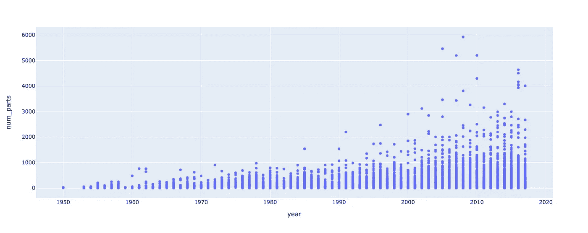

Resulting Figure

我们现在有了年份和零件数量的散点图！您可以将鼠标悬停在某个点上以获取有关该点的更多信息，然后单击并拖动鼠标以放大某个部分。

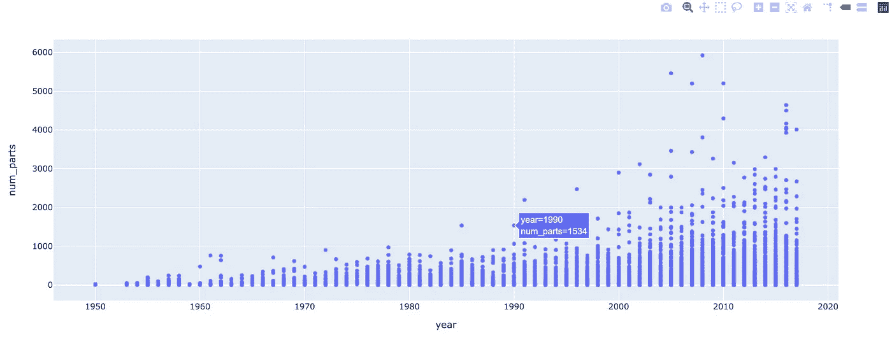

Hover over a point to get more information about it

## 第二步:使用主题为情节添加色彩

创造你的第一个情节的伟大工作！接下来，让我们使用主题为情节添加色彩。为此，我们需要创建一个两跳查询。

```
year_parts = conn.runInterpretedQuery('''INTERPRET QUERY () FOR GRAPH LegoGraph SYNTAX v2 {TYPEDEF TUPLE <year INT, num_parts INT, theme_id INT> YEAR_PARTS;
ListAccum<YEAR_PARTS> @@result;Seed = {Year.*};Res = SELECT l FROM Seed:s - (LEGO_SET_YEAR:e) - Lego_Set:l - (LEGO_SET_THEME:e1) - Theme:t
      ACCUM @@result+=YEAR_PARTS(s.year, l.num_parts, t.theme_number);PRINT @@result;}''')
```

这类似于过去的查询，但是现在我们使用“语法 v2”在 TYPEDEF 元组中，我们添加了一个 theme_id，这将是它的颜色编号。然后，在 SELECT 语句中，在转到 Lego_Set 顶点之后，我们接下来将越过 LEGO_SET_THEME 边并转到主题顶点。从主题顶点我们得到了主题编号。

接下来，让我们将结果放入数据帧中。

```
df = pd.DataFrame(year_parts[0]["@@result"])
```

最后，我们来散散点数据。这一次，我们将添加一个新参数 color，它将是“theme_id”的值

```
fig = px.scatter(df, x="year", y="num_parts", color="theme_id")fig.show()
```

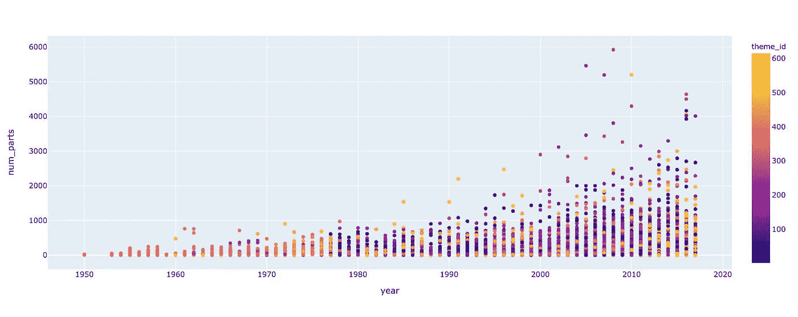

Scatterplot with Colouration!

不错！现在我们有了一个主题标识颜色，在右边有一个键。如果我们将鼠标悬停在某个点上，我们可以看到关于它的更多细节。


Hovering over a point

这很好，但是拥有 theme_id 并没有多大帮助。有主题名称会有用得多。

## 第三步:为要点添加更多信息

让我们添加主题名称，作为我们将从查询中获取的内容的一部分。

```
year_parts = conn.runInterpretedQuery('''INTERPRET QUERY () FOR GRAPH LegoGraph SYNTAX v2 {TYPEDEF TUPLE <year INT, num_parts INT, theme_id INT, theme_name STRING> YEAR_PARTS;
ListAccum<YEAR_PARTS> @@result;Seed = {Year.*};Res = SELECT l FROM Seed:s - (LEGO_SET_YEAR:e) - Lego_Set:l - (LEGO_SET_THEME:e1) - Theme:t
      ACCUM @@result+=YEAR_PARTS(s.year, l.num_parts, t.theme_number, t.theme_name);PRINT @@result;}''')
```

现在，在我们的 TYPEDEF 元组中，我们添加了 theme_name(一个字符串),并且我们也在 ACCUM 子句中累积它。

同样，我们将把它转换成数据帧。

```
df = pd.DataFrame(year_parts[0]["@@result"])
```

最后，我们将绘制它，这次在 hover_data 中添加 theme_name。

```
fig = px.scatter(df, x="year", y="num_parts", color="theme_id", hover_data=["theme_name"])fig.show()
```

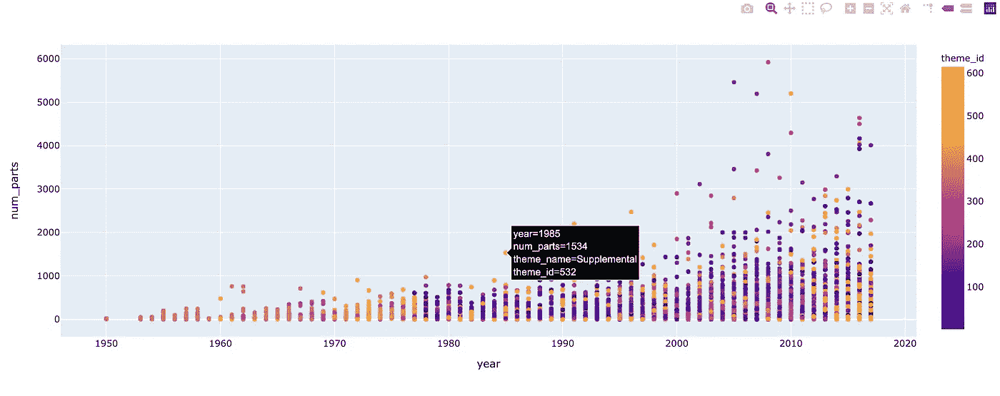

More Hover Data

太棒了。现在，当一个点被悬停，你会收到所有过去的信息以及主题名称！

# 第二部:再来三个剧情！

## 第一步:三维绘图

现在让我们来看看我们可以制作的其他几个情节！首先，我们将使用 scatter_3d 为我们的数据创建一个很酷的 3d 可视化。我们将传递 theme_id、num_parts 和 year。

```
fig = px.scatter_3d(df, x="year", y="num_parts", z="theme_id", hover_data=["theme_name"])fig.show()
```

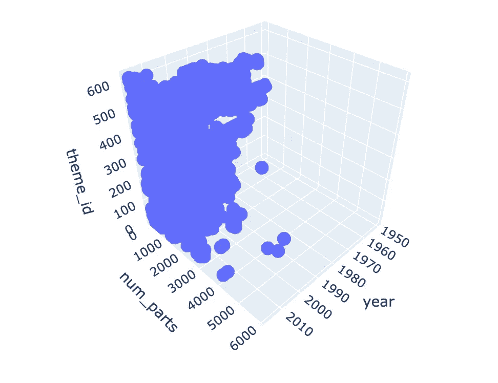

3D Visualisation

如果你停留在一个点上，你可以找到乐高玩具的细节。

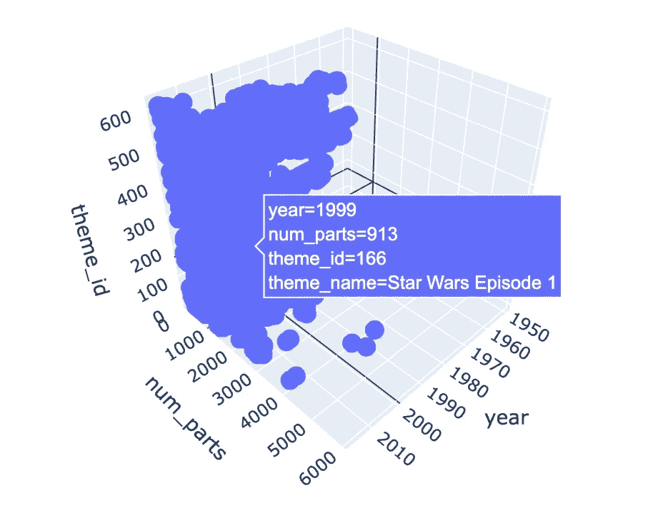

Hovering over a point for details

拖动图表以查看图表的不同角度。

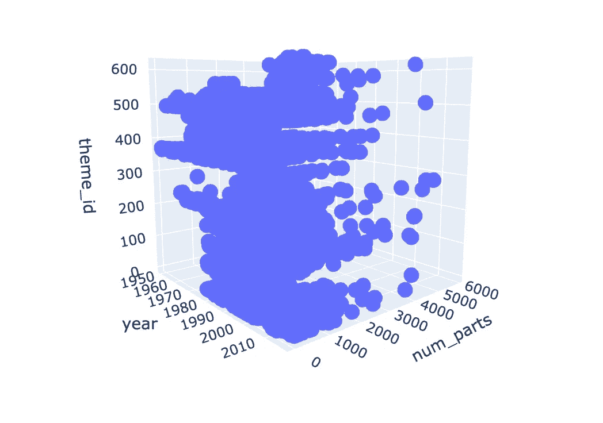

3D graph rotated

## 第二步:热图！

让我们探索另一种类型的图:热图。在 Plotly Express 中，我们可以运行 density_heatmap 来使用我们的数据创建热图。

```
fig = px.density_heatmap(df, x="year", y="num_parts")fig.show()
```

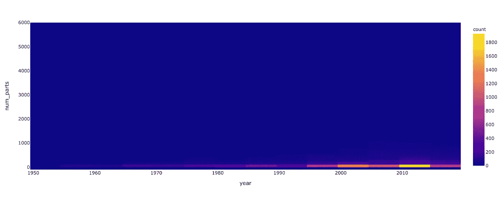

Year x Num_Parts Heatmap

同样，通过将鼠标悬停在某个值上，您可以查看某个单元格的信息。

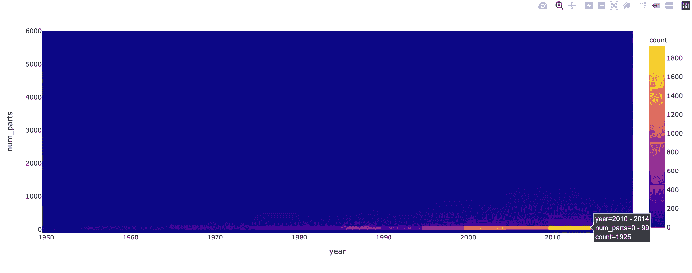

Hover over a cell for its details

我们还可以使用字符串值创建热图，比如主题名称！

```
fig = px.density_heatmap(df, x="year", y="theme_name")fig.show()
```

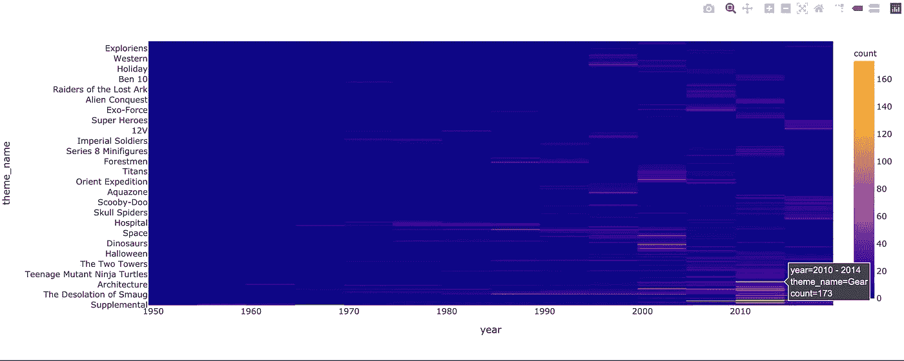

Year x Theme Name Heatmap

太棒了。让我们最后再运行一个查询，并通过它创建更多的可视化。

# 第三部分:又一个疑问和三个情节

## 第一步:编写查询

我们最终将运行一个查询，该查询将再次从 Year 开始，遍历 LEGO_SET_YEAR 边，转到 LEGO_SET，但不是转到主题，而是遍历 INVENTORY_LEGO_SET 并转到库存顶点。在累加器中，我们得到一组年份、零件数量、数量(库存中的器械组)和库存编号。我们将把结果转换成数据帧。

```
year_parts = conn.runInterpretedQuery('''INTERPRET QUERY () FOR GRAPH LegoGraph SYNTAX v2 {TYPEDEF TUPLE <year INT, num_parts INT, quantity INT, inventory_num INT> YEAR_PARTS;
ListAccum<YEAR_PARTS> @@result;Seed = {Year.*};Res = SELECT l FROM Seed:s - (LEGO_SET_YEAR:e) - Lego_Set:l - (INVENTORY_LEGO_SET:e1) - Inventory:t
      ACCUM @@result+=YEAR_PARTS(s.year, l.num_parts, e1.quantity, t.inventory_num);PRINT @@result;}''')df = pd.DataFrame(year_parts[0]["@@result"])
```

## 第二步:方框图

首先，让我们用我们的数据创建一些箱线图。

```
fig = px.box(df, x="year", y="inventory_num")fig.show()
```

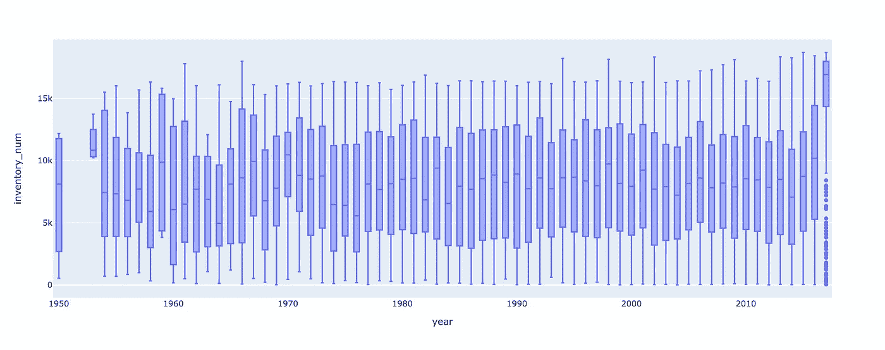

Box Plots of Inventory Number per Year

现在，如果您将鼠标悬停在某个值上，您将获得该部分的最大值、最小值、q1、q3 和中值。任何异常值都用一个点来表示，您可以将鼠标悬停在它们上面来获取它们的值。

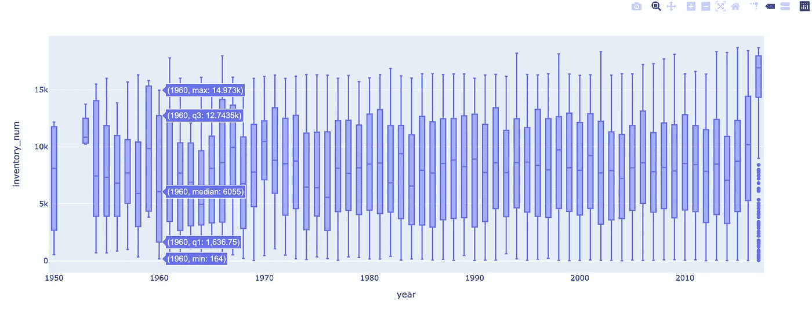

Hover over to get the max, q3, median, q1, and min of the year.

## 第三步:创建一个三维彩色散点图

现在我们总共有四个变量，所以让我们用 inventory_num 作为颜色键创建一个 3D 散点图。

```
fig = px.scatter_3d(df, x="year", y="quantity", z="num_parts", color="inventory_num")fig.show()
```

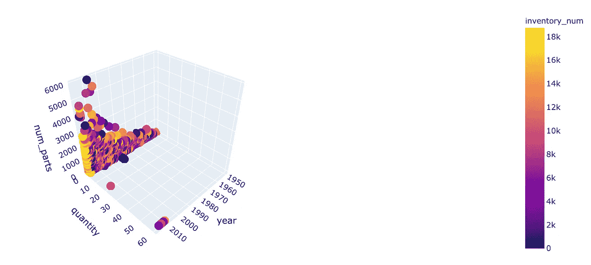

3D Scatter with Inventory Number as the Colour

## 第四步:创建一个三维大小分散

在 3D 散点图中使用四个变量的另一个很酷的方法是让一个变量的大小。在这种情况下，让我们使用 quantity 作为大小，其他变量作为轴的值。

```
fig = px.scatter_3d(df, x="year", y="num_parts", z="inventory_num", size="quantity")fig.show()
```

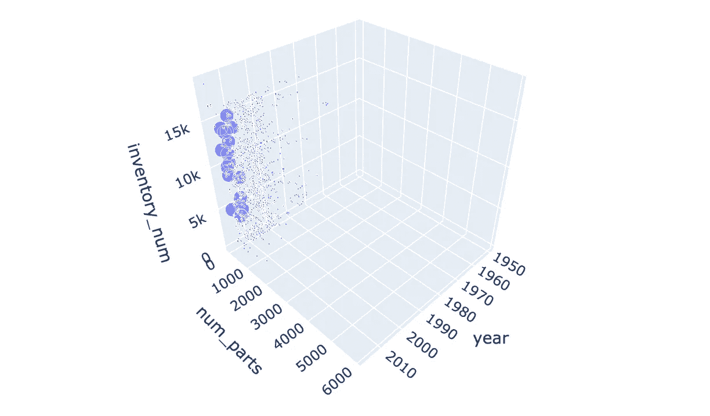

Size-Based 3D Scatter

如你所见，有一堆小点和几个大点。和过去一样，您可以将鼠标悬停在这些点上，以获得更多相关信息。

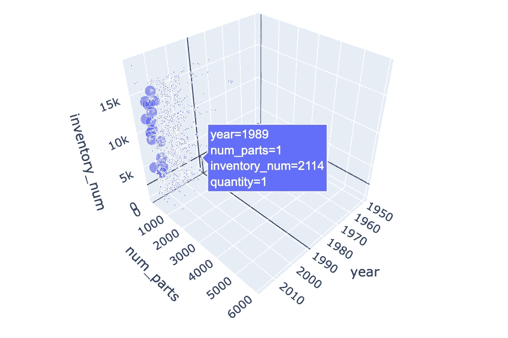

Hovering over Size 3D Scatter

# 第二部分:祝贺+挑战！

恭喜你。您现在知道如何使用 Plotly Express 可视化您的 TigerGraph 数据了！你能够创建一些图表，一些三维和一些 2D！干得好！

现在，尝试在您自己的 TigerGraph 解决方案中用您自己的数据运行这些可视化！欢迎在 TigerGraph 社区 Discord 服务器上分享您的结果或提出任何问题:

[](https://discord.gg/gRHWBZNpxW) [## 加入 TigerGraph Discord 服务器！

### 查看 Discord 上的 TigerGraph 社区-与 585 名其他成员一起玩，享受免费的语音和文本聊天。

不和谐. gg](https://discord.gg/gRHWBZNpxW) 

祝你好运！