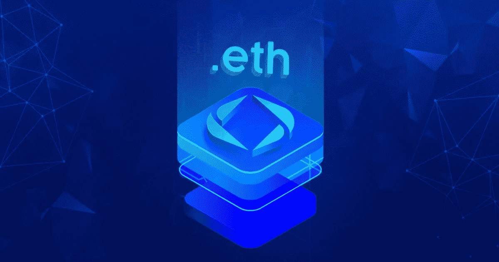

# 为网站、钱包和其他 Web 3 应用程序提供类似 ENS 的域名服务

> 原文：<https://medium.com/geekculture/ens-like-domain-naming-service-for-websites-wallets-and-other-web-3-applications-a910011030e4?source=collection_archive---------12----------------------->

Fig: ENS-like Domain Naming Service For Websites, Wallets, And Other Web 3 Applications

在 Web2 的早期，你需要输入很长的 IP 地址才能访问一个网站，这个网站在 1983 年被 Paul Mockapetris 简化为人类可读的域名。类似地，在 web3 中，您需要使用复杂的钱包地址和交易散列来启动交易。以太坊名称服务 (ENS)就是为了解决这个问题而开发的。阅读这个博客，了解以太坊域名服务是如何做到的，以及如何创建一个个人和人类可读的 ENS 域。

# 以太坊名称服务(ENS)是什么？

以太坊名称服务是以太坊区块链的分布式命名系统。尼克·约翰逊(Nick Johnson)于 2017 年创立，他将加密钱包地址和长十六进制字符串和哈希等复杂标识符转化为简化的人类可读钱包名称，使加密钱包地址易于共享和记忆。

每次用户在他们的以太坊钱包中发起交易时，他们的 ENS 域名是共享的，而不是复杂的地址。你可以使用 ENS 购买像 john.eth 这样人类可读的名字，这样更容易识别出是谁创造了它，而不是从你钱包里的“Ox4h42j34298sd68”这样的地址接收支付或数字资产。这样更容易记住地址，也不容易出错。

# ENS 和其他名字服务有什么区别？

ENS 现在被认为比其竞争对手更受青睐。ENS 的主要目标是为与以太坊区块链互动的 Web3 用户提供一个分散的可信域名。另一方面，大多数其他域名服务，如 Namecoin 和 Blockstack，正在寻求完全取代 DNS 域名服务。ENS 没有采用相同的方法，而是旨在与 Web2 域相协调。

# 了解 ENS 的基础知识

## 如何创建 NFT 域名？

ENS 域的概念与域名系统(DNS)非常相似，它通过创建人类可读的名称和易于记忆的 URL 来简化 web 上的 IP 地址。实际上，ENS 在域上使用相同的操作过程，但通过实施一种以加密为中心的技术，即智能合同来实现。这项技术将区块链的用途扩展到更复杂的金融用例，并让人们完全控制自己的资产。

ENS 域是使用 ERC(以太坊请求注解)令牌创建的，该令牌是用于创建和发布智能合同的标准。ENS 使用 ERC-721 令牌，因为它使用不可替换令牌(NFT)。与加密货币不同，NFT 是不可复制的唯一加密令牌。ENS 域需要此功能，因为它为每个用户提供一个唯一的钱包地址，该地址随 ERC-721 令牌一起提供。

## ENS 域安全吗？

因为 ENS 域是基于智能合同的，所以它们被认为比互联网的 DNS 更安全、更私密。ENS 存在于以太坊高度可编程的生态系统中，允许域除了命名之外，还可以与其他智能合约进行交互。数字合同的存在降低了支付延迟和错误的风险，使 ENS 对用户来说非常安全。

# 以太坊名称服务的优势:

*   ENS 被集成到数百个分散式应用程序(dApps)中，构成了 Web3 的基础。
*   用户可以在一个 ENS 名称下处理和存储所有钱包地址。这听起来可能不那么令人兴奋。然而，通过跨平台提供一致的用户名，创作者有很多机会完全拥有品牌用户名。
*   与您的 ENS 域名相关联的钱包可以存储头像、电子邮件、网站、社交媒体等。
*   在 Web3 环境中导航时，这个个性化的用户配置文件充当您在区块链上的身份。用户实际上有一个 Web3 ID，可以用来注册特定的 dApps、钱包和网站，拥有完全的用户名权限和所有权。
*   与今天的互联网生态系统不同，平台上的主要技术是应用程序可以免费使用，但内容和用户名最终归分享内容的平台所有。
*   使用 NFT 域名有很多好处。它们让您有机会:

1.  人类可读的域名
2.  较小的误差
3.  轻松帐户搜索
4.  作为 NFT 销售

# 什么是 ENS 令牌？它们是用来做什么的？

ENS 令牌是基于区块链以太坊的 ERC 20 令牌标准的治理令牌。ENS 一直是一个面向社区的分散式开源服务。然而，决策权主要掌握在中央团队手中。为了在 ENS 社区下放更多自主权，ENS tokens 于 2021 年 11 月推出。ens 使用 Twitter 宣布发布治理令牌，分发给 ENS 的分散自治组织(DAO)的代表。ENS DAO 社区以 ENS 代币的形式接收资本，并集体做出决定以改进 ENS 系统。这允许您管理它的一般治理。

# 对于你的 Web 3 应用程序来说，ENS 是一个好的投资吗？

ENS 是一个创新项目，因为它包含了可替代和不可替代属性的组合。全部。eth 域名符合 ERC-721 标准，因此可以在许多 NFT 市场上交易。能够注册 ENS 令牌的现有 ENS 域用户从最近的空投中收到了额外的令牌。因此，ENS 令牌是可替换的，可以通过加密钱包和交换平台进行交易。出售 NFT 域名的能力——作为加密投资买卖代币的能力——使这成为一个有利可图的投资机会。

## 总结一下:

您还可以通过为您的 web 3 应用程序提供类似 ENS 的域名服务，从加密和 NFT 领域中充分利用和受益。与密码领域的先锋公司合作，为分散式应用提供类似 ENS 的域名服务 。增加你的平台可信度，获得流量，和 ENS，一个你的 web 3 应用的品牌工具。