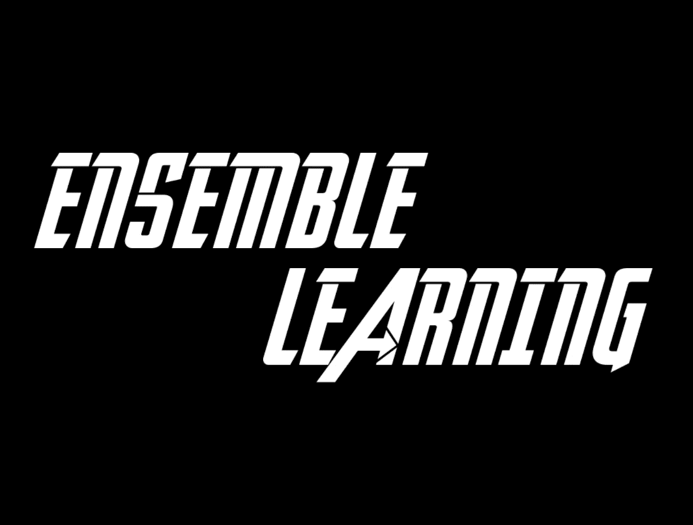
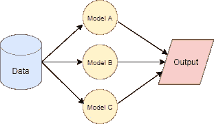
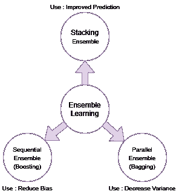
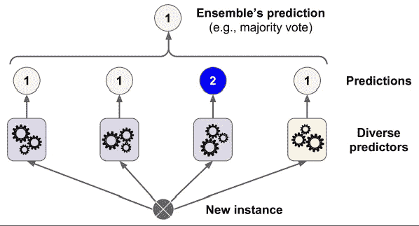
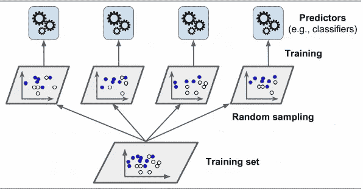
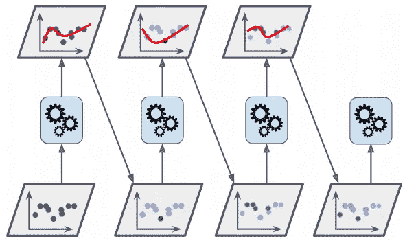

# 集成学习:基础和概述

> 原文：<https://medium.com/geekculture/ensemble-learning-basics-and-overview-316e9691fa35?source=collection_archive---------36----------------------->

## 什么是集成学习？它有哪些类型？

想象一下你想在这个周末去看一部电影，但是你不能决定看哪一部。所以为了方便起见，你可以在网上浏览，看看哪部电影是热门。你向你的朋友或家人寻求建议，却很少阅读评论。所以现在你有来自多种不同来源的信息，因此，你只需要根据这些信息做出决定。

你在这里做的是向随机的人提出一个问题，然后汇总他们的回答。你意识到聚合的答案比专家的答案更好。这就是所谓的*群体智慧*。

类似地，在机器学习的世界中，如果你聚集一组预测器(分类或回归)的值，你通常会得到比单个好的预测器提供的结果更好的结果。这些团体的组合被称为**合奏**。应用这些集成来获得答案是**集成学习**，使用这些技术的算法被称为**集成方法**。

# 集成学习的类型

1.  投票集合:堆叠集合
2.  Bagging 或 Bootstrap 聚合:并行集成
3.  增强:顺序集成

# 投票团。

*投票*合奏，这个术语本身就定义了它做什么。*投票*集成是一种基于集成技术的机器学习模型，它对多个不同或相同的模型进行训练，并基于从这些模型中选择的最高概率来预测输出。简单地说，投票分类器要求集成模型说出输出的概率，并选择多数概率输出。

投票集合可以进一步分为两种类型:

1.  硬投票:一个很简单的方法就是对类的多数预测进行投票，预测得到最多票数的值。这被称为硬投票分类器。假设您训练了四个模型，它们的预测如下(1，0，0，0)，假设是二进制分类。因此，在这里您可以看到 0 具有多数输出，因此 0 将是最终的预测。
2.  软投票:使用投票分类器的另一种方式是基于特定类别的平均概率来获得预测。假设您为二元分类 1 和 0 训练一个模型。1 的预测概率为(0.75，0.36，0.42)，0 的预测概率为{0.5，0.6，0.8}。现在，1 的预测平均值为 0.51，0 的预测平均值为 0.63，因此最终输出将为 0。

Voting Classifier e.g. Hard Voting Classifier

投票集合的准确度高于最佳预测器的最高个体准确度。相反，如果每个分类器都是弱学习器(给出较低的准确度)，集成仍然可以是强学习器，只要有足够数量的弱学习器并且所有的都足够不同。

对这些的解释可以用 [*大数定律找到。*](https://www.investopedia.com/terms/l/lawoflargenumbers.asp)

# 打包/引导聚合

Bagging 指的是集成技术，其中我们对所有不同的预测器使用相同的训练算法，但是在训练集的不同随机子集上训练它们。当这种取样与替换一起进行时，称为装袋。

这种技术不是绝对的，因为数据的变化会对模型产生非常严重的影响。当我们进行 bagging 时，每个个体的偏差变得更高，聚合过程减少了偏差和方差，最终的集成在原始数据上具有与单个预测器相同的偏差和更低的方差。所以*装袋减少了模型的方差*。

Bagging Ensemble with random sampling

Bagging 允许跨多个预测器对训练实例进行多次采样，或者对相同的预测器进行多次采样。

一旦训练了所有的预测器，集成就可以通过简单地聚合所有预测器的预测来对新的实例进行预测。

聚合通常是分类器的统计模式，是回归的平均值。

> 同样在 bagging 中，预测是并行完成的，所以它们更快，更受欢迎。

**随机森林**

随机森林是决策树的集合，通常通过 bagging 方法(有时是粘贴)进行训练，通常样本大小设置为训练集的大小。您可以使用 Random Forest 分类器类来代替构建 Bagging 分类器并将其传递给决策树分类器，这对于决策树来说更加方便和优化。

# 助推

Boosting 是机器学习中存在的另一种集成方法，它也像 Bagging 一样使用各种预测器来提高它们的准确性。与使用并行技术的 Bagging 不同，Boosting 使用顺序技术。依次增强训练预测器，每个预测器都试图校正它的前一个预测器(先前训练的预测器)。

Boosting Ensemble

> 由于这种用于增强的顺序学习，它不像使用并行学习的 bagging 那样可扩展。

# 增压的类型

**AdaBoost**

AdaBoost 更关注前一个不足的训练实例。这导致新的预测者更加关注先前预测者的困难情况。

> *以*为例，训练第一个分类器，然后增加误分类训练实例的相对权重，根据来自先前预测器的更新权重训练第二个分类器。当它对训练集进行预测时，权重被更新等等。最终答案只是计算所有预测值的预测值及其权重，根据多数加权投票预测的类别就是预测的类别。

**梯度增强**

像 AdaBoost 一样，梯度增强也通过将先前训练预测器添加到集合中并校正其前身来顺序工作。然而，在梯度增强中，不是像 AdaBoost 那样在每次迭代时改变每个不正确的分类观测值的权重，梯度增强方法试图使新的预测器与前一个预测器产生的残差相适应。

> A daBoost 在每个实例中调整前任权重，而梯度增强试图用先前预测器的误差来拟合新预测器。

**XGBoost**

请注意，梯度增强的优化实现在 XGBoost 库中可用，XGBoost 的字面意思是 Xtreme Gradient Boost。XGBoost 是梯度提升决策树的实现，旨在提高速度和性能。

该库提供了一个用于各种计算环境的系统，尤其是:

*   **树构建的并行化**在训练期间使用你所有的 CPU 核心。
*   **分布式计算**用于使用机器集群训练非常大的模型。
*   **核外计算**适用于不适合内存的超大型数据集。
*   **数据结构和算法的高速缓存优化**，以充分利用硬件。

XGBoost 在分类和回归预测建模问题上主导结构化或表格化数据集。证据是，它是 Kaggle 竞争数据科学平台上竞赛获胜者的首选算法。

我希望现在你对什么是集成学习和不同类型的集成学习有了一个基本的概念。

感谢阅读！。

关注更多更新。

> **参考文献:**

 [## 应用机器学习 XGBoost 简介-机器学习掌握

### XGBoost 是一种算法，最近一直主导着应用机器学习和 Kaggle 竞争…

machinelearningmastery.com](https://machinelearningmastery.com/gentle-introduction-xgboost-applied-machine-learning/)  [## 1.11.集合方法-sci kit-学习 0.24.2 文档

### 在平均方法中，驱动的原则是独立地建立几个估计量，然后平均它们的估计量

scikit-learn.org](https://scikit-learn.org/stable/modules/ensemble.html) 

通过 Scikit-Learn 和 TensorFlow 进行机器实践学习 *Aurelien Geron* 。