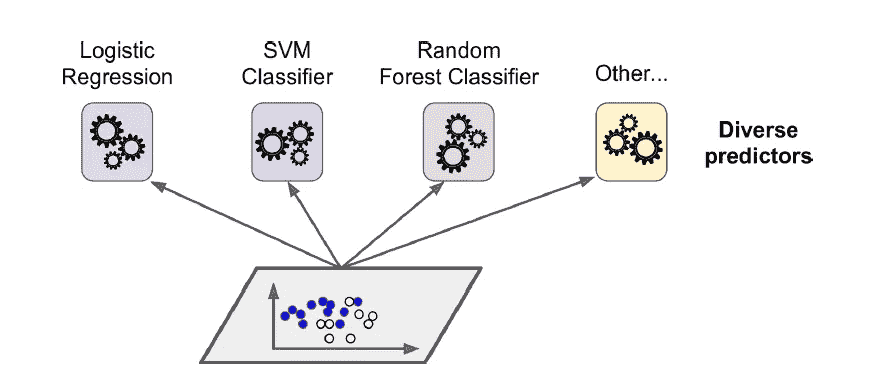
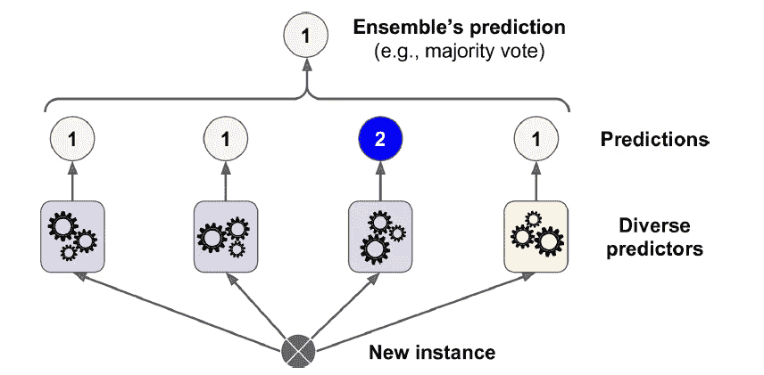
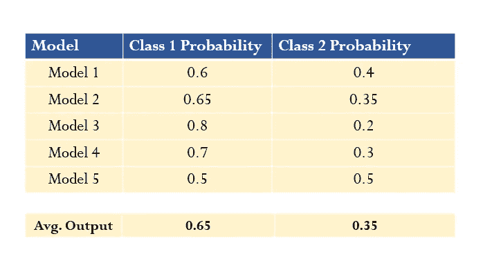
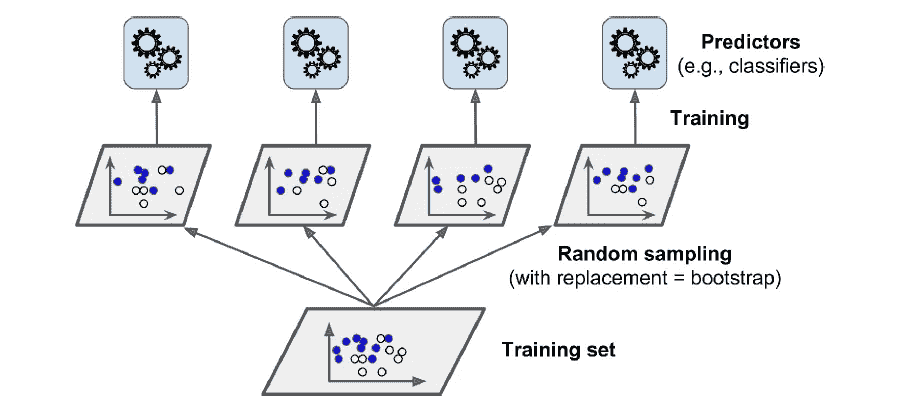

# 整体技术第 1 部分-装袋和粘贴

> 原文：<https://medium.com/geekculture/ensemble-techniques-part-1-bagging-pasting-b8cc7fd69edf?source=collection_archive---------11----------------------->

## 装袋、粘贴、随机子空间、随机补丁、随机森林、额外树、出袋、特征重要性

## 在 scikit learn 中实现集成技术背后的理论直觉


Photo by [charlesdeluvio](https://unsplash.com/@charlesdeluvio?utm_source=unsplash&utm_medium=referral&utm_content=creditCopyText) on [Unsplash](https://unsplash.com/s/photos/machine-learning?utm_source=unsplash&utm_medium=referral&utm_content=creditCopyText)

[***“集成方法的目标是结合用给定学习算法构建的几个基本估计量的预测，以提高单个估计量的可推广性/稳健性。***](https://scikit-learn.org/stable/modules/ensemble.html)

*我们有数据，我们正在训练一个**单个** ML 模型进行预测，这可能经常导致准确性较低。但是如果我们把一组模型(回归器或者分类器)的预测聚合起来呢？答案是，我们通常会得到比最佳个体预测者更好预测。如果有足够数量的弱学习者并且它们足够多样化(相关性较低)，那么对具有低准确度的单个预测者(弱学习者)进行分组会导致**集合**(强学习者)实现高准确度，同时降低方差。*

**

*Source: Oreilly ‘s Hands-On machine learning with Scikit-learn, Keras & Tensor flow*

*最流行的集成方法有:*

1.  *引导聚集*
2.  *助推技术*
3.  *堆垛*

*在本文中，我们将只研究装袋粘贴法及其随机森林算法的特例&额外树法，但在此之前，让我们看看来自单个预测者的预测将如何聚合。对于回归问题，它将主要是单个独立估计量的所有预测的平均值，而对于分类问题，它可以有硬投票或软投票方法。*

***硬投票分类器:** *预测类别标签的多数投票分类器*。这背后的想法是，每个输出的预测将被汇总，得到最多投票的类将是最终的预测输出。对于下图，大多数分类器预测类别 1，一个分类器预测类别 2，因此根据多数投票，分类器类别 1 将是最终的预测输出。*

**

*Source: Oreilly ‘s Hands-On machine learning with Scikit-learn, Keras & Tensor flow*

***软投票分类器:**测量平均预测概率(软投票)。它将预测具有最高分类概率的输出分类，该分类概率在所有单个分类器上平均。对于下面的例子，单个模型预测 1 类和 2 类的概率，大多数模型具有 1 类的最高概率，因此 1 类所有最高概率的平均值为 0.65。有时它通过`weights`参数给每个分类器分配权重。权重将与各个分类器的准确度成正比。*

**

*Credit: Author*

*软投票比硬投票具有更高的性能，因为它给予高度信任的投票更大的权重。*

> ****注意:当所有单个模型尽可能相互独立时，集成技术工作得最好，产生不相关的误差，如果它们在相同的数据上进行训练，则不可能产生相同类型的误差，从而降低集成精度。获得不同分类器的最好方法是使用不同的算法来训练它们，这会导致不同类型的错误，从而提高集成精度。****

*现在继续，让我们看看装袋技术，随机森林和额外树木的方法。*

*1。 **装袋:**在这种方法中，相同的训练算法被用作集成中的预测器，但是所有这些预测器都在训练数据集的不同随机子集上被训练。装袋和粘贴的细微区别在于，在装袋***(bootstrap = True)***中使用替换进行训练数据集的采样，而在粘贴***(bootstrap = False)***中不使用替换。因此，只有 bagging 允许对训练实例进行多次采样以获得预测值。*

**

*Source: Oreilly ‘s Hands-On machine learning with Scikit-learn, Keras & Tensor flow*

*一般来说，每个单独的预测值都有较高的偏差，但是与在相同训练数据集上训练的单个预测值相比，聚合将最终产生具有相似偏差但方差较低的集合。BaggingClassifier 也自动执行软投票。所有预测器都是并行训练的，并通过不同的 CPU 内核执行预测的并行计算(scikit learn 中的 n_jobs 参数表示用于训练和预测的 CPU 内核数量，-1 表示使用所有可用的内核)。*

****像采样实例一样，我们也可以对特征进行采样*** ，这样每个预测器都可以在输入特征的随机子集上进行训练。BaggingClassifier 通过参数`bootstrap_features` & `max_features.` 提供这两种技术:*

***随机子空间:**保留*所有训练实例* ( `bootstrap=False` ) & ( `max_samples=1`)但采样特征(`bootstrap_features=True`)和`max_features`为小于 1 的值称为随机子空间法。*

***随机补丁:**对训练实例和特征进行采样的技术称为随机补丁。*

***开箱评估(OOB):** 在 bagging 中，我们已经看到培训是通过替换培训实例来完成的。因此，有些实例可能被多次采样，而有些实例根本没有被采样。在数学上，可以看到，对于每个预测器，63%的训练实例被平均采样，而 37%的训练实例根本没有被采样，并被称为 ***外袋(oob)实例*** 。由于预测器从未见过这些实例，因此可以使用这些实例评估预测器性能，而无需使用验证集。为了检查评估分数，将使用以下代码，该代码具有 500 个决策树预测器，100 个训练实例，使用所有核心进行并行处理。*

```
*from sklearn.ensemble import BaggingClassifier
from sklearn.tree import DecisionTreeClassifierbagging_clf=BaggingClassifier(DecisionTreeClassifier(),n_estimators=500,max_samples=100, bootstrap=True, n_jobs=-1,oob_score=True)bagging_clf.fit(X_train, y_train)
y_pred = bagging_clf.predict(X_test)bagging_clf.oob_score_*
```

# ****随机森林算法****

****是通过 bagging 技术*** 训练的决策树的集合，其中`max_sample`设置为训练集的大小。森林估计量的主要目标是减少方差，因为单棵树往往会过度拟合并表现出较高的方差。它在生长树中引入了额外的随机性，因为当在节点处分裂时，它从选择的特征的随机子集中搜索最佳特征，而不是从所有特征中搜索最佳特征。这将导致更大的树多样性，有时会导致低方差的偏差增加，从而导致整体更好的模型。*

*我们可以直接使用 sklearn.ensemble 中的 RandomForestClassifier，而不是构建 BaggingClassifier，然后将其传递给 DecisionTreeClassifier。*

*`**Note:** *Random forest helps in performing feature selection by measuring feature importance on looking at how much the tree nodes that use that feature reduces impurity on average.*`*

# *极度随机化的树(额外树)*

*在这种情况下，计算分裂的方式增加了额外的随机性。它对每个特征使用随机阈值，而不是搜索可能的最佳阈值(像常规决策树一样)，然后选择这些随机生成的阈值中的最佳阈值作为分割规则。这种技术允许以略微增加偏差为代价来减少方差。*

*这让我们了解了装袋技术，在接下来的几篇文章中，我们将深入探讨不同的增压技术及其不同类型。*

*如果你发现什么错误，请评论。此外，DM 是开放的。快乐学习。*

*参考资料:*

1.  *[https://scikit-learn.org/stable/modules/ensemble.html](https://scikit-learn.org/stable/modules/ensemble.html)*
2.  *O'Reilly Media，Inc .使用 Scikit-Learn、Keras 和 TensorFlow 进行机器学习。*
3.  *克里斯纳伊克机器学习播放列表。*