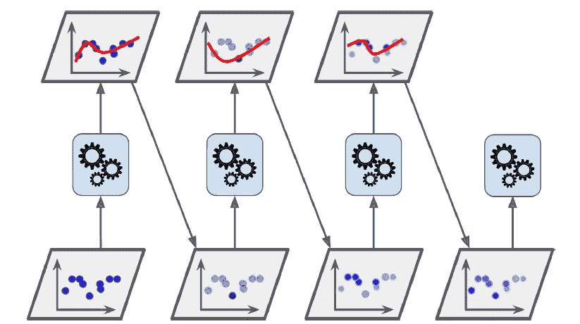
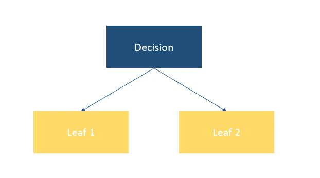
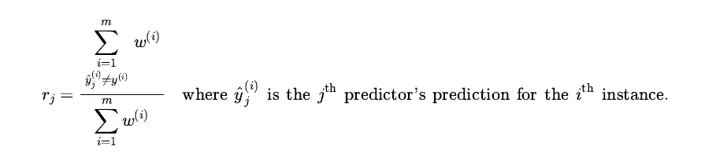
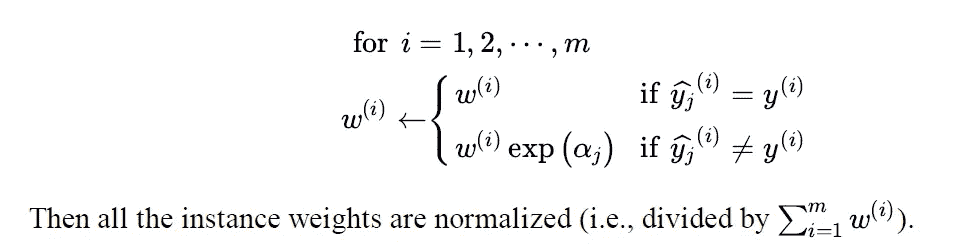
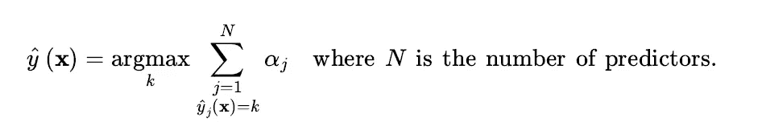

# 集成技术第二部分- AdaBoost 算法

> 原文：<https://medium.com/geekculture/ensemble-techniques-part-2-adaboost-algorithm-8dd927cacba4?source=collection_archive---------18----------------------->

## 集成技术，增强，AdaBoost，机器学习

## AdaBoost 技术背后的理论和数学直觉

Photo by [Bradyn Trollip](https://unsplash.com/@bradyn?utm_source=unsplash&utm_medium=referral&utm_content=creditCopyText) on [Unsplash](https://unsplash.com/s/photos/sequence?utm_source=unsplash&utm_medium=referral&utm_content=creditCopyText)

[本文是上一篇文章(综合技术第一部分-装袋&粘贴)](/geekculture/ensemble-techniques-part-1-bagging-pasting-b8cc7fd69edf)的延续。它将主要集中在下一个非常重要的提升集成方法，即 AdaBoost。正如我们在以前的文章中看到的，集成方法背后的主要思想是将许多弱学习器组合成一个强估计器。因此，Boosting 主要通过顺序学习依次训练预测器来工作。这是一个迭代过程，在这个过程中，每个估计器都试图纠正其前任的错误预测。升压方法的主要类型有:

1.  自适应增强(AdaBoost)
2.  梯度推进
3.  极端梯度增强(Xgboost)

***这些顺序学习技术的问题在于它不能像打包和粘贴那样并行化。***

1。 **AdaBoost:** 该算法背后的核心思想是，新的预测器通过给予前任预测错误分类或欠拟合的训练实例更多的关注来校正其前任。这是通过更新权重，通过增加欠拟合或错误分类的训练实例的相对权重来进行下一次预测，然后重复该过程直到满足所需的条件。AdaBoost 将这些顺序估计器添加到集成中，逐渐使它变得更好。当一个测试数据到来时，它依次通过所有的基本学习器，并根据分配给每个预测器的权重进行最终预测。它可用于回归和分类问题。

Source: Oreilly ‘s Hands-On machine learning with Scikit-learn, Keras & Tensor flow

一旦所有的估计器被训练，基于它们在加权训练实例上的准确度，不同的权重将被分配给这些估计器，以进行总体的最终预测。

现在一步一步地用数学方法研究它的算法，

1.  最初，每个实例被分配相等的权重 w( *i* )=( *1/m* )，其中 *m* 是总实例数。
2.  将使用 AdaBoost 中的决策树树桩创建第一个基础学习者。决策树桩基本上就是带有 max 的决策树。深度为 1，由一个决策节点和两个叶节点组成。

Decision stump with max_depth 1

3.从众多决策树桩中选择最佳决策树桩将基于基尼系数或熵标准来完成。 [*同样可以参考这篇文章。*](/geekculture/criterion-used-in-constructing-decision-tree-c89b7339600f)

4.在训练第一基础学习者之后，将根据第一基础学习者的预测(`y(observer) != y(predicted)`)为错误分类或不适合的类计算加权误差 r( *j* )。错误率的公式如下。

Source: Oreilly ‘s Hands-On machine learning with Scikit-learn, Keras & Tensor flow

5.为了观察决策树树桩的性能，预测值的权重将计算如下:

Source: Oreilly ‘s Hands-On machine learning with Scikit-learn, Keras & Tensor flow

其中 *η* 是学习率超参数(默认为 1)。它在集成的最终预测中贡献弱学习者的权重。预测值越精确，分配给它的权重就越高。

6.在数据修改中向前移动，对于不正确预测的事件，权重将被更新和指数增加，而对于正确预测的实例，权重将减少。数学上，

Source: Oreilly ‘s Hands-On machine learning with Scikit-learn, Keras & Tensor flow

7.对于接下来的连续迭代，基础学习器将再次用重新加权的数据进行训练。该算法将这样工作，即它将主要挑选错误分类的实例用于训练，并且整个过程将被重复。当训练了期望数量的弱学习器或找到完美的预测器时，算法停止。

8.为了进行最终预测，AdaBoost 将使用预测器权重α来计算和加权所有基本学习器的预测，最终预测的类将是获得大多数加权投票的类。

Source: Oreilly ‘s Hands-On machine learning with Scikit-learn, Keras & Tensor flow

这就把我们带到了 Boosting 技术中 AdaBoost 算法的结尾。它在每次迭代中的权重分配技术使它成为最好的算法之一。在下一篇文章中，我们将按照顺序探索梯度推进算法。

如果你发现什么错误，请评论。此外，DM 是开放的。快乐学习。关注我，了解更多关于机器学习的文章和概念:

推特句柄:[https://twitter.com/sdeeksha07](https://twitter.com/sdeeksha07)

中等:[sdeeksha07.medium.com](https://t.co/pWF2eKMqY6)

参考资料:

1.  [https://scikit-learn.org/stable/modules/ensemble.html](https://scikit-learn.org/stable/modules/ensemble.html)
2.  O'Reilly Media，Inc .使用 Scikit-Learn、Keras 和 TensorFlow 进行机器学习。
3.  优酷网上的克里斯·纳伊克机器学习播放列表:[https://www.youtube.com/watch?v=NLRO1-jp5F8](https://www.youtube.com/watch?v=NLRO1-jp5F8)
4.  机器学习大师 Youtube:[https://www.youtube.com/watch?v=kzcetBfltx0](https://www.youtube.com/watch?v=kzcetBfltx0)
5.  机器学习大师 Youtube:[https://www.youtube.com/watch?v=peh2l4dePBc&t = 3s](https://www.youtube.com/watch?v=peh2l4dePBc&t=3s)