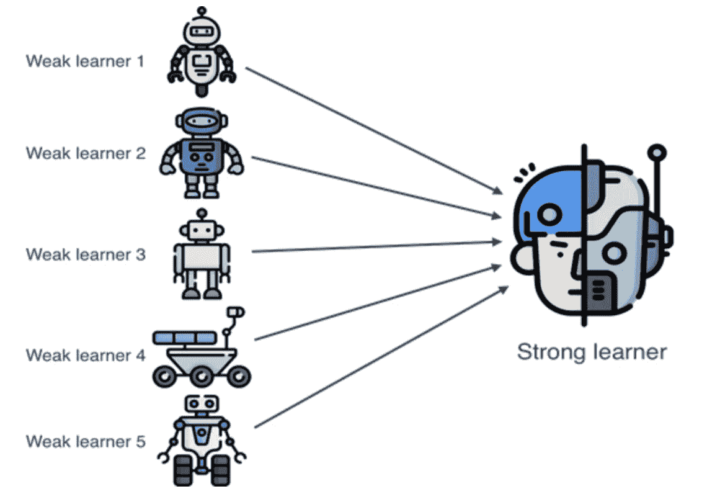

# 合奏:卡格勒用来提高性能的技术

> 原文：<https://medium.com/geekculture/ensemble-the-technique-that-kagglers-use-to-improve-performance-3aee133a6f88?source=collection_archive---------54----------------------->

正如我在上一篇文章中提到的，如果特征决定了模型的上限，那么系综很可能就是这个上限的近似值。