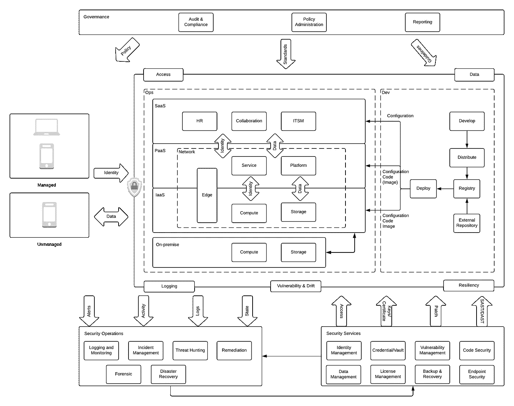
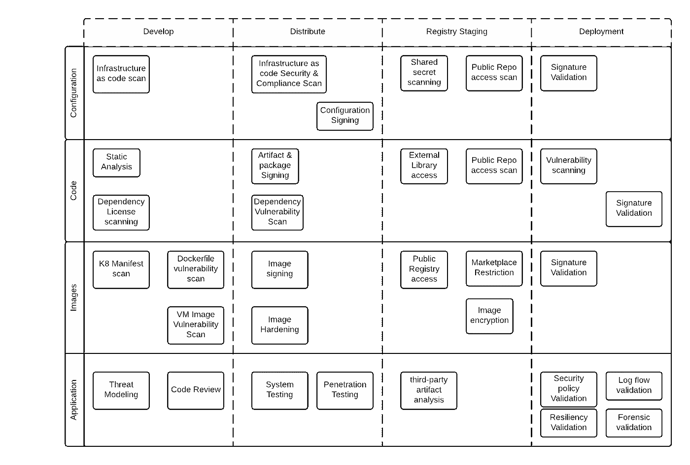
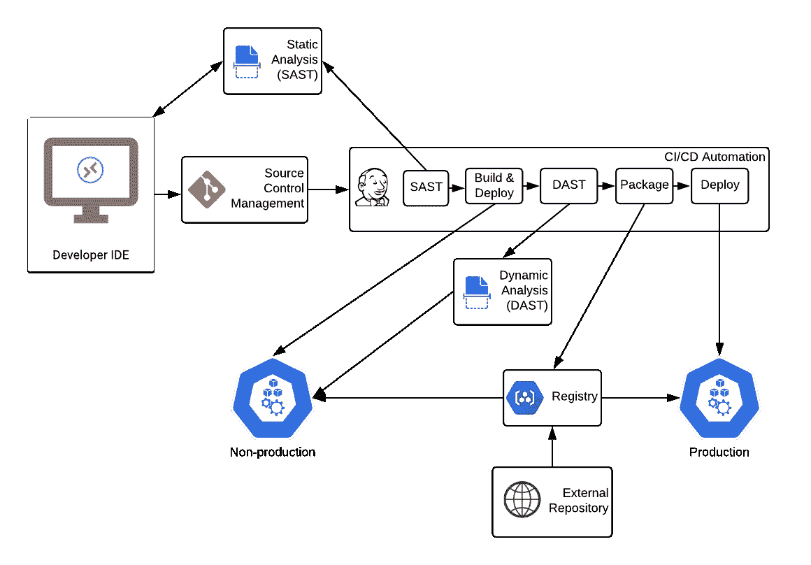

# 企业云安全:应用程序开发

> 原文：<https://medium.com/geekculture/enterprise-cloud-security-application-development-16a7efb2027f?source=collection_archive---------4----------------------->

## 第三部分:开发安全的应用程序

> 本文是企业云安全系列的一部分，其中[第一部分:简介](https://jhash.medium.com/enterprise-cloud-security-introduction-970a63f50914)介绍了这一领域以及它与内部安全的不同之处。 [*第二部分:基础*](https://jhash.medium.com/enterprise-cloud-security-foundation-f2cdeb0c84a4) 涵盖了构建云基础的安全性考虑。第三部分:应用程序开发着重于在应用程序开发过程中构建安全性。

Cloud security reference architecture

应用程序的安全性在高层次上可以分为以下几类

1.  开发应用程序时考虑到了安全性，因此是安全的
2.  应用程序开发基础设施是安全的
3.  应用程序在运行时是安全的
4.  应用程序运行时基础设施是安全的。

开发安全的应用程序要求应用程序在安全的开发平台上被设计和开发为安全的([关于信任的思考](https://www.cs.cmu.edu/~rdriley/487/papers/Thompson_1984_ReflectionsonTrustingTrust.pdf))。

# DevOps 中的应用安全性

CNCF 在整理安全[白皮书](https://github.com/cncf/sig-security/raw/master/security-whitepaper/CNCF_cloud-native-security-whitepaper-Nov2020.pdf)方面做得很好，该白皮书基于 [NIST 应用安全容器指南](https://nvlpubs.nist.gov/nistpubs/SpecialPublications/NIST.SP.800-190.pdf)、[互联网安全中心(CIS)](https://www.cisecurity.org/) 、 [NIST 微服务安全策略](https://nvlpubs.nist.gov/nistpubs/SpecialPublications/NIST.SP.800-204.pdf)和 [OpenSCAP](https://www.open-scap.org/) 。它涵盖了应用程序开发、分发、部署和运行时的典型生命周期。由于它专注于云原生开发，所以在某些方面有点轻，比如保护 SaaS 和 PaaS 服务的独特考虑。

Secure DevOps

DevOps 的总体方法是确保在以下类型的工件流经流程时实现安全性

1.  **应用** —代表运行时中所有工件的集合。
2.  **配置** —由 SaaS、PaaS、IaaS 和驱动应用供应和运行时行为的应用配置组成。
3.  **代码** —作为应用的一部分，主要部署到 IaaS(基础设施即服务)、CaaS(容器即服务)、FaaS(功能即服务)和 PaaS(平台即服务)
4.  **映像** —提供代码运行的平台。这通常包括虚拟机和容器映像。

作为开发运维的一部分，以下阶段构成了流程的一部分

1.  **开发**——包括开发人员编写代码、配置，有时还会将解决方案将要运行的映像放在一起。开发人员还负责测试，并可能负责或参与威胁建模，因为他们了解所涉及的领域和技术。
2.  **分发** —专注于打包开发过程的结果，以便在内部使用或与其他团队、业务单位和组织共享。这通常涉及更全面的测试，以确保工件是“生产就绪”的，可以发布。打包的工件通常会被推送到注册中心，以供暂存。
3.  **Registry staging**——包括存储工件以供下游系统和用户将来使用。
4.  **部署** —重点是在为应用程序指定的着陆区设置应用程序。
5.  **运行时** —由一个应用程序和相关联的基础设施组成，该基础设施提供该应用程序被设计用于的服务。

在这些阶段中，必须监控和处理安全性的各个方面，以确保应用程序是“**默认安全的**”。这种“**左移**”的应用程序安全方法可以减少运行时修复这些安全问题的时间、精力和成本。以下安全方面通常作为开发运维流程的一部分来解决。

## **应用**

1.  **威胁建模** —侧重于在保护有价值的东西(如数据和/或服务)的背景下识别、交流和理解威胁及缓解措施。这是开发过程的一个重要部分，为用户安全地部署应用程序提供适当的指导。在部署阶段，通常会执行威胁建模，以根据部署架构识别所有运行时威胁。
2.  **代码审查** —应对代码、配置和映像的变更进行审查，以确保其符合功能性和非功能性需求以及企业指南。
3.  **测试** —确保代码、配置和映像符合功能性和非功能性(包括安全性)需求。根据需求，在整个开发生命周期中，测试通常包括单元测试、系统测试、集成测试、性能测试等。关于安全性，**渗透测试**是典型的测试之一，通过设计来确保实现的安全性。安全团队可能会开发**自动冒烟测试**，这些测试可以合并到测试框架中，以确保足够的覆盖率。
4.  **第三方工件分析** —查看所有第三方工件，如虚拟机和容器映像、从外部来源(如 maven 存储库、docker 容器存储库和云市场)提取的库，并执行漏洞分析、签名和发布到企业注册表以供应用程序团队使用。
5.  **安全策略验证** —涉及根据预定义的企业策略检查构成运行时环境一部分的所有组件，包括代码、配置、映像、网络，以确保应用在部署后是安全的。
6.  **日志流验证** —确保所有应用和基础设施日志设置正确，以便在部署后流入 SIEM 和/或性能/遥测平台。
7.  **弹性验证** —重点验证已部署应用程序的部署是否符合已确定的弹性(故障转移、灾难恢复)要求。
8.  **取证验证** —确保部署的基础设施设置正确(例如，安装任何代理，从取证自动化工具访问环境)，以便在发生任何事件时快速执行取证调查。

## **图像**

1.  **Docker 文件漏洞扫描** —专注于识别构成容器图像每一层的各种工件，并验证与工件相关的漏洞。
2.  **Kubernetes 清单扫描** —查找 Kubernetes 工作负载的安全和配置问题。
3.  **虚拟机映像漏洞扫描** —在虚拟机映像中寻找潜在的漏洞点。
4.  **映像强化** —去除不必要的软件并更改配置，以限制可能被攻击者利用的潜在漏洞。
5.  **图像签名** **和验证** —将数字指纹添加到图像中，稍后可以对其进行测试以验证信任。
6.  **公共注册表访问** —需要进行管理，以确保未经批准或不安全的图像或图像层不会作为任何阶段的一部分被引入。
7.  **市场限制** —确保正在开发的图像得到批准或符合企业政策
8.  **图像加密** —确保存储在图像上的任何知识产权受到保护。

## **代码**

1.  **静态分析(SAST)** —专注于白盒测试，在编译源代码之前对其进行分析，根据部署架构和其他因素，找出运行时可能被利用的漏洞
2.  **依赖项许可证扫描** —审查与代码相关的所有依赖项，以确保相应的许可证符合企业政策并限制暴露。
3.  **工件和包签名** —将数字指纹添加到作为编译和打包过程的一部分而创建的包和工件中。
4.  **依赖性漏洞扫描** —识别与代码正在使用的依赖性相关联的任何现有漏洞。
5.  **外部库访问** —确保仅使用授权库。
6.  **公共回购访问扫描** —在代码、配置和构建过程中查找对公共和未授权存储库的引用。
7.  **预定义代码模板** —针对安全性进行开发和验证，以减少锅炉板安全代码的重复创建。

## **配置**

1.  **基础设施即代码扫描** — IaaC(基础设施即代码)侧重于使用配置或代码定义(和供应)基础设施。可以使用预定义和自定义的策略来扫描配置(例如云形成、terraform、azure ARM、GCP 部署管理器),以确保基础架构安全(例如磁盘加密、日志启用、访问配置等)和配置正确。
2.  **预定义的配置模板** —由安全团队跨基础架构开发和验证为代码、经批准的框架和库，可降低错误配置渗入的可能性。
3.  **运行时策略验证** —是与 **IaaC** 相当的运行时验证策略，以确保部署的基础设施符合安全和业务策略。
4.  **共享密钥扫描** —在注册表中查找共享密钥、密钥和私有证书。

# 开发平台安全性

DevOps 平台的安全性包括保护所有技术组件和企业流程，其理念是随着应用程序从开发阶段转移到生产阶段，对开发人员流程的阻力会增加。每个企业都必须在开发人员的自由与确保实现业务目标所需的安全性和操作控制之间找到恰当的平衡。

Sample CI/CD flow

DevOps 由需要保护的不同组件组成。应用[**v . l . a . d . r .**标准构建以下方法。](/jhash/enterprise-cloud-security-introduction-970a63f50914#47a9)

## 代码库/源代码控制管理

根据交付模式(IaaS、PaaS 或 SaaS)和适用的共同责任，企业可能负责管理基本的平台安全方面，如技术漏洞、日志记录和弹性。代码库带来了一系列独特的安全挑战，如流程漏洞、访问和数据，这些都应该被适当地考虑。

代码库是一种数据库，因为它包含商业和贸易秘密，算法，如果暴露会导致损失。记住这一点，代码库应该像企业内部的数据一样被处理。这通常会涉及到根据敏感度分离代码库。通过使用组织管理的密钥进行加密来保护静态数据的组织策略可能意味着 SaaS 代码库不能用于敏感代码。

对代码库的访问是这个过程的另一个重要部分。应通过对身份(如 API 密钥)和脚本访问以及其他自动化流程(如自动密钥轮换、用于身份验证的服务身份)的控制，充分补充对用户访问的严格控制。务必确保 API 密钥和类似令牌具有与用户/服务帐户相同的访问控制级别(例如，SAML 身份验证可能会强制执行设备身份验证，而 API 密钥可能会忽略这一点)。所有访问都应基于最低权限原则，尽可能使用 UEBA(用户和实体行为分析)来持续微调访问，并定期进行访问审查。除此之外，特权共享/服务帐户(如 root 或管理员帐户)应加入特权访问管理系统，以便更好地控制有权访问它们的人员并监控所执行的操作。可能需要对敏感存储库实施额外的网络访问控制，以减少攻击面。

在大多数情况下，代码存储库还存储开发运维的其他方面(例如 CI/CD 管道定义、应用配置、SAST/DAST 配置、漏洞异常)，这些方面可能成为流程漏洞的来源。重要的是要确保适当的预提交挂钩、扫描流程到位，以检测绕过企业流程的 CI/CD 管道的更改、通过代码库公开共享机密/API 密钥/私有证书、无一例外地忽略误报漏洞、使用非标准/授权的构建和发布任务等。企业应该审查开发人员的工具集和用例，以识别这些过程漏洞并部署控制来解决它们。

## 登记处

除了基本的平台安全方面(如技术漏洞、日志记录和弹性，企业可能需要根据交付模式和相应的共同责任负责)之外，特定于注册管理机构的流程漏洞和访问模式以及数据仍然是关注的焦点。

根据适当的控制程度，应用程序在开发和发布阶段可能无法访问公共存储库。存储库可以作为外部依赖关系的代理，如库、VM 镜像、容器镜像和工具插件(例如，批准的 terraform 提供商)。除此之外，可能还需要额外的控制来扫描外部依赖项和生成的工件，以发现漏洞和敏感信息。

对注册表的访问是起重要作用的另一个方面。当存储库作为公共存储库的代理时，这种访问非常重要。允许添加或删除外部存储库的能力会产生重大影响。

大多数注册中心还支持签名和加密工件的能力，这提供了数据级的安全性。

## CI/CD 自动化

CI/CD 自动化平台提供了一种执行构建过程和部署工件的方法。该平台需要确保正在执行的流程符合企业策略(例如，在部署到生产环境之前，应用程序不应有严重的漏洞)，并且部署是以最低权限访问进行的。除此之外，构建和打包工具应该来自可信的来源和发布者(包括像 terraform provider 插件这样的扩展),以确保生成的工件在构建过程中不会受到损害。由于涉及到秘密/密钥，因此在可访问性有限的平台上执行自动化，并对静态和动态数据进行充分的加密是非常重要的。除此之外，在执行构建和部署流程期间和之后，应保持适当的环境卫生(例如，在构建后删除所有文件，使用 BYOK 加密状态文件并将其存储在备用存储系统上),以确保在执行 CI/CD 管道后，文件系统上不存在有关应用程序的详细信息，包括机密/服务帐户密码。此处的文章[详细探讨了 CI/CD 滑道的保护。](/geekculture/securing-cloud-devops-workhorse-6b329fb72cda)

在任何企业中，增加开发和操作过程的安全性都是一项艰巨的任务，而大多数企业中文化的变化又进一步加剧了这一任务。随着 DevOps 在组织内的推广，维护开发人员的选择和企业安全状况之间的平衡可能是一个巨大的挑战。

> 变化
> 1。添加了对用户身份验证的 SAML 与 API 密钥
> 2 之间差异的参考。添加了 CI/CD 代理安全
> 3 的链接。添加了在 CI/CD 管道中使用未授权任务的参考