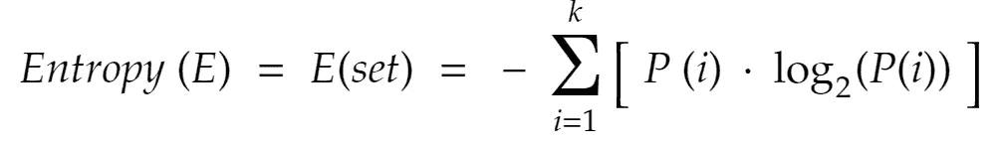
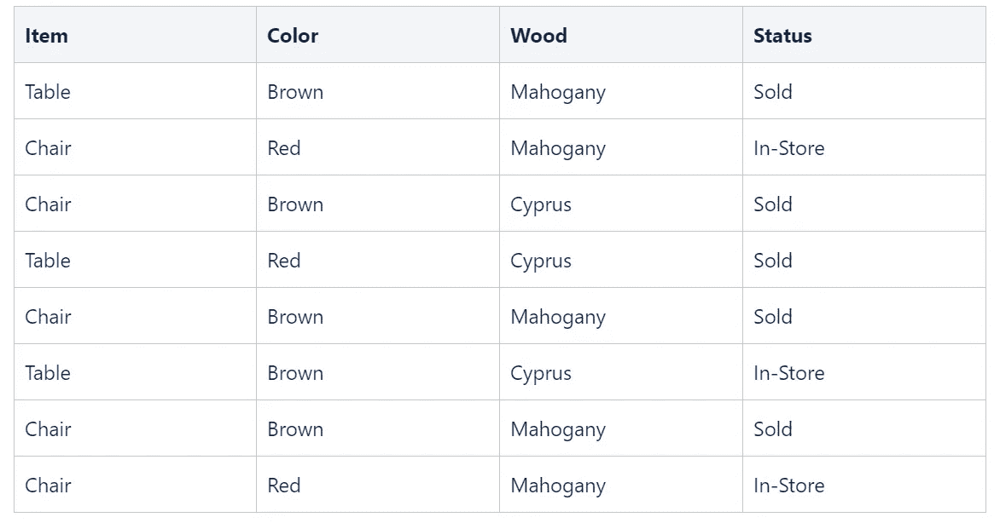
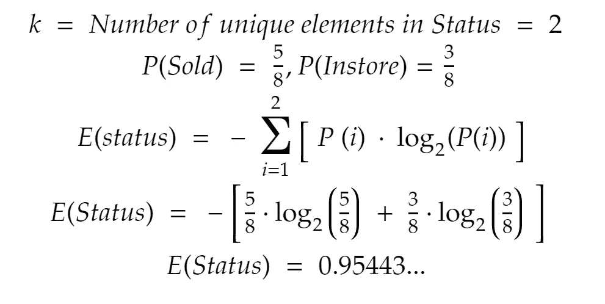
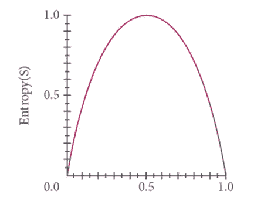
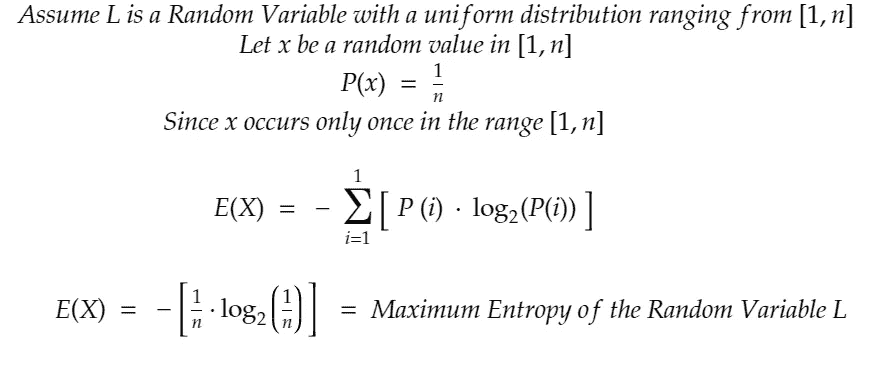
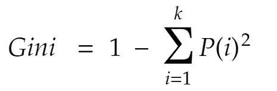

# 决策树中的熵和基尼指数

> 原文：<https://medium.com/geekculture/entropy-and-gini-index-in-decision-trees-cb99ba5d7dcc?source=collection_archive---------9----------------------->

机器学习中的决策树显示了模型用来将数据集分解为越来越小的数据子集，最终产生预测的逐步过程。决策树在监督学习下进行分类，可用于分类和回归问题。与其他监督学习模型一样，预测是基于一组特征变量和一个预定阈值进行的，当涉及决策树时，可以使用多个阈值，但是在本文中，我们将重点关注**熵**和**基尼指数。**

**熵**

如上所述，熵是一种用于将决策树划分为更小子集的方法，通过划分树，它充当树节点的阈值。熵是对一组数据的杂质的度量，或者我们可以认为这是对一个群体的无序或不确定性的度量。

The formula used to determine entropy

直觉上，熵是某个值出现的概率乘以该概率以 2 为底的对数的总和。由于概率落在 0-1 的范围内，所以总和值将总是负的，因此需要乘以-1。

让我们用一个**例子**来更好地理解这一点:假设我们有来自一家家具店的关于某些产品及其销售情况的数据

Furniture Store Data

求状态变量的熵:让我们给状态变量分配虚拟变量——销售(1)和店内(0)。

正如对状态特征的预期，我们具有高熵，这意味着高水平的不确定性。如果要增加售出商品的数量，并将店内状态商品的数量减少到 1，那么我们就降低了不确定性水平，从而提高了纯度水平。

当一组数据中的独特值被相等或几乎相等地划分时，该组数据的杂质达到最高水平。这可以想象如下:

Relationship of Entropy and Probability

如果一组数据具有均匀分布，则所有值将具有相同的出现概率，因此，对于均匀分布中的每个值，熵总是最大化。

The entropy of a Uniform Random Variable

**基尼指数**

基尼系数与熵略有不同，尽管它们的功能相同。基尼指数是一个变量被随机选择后不能被正确分类的概率。

The formula for Gini Index Calculation

基尼指数倾向于偏好较大的分区，因此可能是计算密集型的。

一般来说，基尼系数和熵在相同数据上的表现差别不大，因此使用什么由数据分析师/科学家决定。

在以后的文章中，我希望展示使用 python 库实现上述内容。

图来源:[https://S3-AP-southeast-1 . Amazon AWS . com/he-public-data/entropydfcb 350 . jpg](https://s3-ap-southeast-1.amazonaws.com/he-public-data/Entropydfcb350.jpg)，[https://study online . UNSW . edu . au/sites/default/files/styles/blog feature _ large/public/field/image/Decision % 20 tree _ 1 . jpg？itok=8HOGgFfc](https://studyonline.unsw.edu.au/sites/default/files/styles/blogfeature_large/public/field/image/Decision%20Tree_1.jpg?itok=8HOGgFfc)