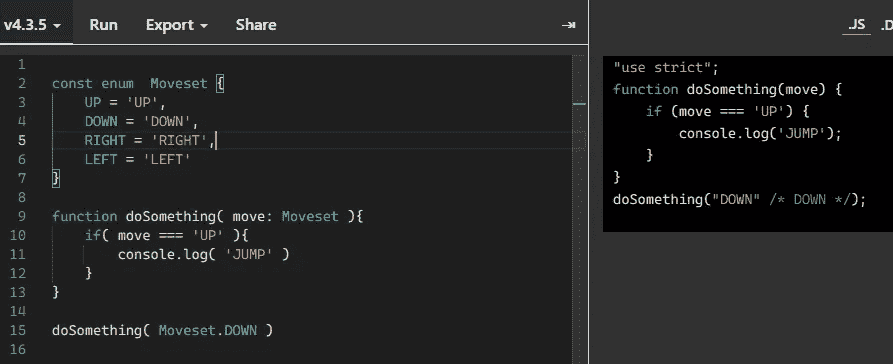
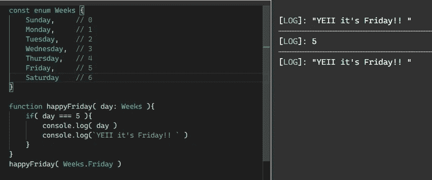
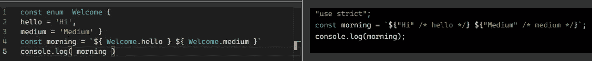
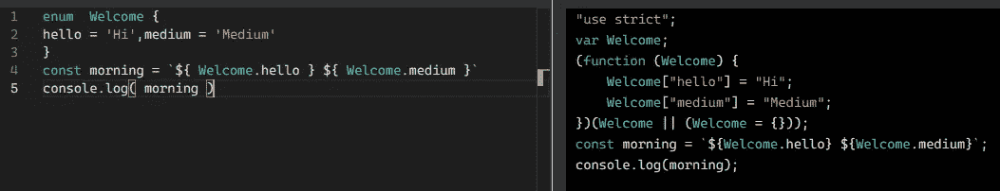

# 枚举和类型脚本中的小差异

> 原文：<https://medium.com/geekculture/enums-and-a-small-difference-in-typescript-2f702d89c8aa?source=collection_archive---------41----------------------->


这不会影响 TypeScript，但会影响编译的 JavaScript

# 什么是枚举

枚举是一组命名的常量，它有助于使其更加清晰和一致。

例如，我们需要制作一个视频游戏，游戏中的角色需要四个动作，比如上、下、右、左，这就是为什么我们需要枚举，但是我们可以使用常量变量？是的，但是让我们看看这个例子:

```
const enum  Moveset {
UP = 'UP',
DOWN = 'DOWN',
RIGHT = 'RIGHT',
LEFT = 'LEFT'}function doSomething( move: Moveset ){
if( move === 'UP' ){
  console.log( 'JUMP' )
 }
}
doSomething( Moveset.DOWN )
```

如果你看到，当我们创建一个名为 doSomething 的函数时，我们显式地使参数 move 只接受 MoveSet enum，我们不能使用任何其他变量，如“UP ”,因为它会抛出一个错误，它看起来非常干净，这就是为什么 enum 对使您的代码可读很重要。



Example Enums TypeScript

# 另一个例子

枚举总是从 0 开始，以此类推，我们来看例子:

```
const enum Weeks {
Sunday,     // 0
Monday,     // 1
Tuesday,    // 2
Wednesday,  // 3
Thursday,   // 4
Friday,     // 5
Saturday    // 6 }function happyFriday( day: Weeks ){
if( day === 5 ){
console.log( day )
console.log(`YEII it's Friday!! ` )
}
}happyFriday( Weeks.Friday )
```



Example enums without explicit variable

Weeks 的变量是用 0 到 6 来创建的，这很好，因为如果我们只需要使用 Weeks，我们就只能使用带有自己数字的枚举，这一看就很清楚。

# 常量和无常量的区别

如果你用 const 写枚举，它将编译更少的代码，并且对编译的 JavaScript 更清晰。

```
const enum  welcome {
hello = 'Hi',
medium = 'Medium' }const morning = `${ welcome.hello } ${ welcome.medium }`
console.log( morning )
```



Example enums with const

但是如果你只想使用不带 const 的 enum，它会用 enum 的所有变量创建一个自动调用函数，这看起来有点乱。

```
enum  Welcome {
hello = 'Hi',medium = 'Medium'
}
const morning = `${ Welcome.hello } ${ Welcome.medium }`
console.log( morning )
```



Example enum without const

# 有什么意义？

有时当我写代码时，我根本不注意我的代码，例如这可能是一个少于 100 行代码的小文件，它对页面来说很好，因为它不会太重，我们不在乎，但如果你有多个文件，超过 100 行代码，你需要使它更轻，更易读(在某些情况下)，这就是为什么你需要为你的项目选择最佳选项，**但** **记住这只影响编译后的**

# 来源

[](https://www.typescriptlang.org/docs/handbook/enums.html) [## 手册-列举

### 枚举是 TypeScript 具有的为数不多的特性之一，它不是 JavaScript 的类型级扩展。枚举允许一个…

www.typescriptlang.org](https://www.typescriptlang.org/docs/handbook/enums.html) 

【https://www.typescriptlang.org/ 