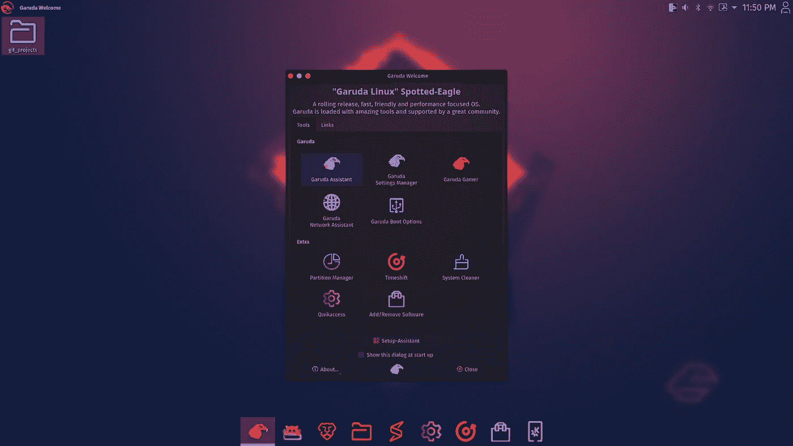
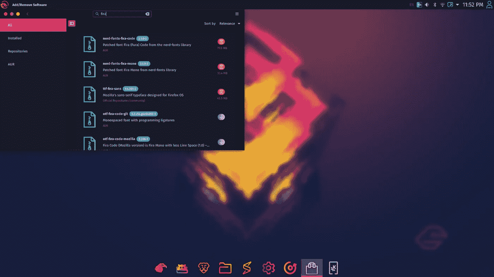
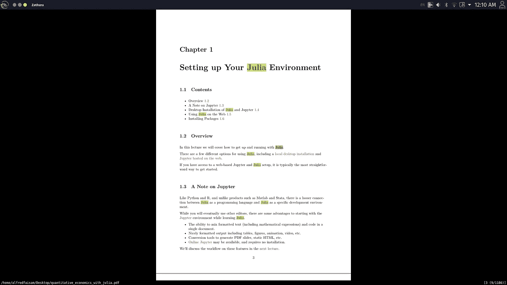

# 哥鲁达 Linux 下数据科学家的环境设置

> 原文：<https://medium.com/geekculture/environment-setups-for-data-scientists-under-garuda-linux-ed6492a2a1ab?source=collection_archive---------13----------------------->

(崇高文本的设置计划被推迟，因为 ST4 最近才推出。事实上，我只是在它开放下载时尝试了一下。然而，关键插件 LSP 将在不久的将来大幅升级，所以也许我可以等待它，并检查出来。前几天，我也在这里提出了讨论[，有兴趣的观众也可以查看一下。另一方面，可以在](https://github.com/sublimelsp/LSP/issues/1676#issuecomment-856503444)这里找到[的初步设置文件。)](https://github.com/AlfredSAM/medium_blogs/tree/main/Sublime-Text-4_Setups_for_Data%20Science)

在这篇文章中，将介绍[哥鲁达 Linux](https://garudalinux.org/) 下的数据科学家的环境设置。第一个谈论 Linux 中的设置的原因是许多数据科学家喜欢 Linux 中的用户体验，我只是希望将我的经验从 MacOS 扩展到 Linux，以与大家分享。其次，我只是对相关的帖子或视频着迷(例如[介绍哥鲁达 Linux 社区发行版挑战赛！](/linuxforeveryone/introducing-the-garuda-linux-community-distro-challenge-af565020cc96)；[我的哥鲁达 Linux 扭捏](https://levelup.gitconnected.com/my-garuda-linux-tweaks-eb8eeecc6e26)；[哥鲁达 Linux 上一款 2013 年 15 寸 MBP](/codex/garuda-linux-on-a-2013-15-mbp-df47f162b961)；[哥鲁达 LINUX 是否值得日常使用？？？？](https://tgmp.medium.com/is-garuda-linux-is-worth-using-for-daily-usage-5d33608511d3)等。)关于它的颜色主题、图标、模块和布局的时尚设计。总的来说，我总是试图在日常编码体验中实现可用性、效率和美观之间的最佳平衡，而这样时尚的 Linux 系统恰恰深深吸引了我的注意力。另一方面，Linux 系统的可用性和效率从来没有让我失望过，所以我决定试一试。主页和上面的帖子或视频只是介绍了安装系统的简单步骤，以及系统的简要技术方面。在这篇文章中，我主要关注数据科学家的观点。

我在 Linux 上的一段经历也可以分享到这里。第一次刚装 Linux 是我博士三年级阶段。即使我在商学院，数据科学的发展也激发我探索如何利用计算技术来测试经济学或营销理论得出的假设。另一方面，我正在上一门关于经验建模的课程，讲师刚刚分享了她在美国读博士时的早期编码经验。这是一个令人印象深刻的故事，她的导师分享了经验模型中使用的算法的完整代码笔记，并试图向她详细解释这些代码。我被这样的善良和慷慨深深震撼，同时我也只是听到了 Fortran，一种计算的经典编程语言。刚刚查阅了网站上的资料，发现了很多关于 Fortran 在类 unix 系统中用法的资料。所以，我就试着在电脑里安装了 Ubuntu。对 Linux 的最初印象很好，尤其是当我习惯了关于包和文档管理的想法之后。但是，关于 Fortran 的体验有些苛刻。我喜欢数据科学中的编码，但是我发现 Fortran 的调试过程非常可怕。可惜我在 Rcpp 的后期也接触过 cpp。近年来，我主要使用 MacOS 进行办公和家庭使用。MacOS 也是类 unix 系统，在编程方面与 Linux 系统有相似的用户体验。当然，MacOS 中的编译似乎确实经常会带来意想不到的麻烦。例如，请查看我最近的另一个讨论[这里](https://github.com/dmlc/xgboost/issues/7017)。另一方面，日常工作经常需要 Microsoft Office 和其他潜在的软件，这些软件不容易被 Linux 中的其他软件所替代。然而，如果数据科学家不需要制作太多的 PPT，那么 Linux 总是一个不错的选择。


My current Desktop using Garuda Linux

基本系统信息在此分享。如[主页](https://garudalinux.org/)所示，哥鲁达 Linux 是基于 arch 的系统。在不同的桌面发行版中，我只选择了[哥鲁达 KDE dr 460 正版化](https://builds.garudalinux.org/iso/garuda/dr460nized/210507/garuda-dr460nized-linux-zen-210507.iso.torrent)。既然不建议在虚拟机上安装哥鲁达 Linux，我就找了一台放了 5 年左右的旧电脑来试用一下。硬件的基本信息如下:

```
CPU: Intel i7-6700HQ (8) @ 3.5GHz
GPU: NVIDIA GeForce GTX 1060 Mobile
Memory: 2.27GiB / 7.65 GiB
```

请查看这个博客的文件夹:[https://github . com/AlfredSAM/medium _ blogs/tree/main/Environment _ Setups _ Data _ Science _ 哥鲁达 _Linux](https://github.com/AlfredSAM/medium_blogs/tree/main/Environment_Setups_Data_Science_Garuda_Linux) ，里面的详细说明是[这里](https://github.com/AlfredSAM/medium_blogs/blob/main/Environment_Setups_Data_Science_Garuda_Linux/Instructions.md)。

# 安装后升级系统

安装后(使用可启动 USB)，只要重新启动，并进入哥鲁达 Linux 的第一次。哥鲁达助手应该出现，要求刷新相关包下载的`mirror-lists`。因此，系统将询问是否升级系统，并只需按“是”等待升级过程完成。在此过程中，要求用户输入密码来授权`sudo`。另一方面，对输入`y`的响应也是推进流程所必需的。在上述升级过程之后，系统还会建议安装软件。建议此时不要做这一步，先重启系统。因为哥鲁达 Linux 是基于 Arch 的系统，它将定期提供滚动更新。建议在安装其他软件之前运行以下程序:

```
sudo pacman -Syu
```

目前，`Add/Remove Software`因`pacman 6.0`变更不再发射。最快的解决方法是重新安装`libalpm`库:

```
sudo pacman -Syu libalpm12
```

请重启并检查一下:[https://forum.garudalinux.org/t/problem-with-updates/5288](https://forum.garudalinux.org/t/problem-with-updates/5288)。然而，`Add/Remove Software`的 GUI 并不重要，因为一般的 Linux 用户不应该关心终端的使用。



Garuda Welcome

# 勇敢浏览器的安装

Brave browser 是首选，因为它内置了阻止广告和跟踪器的功能，尽管 Firefox 已经默认安装。安装非常简单:

```
sudo pacman -S brave-bin
```

安装后，只需通过修改`~/.profile`将其设置为默认浏览器，它只记录启动会话时的环境变量:

```
export BROWSER=brave
```

请务必安装`brave-bin`而不是`brave`，因为可能会出现一些隐藏的错误。例如，我发现屏蔽功能对`brave`无效，但对`brave-bin`正常。也请查看讨论:[https://forum . garudalinux . org/t/brave-crashing-every-first-minutes/1975](https://forum.garudalinux.org/t/brave-crashing-every-few-minutes/1975)。


Brave Browser

# Kitty 的安装

Kitty 是推荐用于哥鲁达 Linux 和 MacOS 的终端仿真器。一般来说，数据科学依赖于编码和命令行工作，所以对优秀的终端仿真器的需求通常很大。也请查看其他人对 kitty 的评论:[Kitty——快速、功能丰富、基于 GPU 的 Linux 终端仿真器](https://www.youtube.com/watch?v=KUMkLhFeBrI)；Kitty 是一个快速且功能丰富的终端模拟器。在哥鲁达 Linux 中，似乎鼓励在 shell 命令中使用`konsole`。然而，在用`konsole`编码时，我发现了一些使用`neovim`时的延迟问题。另一方面，`alacritty`是一个快速的、跨平台的 OpenGL 终端模拟器，默认安装在哥鲁达。这似乎是比`konsole`更好的选择，但目前似乎不支持我很喜欢用来编码的连写:【https://github.com/alacritty/alacritty/issues/50】。所以，kitty 只是一个不错的选择。Kitty 也是一个快速的基于 GPU 的终端模拟器，嵌入了类似 tmux 的功能，如果设置了适当的字体，它可以很好地支持连字:

```
sudo pacman -S kitty
```

也请参考我的设置文件`kitty.conf`，它应该放在文件夹`~/.config/kitty/`中。我只是选择`FiraCode Nerd Font Mono`做结扎，可以用`Add/Remove Software`安装。


Kitty Emulator



Install FiraCode in Add/Remove Softwares

关于 kitty 在 MacOS 中的使用的一个备注是关于显示`nerd`字体的垂直错位问题，包括`FiraCode Nerd Font Mono`，仅适用于 MacOS。请检查一下 https://github.com/kovidgoyal/kitty/issues/2022，你会发现讨论一直持续到最近。这是我之前改回 iTerm2 的基本原因。然而，为了这篇文章，我在 MacOS 上试用了最新版本的 kitty，发现这个问题已经解决了。因此，我只是在 MacOS 中变回 kitty，并使用与您共享的相同的`kitty.conf`。

# 安装文件阅读器和图书馆办公室

一般的办公阅读编辑工具通常是生活和工作需要的，然后这里给出几点建议。最初，文档查看器只安装了`Okular`。不过推荐`qview`查看图片，推荐`Zathura`查看 pdf。`qview`是如此轻便和快速的图像浏览器，它可以很容易地安装在`Add/Remove Software`中。


就 pdf 阅读器而言，`zathura`是一个很好的选择，特别是对于 vim 用户，请查看:[https://wiki.archlinux.org/title/Zathura](https://wiki.archlinux.org/title/Zathura):

```
sudo pacman -S zathura
```

还有其他插件可以增强它的功能:[https://wiki.archlinux.org/title/Zathura](https://wiki.archlinux.org/title/Zathura)



如今，微软 Office 365 和谷歌都提供在线办公应用程序，如果他们工作的公司购买并允许这样的云服务，用户就可以随时利用它们进行文档编辑。同样，个人对它们的使用也取决于他或她的购买和对云的信任。否则，LibreOffice 似乎是另一种选择:

```
sudo pacman -S libreoffice
```

并选择稳定版 [libreoffice-still](https://archlinux.org/packages/?name=libreoffice-still) 。另一方面，`tex`对数学写作总是有帮助的，所以也安装了以下插件:

```
sudo pacman -S libreoffice-extension-texmaths
```

当然，LibreOffice 与其他流行办公工具的兼容性问题始终存在。如今，`WSL2`已经得到了实质性的改进，用户可以回到 windows 来利用 Linux 内核的好处和 Microsoft Office 的优势。

# 自制设备

为了从 MacOS 中复制经验，我还探索了 Linux 中的`Homebrew`。Linux 仍处于初级阶段，似乎可以顺利安装的软件数量有限。关于安装的棘手之处在于，关于`Homebrew`的指令主要基于`bash/zsh`，但哥鲁达 Linux 默认使用`fish`。 [Fish vs. Zsh vs. Bash 所表明的优点以及你为什么要换成 Fish](https://betterprogramming.pub/fish-vs-zsh-vs-bash-reasons-why-you-need-to-switch-to-fish-4e63a66687eb) 就让我试试`fish`吧。然而，需要对代码进行一些小的修改，以符合`fish`的语法。一般来说，`fish`的配置文件在`/home/.config/fish/config.fish`里。可以使用哥鲁达 Linux 的默认编辑器 [micro](https://micro-editor.github.io/) 来打开这样的配置文件。注意到`source ~/.profile`在文件中，这意味着该文件自动从`~/.profile`加载设置。在[自制软件](https://brew.sh/)的主页上，建议的安装命令是

```
/bin/bash -c "$(curl -fsSL [https://raw.githubusercontent.com/Homebrew/install/HEAD/install.sh](https://raw.githubusercontent.com/Homebrew/install/HEAD/install.sh))"
```

但是，该命令在`fish`中无效。修订后的代码是

```
bash
ruby -e "$(curl -fsSL https://raw.githubusercontent.com/Homebrew/install/master/install)"
exit
```

由[提出无法安装家酿+鱼终端(Mac)](https://stackoverflow.com/questions/34010513/unable-to-install-homebrew-fish-terminal-mac) 。暂时进入`bash`执行安装命令，然后返回`fish`。安装完成后，每次打开`fish`时，需要执行以下步骤让`brew`初始化:

```
echo 'eval (/home/linuxbrew/.linuxbrew/bin/brew shellenv)' >> /home/alfredfaisam/.profile
```

受到 https://github.com/Homebrew/brew/issues/10114 的启发。另一方面，`Homebrew`似乎会在`/tmp`中创建临时文件，这可能会返回关于权限的错误。因此，可以在`~/.profile`中添加以下行:

```
echo 'export HOMEBREW_TEMP=/var/tmp' >> /home/alfredfaisam/.profile
```

受到 https://github.com/Linuxbrew/brew/issues/923 的启发。现在我们可以关闭然后重新打开 kitty，然后输入

```
brew update
```

如果该过程可以无错误地完成，则`Homebrew`安装成功。现在可以安装其他相关包来支持`Homebrew`的功能:

```
sudo pacman -S base-devel
```

`base-devel`是一个包组，包括构建(编译和链接)所需的工具。也建议安装最新版本的`gcc`:

```
brew install gcc
```

到目前为止，用户可以像在 MacOS 中一样使用`Homebrew`。老实说，目前`Homebrew`似乎大部分时间都针对 Mac 用户，对 Linux 用户的支持有限。比如有些软件存在编译错误，比如 [Julia](https://formulae.brew.sh/formula/julia) 。现在，我只是用`Homebrew`装上`[Neovim](https://formulae.brew.sh/formula/neovim)`和`[Transmission](https://formulae.brew.sh/cask/transmission)`，看起来还能用。关于`[Transmission](https://formulae.brew.sh/cask/transmission)`的用法，还可以查看【https://cli-ck.io/transmission-cli-user-guide/】的。

# 安装 Neovim

使用`homebrew`安装`neovim`很简单。也可以参考我上一篇关于使用`neovim`作为数据科学家 IDE 的体验的帖子:[https://alfredfaisam . medium . com/neo vim-setups-for-data-science-5ea 251 e 3735 f](https://alfredfaisam.medium.com/neovim-setups-for-data-science-5ea251e3735f)。现在只需用`brew`安装`Neovim`:

```
brew install --HEAD luajit
brew install --HEAD neovim
```

然后安装`vim-plug`进行`neovim`的插件管理:

```
sh -c 'curl -fLo "${XDG_DATA_HOME:-$HOME/.local/share}"/nvim/site/autoload/plug.vim --create-dirs \
     [https://raw.githubusercontent.com/junegunn/vim-plug/master/plug.vim'](https://raw.githubusercontent.com/junegunn/vim-plug/master/plug.vim')
```

把目录改成`~/.config`，只需从[https://github . com/AlfredSAM/medium _ blogs/tree/main/neo vim _ Setups _ for _ Data _ Science/nvim](https://github.com/AlfredSAM/medium_blogs/tree/main/Neovim_Setups_for_Data_Science/nvim)中复制我对`Neovim`的建议配置文件夹即可。在 kitty 中，第一次输入`nvim`打开它，然后你可能会看到一些由于缺少插件而导致的错误。因此，人们可以只输入

```
:PlugInstall
```

等待安装完成。因此使用`:q!`退出然后重新打开`nvim`，可以发现`treesit`的最新文件将被下载并编译，信息显示在`nvim`窗口的左下方。就等它完成了，现在`nvim`已经可以用了。正如本文开头所指出的，ST4 刚刚推出，重要的插件`LSP`似乎在不久的将来会有实质性的升级，所以详细的说明将在后面分享。不过也可以参考[https://github . com/AlfredSAM/medium _ blogs/blob/main/Environment _ Setups _ Data _ Science _ 哥鲁达 _Linux/Instructions.md](https://github.com/AlfredSAM/medium_blogs/blob/main/Environment_Setups_Data_Science_Garuda_Linux/Instructions.md) 了解 ST4 在哥鲁达 Linux 的安装。除此之外，关于 ST4 的插件的提示现在仍然可用:[https://github . com/AlfredSAM/medium _ blogs/blob/main/Sublime-Text-4 _ Setups _ for _ Data % 20 science/Sublime % 20 backups . txt](https://github.com/AlfredSAM/medium_blogs/blob/main/Sublime-Text-4_Setups_for_Data%20Science/Sublime%20Backups.txt)。

# 迷你康达装置

`conda`建议为数据科学设置 Python 或 R 环境。看起来以上只是对哥鲁达基本用法的建议，这里是关于数据科学设置的真正提示。一般来说，`conda`被视为 Python 用户的包管理工具，就像`pip`一样。然而，`conda`也是 Python 和 R 用户管理环境的首选。对于典型的数据科学家来说，几个项目通常是共存的，在这些项目中也可能应用多种语言。很容易想象，不同的项目可能依赖于不同的包集，即使是同一种语言。因此，对**隔离**环境的要求至关重要。我说的**隔离的**环境是指

*   一个环境中软件包设置的改变不会影响其他环境。
*   一个环境中的 Python 与另一个环境中的 Python 无关。这同样适用于 r。
*   如果一些错误发生，使一个环境变得混乱，那么总是可用的解决方案就是完全移除那个环境。

您也可以查看[https://conda . io/projects/conda/en/latest/user-guide/tasks/manage-environments . html # managing-environments](https://conda.io/projects/conda/en/latest/user-guide/tasks/manage-environments.html#managing-environments)了解更多关于如何使用`conda`管理环境的详细信息。另一方面，我的队友 Peter LO，也是数据科学方面的专家，最近在探索 [Guix 功能包管理器](https://en.wikisource.org/wiki/Functional_Package_Management_with_Guix)，也分享了他对于数据科学家如何应用的经验:[https://peterlolengyau . github . io/post/Guix _ intro _ 1 _ motivation/](https://peterloleungyau.github.io/post/guix_intro_1_motivation/)。我相信这些管理思想和理念是伟大而有价值的，将来其他工具也可以参考。这里我只讨论`conda`，它对于跨平台用户来说应该是简单的东西。在哥鲁达 Linux，只要用 kitty 转到`~/Downloads`，然后下载安装包:

```
wget https://repo.anaconda.com/miniconda/Miniconda3-latest-Linux-x86_64.sh
```

然后安装它:

```
bash Miniconda3-latest-Linux-x86_64.sh
```

请注意，在安装结束时，程序会询问是否添加`init`命令。然而，即使为这个提示输入了`yes`,当重新打开这个小程序时，仍然可以发现`conda`没有被加载。原因是默认情况下`init`命令只添加到`bash`中。现在可以检查`~/.bachrc`，应该会发现关于`conda init`的附加行被添加到这个文件的末尾。但是，哥鲁达 Linux 默认使用`fish`，所以上述命令无效。人们可以输入

```
/(your conda installation path)/bin/conda init fish
```

然后可以发现下面几行被添加到`~/.config/fish/config.fish`:

```
#>>> conda initialize >>>
# !! Contents within this block are managed by 'conda init' !!
eval your/path/to/anaconda3/bin/conda "shell.fish" "hook" $argv | source
# <<< conda initialize <<<
```

现在重新打开 kitty 然后输入

```
conda update conda
```

人们可以发现程序可以正常运行。人们也可以使用

```
/(your conda installation path)/bin/conda init zsh
```

向`~/.zshrc`添加`conda init`命令，因为必要时我们也可以使用`zsh`。

# 为 Python 和 R 设置 Conda 环境

为 Python 用户构建单独的环境是很自然的:[https://conda . io/projects/conda/en/latest/user-guide/tasks/manage-environments . html](https://conda.io/projects/conda/en/latest/user-guide/tasks/manage-environments.html)。另一方面，`(base)`环境通常保持清洁，以确保问题只影响其他新建环境。所以去掉其他环境永远是解决问题重新做的直接选项。只需参考[网站](https://conda.io/projects/conda/en/latest/user-guide/tasks/manage-environments.html)中关于构建 Python 新环境的流程，然后**激活**新环境进行后续设置。使用 Python 计算效率的相关问题需要为`numpy`提供优化的 BLAS 框架，而`mkl`是理想的选择。因此，只需激活新的 Python 环境，然后使用以下命令安装`numpy`，并将`mkl`作为依赖项:

```
conda install -c conda-forge numpy libblas=3.9.0=9_mkl
```

其他依赖于`numpy`的包也应该在矩阵计算方面进行优化，比如 PyTorch。为了让 Python 的 LSP 正常工作，还推荐使用以下插件:

```
pip install 'python-lsp-server[all]' python-lsp-black mypy-ls pyls-isort
```

另一方面，单独的 R 环境也是可用的。例如，可以使用下面的`R_4_mkl.yml`来构建新环境:

```
name: R_4.0_mkl
channels:
  - conda-forge
  - defaults
dependencies:
  - python=3.8
  - conda-forge::r-base=4.1.0
  - conda-forge::libblas=3.9.0=9_mkl
```

它将使用名为 R_4.0_mkl 的 R 4.1 构建环境。你可能会注意到，3.8 版本的 Python 解释器也是为这个环境默认安装的，所以除了 R 之外，你还可以在这个环境中为 Python 包提供设置。你还可以发现，这个 yml 只需要依赖 R 中的矩阵计算就可以使用`mkl`。这也是在 conda 环境下使用 R 的另一个好处。有时，链接到`BLAS/LAPACK`的`mkl`是如此的棘手和不灵活。然而，在`conda`的帮助下，这项工作变得非常容易。同样的，设置完成后还需要激活环境，然后安装`install.packages("languageserver")`进行 R 的 LSP，当然`conda`也提供了一堆 R 包进行安装:[https://docs . anaconda . com/anaconda/user-guide/tasks/using-R-language/](https://docs.anaconda.com/anaconda/user-guide/tasks/using-r-language/)。这样做的主要好处是 R 包的树将被记录下来，并很容易导出为`yml`文件，供合作者复制。然而，似乎在 R 中使用`install.packages()`的编译对于优化性能是必需的，特别是对于 MacOS。例如，请查看我提出的关于在 MacOS 中安装`xgboost`的讨论:[https://github.com/dmlc/xgboost/issues/7017](https://github.com/dmlc/xgboost/issues/7017)。

# 朱莉娅的装置

这里举例说明了在哥鲁达 Linux 上安装 Julia 的过程。在 MacOS 中，我只是用`Homebrew`通过`brew install --cask julia`安装 Julia。然而，在哥鲁达 Linux 中使用`Homebrew`安装 Julia 的尝试失败了，并且编译和 cmake 文件存在一些错误。因此，只需手动进行安装:

```
mkdir ~/opt
cd ~/opt
wget https://julialang-s3.julialang.org/bin/linux/x64/1.6/julia-1.6.1-linux-x86_64.tar.gz
tar -xvf julia-1.6.1-linux-x86_64.tar.gz
```

运行`julia`:

```
~/opt/julia-1.6.1/bin/julia
```

此外，可以将以下内容添加到`$PATH`

```
echo 'export PATH="$HOME/opt/julia-1.6.1/bin:$HOME/.local/bin:$PATH"' >> ~/.profile
```

这样只有输入`julia`才能运行程序。目前，`conda`没有提供更新的 julia 应用程序来帮助 julia 构建隔离环境。另一方面，julia 对于不同的项目有自己的`env`设置，请查看 https://towards data science . com/how-to-setup-project-environments-in-Julia-EC 8 AE 73 AFE 9 c。一般来说，julia 可以在单独的环境中创建文件夹。来自不同 julia 环境的包基本上不会交互，所以关于**隔离**的要求也可以得到满足。对于**不同的**项目，也建议安装 julia 的`LSP`包。在 julia 控制台中，只需输入

```
using Pkg
Pkg.add("LanguageServer")
```

# 摘要

在本帖中，从数据科学家的角度与你分享哥鲁达 Linux 的基本设置。在当前繁荣的开源工具的巨大帮助下，数据科学家可以过上比以前轻松得多的生活。还有一个关于`nvim`与上述环境配置一起使用的问题可以在这里说明。如果有人想为某个项目或文件夹使用某个`conda`环境。只需使用`conda activate <env_name>`激活目标环境，然后输入`nvim`。因此，`nvim`可以在这样的`conda`环境下自动读取关于 Python 或 R 的`LSP`设置。对于 julia 来说，这是非常相似的，不需要担心使用的是哪个`conda`环境，因为 julia 是全球安装的。因此，只需进入带有特定 julia 环境安装文件的目标文件夹，如`Manifest.toml`和`Project.toml`，然后输入`nvim`。现在`nvim`也可以读取特定 julia 环境的`LSP`设置，如果已经为这样的 julia 环境或项目安装了 julia `LanguageServer`。