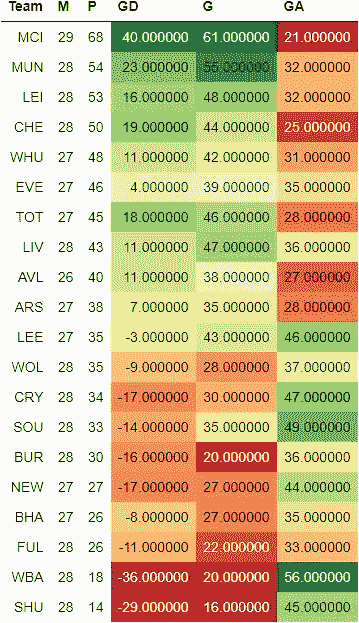
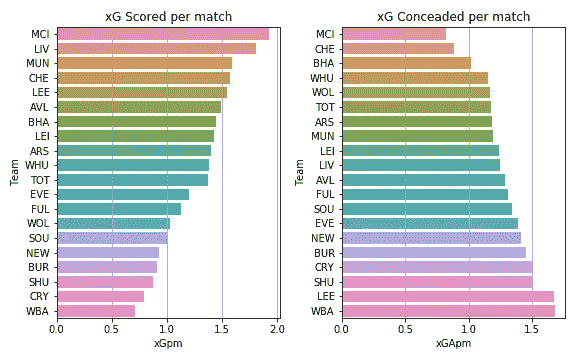
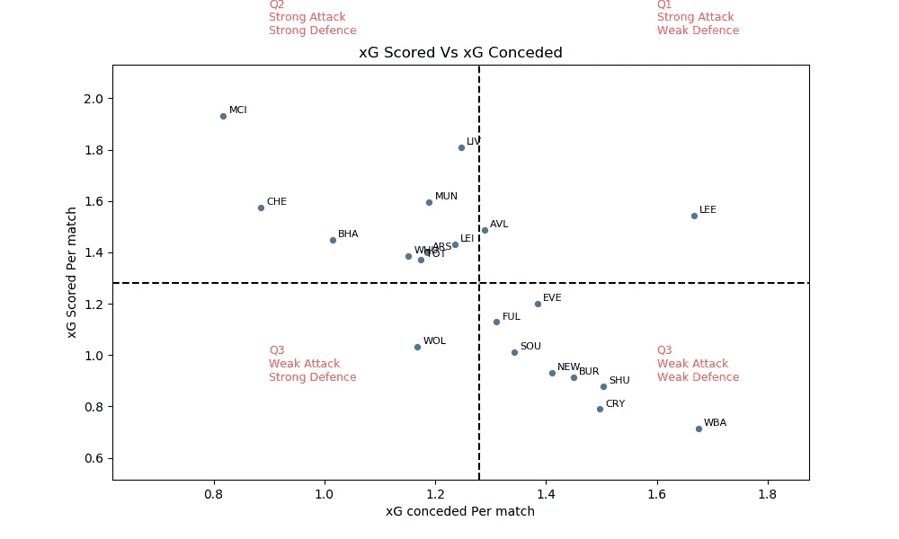
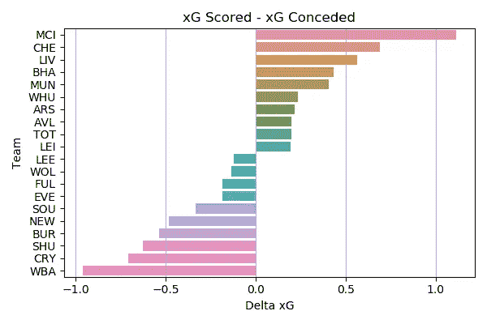
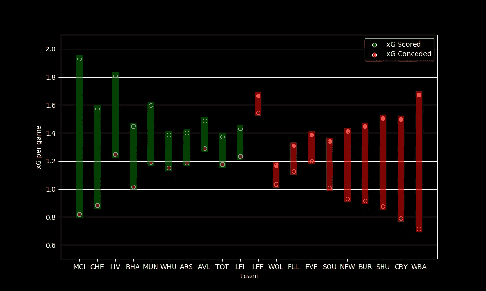
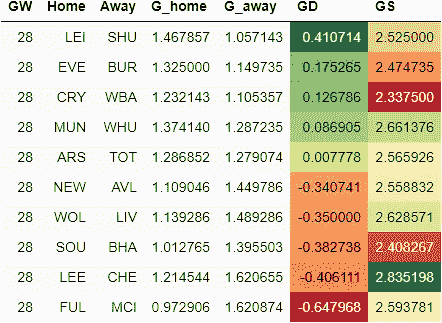
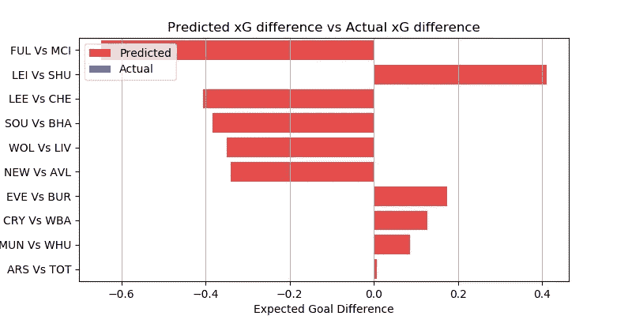
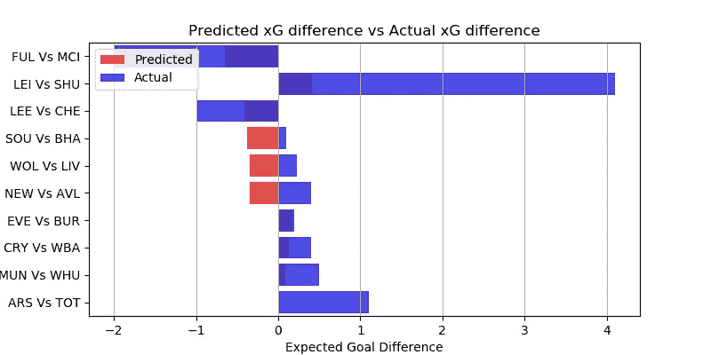

# EPL 分析和 GW 28 预测

> 原文：<https://medium.com/geekculture/epl-analysis-and-gw-28-prediction-7705e5cab624?source=collection_archive---------38----------------------->

## 使用 xG 统计数据预测英超联赛结果的数据驱动尝试

这是我的 EPL 预测系列的一篇文章。你可以看看对第 27 周比赛的预测，以及它与实际表现的对比。

[预期目标或 xG](/@abhijithchandradas/xg-xplained-27b1dbafa943) 是用于预测的参数。如果你对理解预测算法感兴趣，我推荐你去看看[这篇文章，里面有详细的解释](https://towardsdatascience.com/epl-2020-21-season-analysis-and-prediction-5502e20dce26)。

# 截至第 27 周比赛的分析

英超目前看起来很有意思。正如克洛普所说，看起来曼城正在与冠军赛跑。然而，争夺前四名的竞争非常激烈。第二名和第七名只差 9 分。仅仅两个比赛周之后，我们可能会有一个完全不同的四强。

EPL Table (Image by Author)

游戏周 28 暴露了曼城装甲的裂缝。曼联和索顿在对曼城的比赛中各进 2 球。在联赛中排名第二的红魔队在曼彻斯特德比中击败了同城对手。然而，在第 28 轮比赛后，曼城以 14 分的优势领先同城对手。佩普瓜迪奥拉的球队已经在联赛中一手遮天。然而，剩下的 3 个冠军联赛席位的争夺仍在进行中。莱斯特排名第三，仅落后红魔一分。在图切尔的带领下切尔西保持不败，以 50 分排名第四。铁锤帮，马刺队和埃弗顿队也瞄准了前 4 名，他们只打了 27 场比赛，分别积 48，46 和 45 分。卫冕冠军在安菲尔德继续他们的连败，他们输给了与富勒姆的保级之战，没有得分。

xG Scored vs xG Conceded (Image by Author)

经过 27 个游戏周，曼城统治了进攻和防守，因为它有最高的 xG 得分和最低的 xG 失球率。尽管最近几场比赛的进攻表现不佳，但红军仍然位居第二。在进球数上领先的曼联在 xG 得分上排名第三。利兹和切尔西也创造了场均 1.5xG 以上。

在创造力上苦苦挣扎的水晶宫、伯恩利、纽卡斯尔、谢联、西布朗，场均 xG 得分都在联盟垫底。

尽管在上周的两场比赛中丢了 4 个球，曼城似乎是最好的防守单位。切尔西是另一支每场比赛失球少于 1 次的球队。图切尔上任后，切尔西在 9 场比赛中仅丢 2 球。正在为保级而战的陶工队不太可能是 xG 承认的第三好防守方。

大多数球队每场比赛承认 1 到 1.5 xG。西布朗和利兹的场均失球超过 1.5 克。

xG Scored vs xG Conceded (Image by Author)

根据 xG 得分和 xG 失球，球队可以分为 4 个象限，如上图所示。
水平虚线表示每场比赛的平均 xG 得分。水平虚线上方的球队是强攻方，下方的球队是弱攻方。
垂直虚线表示每场比赛的平均失球数。左边的队伍防守强，右边的队伍防守弱。

Delta xG (Image by Author)

曼城在 delta xG 方面遥遥领先于其他球队，xG 得分和 xG 失球之间的差距超过 1。利物浦和切尔西是仅有的另外两支 delta xG 高于 0.5 的球队。另一方面，西布朗在球场的两端苦苦挣扎，进攻最弱，防守漏洞百出。水晶宫、谢联、伯恩利在达美 xG 下排名也很靠后。

xG scored and conceded per game

利兹联队在每场比赛创造的 xG 中名列前茅。然而，球队的 delta xG 是负的，因为对手发现很容易穿透利兹的防守，这是贝尔萨必须立即研究的问题。另一方面，狼队是一支防守很好的球队，但由于劳尔·吉米内兹的受伤，他们缺乏攻击力。

布莱顿按照 delta-xG 排名表排在第 4 位，然而他们在排名表中排在第 17 位，因为他们缺乏高质量的前锋。

# 游戏第 28 周预测

在进行预测之前，让我澄清一下，这是一个非常简单的算法，只是基于过去的 xG，所以只能预期基线性能。该算法也不能预测高得分游戏。该模型也没有考虑球队的选择，球员因受伤/停赛而缺席，阵型，战术变化等。

然而，该模型在预测比赛的势头方面表现得相当好。你可以在下面看看实际表现如何与前一周的预测相比较。

 [## EPL 分析和 GW 25 预测

### 使用 xG 统计预测英超联赛结果的数据驱动尝试

abhijithchandradas.medium.com](https://abhijithchandradas.medium.com/epl-analysis-and-gw-25-prediction-1b0946e5ca04) 

下表提供了对第 28 周比赛的预测。
GD 的绝对值显示了比赛的竞争力。该值越高，预计匹配越偏向一侧，预测的准确性也越高。
GD 值越低，这场比赛就越有可能成为任何人的游戏。GD 的正值表示主场胜，负值表示客场胜。

GW 28 Predictions(Image by Author)

这个游戏周似乎有利于客场球队，除了狐狸在国王电力体育场迎战刀片。曼城 vs 富勒姆预计是比赛周最一边倒的比赛，曼城有望轻松拿到三分。本周末，切尔西、布莱顿、利物浦和维拉也有望轻松赢得客场比赛。

北伦敦德比是比赛周最受期待的比赛，也是周末最激烈的比赛。算法稍微偏向于主机，炮手。然而，考虑到穆里尼奥的队伍目前的状态，枪手拿到 3 分看起来不太可能。

GW 28 predicted delta xG (Image by Author)

红魔将在老特拉福德迎战铁锤帮。该算法预测了一场竞争激烈的比赛，稍稍有利于 Ole 的男人。
太妃糖队和老鹰队预计会受到客队的强烈抵制，但预计本周也会在主场胜过对手。

# 预测与实际结果

Predicted vs actual delta xG(Image by author)

该算法准确预测了 10 个结果中的 7 个，准确率为 70%。有三个结果的预期 delta xG 超过 0.4。该算法能够正确预测他们三个。
北伦敦德比被认为是一场势均力敌的比赛，阿森纳队略胜一筹。然而，xG 的数据表明枪手是场上更好的球队，应该得到三分。

该算法预测布莱顿、利物浦和维拉队将在客场表现优于东道主。前两人赢得了三分，而后者在最后一分钟被逼平。xG 统计显示东道主在场上表现更好。

Photo by [Tim Bechervaise](https://unsplash.com/@timmybech?utm_source=medium&utm_medium=referral) on [Unsplash](https://unsplash.com?utm_source=medium&utm_medium=referral)