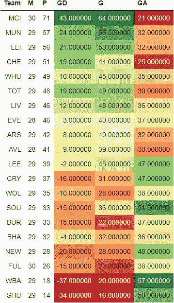
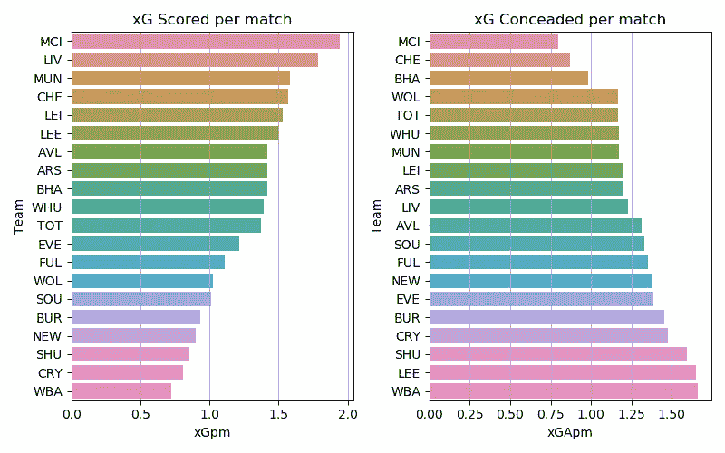
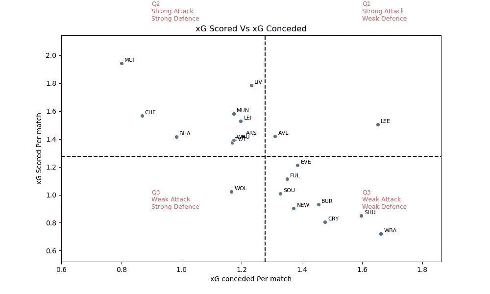
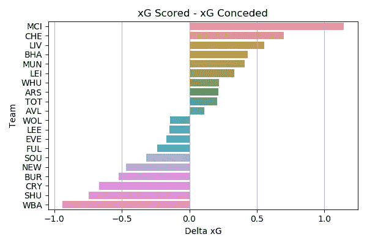
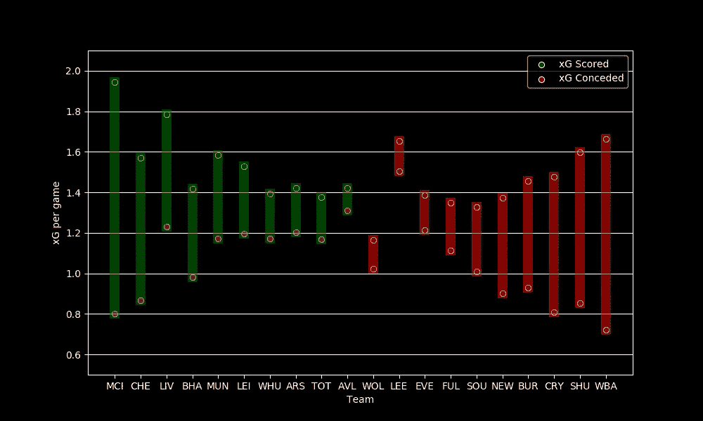
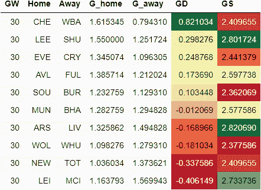
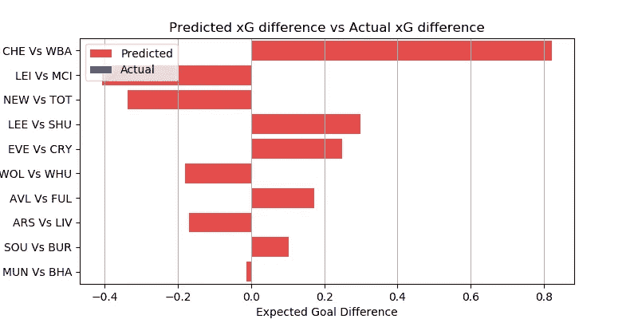

# EPL 分析与 GW 30 预测

> 原文：<https://medium.com/geekculture/epl-analysis-and-gw-30-prediction-1bdced71094b?source=collection_archive---------14----------------------->

## 使用 xG 统计数据预测英超联赛结果的数据驱动尝试

这是我的 EPL 预测系列的一篇文章。你可以看看对第 29 周比赛的预测，以及它与实际表现的对比。

[预期目标或 xG](/@abhijithchandradas/xg-xplained-27b1dbafa943) 是用于预测的参数。如果你对理解预测算法感兴趣，我推荐你去看看[这篇文章，里面有详细的解释](https://towardsdatascience.com/epl-2020-21-season-analysis-and-prediction-5502e20dce26)。

 [## xG 解释！

### 如果你关注足球，你不可能从未遇到过“预期目标”(缩写为 xG)这个术语。xG…

abhijithchandradas.medium.com](https://abhijithchandradas.medium.com/xg-xplained-27b1dbafa943) 

# 截至第 29 周比赛的分析

EPL Table after GW29 (Image by Author)

比赛周 29，只有 4 场比赛，12 支球队没有比赛。所有排名前四的球队在比赛周都是空白，然而，在 GW29 之后，前四名的位置保持不变。

在第 29 轮比赛后，曼城以 71 分高居榜首，比同城对手高出 14 分。曼联以 57 分位居第二。莱斯特城紧随红魔之后，仅落后一分。切尔西以 51 分排名第四。
在 GW 29 打过的铁锤和马刺在 5 号位和 6 号位。

铁锤帮与同城死敌枪手打成平局。热刺在维拉公园的比赛中获得了三分。卫冕冠军滑落至第 7 位，以净胜球优势领先太妃糖。排在第 9 和第 10 位的阿森纳和维拉完成了上半部分。

分别积 14 分和 18 分的刀锋队和麻雀队是垫底的两支队伍。富勒姆有机会通过战胜孔雀队摆脱降级区。然而，在一场非常有趣的比赛后，斯科特·帕克的球队被贝尔萨的球队 1-2 击败。

海鸥队确保了他们在联赛中的连续第二场胜利，现在已经领先降级区 6 分。输给海鸥队的喜鹊队处境非常困难，离降级区仅差 3 分。

xG scored and conceded per game (Image by Author)

在 29 个比赛周之后，曼城统治了进攻和防守，因为它拥有最高的 xG 得分和最低的 xG 失球率。尽管最近几场比赛的进攻表现不佳，但红军仍然位居第二。紧随其后的是其他四支场均得分超过 1.5 xG 的球队。高度不可预测的利兹队是 xG 得分排名第六的球队。

在创造力上苦苦挣扎的水晶宫、伯恩利、纽卡斯尔、谢联、西布朗，场均 xG 得分在联盟垫底，连 1 个 xG 都出不了。

曼城场均失球约 0.75 xG，尽管在最近的比赛中丢了几个球，但似乎是最好的防守单位。看似坚不可摧的图切尔切尔西队以微弱优势位居第二。海鸥是另一支每场比赛失球少于 1 xG 的球队。

大多数球队每场比赛承认 1 到 1.5 xG。西布朗、谢菲尔德联队和利兹联队未能阻止他们的对手创造进球机会，每场比赛失球超过 1.5 克。

xG Scored vs xG conceded(Image by Author)

根据 xG 得分和 xG 失球，球队可以分为 4 个象限，如上图所示。
水平虚线表示每场比赛的平均 xG 得分。水平虚线上方的球队是强攻方，下方的球队是弱攻方。
垂直虚线表示每场比赛的平均失球数。左边的队伍防守强，右边的队伍防守弱。

Delta xG (Image by Author)

曼城在 delta xG 方面遥遥领先于其他球队，xG 得分和 xG 失球之间的差距超过 1。利物浦和切尔西是仅有的另外两支 delta xG 高于 0.5 的球队。另一方面，西布朗在球场的两端苦苦挣扎，进攻最弱，防守漏洞百出。水晶宫、谢联、伯恩利在达美 xG 下排名也很靠后。

Delta xG (Image by Author)

利兹联队在每场比赛创造的 xG 中名列前茅。然而，球队的 delta xG 是负的，因为对手发现很容易穿透利兹的防守，这是贝尔萨必须立即研究的问题。
另一方面，狼队防守不错，但劳尔·吉米内兹因伤缺阵，他们缺乏攻击力。

布莱顿按照 delta-xG 排名表排在第 4 位，然而他们在排名表中排在第 16 位，因为他们缺乏高质量的前锋。

# 游戏周 30 预测

在进行预测之前，让我澄清一下，这是一个非常简单的算法，只是基于过去的 xG，所以只能预期基线性能。该算法也不能预测高得分游戏。该模型也没有考虑球队的选择，球员因受伤/停赛而缺席，阵型，战术变化等。

然而，该模型在预测比赛的势头方面表现得相当好。你可以在下面看看实际表现如何与前一周的预测相比较。

 [## EPL 分析和 GW 29 预测

### 使用 xG 统计数据预测英超联赛结果的数据驱动尝试

abhijithchandradas.medium.com](https://abhijithchandradas.medium.com/epl-analysis-and-gw-29-prediction-89639eab9ee5) 

下表提供了对第 29 周比赛的预测。
GD 的绝对值显示了比赛的竞争力。该值越高，预计匹配越偏向一侧，预测的准确性也越高。GD 值越低，这场比赛就越有可能成为任何人的游戏。GD 的正值表示主场胜，负值表示客场胜。

Predicted Results (Image by Author)

有五个匹配预测了超过 0.20 的 delta xG。

切尔西对西布朗的比赛预计将是周末最一边倒的比赛，蓝军估计可以轻松拿到 3 分。联赛领头羊曼城也有望在客场轻松拿下三分，对手是排名第三的狐狸队。这场比赛也有望成为一场高比分的比赛。马刺队很有可能从客场挑战喜鹊队的比赛中拿到三分，保持他们进入前四的希望。
利兹和埃弗顿分别主场迎战刀锋队和老鹰队，他们也很有可能拿到 3 分。利兹对刀锋队的比赛预计会是一场高比分的比赛。

Delta xG Predicted (Image by Author)

红魔 vs 布莱顿的比赛预计将是本周末与海鸥队最公平的比赛，海鸥队排名第 16 位，与第二名的球队相比略有优势。
南安普顿 vs 伯恩利预计会是低得分手，圣徒预计会是更好的球队。
周末最令人期待的比赛将是枪手和红军之间的超级星期六比赛。这场比赛预计将是一场进球盛宴，红军有望夺冠。

阿斯顿维拉和西汉姆联可以期待确保胜利，尽管他们的对手富勒姆和狼队的强烈反对。

## 成为会员

我希望你喜欢这篇文章，我强烈推荐 [**注册*中级会员***](https://abhijithchandradas.medium.com/membership) 来阅读更多我写的文章或成千上万其他作者写的各种主题的故事。
[你的会员费直接支持我和你看的其他作家。你也可以在媒体上看到所有的故事。](https://abhijithchandradas.medium.com/membership)

# 预测结果与实际结果的对比将在比赛周之后更新

Photo by [Tim Bechervaise](https://unsplash.com/@timmybech?utm_source=medium&utm_medium=referral) on [Unsplash](https://unsplash.com?utm_source=medium&utm_medium=referral)