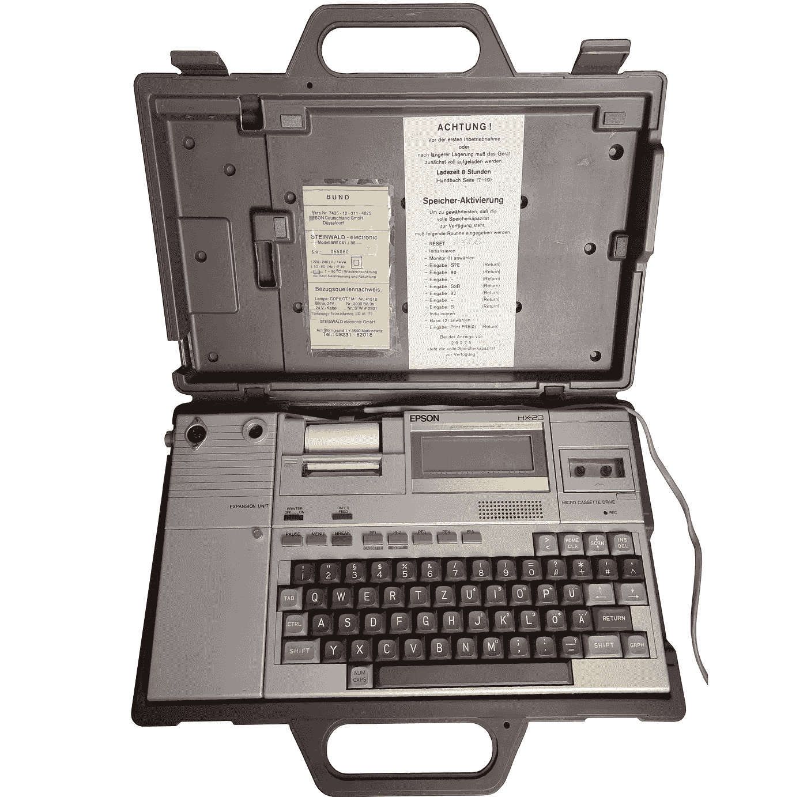

# 爱普生 HX20 —来自德国联邦国防军的计算机

> 原文：<https://medium.com/geekculture/epson-hx20-testing-the-computer-from-a-german-bundeswehr-af502c70a2ad?source=collection_archive---------5----------------------->

在发表了我对爱普生 PX8 的评论后，一些读者建议关注爱普生 HX20，它实际上是历史上第一台“真正的”便携式电脑。在对易贝进行了一番搜索后，我找到了一个在德国军队中使用过的模型。嗯，可能会更有趣:

我将检查硬件和软件—让我们弄清楚它是如何工作的，这是什么…