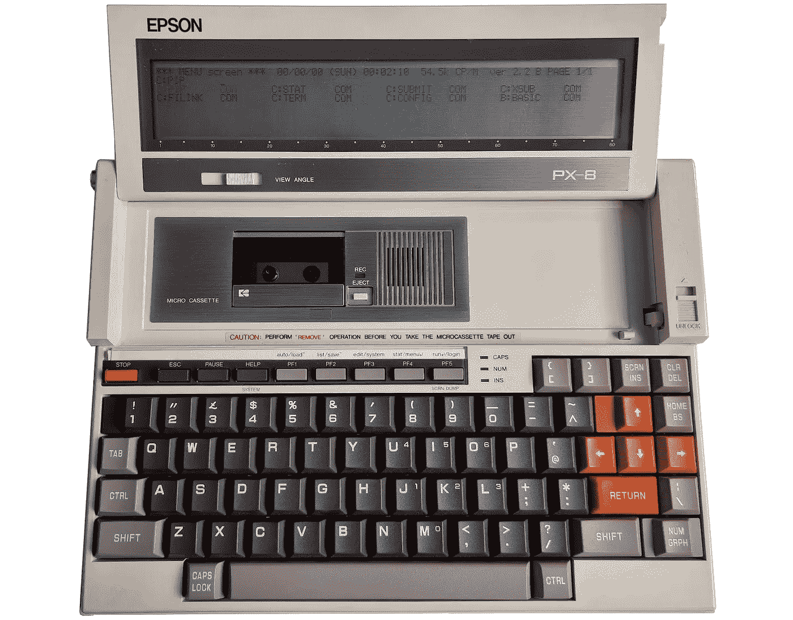

# 带 CP/M 操作系统和磁带机的 Epson PX8 笔记本电脑——当笔记本电脑充满乐趣时

> 原文：<https://medium.com/geekculture/epson-px8-laptop-with-a-cp-m-os-and-a-tape-drive-when-laptops-were-fun-a8227055dceb?source=collection_archive---------0----------------------->

如果我说现在大多数笔记本电脑看起来都一样，我不会大错特错。但在便携式电脑时代的初期，情况并非如此。让我们来看看 1984 年发布的 Epson PX8——一款配有三个微处理器、RAM 磁盘、微型盒式磁带驱动器和成熟操作系统 CP/M 的笔记本电脑:

