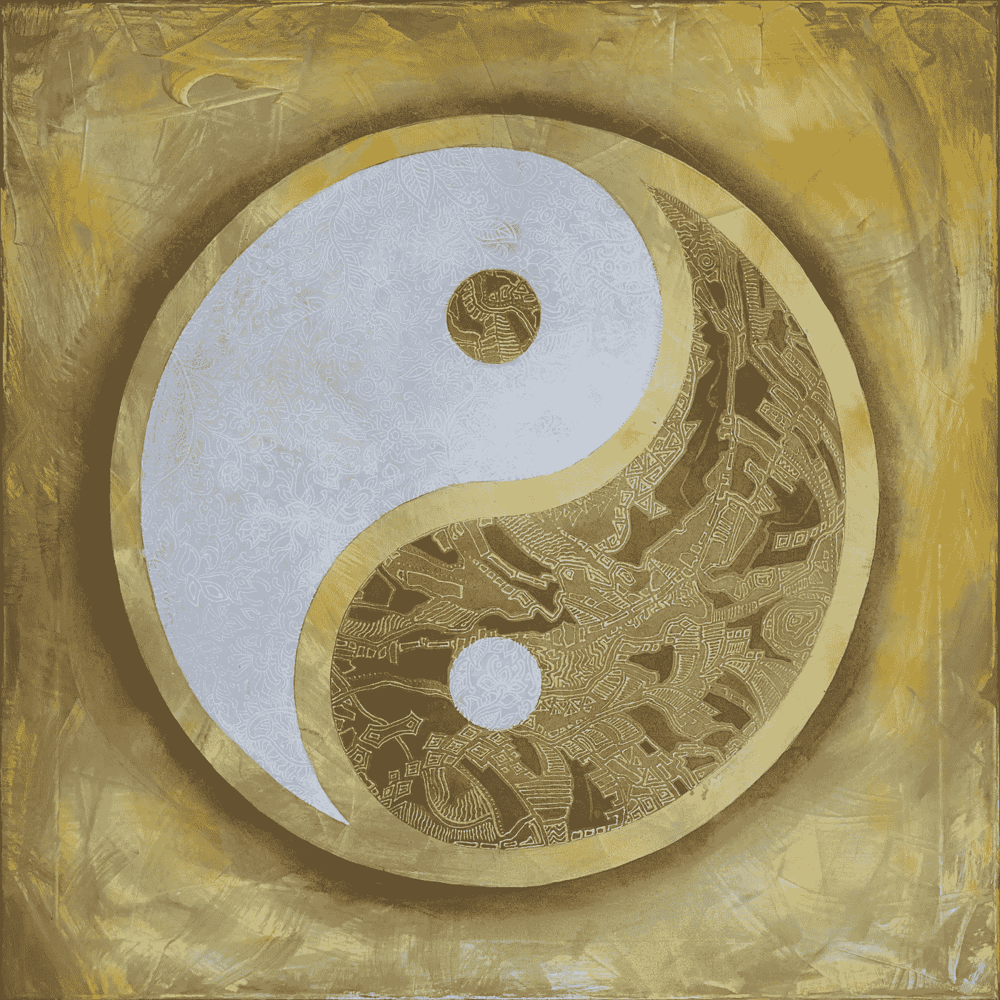

# 平衡，阴阳棋

> 原文：<https://medium.com/geekculture/equilibrium-yin-yang-chess-292e044be46b?source=collection_archive---------29----------------------->

## 设置为 0 的值表示国际象棋游戏达到了某种对称、偏移或平衡

一种接近国际象棋的方法是平衡或阴阳平衡。

根据[维基百科](https://en.wikipedia.org/wiki/Yin_and_yang)阴阳是一个二元论的概念。它描述了看似相反或相反的力量实际上可能是互补的…