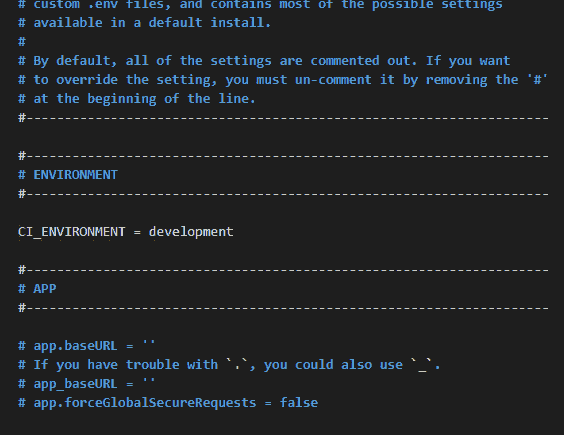

# 错误处理 Codeigniter 4

> 原文：<https://medium.com/geekculture/error-handling-codeigniter-4-1e5b3e9234c1?source=collection_archive---------3----------------------->


你好，朋友们，我祝你们身体健康，永远成功。这一次我们仍然在讨论错误处理，但是这一次我们讨论的是 Codeigniter 4 中的错误处理。

当我们创建应用程序时，我们经常会遇到一些问题，例如经常出现的错误。对于 app 用户来说很烦。Codeigniter 还有一种方法可以在出现错误时处理问题。

开发应用程序时，错误处理非常有用。这将使处理错误变得更加容易。

请遵循以下步骤:

1.  错误处理配置
2.  使用异常
3.  使用 PageNotFoundException

另请阅读其他教程:

[创建 Codeigniter 4 自动化网站地图](https://temanngoding.com/membuat-sitemap-otomatis-codeigniter-4/)

[Codeigniter 4 ~使用 SweetAlert 创建通知](https://temanngoding.com/codeigniter-4-membuat-notifikasi-menggunakan-sweetalert/)

# 错误处理配置

默认情况下，CodeIgniter 将显示开发和测试环境中的所有错误，而不会显示生产环境中的任何错误。您可以通过在。环境文件。



不同的环境需要不同级别的错误报告。默认情况下，开发模式会显示错误，测试和实时模式会隐藏错误。CodeIgniter 提供了如下所示的三个函数来处理错误。

**show_error()**

这个函数通常用于 HTML 格式。

*   **$消息** ( *混合*)—错误消息
*   **$ status _ code**(*int*)—HTTP 响应状态代码
*   **$ heading**(*string*)—错误页面标题

**show_404()**

当访问的页面不存在时使用该函数。

*   **$page** ( *字符串* ) — URI 字符串
*   **$ log _ error**(*bool*)—是否记录错误

**log_message()**

该函数对于以日志消息的形式发送消息非常有用。

*   **$level** ( *字符串*)—日志级别:“错误”、“调试”或“信息”
*   **$消息** ( *字符串*)—记录消息
*   **$ php _ error**(*bool*)—我们是否正在记录一个本地 PHP 错误消息

可以在**app/Config/exceptions . PHP**文件中启用日志记录。

```
<?phpnamespace Config;use CodeIgniter\Config\BaseConfig;/**
 * Setup how the exception handler works.
 */
class Exceptions extends BaseConfig
{
    /**
     * --------------------------------------------------------------------------
     * LOG EXCEPTIONS?
     * --------------------------------------------------------------------------
     * If true, then exceptions will be logged
     * through Services::Log.
     *
     * Default: true
     *
     * @var bool
     */
    public $log = true; /**
     * --------------------------------------------------------------------------
     * DO NOT LOG STATUS CODES
     * --------------------------------------------------------------------------
     * Any status codes here will NOT be logged if logging is turned on.
     * By default, only 404 (Page Not Found) exceptions are ignored.
     *
     * @var array
     */
    public $ignoreCodes = [404]; /**
     * --------------------------------------------------------------------------
     * Error Views Path
     * --------------------------------------------------------------------------
     * This is the path to the directory that contains the 'cli' and 'html'
     * directories that hold the views used to generate errors.
     *
     * Default: APPPATH.'Views/errors'
     *
     * @var string
     */
    public $errorViewPath = APPPATH . 'Views/errors'; /**
     * --------------------------------------------------------------------------
     * HIDE FROM DEBUG TRACE
     * --------------------------------------------------------------------------
     * Any data that you would like to hide from the debug trace.
     * In order to specify 2 levels, use "/" to separate.
     * ex. ['server', 'setup/password', 'secret_token']
     *
     * @var array
     */
    public $sensitiveDataInTrace = [];
}
```

您可以在 application/log/中找到日志消息。在启用日志文件之前，请确保此目录是可写的。

可以在 application/views/errors/cli 或 application/views/errors/html 中找到各种错误消息模板。

# 使用异常

异常用于在创建的代码出错时为应用程序开发人员提供选项。

```
<?phpthrow new \Exception('Some message goes here');
```

您可以对异常使用 **try/catch** :

```
<?phptry {
    $user = $userModel->find($id);
} catch (\Exception $e) {
    exit($e->getMessage());
}
```

这里我给你举个例子:

```
<?php namespace App\Controllers;
use App\Models\PostModel;
use App\Models\PostCategoryModel;
class Post extends BaseController
{
	public function create()
	{
		$post = new PostModel();
		$post->db->transBegin();
		try {
			$post->insert([
				'title'=>$this->request->getPost('title'),
				'content'=>$this->request->getPost('content')
			]); $post_id = $post->insertID(); $postLog = $this->TransLog($this->request->getPost());
			if($postLog===false){
				throw new Exception();
			}
			$postCategory = new PostCategoryModel();
			$postCategory->insert([
				'post_id'=>$post_id,
				'category_id'=>$this->request->getPost('category_id')
			]); $post->db->transCommit();
		} catch (\Exception $e) {
			$post->db->transRollback();
		}
	}
}
```

上面的代码使用了一个 try catch，这样当 **$postLog** 返回 false 时。转到**捕捉**和**回滚。**

# 使用 PageNotFoundException

这用于 404 错误，找不到页面。抛出时，系统返回在 app/Views/errors/html/error _ 404 . PHP 中找到的视图。您必须为您的站点自定义所有错误显示。如果在 app/Config/Routes.php 中指定了 404 覆盖，将调用该覆盖而不是标准的 404 页面:

```
<?phpif (! $page = $pageModel->find($id)) {
    throw \CodeIgniter\Exceptions\PageNotFoundException::forPageNotFound();
}
```

您可以将消息传递给异常，该异常将在 404 页上显示，而不是默认消息。

这是使用 Codeigniter 4 的应用程序开发人员经常使用的错误处理 Codeigniter 4。

这就是我这次能给出的教程，希望有用。

谢了。

来源:[https://www.codeigniter.com/user_guide/general/errors.html](https://www.codeigniter.com/user_guide/general/errors.html)