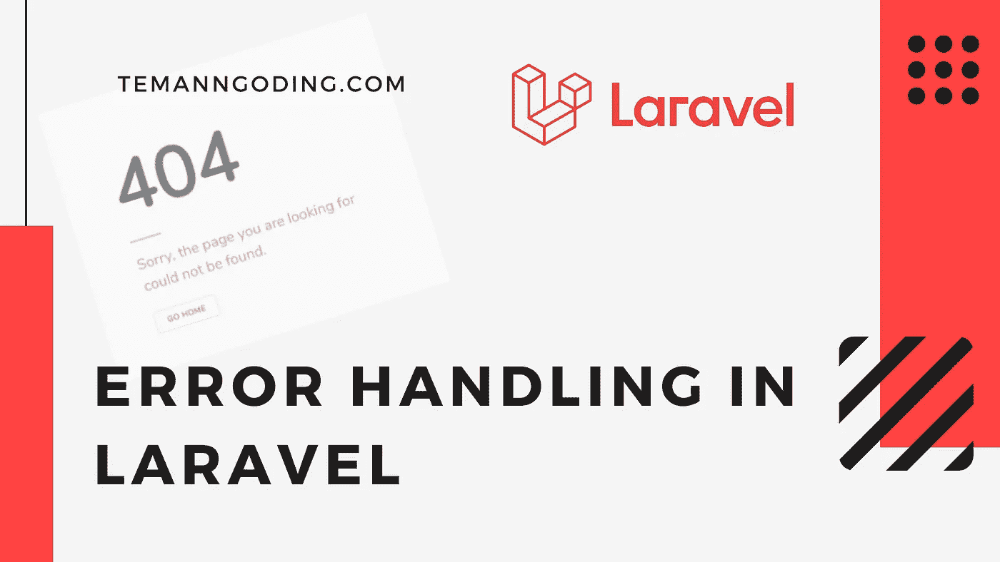
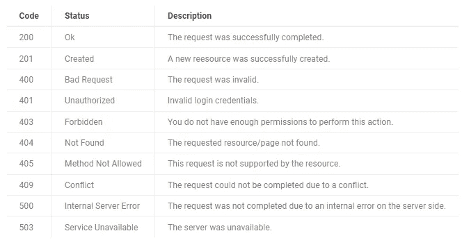
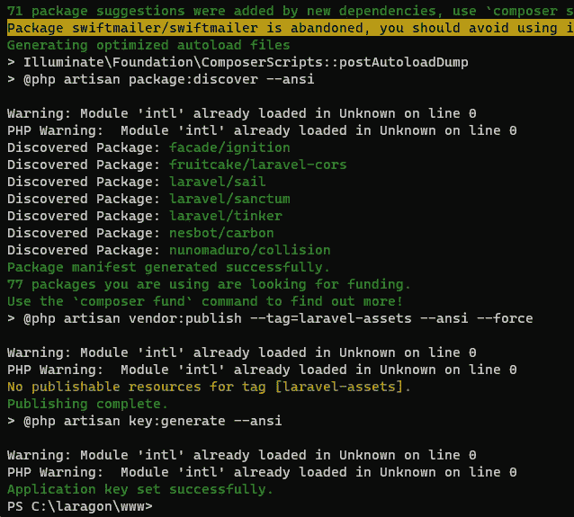
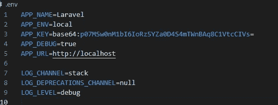

# Laravel 中的错误处理

> 原文：<https://medium.com/geekculture/error-handling-in-laravel-e5bb55a11f64?source=collection_archive---------1----------------------->



你好，你们都好吗，我希望你们都健康和成功。这一次我们将讨论一个关于如何发现 Laravel 中出现的错误的教程。

Laravel 在错误处理方面给了你很大的灵活性。我相信你会在本教程中学到一些新东西。您可以覆盖任何 laravel 状态代码模板。

您还可以学习其他教程:

[用 Laravel 创建评级和评论](https://temanngoding.com/en/creating-ratings-and-reviews-with-laravel/)

[使用 Laravel 拖放图像/文件上传](https://temanngoding.com/en/drag-and-drop-image-file-upload-using-laravel/)

[REST API 登录&向 Sanctum Laravel 注册](https://temanngoding.com/en/rest-api-login-register-with-sanctum-laravel/)

Laravel 中处理错误的一个主要特性是异常处理。Laravel 带有一个内置的异常处理程序，允许您以一种简单友好的方式报告和创建异常。

在默认设置中，异常处理程序提供的是通过 handler 类来了解 laravel 如何处理异常。我们将看到如何创建一个异常处理程序来创建自定义的异常。

# HTTP 响应代码和状态



代码状态描述 2000 确定请求已成功完成。201 创建新资源已成功创建。400 错误请求请求无效。401 未授权无效登录凭据。403 禁止您没有足够的权限执行此操作。404 未找到请求的资源/页面未找到。405 不允许的方法此请求不受资源支持。409 冲突由于冲突而无法完成请求。500 内部服务器错误由于上的内部错误，请求未完成

您必须遵循上述文件结构，否则您将无法替换上述错误页面。要在视图文件中获得错误消息，您可以在刀片视图中使用以下变量:

> 404.blade.php
> 
> {{ $exception->getMessage() }}

# 安装 Laravel

启动应用程序的第一件事是，我们必须先安装 laravel。

```
composer create-project laravel/laravel handling-laravel
```



配置属性设置

在我们安装了 laravel 之后，这次我们可以在 config/app.php 中设置我们的配置文件。

如果设置为`TRUE`，将有助于您调试应用程序产生的错误。该变量的默认值被设置为文件`.env`中环境变量`APP_DEBUG`的值

在开发环境中，您应该将它设置为`TRUE`，这样您就可以轻松地跟踪错误并修复它们。另一方面，您应该在生产环境中关闭它，在这种情况下，它将显示一个常规错误页面。



标准日志文件位于`storage/logs/laravel.log`，在大多数情况下已经足够。另一方面，`APP_LOG_LEVEL`被设置为指示要记录的错误的严重性的值。

# 亨德勒设置

接下来，我们将看看默认 Laravel 应用程序附带的默认处理程序类。继续打开`app/Exceptions/Handler.php`文件。

如果你们想为自定义错误创建自定义响应或视图，可以在 laravel 中完成。你需要做的是修改 App\Exceptions\Handler 类。

```
<?phpnamespace App\Exceptions;use Illuminate\Foundation\Exceptions\Handler as ExceptionHandler;
use Illuminate\Database\Eloquent\ModelNotFoundException;
use Illuminate\Http\JsonResponse;
use Illuminate\Http\Response;
use Illuminate\Http\Request;
use Throwable;*class* Handler extends ExceptionHandler
{
    /**
     * A list of the exception types that are not reported.
     *
     * @var array
     */
    protected $dontReport = [
        //
    ]; /**
     * A list of the inputs that are never flashed for validation exceptions.
     *
     * @var array
     */
    protected $dontFlash = [
        'current_password',
        'password',
        'password_confirmation',
    ]; /**
     * Register the exception handling callbacks for the application.
     *
     * @return void
     */
    public *function* register()
    {
        $this->reportable(*function* (Throwable $e) {
            return false;
        });
    } /**
     * @param Request $request
     * @param Throwable $e
     * @return JsonResponse|Response|\Symfony\Component\HttpFoundation\Response
     * @throws Throwable
     */
    public *function* render($request, Throwable $e)
    {
        if ($request->is('api/*')) {
            return response()->json([
                'message' => 'Record not found.'
            ], 404);
        } return parent::render($request, $e);
    }
}
```

你们可以在这里添加一些其他的定制逻辑来满足你们的排除需求。

# 使用寄存器方法的错误处理

还可以在 App\Exceptions\Handler 类中使用 laravel register 方法呈现不同的错误页面。让我们举一个例子，让我们创建一个新的异常类，当订单在我们的应用程序中失败时将调用它。

要生成新的异常类，请执行以下命令:

```
php artisan make:exception InvalidOrderException
```

上述命令将在 app/Exceptions 文件夹下创建一个名为 InvalidOrderException.php 的文件。我们不需要这个文件，只需要修改一下就可以了:

```
<?phpnamespace App\Exceptions;use Exception;*class* InvalidOrderException extends Exception
{
    /**
     * Get the exception's context information.
     *
     * @return array
     */
    public *function* context(): array
    {
        return ['order_id' => 123];
    }
}
```

让我们修改 App\Exceptions\Handler 类，如下所示:

```
<?phpnamespace App\Exceptions;use Illuminate\Foundation\Exceptions\Handler as ExceptionHandler;
use Illuminate\Http\JsonResponse;
use Illuminate\Http\Response;
use Illuminate\Http\Request;
use Throwable;*class* Handler extends ExceptionHandler
{
    /**
     * A list of the exception types that are not reported.
     *
     * @var array
     */
    protected $dontReport = [
        //
    ]; /**
     * A list of the inputs that are never flashed for validation exceptions.
     *
     * @var array
     */
    protected $dontFlash = [
        'current_password',
        'password',
        'password_confirmation',
    ]; /**
     * Register the exception handling callbacks for the application.
     *
     * @return void
     */
    public *function* register()
    {
        $this->renderable(*function* (InvalidOrderException $e, $request) {
            return response()->view('errors.invalid-order', [], 500);
        });
    }
}
```

现在，在 app/resources/views/errors 文件夹下创建一个名为 invalid-order.php 的文件，并根据需要修改文件内容。

因此，这次教程我螺栓。可能有用。

谢了。