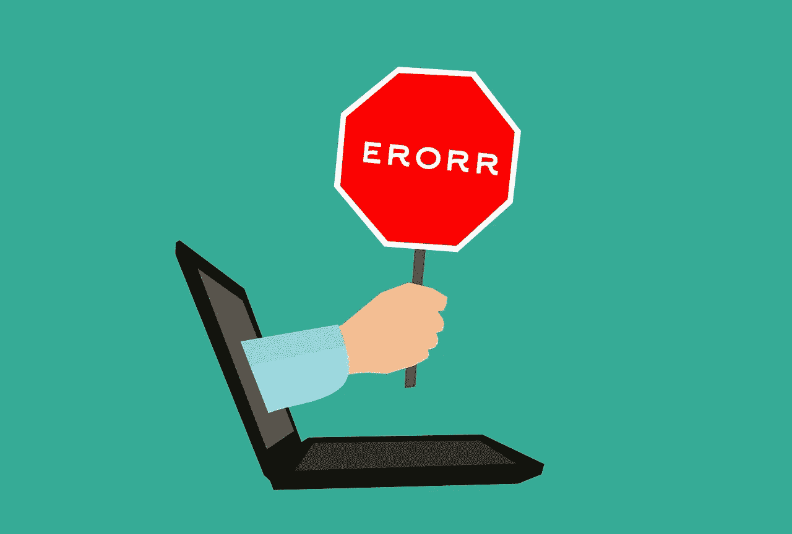

# Node.js 中的错误处理

> 原文：<https://medium.com/geekculture/error-handling-in-node-js-9ae692f1ae1?source=collection_archive---------11----------------------->

遇到错误的方法有很多，要克服它们并不容易。当我们制作我们的项目时，我们想知道它已经被处理好了，并且针对可能出现的任何混乱进行了整合。



让我们考虑一个场景，我们用 Node.js 构建一个 **RESTful web API。我们有许多用户从我们的服务器发送数据请求。听起来不错。暂时如此。**

随着来自世界各地的人们向我们的服务器发出请求，我们很有可能将一些**意想不到的价值**带入我们的程序。一旦我们有了这些值，我们想给我们的用户一个尽可能描述性的答案。如果我们没有适当的 Node.js 错误处理，我们很可能会抛出一个简单的错误消息。用户很可能会看到**【出了点问题】**消息。


Photo by [Elisa Ventur](https://unsplash.com/@elisa_ventur?utm_source=medium&utm_medium=referral) on [Unsplash](https://unsplash.com?utm_source=medium&utm_medium=referral)

## 这不是一个好的做法。

为了很好地理解错误处理概念，首先需要理解错误对象。

```
throw new Error('database failed to connect');
```

本机错误对象的第一个参数是它的描述。描述是错误对象的可读字符串。当有什么出错的时候，它就会出现在你的控制台上。

```
throw new CustomError('A custom error');
```

第二个错误对象也有一个 name 属性，它是对象的计算机可读部分。当使用本机错误对象时，name 属性默认为一般的“错误”，但您可以创建自己的。

创建一个错误对象并不是我们的目的。创建一个错误对象只是隐喻性地为发送错误做准备，但它并不发送。要发送我们的错误，我们需要抛出它。但是扔是什么意思呢？这对我们的项目意味着什么？

Throw 实际上做了两件事:它停止程序，并找到一个要执行的 catch。

当 JavaScript 找到 throw 关键字时，它做的第一件事就是立即停止，这阻止了更多函数的运行。通过像这样停止，它减少了任何进一步错误发生的风险，并帮助我们不使我们的程序状态完全扭曲。


Photo by [Ferenc Almasi](https://unsplash.com/@flowforfrank?utm_source=medium&utm_medium=referral) on [Unsplash](https://unsplash.com?utm_source=medium&utm_medium=referral)

## 处理异步错误

在我们深入之前，让我们后退一步，理解 JavaScript 如何处理异步任务——以及我们为什么需要这样做。

JavaScript 是一种单线程编程语言。由于只有一个处理器，我们得到了阻塞代码。阻塞代码指的是你的程序是否会等待一个异步任务完成后再做其他事情，而非阻塞代码指的是当任务完成时你在哪里注册一个回调函数来执行。

在这一点上，值得一提的是，在 JavaScript 中有两种处理异步的主要方法:承诺或回调。

Promises 非常优雅地处理错误，并将捕获链中在它之前的任何错误，这对于 Node.js 程序员来说非常好，因为这意味着我们可以在单个处理程序中处理许多函数中的许多错误。

在这一点上，你可能想知道给你的承诺增加一个条件是否是可选的。这是可选的，但是你应该总是提供一个 catch 处理程序。

因为异步调用失败的方式有很多。我们的代码可能超时，可能有网络问题，或者可能有硬件故障。出于所有这些原因，您应该始终指导您的程序在承诺失败的情况下做什么。

记住黄金法则:**永远要处理承诺的拒绝。**


Photo by [Raúl Nájera](https://unsplash.com/@reinf?utm_source=medium&utm_medium=referral) on [Unsplash](https://unsplash.com?utm_source=medium&utm_medium=referral)

## 异步尝试/捕捉的危险

您可能想知道为什么 promise 公开了一个 catch 方法，为什么我们不能将 promise 实现包装在一个 try/catch 中。如果你试图这样做，结果不会如你所料。

默认情况下 Try/catch 是同步的。这意味着，如果异步函数在同步 try/catch 块中抛出错误，则不会抛出错误。

这绝对不是我们想要的。

总之，如果您正在处理异步错误处理，您应该真正使用 promises catch 处理程序，因为这将允许您有效地处理异步错误。但是如果您处理的是同步代码，那么 try/catch 会做得很好。