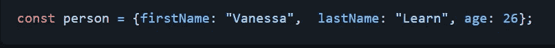
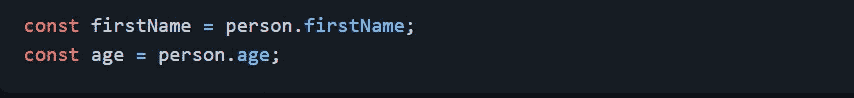
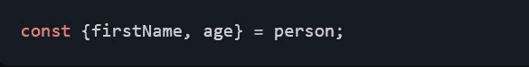
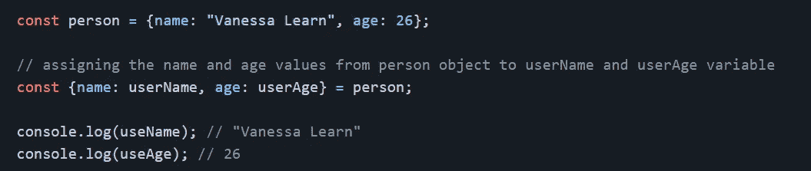
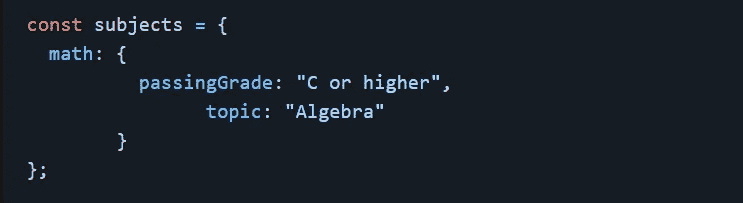
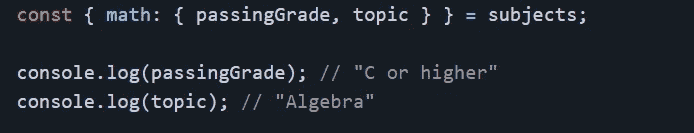
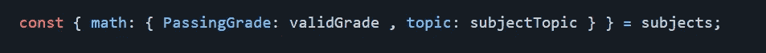
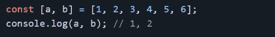
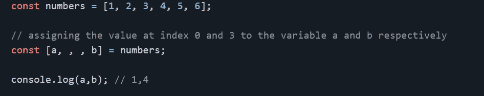
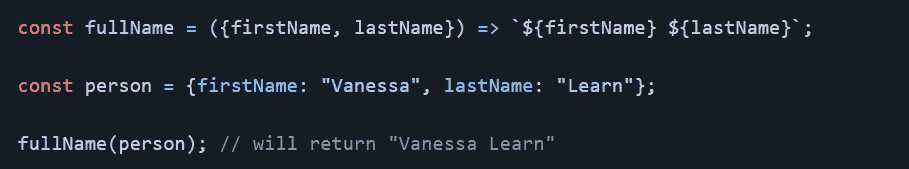

# ES6 析构赋值

> 原文：<https://medium.com/geekculture/es6-destructuring-assignment-81a895abc28?source=collection_archive---------27----------------------->

你可能熟悉 ES6 的析构，但是你知道它的所有特性吗？到目前为止，我只熟悉从对象和数组中提取值的 ES6 析构语法。在这里，我将介绍使用 ES6 中引入的这种特殊语法的所有可能方式。

析构赋值是直接从对象中直接取值的简洁赋值的语法糖。下面是 ES6 析构语法的不同使用方式:

# 从对象中提取值

考虑以下对象:

在 ES6 之前，要检索一个对象的值并将它们赋给一个变量，我们将按如下方式进行:

ES6 析构语法使赋值语句更简单、更整洁:

将创建`firstName`和`age`变量，并从 person 对象中为它们分配各自的值。只要我们正在创建的变量和对象的属性具有相同的名称，这就会起作用。

# 从对象中提取值，并将它们赋给新的变量名

您可能需要创建新的变量名，而不是使用从对象的属性派生的名称。这可以如下进行:

上面的赋值代码可以解读为“获取`person.name`的值，赋给一个名为 userName 的新变量”等等。

# 从嵌套对象中提取值并分配变量

也可以从嵌套对象中析构值。考虑以下对象:

现在让我们提取`subjects.math`的`passingGrade`和`topic`值，并将它们赋给同名变量:

我们还可以将对象属性的值赋给不同名称的变量，如下所示:

# 从数组中提取值并赋给变量

析构数组和析构对象一样简单。

左边数组中的每个变量都被赋予了右边数组中的一个值，该值具有相同的索引或位置。和上面的例子一样，变量`a`被赋予数组的第一个值(1)，而`b`被赋予数组的第二个值(2)。数组中任何索引处的值也可以通过析构来访问，使用逗号到达所需的索引:

# 将对象作为函数的参数传递

可以在函数参数中析构一个对象。以下面的例子为例:

`fullName`函数可以用 ES6 析构进行重构，如下所示:

当对象`person`被传递给`fullName`函数时，`firstName`和`lastName`属性的值被从函数参数中析构，以便在函数中使用。

现在您对 ES6 的析构语法有了更多的了解，希望它能帮助您重构代码，使其更具可读性。

编码/学习快乐！！！

*原载于 2021 年 3 月 28 日*[*https://vanessuniq . github . io*](https://vanessuniq.github.io/es6_destructuring_assignment)*。*