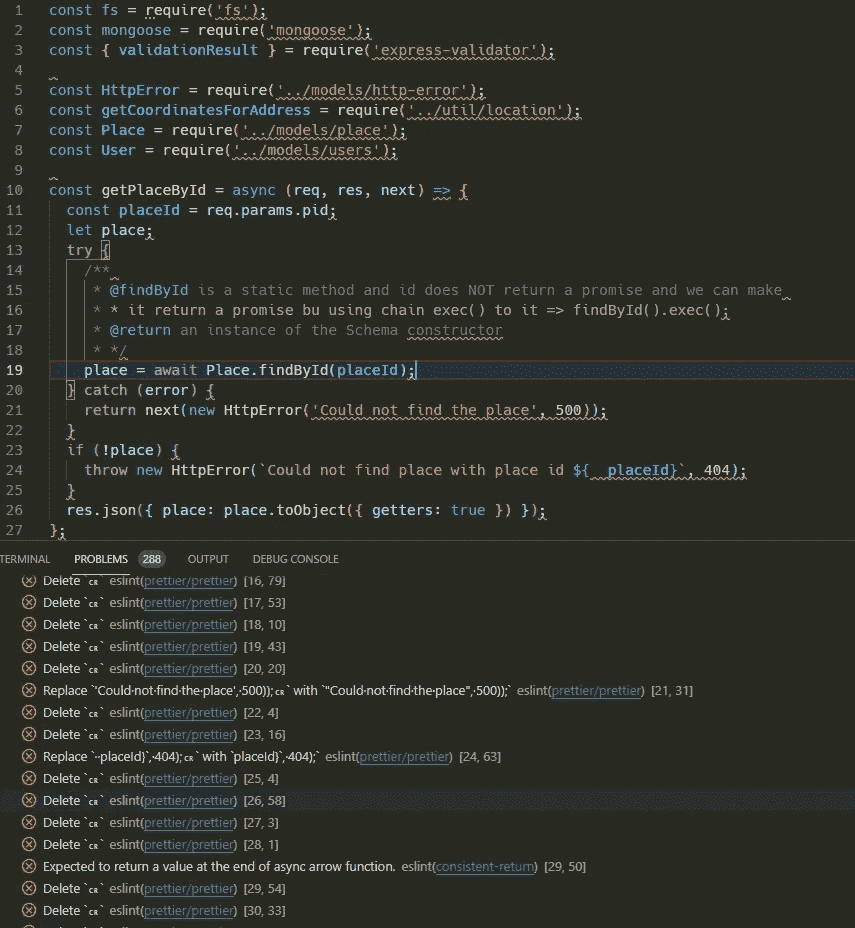
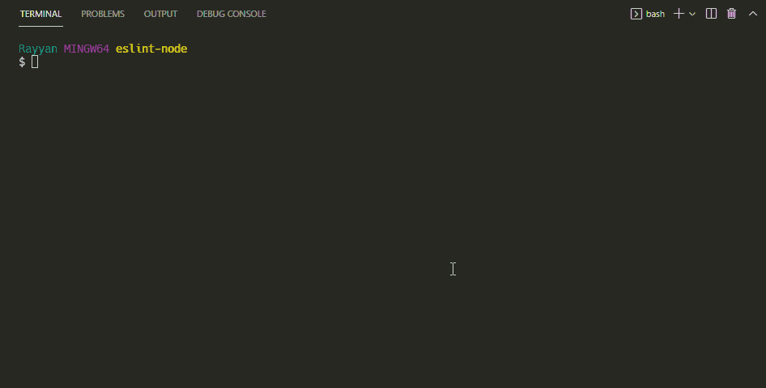

# 用简单的词表示带有节点 JS 的 Eslint

> 原文：<https://medium.com/geekculture/eslint-with-node-js-in-simple-words-cee0a0cf9167?source=collection_archive---------5----------------------->


在过去的两周里，我一直试图将林挺的 eslint 应用到我的节点项目中。我发现了太多的建议。其中大部分是指使用定制的`eslint`包，如`airbnb`、`google`、`standard`等许多定制的林挺包，并附上一个**漂亮的**格式化程序。

我遵循这些建议，使用其中一些包将`eslint`应用到我的节点项目中。

一旦我将它们应用到我的项目中，它们在我的代码中产生了太多的`eslint`问题，毫无疑问，这是好的，这就是为什么我想将`eslint`应用到我的 cod 中来增强我的代码平等性👌

真正的问题是，它显示了这些问题，但没有解释这些问题的真正原因是什么，它只是说了这条短信**“更漂亮/更漂亮”**，并提供了一些不可理解的建议来解决这些问题。



当然，有一些配置可以解决其中的一些问题，但是搜索每一个问题需要很长时间😔

老实说，我不喜欢在我的项目中做傻瓜。我更喜欢了解正在发生的事情，如果项目有问题，我至少应该知道如何解决部分问题。

**一言难尽！**🙂我只是想解释为什么我更喜欢使用纯粹的`eslint`规则而不是额外的包和依赖项。😎

***该出发了*** ⛳

# 安装 Eslint

```
> npm install eslint --save-dev
            or
> yarn add eslint --dev
```

# 添加 Eslint

让我们生成我们的`.eslintrc.json`文件！

在项目根文件夹中打开您的终端，点击以下命令:

```
> npx eslint --init
          or
> yarn run eslint --init
```

该命令提示您选择多个选项，**选择以下选项**:

1.  `To check syntax and find problems`
2.  JavaScript 模块>`commonjs`
3.  您的项目是否使用 TypeScript 否/是在我的情况下，我没有使用 TypeScript > `No`
4.  代码在哪里运行？>`Node`
5.  配置文件的格式是什么？>`JSON`
6.  您想现在用 npm 安装它们吗？>`Yes`



完成这些升级选项后，将创建一个具有以下配置的`eslintrc.json`文件:

```
{
  "env": {
    "browser": true,
    "commonjs": true,
    "es2021": true
  },
  "extends": "eslint:recommended",
  "parserOptions": {
    "ecmaVersion": 12
  },
  "rules": {}
}
```

我们将在这个文件中添加额外的 **eslint** 规则。因此，您可以使用以下内容覆盖该文件的全部内容:

```
{
  "env": {
    "node": true,
    "commonjs": true,
    "es2021": true,
    "jest": true
  },
  "extends": "eslint:recommended",
  "parserOptions": {
    "ecmaVersion": 12
  },
  "rules": {
    "no-console": "warn", //* Avoid Bugs
    "no-undef": "error",
    "semi": "error",
    "semi-spacing": "error", //* Best Practices
    "eqeqeq": "warn",
    "no-invalid-this": "error",
    "no-return-assign": "error",
    "no-unused-expressions": ["error", { "allowTernary": true }],
    "no-useless-concat": "error",
    "no-useless-return": "error",
    "no-constant-condition": "warn",
    "no-unused-vars": ["warn", { "argsIgnorePattern": "req|res|next|__" }], //* Enhance Readability
    "indent": ["error", 2, { "SwitchCase": 1 }],
    "no-mixed-spaces-and-tabs": "warn",
    "space-before-blocks": "error",
    "space-in-parens": "error",
    "space-infix-ops": "error",
    "space-unary-ops": "error",
    "quotes": ["error", "single"],
    //
    "max-len": ["error", { "code": 200 }],
    "max-lines": ["error", { "max": 500 }],
    "keyword-spacing": "error",
    "multiline-ternary": ["error", "never"],
    "no-mixed-operators": "error",
    //
    "no-multiple-empty-lines": ["error", { "max": 2, "maxEOF": 1 }],
    "no-whitespace-before-property": "error",
    "nonblock-statement-body-position": "error",
    "object-property-newline": [
      "error",
      { "allowAllPropertiesOnSameLine": true }
    ], //* ES6
    "arrow-spacing": "error",
    "no-confusing-arrow": "error",
    "no-duplicate-imports": "error",
    "no-var": "error",
    "object-shorthand": "off",
    "prefer-const": "error",
    "prefer-template": "warn"
  }
}
```

你刚才加的是什么鬼？🤷‍♀️

*冷静点巴德！！！*

我们刚刚在`env`中添加了`"jest": true`，以防您想要使用`jest`对您的节点项目进行单元测试。额外的规则也被添加到了`rules`部分。

***就这样！***

# 额外注释

**为什么会有这些确定的规则？！**

老实说，您还可以添加许多其他规则，但是这些规则足以增强您的代码可读性并帮助您避免错误。*够放任！！*🙂

**打开/关闭规则💡**

每个`eslint`规则都有**三个**可能值:`off`、`warn`、`error`。所以你可以添加一个规则，并赋予它这三个值中的一个。此外，您可以更改先前`.eslintrc.json`文件中任何规则的值。

例如，我们的规则之一是`"semi": "error"`。我们可以通过将`error`值替换为`warn`来更改此规则，以便仅在您忘记添加分号`;`时显示警告，或者您甚至可以通过使用`off` 值来关闭此规则。

**搜索规则的描述🔍**

您可以搜索规则的描述，只需前往[eslint.org](http://eslint.org)进行搜索。你会看到**这个规则对于**、**它是如何深入**工作的，以及它可以取什么样的**可能值。**

**使用** `**--fix**` **选项**应用自动修复

如果你刚刚将`eslint`添加到一个现有的项目中，很有可能你的代码中已经存在的许多 eslint 问题会出现。检查所有的项目文件并手动修复这些`eslint`将会非常困难。

幸运的是，有一个很棒的命令可以自动修复这些问题。**在你的终端上点击这个命令:**

```
./node_modules/.bin/eslint --fix
```

它有望修复大多数问题。

> 还有一件事，你可以**改变**任何以前的**规则**，这样它们就能满足你的需要。

希望你现在明白如何添加`eslint`到节点项目:)

所有之前的规则都托管到这个 repo 中，我发现的任何其他规则都可以增强我将添加到这个 repo 中的节点代码。

***快乐诚品*** *🎉🎉✨*