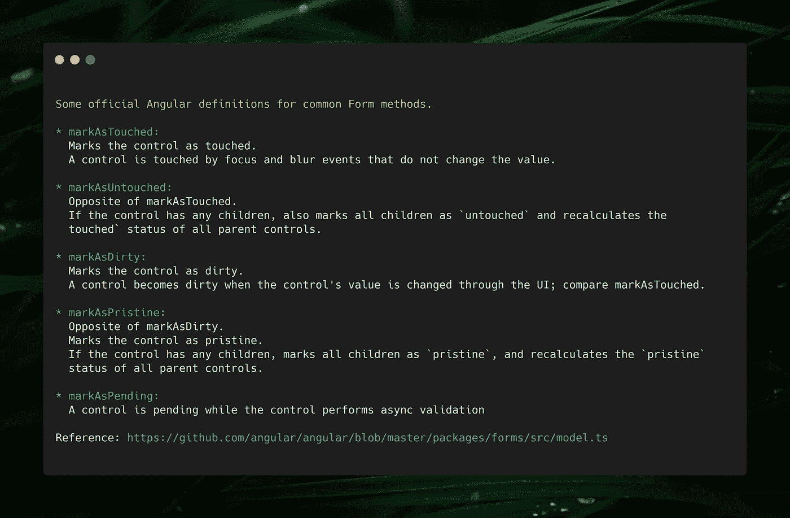

# 你应该知道的基本角形 API

> 原文：<https://medium.com/geekculture/essential-angular-form-apis-you-should-know-5b0c12be0569?source=collection_archive---------3----------------------->


The more frustrating problem you face in development, the more amazing solution you end up with.

Angular reactive forms 是一个强大的模块，用于管理 web 应用程序中的表单，但有时为了解决特定问题，我们可能会实现一些不必要的代码，而没有意识到已经有内置的解决方案可用。在这篇文章中，我们将回顾其中的一些。

# **发射事件:**

当我们修补值，设置值，启用或禁用表单时，我们有附加选项 emitEvent，onlySelf 作为参数传递。

emitEvent 是当我们的表单值或状态改变时触发的事件。因此在官方[文件中](https://angular.io/api/forms/FormControl):

```
*emitEvent: When true or not supplied (the default), both the `statusChanges` and `valueChanges` observables emit events with the latest status and value when the control value is updated
```

> 附注:启用或禁用表单控件也会触发值更改。

因此，基本上当我们调用 setValue、patchValue、disable、enable 控件时，默认情况下它会触发值更改。

*用例:*

假设您有一个实现 ControlValueAccessor 的自定义窗体控件。每当表单值改变时，父级上有监听器，触发更新数据 api。当您从父控件更改表单值时，为了在自定义控件上反映此更改，您需要实现以下方法:

```
public writeValue(newValue: number): void {
 this.value = newValue;
 this.streetControl.patchValue(newValue, { emitEvent: false });
}
```

如果我们没有将 emitEvent 设置为 false，它将触发 valueChange，因此父窗体将触发不必要的 api，这是我们在这里要避免的。

# 更新值和有效性:

在我们深入研究另一个选项 onlySelf 之前，让我们先了解官方[文档](https://github.com/angular/angular/blob/4a68e13d1b9dc2665679bb2b7c215f69a6ac8f98/packages/forms/src/model.ts#L715)中的 updateValueAndValidatity 方法:

```
/*** Recalculates the value and validation status of the control.* By default, it also updates the value and validity of its ancestors.* @param opts Configuration options determine how the control propagates changes and emits events  after updates and validity checks are applied.* `onlySelf`: When true, only update this control. When false or not supplied, update all direct ancestors. Default is false.* `emitEvent`: When true or not supplied (the default), both the `statusChanges` and `valueChanges` observables emit events with the latest status and value when the control is updated. When false, no events are emitted.*/updateValueAndValidity(opts: {onlySelf?: boolean, emitEvent?: boolean} = {}): void {
....
```

简而言之，它重新计算控件的值和验证状态。当控件第一次初始化时，或者当我们调用窗体控件的 patchValue、setValue、addControl、setControl 或 removeControl 方法时，会触发该事件。

使用案例:

当我们更新表单控件的验证器时，这很有用。因为当我们更新验证器时，默认情况下它不会重新计算验证状态，所以您需要额外调用它。例如，假设我们有一个名为 postalCode 的表单，它具有动态验证器(这里依赖于国家字段)。当国家是美国时，我们设置验证器最大长度为 5，在所有其他情况下最大长度为 7。为了实现这一点，我们将编写如下代码[演示](https://stackblitz.com/edit/angular-essential-form-apis):

当国家值改变时，我们添加并重新验证邮政编码的状态。但是这里有一个小问题，updateValueAndValidity 也会触发父窗体上的 updateValueAndValidity 方法。参见下面的代码

如果我们在父节点上有异步验证器会怎么样？所以我们需要防止这种不必要的检查。这就是唯一自我选择的来源。

# 仅自己:

根据官方[文件](https://angular.io/api/forms/FormControl):

```
* `onlySelf`: When true, each change only affects this control, and not its parent. Default is false.
```

简单地说，当我们调用 updateValueAndValidity 时，这也会触发父节点上的这种变化。为了解决前面例子中的问题，我们只需要添加新的参数: [DEMO](https://stackblitz.com/edit/angular-essential-form-apis)

```
this.addressForm.get("postalCode").updateValueAndValidity({emitEvent: false, onlySelf: true});
```

还有其他一些基本的方法可用，比如 markAsTouched、markAsDirty，但是因为它们很简单，所以我没有去碰它们。你可以看到下面的定义截图。



仅此而已。希望对你有帮助。另外，请不要犹豫，通过文章回复或我的[推特](https://twitter.com/Vugar005)联系我！干杯！