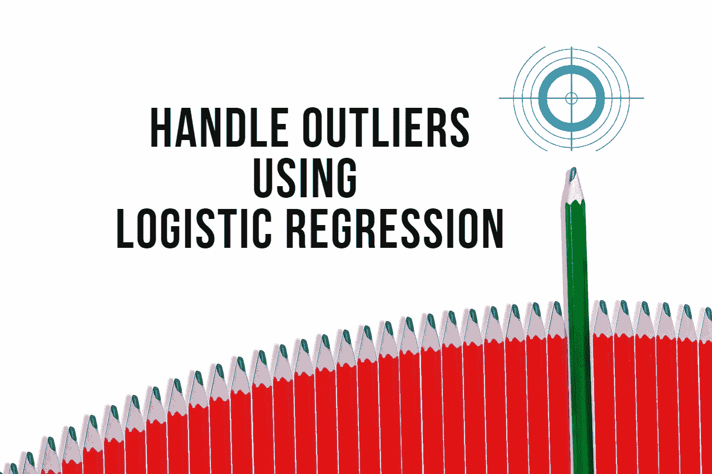

# 处理逻辑回归模型异常值的基本指南

> 原文：<https://medium.com/geekculture/essential-guide-to-handle-outliers-for-your-logistic-regression-model-63c97690a84d?source=collection_archive---------5----------------------->

## 通过移除异常值来提高模型性能

Image by [khamkhor](https://pixabay.com/users/khamkhor-3614842/?utm_source=link-attribution&amp;utm_medium=referral&amp;utm_campaign=image&amp;utm_content=4269760) from [Pixabay](https://pixabay.com/?utm_source=link-attribution&amp;utm_medium=referral&amp;utm_campaign=image&amp;utm_content=4269760)

真实世界的数据集通常包含大量缺失值和异常值数据点。异常值的原因可能是数据损坏、测量/实验错误或人为错误。数据集中异常值的存在对模型有很大的影响…