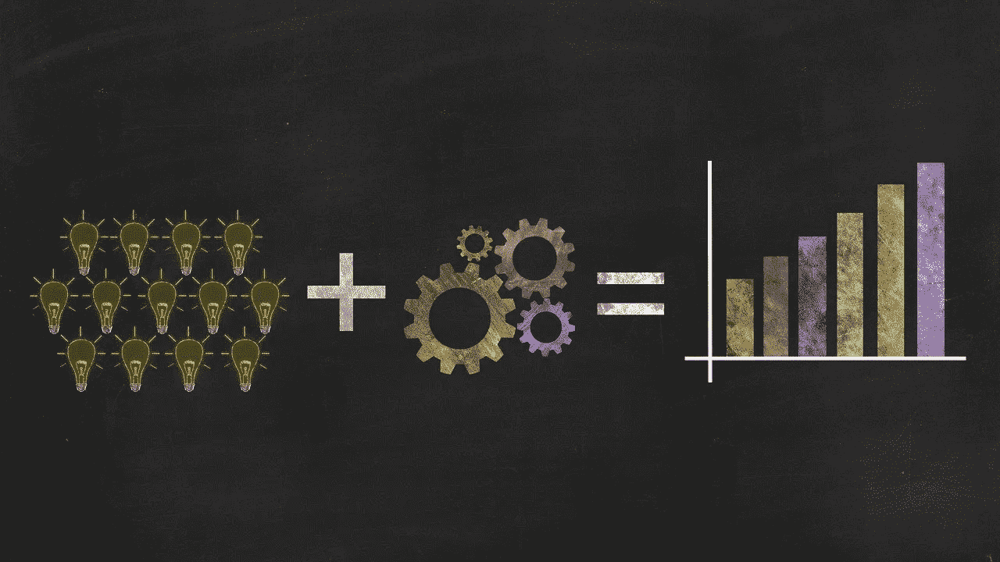

# 提高不平衡数据分类模型性能的基本指南

> 原文：<https://medium.com/geekculture/essential-guide-to-improve-imbalanced-data-classification-model-performance-c8cf0125b731?source=collection_archive---------14----------------------->

## 结合过采样和欠采样技术

Image by [ar130405](https://pixabay.com/users/ar130405-423602/?utm_source=link-attribution&amp;utm_medium=referral&amp;utm_campaign=image&amp;utm_content=2081168) from [Pixabay](https://pixabay.com/?utm_source=link-attribution&amp;utm_medium=referral&amp;utm_campaign=image&amp;utm_content=2081168)

对于分类任务，可能会遇到目标类标签分布不均匀的情况。这种情况被称为不平衡数据。由于阶级不平衡的存在，这个模型可能会偏向大多数…