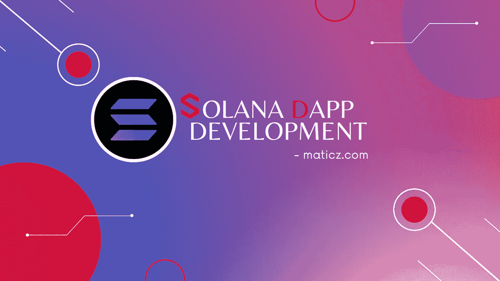

# 关于索拉纳 DApp 发展的基本知识

> 原文：<https://medium.com/geekculture/essential-things-to-know-about-solana-dapp-development-ed72abb0da70?source=collection_archive---------10----------------------->

Solana DApp Development

索拉纳是继以太坊区块链网络之后最著名和最强大的区块链。它从区块链行业创造了更多的商誉收益，因为它为用户提供了更多的增值功能，包括较低的交易费用、高水平的交易速度，以及在区块链可以获得过量的分散式应用程序(Dapps)和 NFT。

运行在对等网络协议上的分散式应用程序，因此不受任何干扰。DApps 的使用在最近几年正在扩大，并且在未来已经完全转换到所有类型的平台。许多企业家都想在索拉纳上大展拳脚。通常，构建你自己的 Dapp 需要一些编程语言，但是从全局来看并不是特别困难。

# 为什么索拉纳·区块链对 Dapps 很重要

[索拉纳·区块链开发的](https://maticz.com/solana-blockchain-development)之所以被推广是因为被用于历史机制的证明。因此，与其他区块链网络相比，你的交易速度很快。密码专家已经考虑了以太坊区块链的直接竞争对手。目前，它每秒钟处理超过 65，000 个交易，是业界领先的。索拉纳区块链平均阻塞时间为 400 到 800 毫秒，每笔交易费用为 0.00025 美元，索拉纳 Dapp 开发中提供了更多高级功能。这种卓越的性能和可伸缩性正在成为成熟的 DApp，这是需要考虑的要点。

# 在 Solana 上创建 Dapp 的步骤

*   收集要求并最终确定范围
*   为 DApp 创建特定的用户界面设计
*   为 DApp 建立合适的智能合同
*   通过智能合同审核测试
*   为 DApp 发展必要的特色
*   在前端和后端实施智能合约
*   对开发的应用程序进行多次测试
*   将开发的应用程序部署到 Mainnet

# 索拉纳·DApp 的优点

*   与其他 Dapp 相比，Solana Dapp 的交易费用较低
*   它不能在任何集中的权威平台上工作
*   它提供了高透明度和非常高的安全性
*   没有任何延迟问题，同时随时处理您的交易
*   Solana Dapp 与智能合同保护相结合，因此您不必担心黑客活动和隐私问题。
*   根据您的要求，轻松定制您的 DApp

# 索拉纳·DApp 发展服务公司

Solana 不仅在分散式应用中使用，它还出现在更多的开发服务中，如

1.  智能合同
2.  Defi 交换
3.  令牌开发
4.  NFT 市场发展

## 智能合同

索拉纳智能合同工作于历史算法机制的证明。这个机制的主要目标是对检查进行高频验证，以评估和交付唯一的输出。

## Defi 交换

去中心化地做你的金融活动，不要像券商一样有任何瓶颈干扰。任何人都可以很容易地在 Defi 交换索拉纳开始他们的生意

## 令牌开发

代币的使用日益增加。索拉纳参与了令牌开发。最近加密音乐应用 Audius 为我们的用户推出了 Solana 版本的音频令牌，不仅如此，还有更多的企业使用 Solana 令牌。

## 索拉纳 NFT 市场开发

索拉纳 NFT 市场提供了高吞吐量和较低的费用。著名的 NFT 索拉纳市场是索拉纳克隆和索尔西。超过 570 万辆 NFT 是在索拉纳·NFT 平台上铸造的。索拉纳 NFT 有趣的特点，如独特的令牌，透明性和兼容性。

# 结论

这些是包含在[索拉纳 DApp 开发](https://maticz.com/solana-dapp-development)中最有价值的特性和功能。如果你是一个密码业务的新手，索拉纳是一个新兴的区块链技术，肯定会支持你达到成功。许多商业人士已经开始他们的 Dapps 达到胜利。我们的 Defi 专家是帮助您职业发展的向导。