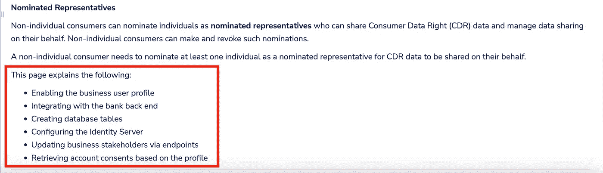
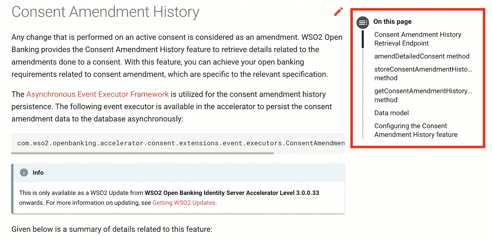
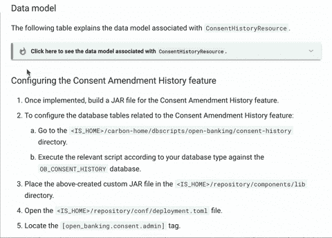

# 有效技术文档的基本技巧(第 1 部分)

> 原文：<https://medium.com/geekculture/essential-tips-for-effective-technical-documentation-part-1-fe2a3fa8b604?source=collection_archive---------12----------------------->

## 提高技术文档水平的简单而有效的技巧

Image Source: [Unsplash](https://unsplash.com/)

大家好！

这是*有效技术文档的基本技巧*系列的第一篇文章。在这一系列文章中，我将分享我作为一名技术写作者最初几个月所学到的一些要点。

作为一名技术写作者，你应该能够以简单得多的方式提供准确的内容，这样用户第一眼就能理解，而无需进一步提问。

无论你是一个初学科技写作的人，还是只是想知道如何开始科技写作，你都可以使用这些简单而有效的技巧来提高你的写作技巧。

# 📌技巧 1:识别受众

第一步，了解你的受众。确定受众的目标对文档过程有着巨大的影响。在我看来，这是撰写技术文档时最重要的因素。它决定了文档要写什么，怎么写。所以，在写作的时候，一定要记住受众的类型和他们的需求。确保你给了观众他们需要的所有信息。

通常，作为一名技术写作者，你必须面对两个主要的受众:

*   开发商
*   最终用户/客户

## 开发商

开发人员是想要配置或维护代码库的人。

在与开发人员交流时，给出如何配置或实现的说明。例如:

> "您可以在帐户选择步骤之前包括配置文件选择步骤."

开发人员不希望看到如何使用特定产品或功能的逐步说明。但是我们可以在必要的地方提到最终用户将如何使用它。例如:

> 在银行客户向经认可的数据接收者(ADR)发起同意流程后，他们将被重定向到数据持有人的身份认证流程

## 最终用户/客户

最终用户或客户是想使用你的产品或应用程序的人。清楚地解释产品/应用如何通过适当的说明帮助解决他们的问题。他们根本不关心它是如何工作的。

在与最终用户沟通时，提及如何使用某项功能、应用或产品。

理解你的读者为什么参考这些文档是必要的。只包括对他们至关重要的内容。例如，如果您面向最终用户，则不应包括该功能背后的配置。

# 📌技巧 2:与观众交谈

如果你向用户传达指示，尽可能使用第二人称视角。意思是用代词“*有”*对观众说话。这有一种对话的感觉，意味着你在直接和读者对话。

仅在需要时使用第三人称叙述。例如:

**如果你是面向开发者:**

*   使用→ " *您可以按如下方式进行配置:"*
*   代替→ " *,开发人员可以如下配置它:"*

**如果你在对用户说话:**

*   使用→ " *您可以通过…"* 选择您的个人资料
*   代替→ " *，用户可以选择…"*

如果你忽略了这一点，把事情搞混了，你的观众会很困惑。

# 📌秘诀 3:保持好奇

设身处地为读者着想。总是问这样的问题，“为什么？”，‘*什么*和“*如何？”*。他们可能有很多问题。所以，试着想象用户接下来会问什么。包括所有可能的答案，以便用户不会混淆。

从读者的角度组织内容，并确保它解决了这些问题。这些问题也取决于观众。例如:

如果您是为开发人员编写，请从开发人员的角度出发，尝试回答如下问题:

*   *我为什么要配置/实施此功能？*
*   *我需要什么来配置/实施它？*
*   *我该如何配置/实施？*

如果你是为系统或应用程序的最终用户而写，从最终用户的角度来看。像第一次使用系统或功能的最终用户一样保持好奇，并尝试回答如下问题:

*   我为什么要使用这个系统/产品/应用程序？
*   使用这个我需要什么？
*   我如何使用这个？

# 📌技巧 4:合理组织

组织是成功的技术文档的关键。这就是你如何组织信息并把它分成小组。首先，理解文件的目的和你想要传达的关于特定产品或应用的想法。然后通过适当的格式将内容传达给读者。遵循文档中的逻辑流程。

*   在进入细节之前，提供一个可靠的特性介绍。在你的介绍中包括概述、用例以及合适的例子。
*   在页面的开头用一个项目符号列表提供你在文章中涉及的主题的概述，这样用户就知道页面包括了什么。例如:

Adding a table of contents at the beginning of the page | Image Source: WSO2 Open Banking Documentation

*   或者，您可以在页面的侧窗格中排列目录。例如:

Adding a table of contents in a side pane of the page | Image Source: WSO2 Open Banking Documentation

# 📌技巧 5:注重可读性

把长段落分成小段，把长句分成短句。它增加了清晰度和可读性。长的段落和句子很难抓住内容。

## 桌子

只要你能恰当地总结信息，就包括表格。它减少了长度和复杂性，增加了文档的可读性。它还提供了快速参考，帮助读者快速找到信息。

## 列表

列表对读者略读很有用。列表也给文档增加了空白，使其易于阅读。

*   如果列表不遵循顺序，请使用项目符号列表。
*   对于循序渐进的程序，使用编号列表来建议一个顺序流程。

## 布局

还要考虑页面的布局和视觉效果。使用不同的样式组织重要的信息。例如:

*   相关信息
*   重要注意事项
*   其他提示

确保在整个文档中使用一致的样式。下面是我们使用不同样式来组织相同类型内容的一些例子:

Organizing different types of related information | Image Source: WSO2 Open Banking Documentation

恰当的布局有助于读者更好地理解信息并注意到重要的内容。

# 结果

技术写作者的目标是用简单的格式传达经过充分测试的准确信息。最终，文档应该帮助读者简明地理解产品或过程。所以，确保你从读者的角度看问题，并以一种组织良好的方式组织内容。

这些技巧包括我们作为技术作者在 WSO2 遵循的一些最佳实践，以及我从我的导师和领导那里得到的反馈中的一些改进点。

我希望这些简单的步骤能帮助你提高技术文档的水平。在我即将发表的博客文章中，我将分享更多关于如何提高技术写作技巧的小技巧。

*感谢阅读！*

## 参考资料:

这里有一些关于技术写作的很好的资源:

 [## 欢迎-微软风格指南

### 在线 Microsoft 写作风格指南提供了最新的风格和术语指南。它取代了…

docs.microsoft.com](https://docs.microsoft.com/en-us/style-guide/welcome/)  [## 技术写作一介绍|谷歌开发者

### 技术写作一教你如何写出更清晰的技术文档。你至少需要一点写作…

developers.google.com](https://developers.google.com/tech-writing/one)  [## 技术写作二简介|谷歌开发者

### 技术写作二帮助技术人员提高技术沟通能力。我们本课程的目标是…

developers.google.com](https://developers.google.com/tech-writing/two)  [## 杰奎琳·惠勒的博客

### 自 1991 年以来，杰奎琳一直是一名职业作家。她因其技术写作获得了许多奖项…

jacquelynwheeler.blogspot.com](http://jacquelynwheeler.blogspot.com/)  [## 家庭写作基础指南

### 没有人

写作-基础-指南. readthedocs.io](https://writing-fundamentals-guide.readthedocs.io/en/latest/)