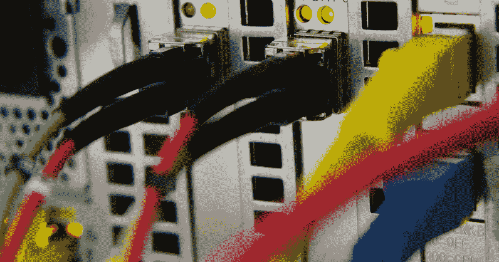

# 使用 Couchbase Java SDK 从 aws ec2 实例建立到 Couchbase 服务器的连接

> 原文：<https://medium.com/geekculture/establishing-connection-to-couchbase-server-from-aws-ec2-instance-using-couchbase-java-sdk-5bdc4a1aeaaa?source=collection_archive---------31----------------------->



我在使用 Couchbase java sdk 中的公共 ip 从我的笔记本电脑建立到 ec2 中 Couchbase 服务器的连接时遇到了问题。所以对我来说，前进的唯一方法是在 ec2 实例中创建 maven 项目，并使用连接字符串“localhost”连接到 Couchbase。

这篇博客是关于我如何从终端在 Ubuntu ec2 实例中创建 maven 项目，并建立到 Couchbase 服务器的连接以从 bucket 获取数据。

Maven 是一个 Java 工具，因此您必须安装 Java 才能继续。
首先，下载 Maven 并按照[安装说明](https://maven.apache.org/install.html)进行操作。我在 ec2 中使用 ubuntu，所以，如果你使用 windows 或 mac，你的步骤可能会改变。

```
mvn --version
```

一旦确认安装了 maven，就进入创建 maven 项目。

创建一个文件夹并在那里启动 shell，然后执行下面的 Maven 命令。

```
mvn archetype:generate -DgroupId=com.couchbase.client -DartifactId=couchbaseanalytics -DarchetypeArtifactId=maven-archetype-quickstart -DinteractiveMode=false
```

这里“DartifactId”是您的项目名称，“DarchetypeArtifactId”是 Maven 项目的类型。

一旦您在键入上述命令后按 Enter 键，它将开始创建 Maven 项目。如果您刚刚安装了 Maven，第一次运行可能需要一段时间。这是因为 Maven 正在将最新的工件(插件 jar 和其他文件)下载到您的存储库中。在成功之前，您可能还需要执行几次该命令。这是因为远程服务器可能会在您的下载完成之前超时。

**错误**:如果构建失败，请检查 pom.xml 文件中的 Maven 版本号。它应该与您机器上安装的 Maven 版本相匹配。

执行该命令后，它会创建一个与 artifactId 同名的目录。换到那个目录。

`cd couchbaseanalytics`

在这个目录下，您会注意到下面的标准项目结构。如果不是这样，那么你可能已经偏离了某个地方。

```
couchbaseanalytics
|-- pom.xml
`-- src
    |-- main
    |   `-- java
    |       `-- com
    |           `-- couchbase
    |               `-- client
    |                   `-- App.java
    `-- test
        `-- java
            `-- com
                `-- couchbase
                    `-- client
                        `-- AppTest.java
```

src/main/java 目录应该包含项目源代码，pom.xml 文件是项目的项目对象模型，即 pom。

pom.xml 文件是 Maven 中项目配置的核心。它是一个单一的配置文件，包含按照您想要的方式构建项目所需的大部分信息。

打开 pom 文件，尝试探索不同的领域。

现在运行下面的命令来构建项目。

```
mvn package
```

一旦构建成功，您可以使用以下命令测试新编译和打包的 JAR:

```
java -cp target/couchbaseanalytics-1.0-SNAPSHOT.jar com.couchbase.client.App
```

该命令将打印:

`Hello World!`

# 现在修改这个项目以连接到 couchbase:

现在将下面的内容添加到`<dependencies>`内的 pom.xml 文件中:

```
<dependency>
        <groupId>com.couchbase.client</groupId>
        <artifactId>java-client</artifactId>
        <version>3.1.3</version>
</dependency>
```

完成后，编辑 Java App.java 文件:
您可以使用 vi 打开，我使用了以下命令来代替 cd 目录:

```
vi /home/ubuntu/kiran/couchbaseanalytics/src/main/java/com/couchbase/client/App.java
```

注意:您的路径可能不同，因此分别进行更改。

在主类中添加下面的代码

`Cluster cluster = Cluster.connect(connectionString, username, password);`

connectionString 是“本地主机”

集群提供对集群级操作的访问，如 N1Ql 查询、分析或全文搜索。

以下导入是构建代码片段所必需的:

```
import com.couchbase.client.java.*;
import com.couchbase.client.java.kv.*;
import com.couchbase.client.java.json.*;
import com.couchbase.client.java.query.*;
```

要访问 KV(键/值)API 或查询视图，您需要打开一个存储桶:

```
// get a bucket reference Bucket bucket = cluster.bucket(bucketName);
```

在集群级别执行 N1QL 查询:

```
QueryResult result = cluster.query("select * from `beer-sample` limit 10"); 
System.out.println(result.rowsAsObject());
```

注意:我有 bucket `beer-sample`你可以用你拥有的 bucket 名称替换它。

现在运行:

`mvn clean install`

```
mvn compile exec:java -Dexec.mainClass="com.couchbase.client.App" -Dexec.arguments="Hello World,Bye"
```

您应该可以在终端中看到 bucket 中的记录。

# 如果你想复制粘贴运行完整的代码，这里是:

```
import com.couchbase.client.java.*;
import com.couchbase.client.java.kv.*;
import com.couchbase.client.java.json.*;
import com.couchbase.client.java.query.*;public class App {
    public static void main(String[] args) {Cluster cluster = Cluster.connect(connectionString, username, password);
    Bucket bucket = cluster.bucket(bucketName);QueryResult result = cluster.query("select * from `beer-sample` limit 10");
    System.out.println(result.rowsAsObject());}
```

万岁！！！就是这样。现在您已经与 Couchbase 服务器建立了连接。你可以在 App.java 编辑代码来适应你的用例。

*原发布于*[*https://blog . learnwithdata . me*](https://blog.learnwithdata.me/establishing-connection-to-couchbase-server-from-aws-ec2-instance)*。*