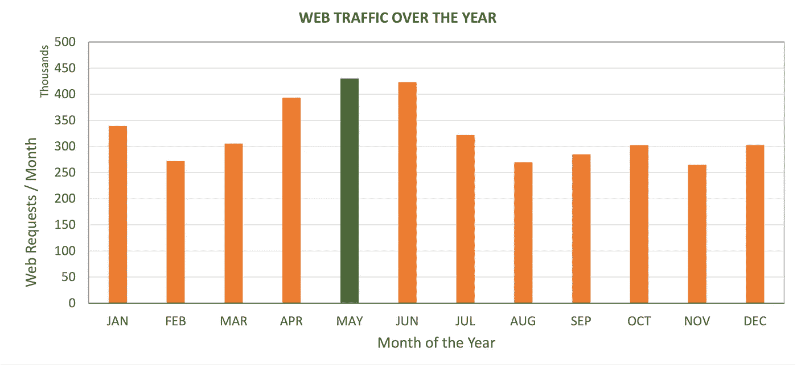
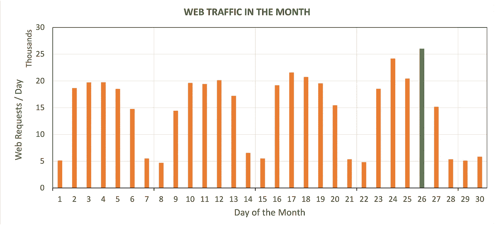
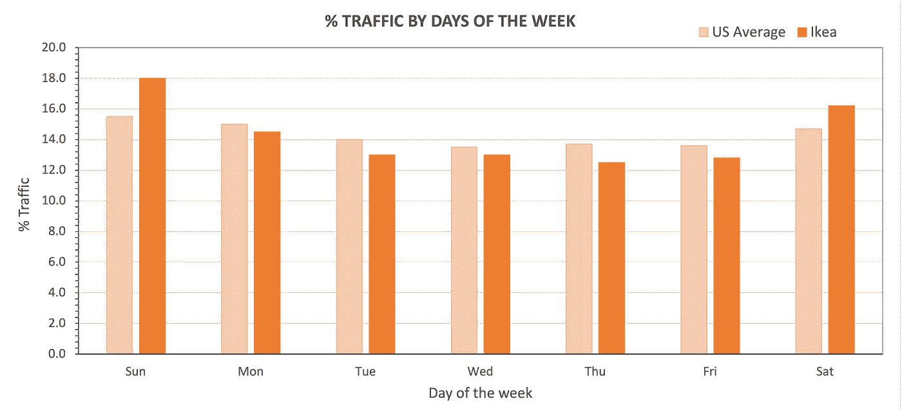
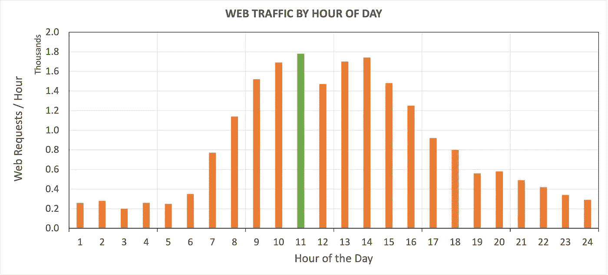
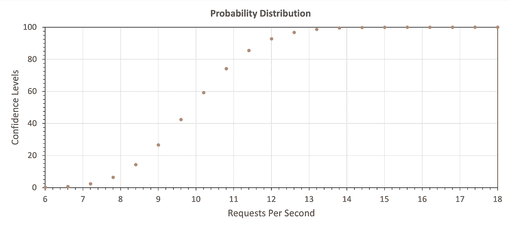
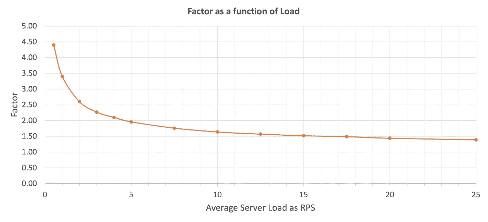

# 估计数字商务网站的峰值流量

> 原文：<https://medium.com/geekculture/estimating-peak-web-traffic-for-e-commerce-websites-25b7368c2051?source=collection_archive---------5----------------------->

Photo by [Robin Pierre](https://unsplash.com/@robinpierre?utm_source=unsplash&utm_medium=referral&utm_content=creditCopyText) on [Unsplash](https://unsplash.com/s/photos/traffic?utm_source=unsplash&utm_medium=referral&utm_content=creditCopyText)

## 的框架

## 通过准确了解需要测试的流量，保持网站平稳运行。

解决方案架构师应该让企业主了解他们的网站可以维持的流量，以便他们在计划新的发布或重大营销活动时，可以使用这些信息进行有效的规划。这样做将避免一个落后的网站，这可能会导致收入损失，甚至更糟的是，打破客户的信任。

确定峰值负载需要严格的测试；这反过来要求对站点的预期流量进行良好的估计。

在 2005 年中期，在[的 AAXIS](https://www.aaxisdigital.com/) ，我们对在超级碗半场秀上做广告的网站进行了性能测试，在表演之前、之中和之后监控负载。从那时起，我们实施并测试了几个高知名度的企业对企业(B2B)和企业对消费者(B2C)网站，它们不仅成功地经受住了流量的考验，而且蓬勃发展。基于这些观察，我们开发了一个框架，利用不同粒度的度量来估计网站的峰值负载；从每年一次到每小时一次。

现在让我们更详细地探索这个框架，这样您就可以将它应用到您自己的站点上。最后，我们将计算每秒请求数或 RPS 的峰值负载。如果你正在测试一个网站，这是你应该实际测试的负载。

# 度量的质量

U 了解你可用的度量标准的质量非常重要。如果这是一位高管的猜测，你应该给它加上一个安全系数。根据我的观察，我通常建议 100%的利润。

前端分析如 [Google Analytics](https://analytics.google.com/) 、 [Matomo](https://matomo.org/) 等。，可能无法提供全貌，因为它们仅用于衡量营销效率。为了确保您的站点服务器能够优雅地处理负载，您需要考虑所有的流量；包括机器人、刮刀或其他无用的流量。因为，相信我，如果你不这样做，你的服务器不会是唯一感受到负载的，你的客户也会感受到。因此，如果你只有来自前端分析来源的数据，那就增加一个合理的利润。请注意，在您的现有负载上添加一个百分比因子可能会产生误导，因为 bot 流量必须独立于站点流量添加。对于较小的网站，这可能意味着 50%或更多的流量可能只是坏机器人。

在我看来，最好的数据来源是访问日志。使用诸如 [AWSTATS](https://awstats.sourceforge.io/) 、 [NAGIOS](https://awstats.sourceforge.io/) 、 [GoAccess](https://goaccess.io/) 、 [HTTP log viewer](https://www.apacheviewer.com/) 等软件解析日志为性能测试提供了良好的、高质量的度量。另一个来源可能是应用性能监控(APM)工具，如 [New Relic](https://newrelic.com/) 、 [App Dynamics](https://www.appdynamics.com/) 等。

一个关键的考虑因素是每秒页面浏览量(PVS)与每秒请求数。这是两种不同的衡量标准，取决于信息的对象。营销可能会将 PV 视为网站的眼球数量。虽然从这个角度考虑 PVS 是有用的，但是站点实际上可能不得不处理对该页面视图的多个请求。

另一方面，RPS 可能包括静态内容的点击，如 CSS、JS、图像等。，它应该来自内容交付网络(CDN)。如果你真的从你的应用服务器提供这些资产，不要！这是对宝贵资源的浪费。

在本文中，我将提到每秒请求数或 RPS 中的负载。如果您有年平均请求数，我们如何计算 RPS？你说，容易。简单地将每年的数字除以时间单位，你就应该得到它了！没那么快。你计算的是平均负载，平均负载和峰值负载相差甚远；有时是 10 倍。所以我们来看看如何找到峰值。因为我不确定您可以使用什么粒度的指标，所以我将从每年开始，一部分一部分地往下，直到第二年。虽然你应该从最详细的细节开始，但我建议你从顶部开始估算，看看这些数字是否有意义。你可能会在数据中发现一个趋势，对你的网站有所帮助。

# 平均年负荷对月负荷

如果你只有年负荷可用，你应该从这里开始。对于创业公司来说，这是常有的事。你可以从竞争对手的网站上获得这个数字，或者从销售和营销策略中获得。

此处显示的是 ACME Foods Inc .的年负载量。虽然公司和指标是虚构的，但趋势对于大多数 B2B 公司来说是常见的。

从数字上看，平均 web 流量为 326，000 个请求，峰值为 423，000 个请求。ACME Food Corp .向向消费者销售饮食和运动食品和饮料的企业分销这些食品和饮料。你可以看到一月左右的高峰代表“节食季节”，五月和六月再次出现，为夏季运动季节做准备，他们直接解决这个问题。

因此，我们在这里观察到的是，对于 ACME，如果我们只知道每年 400 万个请求的数量，简单的平均会让您得出结论，服务器每月只需要处理 32.6 万个请求，而实际上它每月需要处理 42.5 万个请求。ACME 的峰均比大约为 1.35。对于我们在 [AAXIS](https://www.aaxisdigital.com/) 处理的公司来说，这个比率是典型的，处于 B2B 公司的中间范围，B2C 公司的范围甚至更高。

这里的要点不是把这个数字当作给定的，而是根据你的具体情况来计算。我们的客户在飓风季节前的两个月里完成了 50%的业务，为进行房屋维修的风暴追逐者提供服务。它们的峰均比如此之高，我们建议自动扩展硬件以节省成本。

总之，虽然在没有任何可用数据的情况下，35%的利润是一个很好的赌注，但你真的应该尝试研究你的具体情况，并确定每月的负荷。

***高峰月负荷=(1.35-1.50)*全年总负荷/ 12***

# 月负荷至日负荷

一旦你有了已知的或计算出来的月负荷，下一步就是计算每天的需求。当我们分析一个月内的流量模式时，我们需要查看周趋势以及整个月趋势。

这是我们虚构的公司 ACME Foods Inc .的每日 web 请求图表，这对于许多 B2B 来说是典型的。

这里有两个方面要观察；一个是周而复始的周线模式，一个是月末活动。随着人们从周末回来，星期五有点慢，星期一很轻松。另一件要考虑的事情是，根据客户机的时区分布，星期一和星期五可能只代表服务器上的部分负载。这导致了经典的高斯分布，如钟形曲线。

第二种模式是月末活动的增加。这变得越来越普遍，因为 B2B 公司提供诸如要求交货日期和预测等功能，客户可以指定他们需要货物到达的时间。这些功能允许客户在月底下订单，以保留库存并从下个月开始利用信贷。这导致图中所示的月末活动增加。

B2C 的客户行为模式非常不同。在类似网站的博客上可以看到热门网站。从帖子中，我们可以看到亚马逊在一周内显示了相当平稳的流量，在周末有一个轻微的峰值。美国普通购物者和宜家的网站流量显示在他们的帖子上。与亚马逊不同，宜家在周末表现出明显的峰值，而在一周的中期表现出最低点。

虽然峰值出现在不同的时间，但 B2B 和 B2C 网站的峰值与平均值之比都在 1.2 到 2.0 之间。1.5 的比率可以用于 B2B 或 B2C 为主的零售商，没有月末高峰。

***峰值日负荷=(1.2-2.0)月负荷/ 30.5***

# 每日负荷到每小时负荷

aving 计算了上面的月负荷，现在是高峰小时负荷的时间。具体来说，对于 B2B 公司来说，一天的开始部分的负载会随着一天的开始而降低，到中午时会升高，随着人们下班，随着工作日的结束而逐渐降低。我们 ACME Food Inc .的数据如下所示。

决定该图形状的一个重要方面是您客户的地理分布。以 ACME 为例，虽然它的客户遍布美国、加拿大和墨西哥，但它的大多数客户都在同一个时区。根据我们对会议的分析，我们认为中午的小低谷是午餐时间，加上时区重叠。晚上 8 点左右，请求量的小幅上升是由于 ACME 的 B2C 客户在下班后清点库存，这些客户通常会在一天结束时发出补货订单。

根据客户端的时区分布，这种模式可能会有所不同。我们在 [AAXIS](https://www.aaxisdigital.com/) 的一位客户在美国和亚洲国家从事奢侈品交易，他看到了与这两个地区的高峰时间相对应的两个明显的高峰。美国图书销售商展示了他们的每日流量模式[这里](https://www.bookweb.org/news/e-commerce-update-website-traffic-conversion-rates-see-slow-decline-577317)你可以看到一个类似的钟形曲线。

顶部的曲线代表了类似钟形曲线的经典高斯分布，理论峰均比为 1.4。如果我每天工作 16 小时，这个比率就是 1.39，或者我可以每天工作 24 小时，得到 2.0。我们发现，使用办公时间和 1.4 比 1.6 的比率最适合 B2B 公司，而使用 24 小时工作日最适合 B2C 公司。B2C 小时趋势[此处](https://blog.workarea.com/trends-when-do-people-shop-online)供参考。

***高峰小时负荷=(1.4-1.8)*日负荷/平均工作时间***

如果您估计这个数字，我们建议使用 12 小时+(您的客户群位置之间的最大时区差异)。

# 每秒峰值请求的小时负载(RPS)

下一步是计算每秒的峰值请求。在大多数情况下，这是很少可用的，你可能需要计算它。为了理解这一部分，我们需要深入研究一下概率和统计科学。

在任何给定的时间里，我们可以预期平均访客和请求或多或少是恒定的。然而，在那一小时的某一秒钟，访问者会随机到达，请求会有波动。一些秒会更高一些，一些秒会更低一些，但是在更长的时间段内，例如一个小时，平均速率是恒定的。为了估计 5 秒内的峰值，我们可以使用泊松分布。

> [泊松分布](http://en.wikipedia.org/wiki/Poisson_distribution)表示给定数量的事件在固定的时间或空间间隔内发生的概率，前提是这些事件以已知的恒定平均速率发生，且与上次事件后的时间无关。(维基百科)。

用外行人的话说；只要网站访问者不断涌入，我们就可以用这种方法来计算给定时间段(秒)内给定数量的访问者在使用网站的概率。这位作者在这里采取了类似的方法[。](https://realnumeracy.wordpress.com/2012/01/28/estimating-peak-load-from-average-load/)

对于一个网站来说，最糟糕的情况是该小时的所有用户都出现在同一个 5 秒钟的窗口内。然而，这种情况极为罕见。实际上，我们可以估计你的网站上有多少用户，置信水平从 99.9%到 99.999%(五个九)，然后我们可以从中选择最有意义的一个。让我用一个例子来说明这一点。下图显示了平均 10 个 RPS 的累积泊松分布。

x 轴代表服务器可能看到的 RPS，平均时间是性能最差的页面所用时间的两倍(我们用了 5 秒)。y 轴代表置信水平。

所以，如果你在 x 轴上取 10 个 RPS，你会看到置信度是 50%。也就是说，在任何给定的时间内，您的服务器有 50%的几率会经历平均负载或更低的峰值负载。向上移动，我们 92%确定峰值将是 12 RPS 或更少。从另一个角度来看，在任何给定的一秒钟内，该站点都有 8%的机会经历高于 12 RPS 的负载。我们想要的自信是什么？通常，对于任务关键型 B2B 商务应用程序，我们推荐 99.999%(或 5 个 9)。在图示的例子中，这发生在 16.4 RPS 或 1.64 的系数。

但是你不能拿那个号码。随着服务器负载的减少，达到 5 个 9 的系数会增加，反之亦然。在 RPS 为 5 时，RPS 为 9.80 或因子为 1.96 时出现 5 个 9。在 0.5 RPS 的情况下(ACME 的情况)，只有在 2.20 RPS 的高达 440%的加价率下才能实现五个 9。

对 ACME 来说幸运的是，流行的 B2B 平台提供商提供的最低标准环境，如 [ORO 商务](https://oroinc.com/)和 [Magento](https://magento.com/) 对**他们的云环境，轻松覆盖了所需的 2.2 RPS。我建议总是将您的服务器调至至少 2 RPS，即使您的负载只是该数量的一小部分。**

如果你没有遵循上面所有的数学公式，把一秒钟内的峰均比作为你的安全系数；你的负荷越低，你的安全系数应该越高。我提供这张方便的图表，让你选择 99.999%置信水平的安全系数。

例如，如果你的 RPS 是 5，你应该使用系数 2。也就是说，在 99.999%的置信水平下，我们可以说，在任何固定的 5 秒窗口中，您的服务器平均将 ***而不是*** 经历高于 5*2 = 10 RPS 的负载。

***峰值 RPS =(4.4-1.5)*小时负荷/ 3600***

要获得负载系数的粗略估计，请使用泊松分布图。

# 摘要

TLDR；这是为不耐烦的人准备的版本。

始终考虑分析的质量和目标受众。要估计服务器的峰值负载，请选择服务器端指标，而不是为营销目的设计的指标。

> 给定年负荷，计算峰值月负荷:

***月峰值负荷=(1.35-1.50)*年总负荷/ 12***

> 给定月负荷，计算最高日负荷:

***日高峰负荷=(1.5-1.8)*月总负荷/ 30.5***

> 给定日负荷，计算峰值小时负荷:

***高峰小时负荷=(1.4-1.6)*日总负荷/平均工作时间***

> 给定每小时峰值负载，计算服务器上的峰值负载:

***峰值 RPS =(4.4-1.5)*总小时负荷/ 3600***

# 编写测试前的进一步考虑

在进行性能测试之前，还有一些需要考虑的事项

*   估计你的网站预期的访问者数量。使用预期的用户数量进行测试是很重要的，因为拥有一个不能伸缩的内存受限的应用程序将会导致糟糕的用户体验，甚至可能会使您的服务器停机。通过测试，您可以计划负载，并确保您的站点按预期运行。
*   分析负载的组成。并非所有页面都给服务器带来相同的负载。例如，结帐页面比产品详细信息页面使用更多的资源。通常，只有 2%或更少(B2C)或 20%或更少(B2B)是结账流量。你可以使用 Google Analytics 或 Matomo 来了解哪些页面是受欢迎的，并在测试中表现出来。

# 结论

D 电子商务公司不仅依靠正常运行时间来创造收入，还能与客户建立信任。因此，对于平台所有者和系统集成合作伙伴来说，使用峰值负载的精确测量在站点上进行性能测试是加倍重要的。

本文描述了一个考虑服务器负载的系统结构。简单地将总负载除以时间段会导致对服务器上的峰值负载得出错误的结论。正确的方法是使用各种因素来达到峰值负载。这一过程将确保峰值负载代表正确的负载，并帮助您在产品发布或重大广告推广期间避免不必要的麻烦。以此为框架来估算你的流量，因为实际情况因公司而异。

虽然你不应该在小鸡孵出来之前就数它们，但是如果你有一个可靠的估计会有所帮助！