# 用 ITRex 投资组合的例子估算软件开发的成本

> 原文：<https://medium.com/geekculture/estimating-the-cost-of-software-development-with-examples-from-itrex-portfolio-c85808a6cab?source=collection_archive---------19----------------------->

今天，软件是所有内部和面向客户的操作的支柱。但是许多企业主对从企业软件开发服务中获益犹豫不决，因为他们不明白是什么决定了软件开发的成本。此外，一些供应商的定价系统不透明，使得整个过程更加紧张。

在本文中，我们将解释哪些因素会影响软件解决方案的成本，以及如何以可管理的方式降低总价格或逐渐增加功能。

我们还详细介绍了软件开发成本估算的方法。你将会看到我们的策略是相当透明的，也许这会鼓励你去追求你已经酝酿了一段时间的软件解决方案的想法。

# 关于软件开发你需要知道什么

为了理解软件开发的总成本来自哪里，它们是如何累积的，让我们看看软件解决方案如何在幕后工作，您的托管选项是什么，以及您是否可以通过重用第三方组件来降低价格。

# 软件解决方案本质上是多组件的

软件解决方案通常由几个部分组成:

## 前端

前端开发关注软件解决方案面向用户的一面，旨在最大化可用性和用户体验。它围绕着用户在浏览器屏幕上看到的设计，比如颜色、按钮、文本样式和导航。前端开发人员与 UI/UX 专家一起验证用户在应用程序中导航时是否有愉快的体验，是否能轻松找到他们想要的东西。

典型的前端编程语言有 JavaScript、CSS、库包 HTML 等，如 React、Angular 等。

## 后端

[后端开发](https://itrexgroup.com/services/back-end-development/)处理软件解决方案的服务器端，构建其功能和逻辑，并负责数据聚合、处理和存储。后端开发人员负责实现操作、应用程序编程接口(API)和数据库。后端部分留在幕后，对用户来说是不可见的。

一些典型的后端编程语言包括但不限于 Java、PHP 和 Python。

## 五金器具

您总是需要硬件，因为应用程序在其上运行，并且它严重影响软件开发定价。您的软件解决方案将使用处理硬件、存储、输入/输出设备等。

如果你正在为一个使用互联设备完成任务的信息物理系统构建一个解决方案，你将不得不购买或构建它的硬件组件。例如，一个监控餐馆食物浪费的应用程序由一个软件解决方案、一个电子秤和一个摄像头组成。

请记住，有些设备很难连接，编写可以链接这些设备的驱动程序软件可能需要几个月的时间。在我们的一个项目中，我们需要一个定制的 USB 摄像头在 Android 操作系统上运行。这个厂商没有提供相关的驱动软件，我们为此专门找了一个程序员从头开始写。他花了五个月的时间完成这项任务，总费用约为 40，000 美元。

# 软件可以托管在云中或内部

您可以在云中或内部托管您的软件解决方案。内部部署选项引入了大量的初始软件开发成本，而使用云，您只需为所消耗的计算资源付费。

## 云托管

所有基础架构都托管在云中，不在您组织的内部。不需要在基础设施上进行大量前期投资，也不需要现场维护。你只需要找到一个云提供商，然后“租用”资源，比如存储和计算能力。根据您的实际消费，您可以按需付费。如果你想扩大规模，你需要更多的资源，这将增加费用，但它仍然给你相对快速扩张的可能性。

[云供应商](https://itrexgroup.com/services/cloud-consulting/)也对他们产品的安全性和可靠性负责。他们雇佣高素质的安全专家，负责备份和灾难恢复。如果你想在医疗保健或另一个高度监管的部门采用[云计算，你可以寻找一家合规的云提供商，他们熟悉你所在行业的具体情况，并会确保合规。](https://itrexgroup.com/blog/cloud-computing-in-healthcare-benefits-and-roadblocks/)

## 内部托管

使用此托管选项，您的组织将获得、安装和维护运行软件产品所需的基础架构，包括存储系统。这种方法会导致更高的总拥有成本，因为您需要设置和管理基础架构。您还需要物理空间来安装组件。

本地托管还会使您将来更难扩展。但是您将不再依赖互联网连接，因为您可以在本地访问所有资源，这也提高了性能并允许定制。对于处理敏感数据并喜欢在本地保护数据的公司来说，这是一个很好的选择。

# 你有不同的软件开发选择

如果你想通过软件解决方案来简化业务流程，你不需要从头开始构建一个应用程序，也不需要为定制软件开发付出高昂的代价。

实际上，您有四个软件开发选项可供选择:

*   采购和定制软件即服务(SaaS)解决方案
*   使用无代码或低代码开发平台创建应用程序
*   基于预打包的软件开发库和 SDK 构建应用
*   最后，从 scratc 开发定制的软件解决方案

让我们看看这些选项是如何相互叠加的，以及何时应该追求它们。

## 软件即服务(SaaS)

SaaS 开发模型主张创建在云基础设施上运行的基于云的应用程序。您只需为消耗的资源付费，而无需进行大量前期投资。不需要在本地安装、配置和维护软件，每个人都可以通过互联网访问应用程序。

SaaS 工具可以让你快速构建软件，但它们可能无法满足你的所有需求，或者给你的网站一个独特的外观。例如，您可以使用 Wix 或 Hubspot 在几天内建立一个患者参与门户。但是许可费用可能会很高，定制选项相当有限，而且所选的 SaaS 工具可能缺少一些模块，如供应链管理，您仍然需要从头开始构建。

## 无代码/低代码开发

无代码方法不同于高代码(或传统)开发，因为它不需要任何编码经验。无代码平台提供了一个可视化的开发环境，没有技术背景的用户可以通过将 UI 元素拖放到开发画布中来构建基本的应用程序。但是，这种开发方式只适用于范围有限的应用。定制选项相当有限，并且不能涉及遗留系统。

这种方法帮助非技术用户创建原型，向技术人员传达他们的产品愿景。也可以为相对较少的受众构建成熟的应用程序。

低代码开发是无代码开发和传统开发之间的中间地带。您可以使用可视元素创建基本的应用程序，但也可以通过访问源代码来自定义和添加复杂的功能。通常，低代码平台供应商会提供大量的文档和教程。

## 预打包的库

库是预先编写的代码，旨在解决特定问题或提供功能，如用户身份验证或建立与服务器的连接。开发人员使用库来添加更多的功能，而无需实际为其编写完整的代码，从而降低了软件开发成本。

合并现有的库将减少构建软件应用程序所需的时间和精力。但是库是由其他人编写的第三方组件，如果没有正确测试，它们可能会在您的解决方案中打开[安全漏洞](https://itrexgroup.com/blog/security-vulnerability-types-and-ways-to-fix-them/)。

## 从头开始定制开发

在这种软件开发方法中，一个应用程序是从零开始构建的，并且它是根据手边的业务需求完全定制的。这是一种费力的方法，但是最终的解决方案可能是可靠的，并且会让客户满意，因为该解决方案是为解决他们的特定需求而设计的。

# 软件开发过程跨越几个阶段——从模型到成熟的解决方案

创建应用程序(无论是使用预先配置的组件还是从头开始)是一个跨越几个阶段的过程。软件开发的成本将取决于你目前所处的阶段——以及你打算构建的应用程序的版本。

我们来探索一下。

## 实体模型

模型是应用程序的静态设计。它包含解决方案的特性和设计元素，但它不是功能性的。例如，它包括一个形状和颜色都正确的行动号召(CTA)按钮，但是如果点击它，什么也不会发生。

您可以将模型视为软件解决方案的可视草稿，设计师可以在其中试验不同的颜色和形状如何协同工作。团队可以设计几个模型来测试不同的风格。

## 概念证明(PoC)

概念验证是在内部执行的一个小活动，用于验证项目的想法、证明其潜力并展示其可行性。

PoC 的目标是展示在现实世界中开发所需功能的可能性，并揭示可能存在的障碍。它还显示了构建一个成熟的产品需要哪些技术和预算。这个阶段更多的是关于想法而不是实际的产品。

## 最小可行产品(MVP)

MVP 是实现其所有核心特性的早期产品版本。它足够好，可以发布到市场上，并从早期采用者那里获得反馈。开发团队可以使用这些反馈来进一步改进解决方案。

## 成熟的解决方案

这是最终的软件产品，具有所有的特性和功能。然而，这一过程并没有随着解决方案的推出而结束。您仍然需要维护软件，逐步添加新功能，并发布更新。

# 影响软件开发成本的因素

现在你知道创建一个软件解决方案需要什么了。问题是，软件开发要花多少钱？答案很大程度上是由这八个因素决定的。

1.  B2C 与 B2B 软件产品
2.  内部与外部应用程序
3.  软件解决方案的目标平台
4.  涉及的技术
5.  工业
6.  项目规模和类型
7.  团队组成和参与度
8.  整合次数

# 1.B2C 与 B2B 软件产品

企业使用 B2B 解决方案作为内部应用程序或作为与合作伙伴组织通信的方式。这个软件有多种用途。例如，它可以帮助进行库存管理或自动执行一些任务和流程，以实时增加、聚合和可视化数据。Salesforce 和[其他数据平台](https://itrexgroup.com/blog/factors-behind-data-analytics-cost/)是众所周知的 B2B 应用的例子。

B2B 解决方案侧重于核心功能，而不是应用程序的视觉组件。这些应用程序可以与功能打包，增加其平均软件开发成本。

B2C 应用程序使公司能够与客户互动，宣传和销售他们的产品和服务。B2C 软件的主要功能包括展示公司产品、提供客户支持、发布客户评论等。网飞和亚马逊是 B2C 解决方案的两个著名例子。

当构建 B2C 产品时，设计和用户体验和功能一样重要，因为可用性是这类应用成功的关键。[用户界面](https://itrexgroup.com/services/ui-ux-design/)必须吸引人，但又简单易用。这种软件类型的用户群更大，面临的竞争也更多。你还必须更频繁地更新它，以跟上潮流并吸收客户的反馈。

# 2.内部与外部应用程序

内部应用程序在一个组织内使用，用于解决其内部问题。另一方面，外部解决方案旨在为外部世界服务。

构建一个内部应用，需要对自己的业务进行严谨的分析，这就使得你的研究范围仅限于自己的公司。对于外部产品，团队执行市场调查，这扩大了调查范围。这项市场研究涵盖了更多的使用案例。基于纯粹的分析范围和可能的外部专家经验，外部解决方案往往具有更高的软件开发成本。

# 3.软件解决方案的目标平台

当比较移动应用和网络应用时，移动应用的平均软件开发成本更高，因为它们构建起来更复杂。甚至在没有太多技术知识的情况下，[也可以使用内容管理系统(CMS ),比如 WordPress，开发一个网络应用程序](https://itrexgroup.com/services/custom-web-development/)。此外，你可以重用那些相当可靠、有很多评论供你选择的网站插件，而手机插件相对较新且不稳定。

移动和 web 应用都需要后端和前端开发。对于 web 应用程序，这两层需要相似的技术，而在移动解决方案中，这两个方面使用不同的技术。

当构建包含地图、GPS 和其他探测器的移动应用时，[移动开发人员](https://itrexgroup.com/services/mobile-app-development/)不得不应对更多的困难，因为他们要为 RAM 受限的设备、有限的处理器能力、电池和通常有限的连接编写代码。通常，移动开发者比他们的网络同行更昂贵。这是来自 [Upwork](https://www.upwork.com/resources/cost-build-mobile-app) 的平均时薪对比，这是一个自由职业者的平台，他们的费用通常低于全职公司员工。

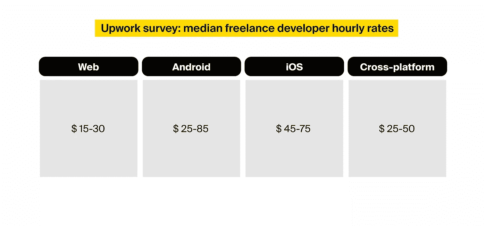

[嵌入式解决方案](https://itrexgroup.com/services/embedded-software-development/)平均来说比移动和网络应用更复杂。但它们的复杂性也各不相同，从裸机固件到能够执行繁重计算的适当操作系统。嵌入式解决方案会带来以下费用:

*   硬件成本
*   在底层定制嵌入式系统的相关成本通常高于传统编程中的成本
*   设备集成成本。特别是，如果你的目标是集成以前没有集成的设备。在这种情况下，开发团队将研究这个主题，并提出他们自己新颖的集成方法。

# 4.涉及的技术

您的软件解决方案还可以涉及创新技术，如人工智能、物联网和 RPA。这些技术增强了应用的潜力，但同时也增加了软件开发的成本。

这些技术中的每一项都需要拥有专业技能的人，而专业人士总是花费更多。如果您对 RPA 感兴趣，您将需要招募领域专家来帮助开发团队理解要自动化的流程。如果你正在寻求融入人工智能，你将雇用懂数学、了解不同机器学习模型如何工作的人。

让我们更仔细地看看每种技术可能带来的额外成本。

## 人工智能

当我们想要将 [AI 并入一个软件解决方案](https://itrexgroup.com/services/artificial-intelligence/)时，有四种可能性，从最便宜到最贵排列。

1.  有一个现成的人工智能模型可以服务于手头的目的。不需要额外的培训和定制。开发者只需要集成这个模型，如果这个模型不是开源的，或者你需要购买一个许可，开发者可能需要支付一笔费用。
2.  **有一个人工智能模型符合我们的目的，但我们需要在相关数据集上重新训练它。**这意味着，除了集成成本之外，我们还需要获取并可能标记数据集，这非常耗时。请注意，训练数据集可能不能免费用于商业目的，这会带来额外的成本。
3.  **我们不知道哪种人工智能模型最适合眼下的问题。**我们需要进行广泛的研究，以确定能够产生理想结果的几种模式，并对每一种模式进行培训和测试。
4.  我们甚至不知道人工智能是否是解决我们问题的最佳方案。我们需要研究人工智能和其他一些候选技术的潜力，以确定最佳选择。然后，我们重复上一步的研究。

要了解更多信息，请查看我们最近关于人工智能成本的文章。

## 物联网

物联网将引入与硬件和基础设施相关的额外软件开发成本。

在[物联网开发](https://itrexgroup.com/services/iot-development-consulting/)的情况下，一家公司将需要收购设备——要么是消费电子设备，要么是增强了传感器的非电子物体。非电子“东西”可能包括使用物联网改造套件升级的传统设备，或者只是用印刷标签增强的消费品包装。制造这种设备相对便宜。但是如果我们想从头开始开发硬件，那么设计和大量测试就是另一回事了。

关于基础设施，你需要找到一个最适合你需求的托管平台，并支付托管费。热门托管平台有 [AWS 物联网平台](https://aws.amazon.com/iot/)、[微软 Azure 物联网套件](https://azure.microsoft.com/es-es/blog/microsoft-azure-iot-suite-connecting-your-things-to-the-cloud/)、[谷歌云物联网平台](https://cloud.google.com/iot-core)。他们有不同的定价选择，并提供一些免费津贴。例如，谷歌向其新客户提供 300 美元的免费信贷。

要了解更多信息，你可以阅读我们关于[物联网成本](https://itrexgroup.com/blog/how-much-iot-cost-factors-challenges/)的博客文章。

## 机器人过程自动化(RPA)

[RPA 系统实施](https://itrexgroup.com/services/robotic-process-automation/)产生了以下额外的软件开发成本:

*   RPA 供应商研究，以了解哪个提供商更适合您的项目范围。你可以参考我们最近的文章，[强调了四个可靠的 RPA 供应商](https://itrexgroup.com/blog/rpa-tool-comparison-how-to-choose-the-right-automation-vendor/)之间的差异——ui path、Automation Anywhere、Blue Prism 和 Workfusion。
*   RPA 许可费
*   将选定的 RPA 平台集成到您的系统中
*   RPA 定制(如果需要)

# 5.工业

您的解决方案所服务的行业类型也会影响软件开发价格。为受到严格监管的行业设计的产品，如医疗保健和军事，必须符合行业法规。这是如何工作的。

合规性意味着每个软件都需要遵守标准。专家会阅读一份详细的规则列表，并确保您的软件开发团队在每个阶段都遵守这些规则——需求规范、设计和编码。雇用这些主题专家是相当昂贵的，你可能需要保留几个专业人士。基于他们的专业知识，这些人知道合规漏洞可能出现在哪里，并且可以在问题升级之前解决问题。

此外，从事此类项目的工程师和开发人员需要了解如何以兼容的方式设计和实现解决方案。尽管采取了所有这些预防措施，您仍然需要进行定期的内部产品审计，以验证每个开发阶段的合规性，这也将增加成本。

最后，要为受监管的行业开发产品，你可能必须获得政府的批准，这意味着要雇佣更多的专业专家来接手文书工作，并与政府官员沟通。这些专家也会和你的开发团队互动，打断他们的日常工作。有时，开发团队甚至可能需要调整和重申一些交付成果，如果它不满足法规遵循的话。

# 6.项目规模和类型

## 项目类型

有三种主要的项目类型，每一种都需要不同的工作量，因此，有它自己的软件开发成本范围。

*   **软件修改**是关于增强和升级现有软件应用程序或添加新功能。
*   软件集成意味着将定制代码或现成的组件，如插件和软件包，整合到现有的业务流程中。一天就可以完成一个简单的集成。稍微复杂一点的集成可能需要几周时间。集成包含错误和缺乏适当文档的软件可能需要几个月的时间。
*   **新软件开发**是从零开始实现定制软件。这通常比前两种项目类型需要更长的时间，除非开发的应用程序相当基础。

## 项目规模

影响软件开发定价的另一个因素是项目的规模。它可以分类如下:

*   **小型项目**。这种项目类型通常涉及较小的软件更改，例如修复 bug。这里与客户的互动是相当有限的。
*   **中型项目**。这不仅仅是对现有程序的一个小调整。它通常有一组定义良好的可交付成果，包括构建独立的解决方案或处理复杂的集成。现有库存系统的 web 界面或范围有限的移动应用程序就是这种类型的例子。
*   **大型项目**。这些解决方案需要与几个系统集成，并将具有安全性和数据库组件。这一类别包括在多个平台上运行的多方软件——手机和网络。
*   **企业级项目**。这种类型的项目通常具有更严格的安全性、错误处理和日志功能，并且通常构建在底层框架上。为这些解决方案设计的支持系统可以在用户感受到任何影响之前处理多达三个并发的基础设施故障。优步移动应用是企业级项目的一个例子。

# 7.团队组成和参与模式

软件开发团队成员的组成、资历和位置也会影响软件开发的总成本。

## 团队组成

在每个软件开发项目中，至少有三个角色——项目经理、开发人员和 QA 工程师。其他角色包括业务分析师、设计师、架构师等。

对于小型项目，同一个人可以同时担任开发人员和 QA，或者经理和业务分析师。对于较大的项目，一个角色可能需要几个人。

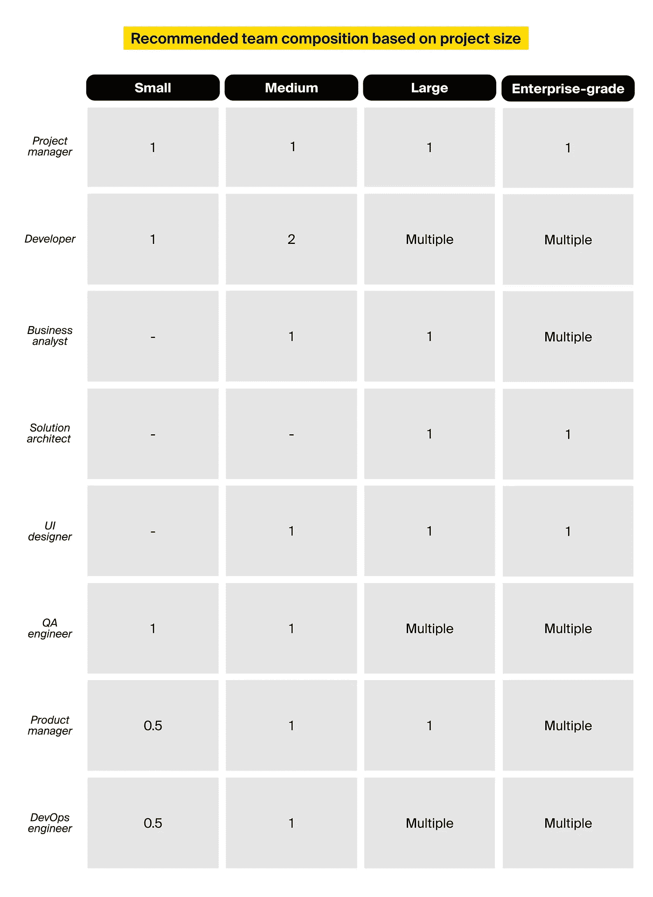

团队成员的经验和资历水平是影响软件开发成本的另一个因素。开发人员通常分为三个资历级别:

1.  **初级专家**工作经验不到两年。他们执行简单的任务，需要持续的支持和监督。
2.  中级专家拥有长达五年的工作经验。他们在工作中更加自信和独立。
3.  高级专家在该领域工作了五年或更长时间。他们独立运作，参与决策过程，并指导初级员工。

## 团队位置

不同专业人员的小时工资取决于他们的所在地，因为一些国家的生活费用和工资预期比其他国家高得多。为了比较，你可以看看下面的表格，它是根据 Accelerance 的 [2023 年全球软件外包趋势和比率指南](https://www.accelerance.com/2023-global-software-outsourcing-trends-and-rates-guide)编辑的。它展示了不同地理位置的软件开发人员的平均时薪。

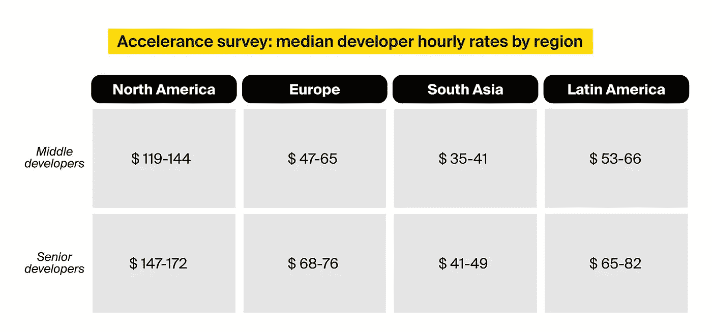

选择最廉价的劳动力似乎很诱人，但要注意时区和文化差异。选择能够理解和说你的语言的团队成员也是一个更安全的选择，即使这会增加软件开发成本。

## 参与模型

雇佣模式也会影响软件开发的成本。有三种主要的参与选项:

*   **固定价格。您为记录的需求和功能支付预定的价格。如果您想要实现附加功能，将会有额外的费用。**
*   **时间和材料(T & M)** 。在这种参与模式下，随着开发的进展，您需要为人力和材料付费。该模型可以适应项目过程中的调整。缺点是你事先不知道总成本。

你可以在我们最近的博客文章[中找到更多关于固定价格与时间和材料的信息。](https://itrexgroup.com/blog/waterfall-vs-agile-how-to-choose-the-right-approach/)

*   **专门团队**。这是一种合作模式，软件供应商专门为你的项目分配一个专门的开发团队。你给他们发工资，他们把所有的时间和精力都奉献给了你的申请。

# 8.整合次数

我们的软件解决方案可能不会孤立运行。工程师将把它与外部服务(如支付网关)以及组织中使用的其他应用程序集成在一起。

当谈到与外部服务的集成时，其中一些服务提供了方便易用的 API，如 PayPal 支付门户。而其他较旧的系统使连接它们变得很困难，需要更多的开发时间和精力。

当您构建一个供内部使用的应用程序时，您希望它与组织中的其他系统一起工作。例如，您的公司可能会使用人力资源软件来确定表现最佳的员工，并使用财务补偿计划来报销员工与工作相关的差旅费。任何新的内部应用程序都需要与这些应用程序无缝共享数据。

简单地说，集成越多，实现过程的成本就越大。但是有时即使是一个集成也会对软件开发成本产生显著的影响，例如缺少技术文档的遗留系统和门户。

# 我们投资组合的软件开发成本估算

既然您已经知道了哪些因素会影响定制软件开发的成本，那么是时候我们给您一些数字了，这样您就可以了解您的应用程序可能会花费多少。

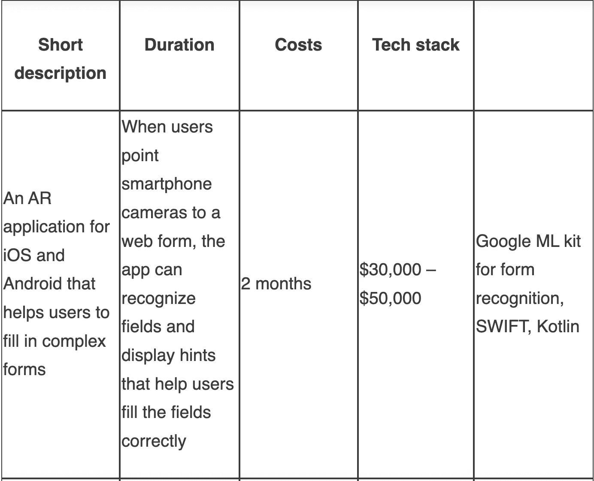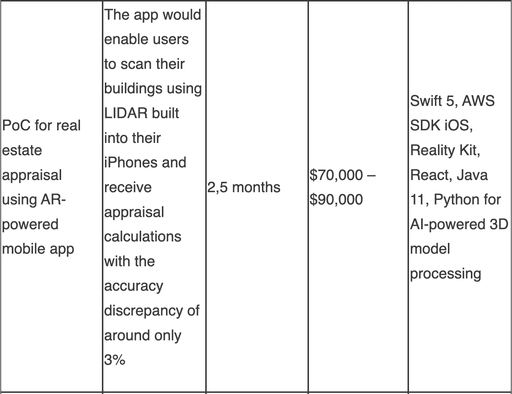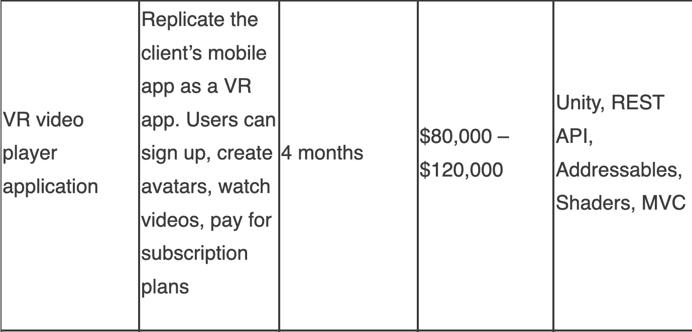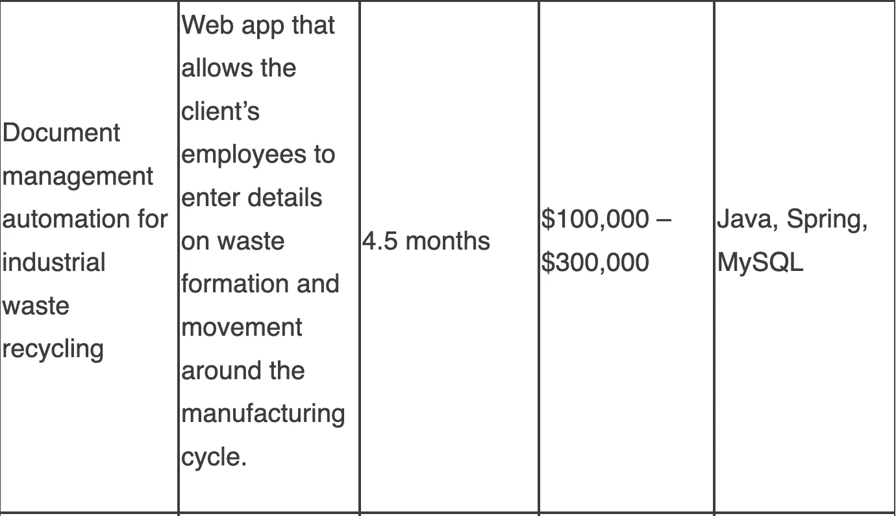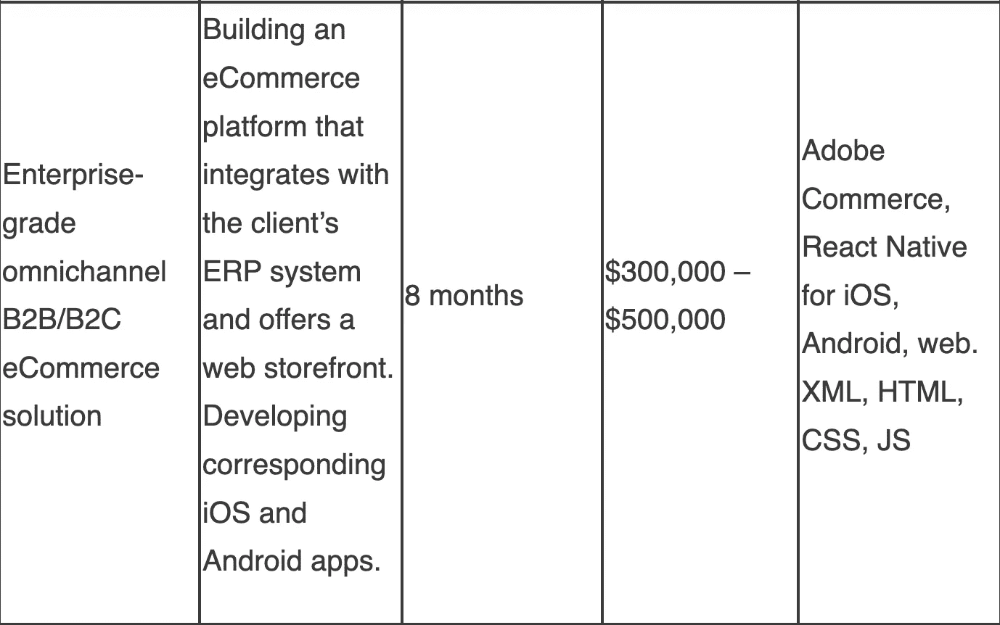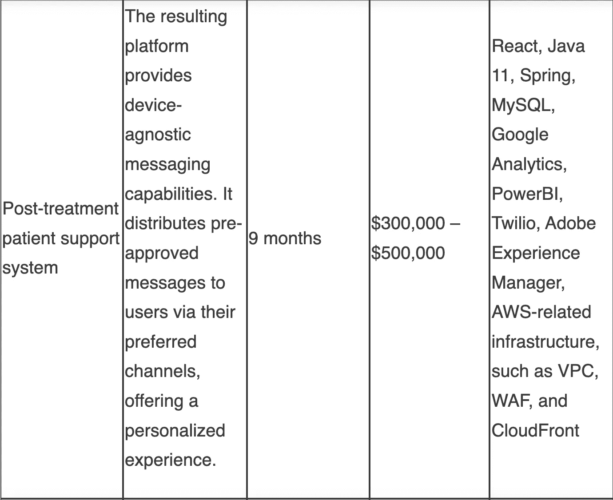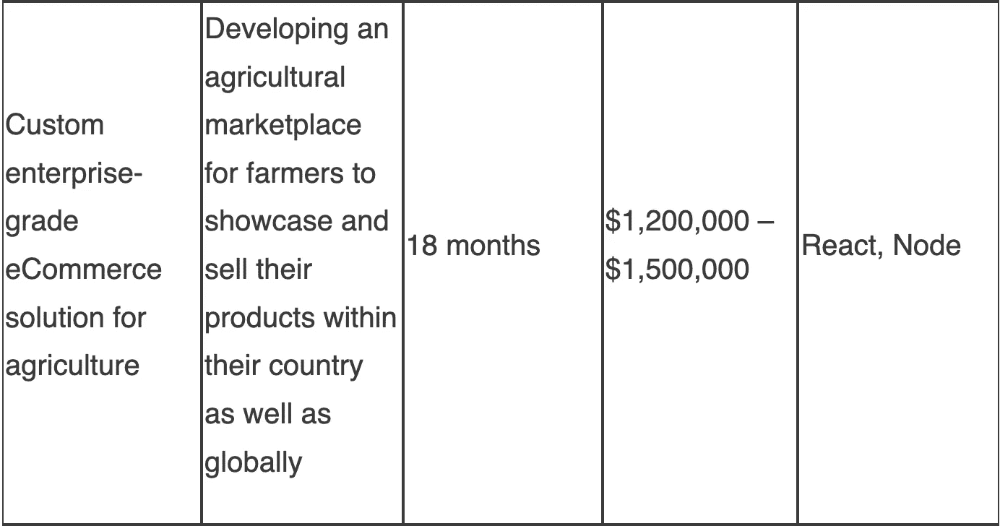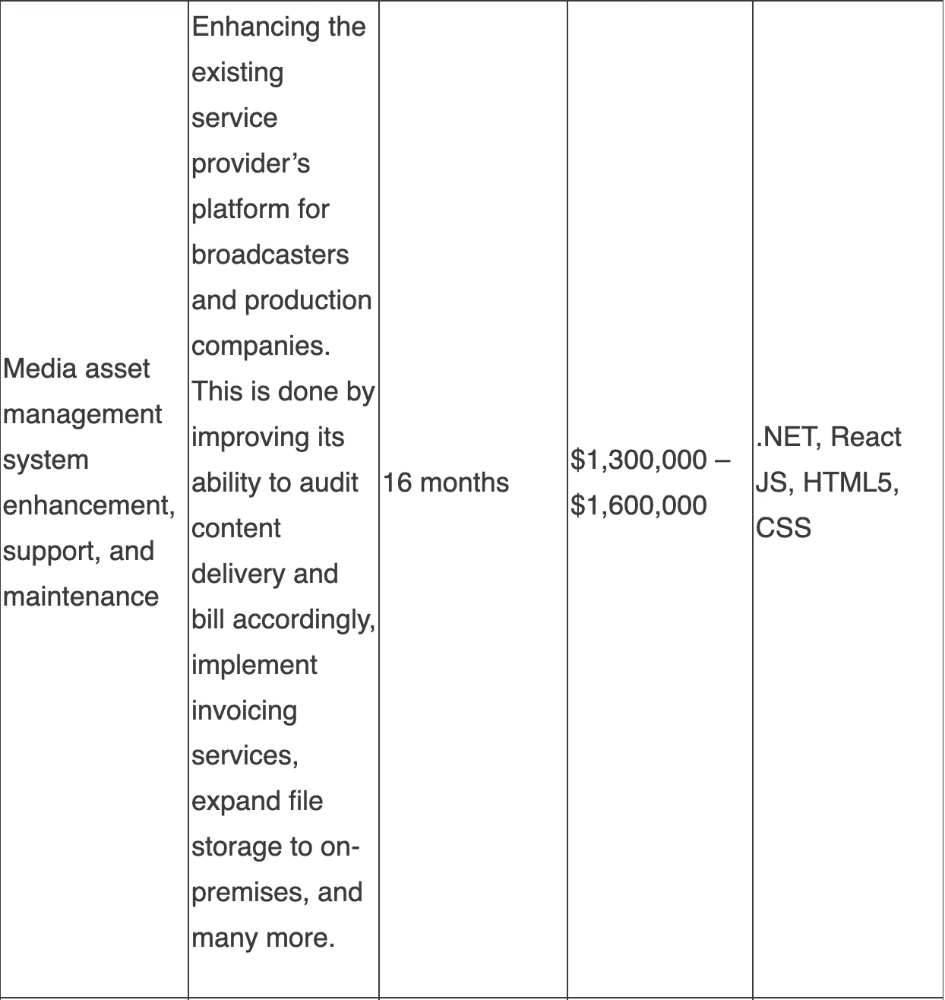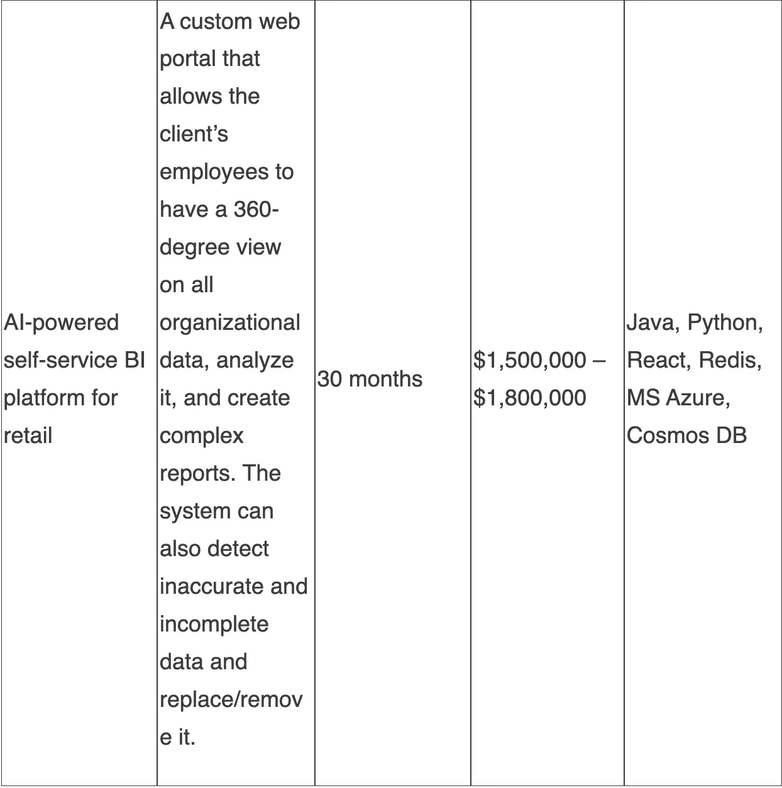

# ITRex 如何估算软件开发成本

当潜在客户与我们联系时，我们会通过一套标准程序来帮助他们估算解决方案的成本。我们是这样做的:

*   询问客户的目标是从头开始开发定制解决方案，还是通过集成现有组件来构建产品。第一种选择需要大量的前期财务投资，适合有完善战略和明确退出计划的公司。第二个选择是一个更便宜的选择，但它涉及到长期的许可费用。这种方法适用于资金有限的初创公司和上市时间至关重要的情况。

可以将两种选项混合使用，以获得更多功能。客户可以从头开始构建他们的大部分解决方案，同时仍然维护一个基于集成的组件。以一个基于 Amazon Chime 的带有 WebRTC(一个开放的 web 框架，支持实时通信)的远程医疗门户为例。Amazon Chime 提供了前端组件，只需要最少的定制工作。

然而，随着用户数量的增长，Amazon Chime 的成本效率会变得更低，客户端需要用更合适的 WebRTC 服务来替换它，如开源的 Jitsi Meet，这需要大量的开发工作。更改核心组件将导致未来额外的开发成本。

*   了解客户的业务需求。我们与客户交谈，了解他们从事哪种业务。我们提出一系列问题，例如:

-您希望提供哪些服务来满足客户的需求？

-您将如何提供这些服务，谁将参与这一过程？

-谁是你的观众？谁将接受这些服务？

回答这些问题，并考虑客户的预算和期望的上市时间，将有助于我们找到一个能够真正创造收入的适当解决方案。

*   构建解决方案架构并估算相关成本，包括每月授权费、服务器费，甚至营销费用都可以算进去。

# 发现阶段

如果客户只是对他们想要什么有一个简单的想法，而对他们需要构建的软件没有详细的了解，我们强烈建议通过[发现阶段](https://itrexgroup.com/blog/product-discovery-choosing-between-waterfall-agile-kickoff/)来确定需求并概念化解决方案。发现阶段将帮助您更好地理解您需要什么，并将其清楚地传达给实施团队。

根据手头的项目，我们以两种不同的方式接近发现阶段。

*   **固定价格项目**。在这种情况下，我们进行了非常详细的分析，旨在提供一个相当准确的估计。这适用于定义了有限范围的项目，在实施过程中不太可能发生变化。固定价格项目通常遵循瀑布方法，这是一种僵化的方法，很难随着项目的进展进行任何调整。如果客户希望扩大初始范围，他们需要提交一份变更申请。
*   **时间和材料项目**。这是一种更常见、更便宜的方法。它提供了一个粗略的估计，不如前一个精确，但它为客户在开发过程中进行调整提供了更多的灵活性。在这里，我们使用敏捷方法，它是灵活的，可以修改范围。

变化可能因各种原因而发生。例如，客户可能想在审查初始版本后尝试其他东西。投资者可能希望整合一些他们正在融资的其他解决方案，或者整个市场可能会发生变化。

在发现阶段，我们根据行业标准提供一组可交付成果。我们的团队将在实施阶段依靠这些材料。客户可以从内部文档中受益，并向外部平台提供商展示，如 Google 和 Microsoft。

# 我们的逐步软件开发成本估算策略

为了产生软件开发成本估计，我们遵循专家判断方法，给出一系列最坏情况和最好情况的估计。以下是我们制定价格标签的步骤。

*   **分解范围**。一个或几个业务分析师将项目分成可管理的功能块。
*   **计算前期开发工作量**。相关技术专家添加功能性和非功能性需求，并评估上一步中的工作分解结构，以确定他们需要在该项目中投入多少工作时间。
*   **合并额外费用**。这将涵盖测试、文档和管理计划等方面。
*   **确定团队结构并制定时间表**。如果项目遵循敏捷方法，我们会基于 sprint 的数量和参与每个 sprint 的团队成员来构建资源计划。一次冲刺通常持续两周。

在瀑布方法的情况下，我们建立一个显示关键任务顺序的关键路径，并指定团队可以并行执行的任务。假设范围不变，这需要更多的努力，但是得到的估计更精确。

*   **说明额外费用**，如设备购买和许可费用。我们已经有了一些开发套件、设备和为共同项目需求获得的许可，例如 [iOS](https://itrexgroup.com/services/ios-app-development/) 和 [Android 开发](https://itrexgroup.com/services/android-app-development/)。但对于不太受欢迎的平台，客户需要向我们提供专有设备，这将导致额外的费用。

此外，基础设施，如托管，带来了额外的成本，我们透明地显示。我们提供发票来支持每一笔费用报销。

*   **添加支持和维护费用**。我们可以为我们的客户提供为期一年或两年的[实施后支持计划](https://itrexgroup.com/services/it-support-maintenance/)。这包括添加新功能、根据客户反馈进行更改、更新某些组件等。我们按预定的小时数收取月租费。在这些时间用完之后，我们将 T & M 方法应用于额外的时间。如果有任何关键的拦截器错误，我们会在保修期内自费修复，保修期通常是发布后的三个月。
*   **估算培训成本**。如果解决方案很复杂，或者客户明确要求培训，我们会分配时间和资源来编制培训计划，并帮助用户远程或现场熟悉应用程序。我们想指出的是，我们将所有与产品相关的知识产权转让给客户，包括源代码。

# 我们如何确定团队成员的时薪？

在确定每个专业人员的时薪时，我们会考虑以下因素:

*   **项目内的角色。**小众专业人士，比如机器学习专家，成本更高。
*   **资历**。我们想在这里强调，我们避免为整个项目配备初级人才。我们的典型员工包括高级和中级专业人员，但我们会仔细考虑客户的预算和需求，并组成一个平衡的团队。我们从不分配整个初级专家团队。只有在项目范围允许的情况下，并且如果有足够多的年长者来监督和指导他们的年长者，我们才会包括年长者。
*   **项目工期**。多年交易会带来更优惠的利率。

# 来自 ITRex 的提示帮助您降低定制软件开发价格

1.  当求助于软件开发供应商时，尽可能详细地介绍你的项目和业务。你越精确地指定你想要达到的目标，实现的成本就越低。解释您希望解决方案的外观、功能、目标受众等。如果你愿意的话，将来你还可以做出改变。
2.  请注意文档和规范，因为这将进一步降低开发成本。此外，如果需要的话，拥有一个记录良好的解决方案将使实现变更变得更加容易。
3.  在构建 MVP 时，尽可能多地使用预制的组件和服务。这将降低开发成本，加快上市时间，但会增加总拥有成本。是的，以后你将不得不支付许可费，但是那时，你可能已经开始收到收入了。并且您可以在以后对代码进行修改。
4.  在构建 MVP 时使用[精益方法](https://www.lean.org/explore-lean/what-is-lean/),因为它专注于核心功能并消除干扰，这将加速开发过程。
5.  求助于一家在你所在领域拥有成熟专业知识的[值得信赖的软件开发供应商](https://clutch.co/profile/itrex-group)。在他们的[投资组合](https://itrexgroup.com/case-studies/)中有类似项目的供应商，这样他们已经拥有相关的知识，不需要随时学习一切。一个值得信赖的供应商也会给你一些如何削减软件开发成本的建议。

*原载于 2022 年 11 月 11 日 https://itrexgroup.com***。**