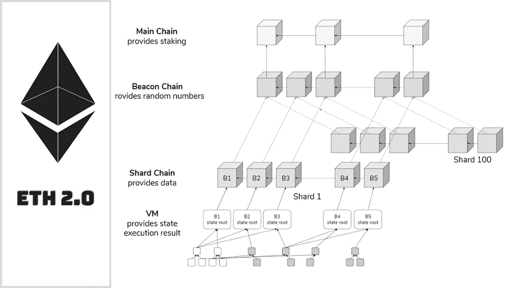
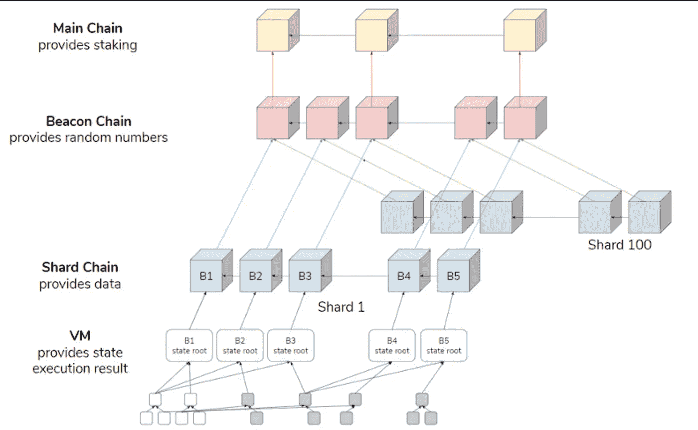
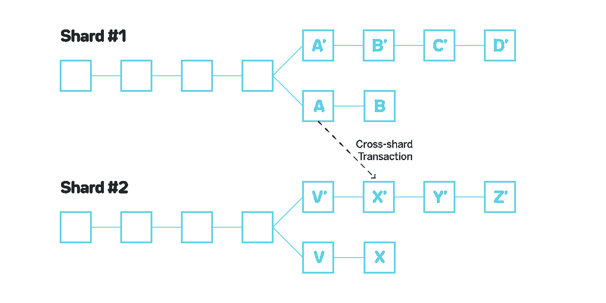

# 以太坊 2.0 为绝对初学者讲解

> 原文：<https://medium.com/geekculture/ethereum-2-0-explained-for-absolute-beginners-190d0ce907ad?source=collection_archive---------2----------------------->

## 以太坊 2.0 是什么，准备如何自我升级？

## 我觉得:

> “如果你愿意接受自己的弱点，你就给了自己一个真正的机会去提高，变得更好，如果不是最好的话。我觉得这就是我所钟爱的以太坊区块链 2.0 升级版将要发生的事情。”

以太坊 1.0 在区块链已被加密开发者社区大量采用，许多分散式应用、分散式金融解决方案正在利用 ETH 1.0 平台提供加密池、借贷、交换和交易服务。

但是，高网络拥塞、不断上涨的燃气费和缓慢的交易吞吐量现在正成为以太坊的拦路虎，无助于其扩展。为了解决这个问题，以太坊 2.0 应运而生。今天我们将看看以太坊是如何准备成为

*   更具可扩展性
*   更安全
*   更可靠
*   更节能
*   更可持续

# 以太坊 2.0 是什么？

以太坊 2.0 是从目前的区块链 1.0 版本过渡到一个新的头像，重点是

*   更高速度(TPS)
*   效率(流程效率)
*   能效(由于采购订单减少了电力消耗)
*   高度安全
*   可量测性

这些对现有 ETH 1.0 区块链的升级提议将实现更高的交易处理能力，同时降低天然气费用。

# 提议的升级是什么？

为了深入了解以太坊 2.0 将如何解决所有的障碍，并实现可伸缩性和速度的预期目标，我们需要了解哪些升级将有助于实现这一愿景。

**以下是提议的升级:**

# 1.信标链:(从工作证明转移到利益证明)

> 以太坊开发者已经在世界协调时 2020 年 1 2 月 1 日中午发布了这个升级版本。

**本次升级的目的:**

*   帮助以太坊迁移到利害关系证明共识机制
*   通过新的赌注机制帮助保护区块链网络
*   让以太坊网络更加可靠健康。
*   对更负责任的矿工给予丰厚的奖励，对行为不端的矿工进行惩罚。

[source](https://docs.google.com/presentation/d/1G5UZdEL71XAkU5B2v-TC3lmGaRIu2P6QSeF8m3wg6MU/edit#slide=id.g3c326bb661_0_58)

# 信标链的主要特征:

*   立桩标界
*   碎片链

## 标桩:

利益证明是信标链升级的一个关键特征。其核心思想是引入一种新的交易验证方式，并完成链中的块。Proof-of-Stake 希望通过赌注来提高区块链网络的安全性。

以太坊 2.0 赌注要求参与者存入 32 ETH 来激活他们的验证器软件。作为验证者，你将负责

*   存储数据
*   处理交易
*   在主链中创建和添加新块

尽管验证者会因为执行上述所有操作而获得回报，但他们也面临着因恶意操作而失去所有利益、离线和验证失败的风险。

> “因此，如果你想投资你的以太网，成为支持你最喜欢的以太坊 2.0 项目的投资者，并从中获利，请确保你的行为是负责任的”

第二个主要升级是，它仍然是一个**“进行中的工作”**

# 2.主网与信标链的融合；

> 这一阶段计划在 2021 年底前完成，或者在 2022 年前几个月开始。测试阶段正在进行

## 合并阶段的目标:

*   正式迁移主链以使用利益相关共识证明，标志着传统工作证明的终结。
*   变得高效节能
*   以平滑地将现有的主链合并到信标链，并实现完整的迁移。目前，带有 PoW 的主链是活动的，信标链也使用 PoS 与其并行运行。
*   此次合并将实现 Eth 2.0 可扩展性、安全性和速度的终极愿景

## 什么是合并阶段？

在第一阶段，信标链已经被部署为与 mainnet 并行工作，而不替换它。以太坊 1.0 正在使用这个 mainnet，它使用工作证明，而信标链正在使用利益证明共识进行测试，因此正是这个合并阶段将最终统一两个链，作为一个主链。

## 这个合并阶段会导致什么？

因此，一旦这个合并阶段完成，它将使 mainnet 能够将智能合同运行到股权证明系统中，加上以太坊的完整历史和当前状态，以确保所有当前以太坊持有者和用户的过渡是平稳的。此外，这也标志着正式工作证明的开始

# 3.碎片链:

这一阶段计划在 beacon chain 与 miannet 的合并成功完成后启动。这一阶段将在 2022 年最终成型，具体日期仍未确定。

## 碎片链阶段的目标是什么？

*   为了增强以太坊的存储能力和数据访问能力。
*   实施这些碎片链是为了通过将网络扩展到 64 区块链来提高网络容量和交易速度。
*   信标链升级还有一个关键目标，那就是确保在验证块时没有一个利益攸关方具有主导影响。为此，Beacon Chain 将随机分配股份以验证碎片链，这将最终防止任何单个股份持有者共谋并接管碎片。

## 什么是碎片？

这是水平分割主数据库以委派工作负载的过程。这些单独的碎片将帮助网络获得

*   减少网络拥塞
*   提高交易吞吐量
*   更多验证器节点有助于网络扩展

## 酷炫的分片功能:

*   **轻量级运行验证器:**

分片将帮助以太坊区块链在运行验证软件的硬件需求方面变得轻量级。这将最终鼓励大量用户充当验证者，因为现在有了碎片链，验证者只需要存储/运行他们验证的碎片的数据，而不是整个网络的数据。

这加快了速度，并大大降低了对昂贵硬件的依赖。

*   **更安全&分散式网络:**

分片之后，任何人都可以很容易地使用他们的笔记本电脑或智能手机上网，开始充当验证者或委托者。更多的参与将最终导致一个更加分散和安全的网络。

> 随着硬件需求的降低，分片将使你自己运行客户端变得更加容易，完全不需要依赖任何中介服务。这也将有助于以太坊网络变得更加健康，最大限度地提高可用性，减少停机时间

# EIP 1559 升级版:

这项提议的伦敦升级(**正在 Testnet** 上测试)与现有以太坊 1.0 网络的可扩展性或速度无关，但它旨在解决如何计算网络燃气费&如何奖励每一个成功批准的验证者。

[**EIP 1559 年**](https://eips.ethereum.org/EIPS/eip-1559) **提出了以下主要修改:**

*   当前的气体阈值极限将由两个值代替:“长期平均目标”(等于当前的气体极限)和“每个区块的硬性上限”(是当前气体极限的两倍)
*   存在要求交易支付的基本费用(已消耗),该基本费用在逐块的基础上进行调整，目标是设定一个值，使得平均块气体使用量保持在接近当前气体限制的水平。

我已经在我的一篇文章中对 EIP 1559 进行了长篇大论的报道，请阅读这篇文章以深入了解 EIP 的变化、它们的好处和特点

以下是链接:

 [## EIP 1559:大以太坊的伦敦升级版即将登陆测试网

### 什么是 EIP 1559 伦敦升级&为什么它对 ETH 2.0 是特别的？

medium.com](/crypto-wisdom/eip-1559-the-great-ethereums-london-upgrade-is-about-to-hit-the-testnet-6902202e0efd) 

# 未来和未来之路:

Eth 2.0 可能是加密货币历史上最受期待和最受关注的事件。柏林升级上线后，伦敦升级正在接受严格测试，预计将于 2021-2022 年推出。我觉得从 Eth 1.0 到 Eth 2.0 的过渡不会很容易，可能需要一段时间，但如果不是在 2021 年，最终也会在 2022 年实现。

这两种方式都将永远改变区块链的这一遗产。Eth 2.0 使其成为最安全、可扩展和可持续的愿景将在很大程度上对加密市场的情绪产生积极影响，并鼓励开发人员社区进行创新。

分散式金融领域将会更多地采用这种新的虚拟形象，更多的 Dapps 将会在这种演进的 Ethreum 平台上推出，因为他们关注的两个主要问题(高网络拥塞和高网络费用)最终将会得到更大程度的补贴。

支付解决方案将更多地采用 ETH 2.0 平台，因为更高的 TPS 将有助于他们为数百万客户提供服务，而现有的 Eth 1.0 平台的 TPS 被设计为 15-30 TPS。

# 思考的食粮:

> “如果你有耐心走得更远，有好奇心去了解更多，诚实地接受你仍然知道一个规范，你就有机会从生活中提取最好的东西，并在你选择和行动的任何生活流中取得成功。这个原则在密码或任何投资领域也同样适用。我希望&我希望这个最令人垂涎和期待的 Eth 2.0 能带来大量的机会，让每个人脸上都带着微笑。”

# 免责声明！

CryptoWise 在此表达的观点不是投资建议，仅用于教育目的。投资者应该在对比特币、加密货币或数字资产进行任何高风险投资之前进行尽职调查。请注意，您的转账和交易风险由您自己承担，您可能遭受的任何损失由您自己负责

# **谢谢你一路陪在我身边，了解我的想法……**