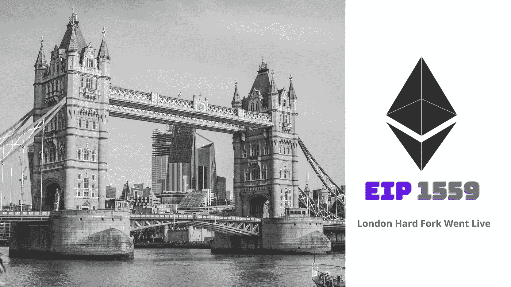
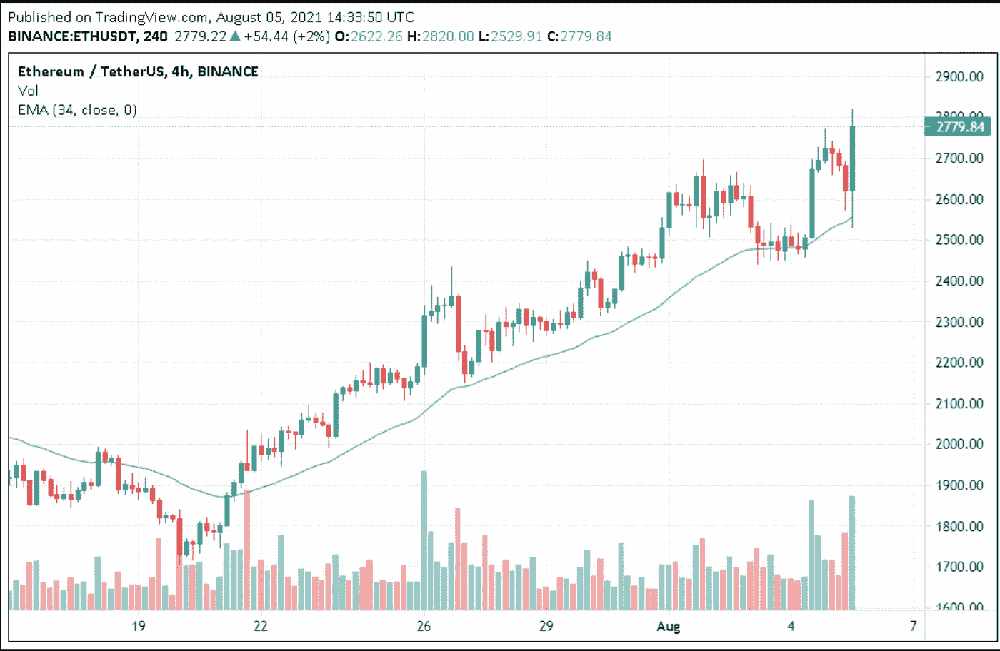
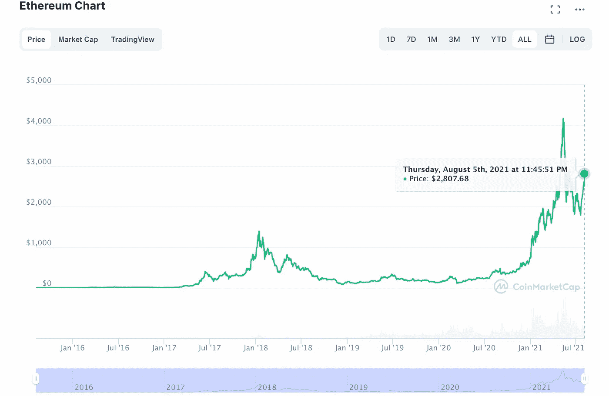

# 以太坊 2.0 伦敦硬分叉:一个简短的快照

> 原文：<https://medium.com/geekculture/ethereum-2-0-london-hard-fork-a-brief-snapshot-5d70fe44ae48?source=collection_archive---------16----------------------->

## 什么是伦敦硬叉更新&它将如何永远改变以太坊？

> “当目的是服务于数百万密码爱好者的梦想，并为人类的更大利益支持改变游戏规则的创新时，以太坊 2.0 这样的项目就出现了”

人们最期待的 ETH 2.0 伦敦升级已经在

`**Aug-05-2021 12:11:34 PM +UTC**`

在，

🧱 **区块编号**:[1296.5 万](https://etherscan.io/block/12965000)

现在所有人都在关注它将如何改变以太坊价格和交易费的游戏。好吧，这就是我们将在这个一生一次的事件的简短快照中解码的内容。

**伦敦硬叉升级到底是什么？**

伦敦升级引入了 [EIP-1559](/crypto-wisdom/eip-1559-the-great-ethereums-london-upgrade-is-about-to-hit-the-testnet-6902202e0efd) ，这是一套以太坊改进协议，将改革交易费市场，以及如何处理天然气退款的变化。

**以太坊 EIP 1559 改进提案的主要目标**是使其网络中的费用市场更加高效和可靠。为实现这一目标，它提出了以下修正案

**根据以太坊 EIP 升级** [**常见问题解答**](https://notes.ethereum.org/@vbuterin/eip-1559-faq) **:**

*   气体限值将由两个值代替:—长期平均目标值和每个区块的硬性上限，上限为当前气体限值的两倍
*   它还将针对每笔用户交易设定一个**基本费用**(该费用将被烧掉以使以太坊通货紧缩)，该基本费用将逐块进行调整，以确保平均燃气费用被控制在非常接近当前燃气限值的水平
*   每当网络拥塞增加导致每个区块的目标用气量过多时，基本费用相应增加，而当区块容量低于设定的目标限制时，基本费用减少。基本费用的变化将在设定的范围内起作用，因此很容易预测燃气费用，并将使市场费用更加透明和可靠

**除了 EIP 1559，**伦敦硬叉升级版还推出了许多其他改进

*   **EIP-3198** :从程序块返回`BASEFEE`
*   EIP-3529:它减少了 EVM 业务的汽油退款
*   **EIP-3541:它**阻止部署以`0xEF`开头的合同
*   EIP-3554:它将冰河世纪推迟到 2021 年 12 月

# **这次伦敦硬叉升级对以太坊矿工有什么改变？**

*   矿工现在将通过**优先费用**得到奖励，优先费用将被放在用户钱包里，基本费用最终将被以太坊协议烧掉。许多矿工对此感到不快，因为与他们作为矿工所冒的风险相比，他们的报酬正在减少。
*   尽管看起来矿工们因为基本费用的燃烧而被剥夺了额外的收入，但这最终会更有益。为什么这样因为流通中的 ETH 越少，他们持有的 ETH 价值就会越大，这是由于供给冲击。

# 以太坊烧基费背后的想法是什么？

*   ETH 2.0 和 EIP 1559 升级的以太坊网络想让 Ehereum 在一定程度上(如果不是完全)通缩，提升其在区块链生态系统内的经济价值。这也将创造必要的平衡，让矿商不会变得强大到足以挑战区块链权力下放的根本结构。
*   随着 BASEFEE 的燃烧，以太坊网络试图确保矿工不会最终操纵区块来榨取额外的费用，因为现在除了优先(小费)费用之外的任何费用最终都将消失。

要进一步了解 EIP 1559 的细节，请参考我之前的文章:

 [## EIP 1559:大以太坊的伦敦升级版即将登陆测试网

### 什么是 EIP 1559 伦敦升级&为什么它对 ETH 2.0 是特别的？

medium.com](/crypto-wisdom/eip-1559-the-great-ethereums-london-upgrade-is-about-to-hit-the-testnet-6902202e0efd) 

## EIP 1550 基础费燃烧策略会对 ETH 价格产生什么影响？

据推测，随着伦敦 hard fork 的上线，以前支付给矿工的交易费现在将被烧掉并从流通中移除，这可能会造成某种以太坊供应冲击，此外，随着交易量的减少，像 NFT DEFI 这样利用以太坊网络的平台将会被更多人采用，并最终创造出对加密货币的更多需求，因此预计其价格将会上涨。

**伦敦升级后以太坊价格反响如何？**

> 在 EIP-1559 升级前后，ETH 飙升至 2700 美元以上。

如下图所示:

在撰写本文时，Eth 的价格徘徊在 2750-2800 美元之间，当前价格为 2807.68 美元

**Source:** [**coinmarketcap**](https://coinmarketcap.com/currencies/ethereum/)

# 总结:

随着 EIP 1559 的上线，ETH 会不会出现通货紧缩，让我们拭目以待吧。但是以太坊在他们的官方博客上已经明确提到了这一点

*   *通过燃烧基础原料，我们不再能够保证固定的乙醚供应。这可能导致经济不稳定，因为随着时间的推移，ETH 的长期供应将不再稳定。虽然这是一个合理的担忧，但很难量化这将产生多大的影响。*

**他们进一步指出:**

*   如果消耗的基本费用多于采矿奖励产生的费用，那么 ETH 将是通货紧缩的，如果采矿奖励产生的费用多于消耗的费用，那么 ETH 将是通货膨胀的。由于我们无法控制用户对块空间的需求，我们目前无法断言 ETH 最终会导致通货膨胀还是通货紧缩，因此这种变化导致核心开发者对 ether 的长期数量失去一些控制。

## 我觉得:

> “这次升级肯定会对网络的可靠性和适应性产生积极影响。随着更低的天然气费用和更高的价格可预测性，以太坊区块链网络将在区块链开发商和 DEFI 创新者中得到越来越多的采用。矿工将被迫表现得更负责任，将无法主导网络，从而理顺权力下放的核心精神”